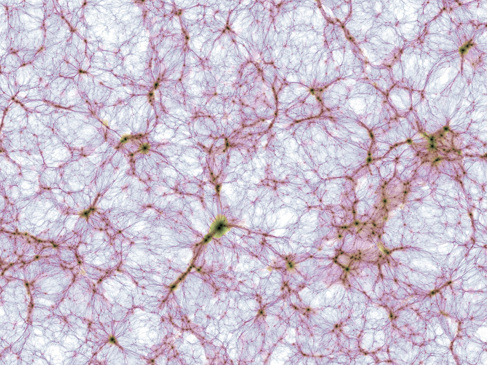
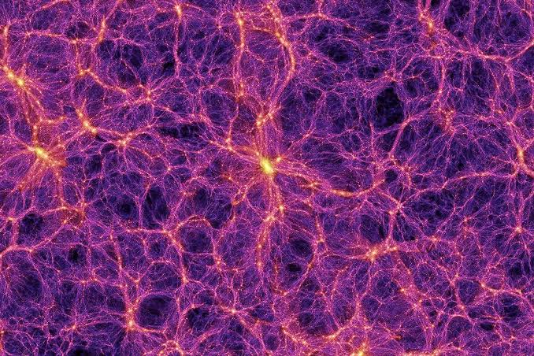
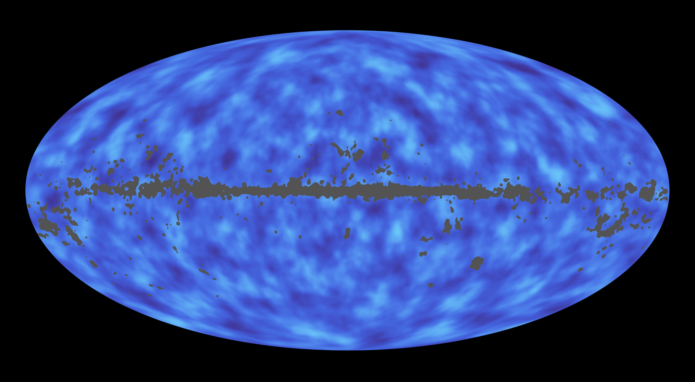

# Cosmic web — the whole (creation and evolution)

Pilot doc for Issue #211. This page describes the cosmic web as a whole:
what it looks like today, how it was created, how it changed through time,
and how its parts interact. Per-part detail lives in sibling docs
(`voids.md`, `filaments.md`, `walls.md`, `nodes.md`, `superclusters.md`,
`background.md`); the dated timeline lives in `lifetime.md`.
Status: pilot — the section template below is the pattern the part docs follow.

## What it is and how it looks

The cosmic web is the large-scale arrangement of all matter in the
observable universe: dense cluster nodes joined by filaments, flat walls
(sheets) between them, and vast near-empty voids filling most of the volume.
It is best seen in two complementary views. Simulations show the dark-matter
backbone directly; galaxy surveys show the luminous tracers sitting inside it.

Target visuals (files in `images/`, credits and licenses at the bottom):

Sources: IllustrisTNG media page; Wikimedia Commons `File:Cosmic_web.jpg`;
SDSS-III gallery; NASA SVS / JPL photojournal.

## How it was created

**Seeds from inflation.** At about 10^-36 to 10^-32 seconds after the Big
Bang, exponential expansion stretched space by a factor of roughly 10^26 to
10^30 and amplified minute quantum fluctuations to cosmological scales.
Denser patches later grew by gravity into stars, galaxies and clusters.
Sources: ESA Planck "CMB and inflation" page;
Wikipedia "Cosmic inflation".

**Frozen sound waves.** For the first ~380,000 years the universe was an
opaque plasma; pressure fought gravity and drove sound waves through the
photon-baryon fluid. When the plasma cooled to ~3000 K (redshift ~1100),
electrons and protons formed neutral hydrogen, light escaped, and the wave
pattern froze in — visible today both as the microwave background and as a
preferred galaxy separation of ~150 Mpc (baryon acoustic oscillations).
Sources: ESA Planck "Planck and the CMB"; NASA LAMBDA graphic history;
SDSS-III BOSS.

**First collapse.** Matter-radiation equality at ~47,000 years let
perturbations grow instead of being washed out. Dark matter, feeling no
radiation pressure, gathered first into filaments; ordinary matter fell in
afterward. The Dark Ages (no stars) lasted until the first massive stars lit
up ~200 million years in and reionized the gas by ~1 billion years.
Sources: Wikipedia "Chronology of the universe"; NASA Webb "Early universe";
ESA "Cosmic eras".

**Anisotropic collapse.** Collapse happens fastest along one axis at a time,
so Zel'dovich dynamics naturally produce the web topology: collapse on three
axes makes knots (halos), on two makes filaments, on one makes sheets, on
none leaves voids. Matter flows voids to walls to filaments to cluster
nodes. Sources: IllustrisTNG baryons paper; Cautun et al. cosmic-web
evolution papers.

## How it changes over time

**From gauze to rope.** The early web is dominated by tenuous filaments and
sheets; they merge, so today's web has fewer but far more massive
structures. In the IllustrisTNG census the knot mass share rises from ~8% to
~33% between redshifts 4 and 0 while sheets fall from ~42% to ~21% and voids
from ~17% to ~6%; filaments roughly double their mass share from early times
to ~40% today. Sources: Martizzi et al. (IllustrisTNG baryons);
Cautun et al.

**Present shares are method-dependent.** As an orientation, not a single
truth: filaments hold ~40-50% of mass in ~5-10% of volume; voids fill
~70-85% of volume with only ~15-25% of mass; nodes hold a large mass in under
1% of volume; walls sit between. Different finders move these by factors of
two or more, so part docs always cite their method. Sources: Cautun et al.
NEXUS+; Aragon-Calvo et al. MMF; IllustrisTNG deformation-tensor census.

**Gas heats up.** About 30-50% of ordinary matter today is warm-hot
intergalactic gas (100,000 to 10,000,000 K), shock-heated as it falls into
filaments; at redshift 2 it was only ~11%, the rest cool diffuse gas.
Filaments are therefore the prime reservoir of the "missing" baryons.
Sources: Dave et al.; Cen and Ostriker; Tuominen et al. (EAGLE).

**Expansion freezes the build.** Dark energy took over ~9.8 billion years in
(redshift ~0.4) and now accelerates expansion while slowing structure
growth: no new large bound structures freeze in anymore, and in the far
future filaments dissolve as bound clusters separate. Sources: NASA "Dark
energy"; Wikipedia "Future of an expanding universe".

## How the parts interact

Gravity is the messenger. Filaments exert ~60% of the local gravitational
force on average across the volume, voids ~20%, nodes ~17%, walls ~14% —
walls are massive but pull weakly because they are extended. Galaxies form in
nodes and filaments, drain out of voids, and the gas in filaments feeds both
star formation and the hot halos of clusters. Laniakea-scale flows show whole
supercluster regions streaming toward common attractors. Sources: Cosmic Web
Dynamics 2024; Cautun et al.

## Key numbers

- Age of the universe: 13.787 +/- 0.020 Gyr (Planck 2018 final).
- Observable diameter: ~93 billion light-years (8.8 x 10^26 m).
- CMB temperature today: 2.725 K, scaling as (1+z).
- Budget: ~5% ordinary matter, ~27% dark matter, ~68% dark energy.
- Recombination: ~380,000 years, redshift ~1100. First stars: ~200 million
  years. Cosmic noon (peak star formation): 2-3 Gyr. Dark-energy takeover:
  ~9.8 Gyr.
- BAO standard ruler: ~150 Mpc. Typical filaments: 50-80 Mpc long;
  voids: 10-100 Mpc across.

Sources: Planck Collaboration 2018; NASA WMAP overview; ESA Planck pages;
NASA "Dark energy".

## Image credits and licenses

| File | Shows | Credit (required) | License / terms |
|---|---|---|---|
| `tng300-gas-dens-temp-375Mpc.jpg` | TNG300 gas density + temperature slice | V. Springel / IllustrisTNG Collaboration | Free distribution for talks/posters/docs; contact for commercial (non-academic) use. Source: `https://www.tng-project.org/media` |
| `millennium-cosmic-web.jpg` | Millennium dark-matter web + cluster zoom | Volker Springel / Max Planck Institute for Astrophysics | CC-BY-SA 4.0 (`https://creativecommons.org/licenses/by-sa/4.0/`) |
| `sdss-pie2-galaxy-map.jpg` | SDSS observed galaxy wedge to 2 Gly | M. Blanton and the Sloan Digital Sky Survey | SDSS-III gallery: free for non-commercial/educational use with credit |
| `nasa-svs-sdss-journey3.jpg` | NASA 3-D render of SDSS structure | NASA/University of Chicago and Adler Planetarium and Astronomy Museum | NASA SVS free use with credit |
| `planck-cmb-2013.jpg` | Planck 2013 CMB all-sky map | ESA and the Planck Collaboration | ESA free use with credit |
| `planck-lensing-matter-map.jpg` | Planck lensing all-matter map | ESA/NASA/JPL-Caltech | Free use with credit |

Note: licenses vary (not all strict public domain). The Round 2 audit (T5)
confirms each file, credit and term before the loop continues; replacements
are separate sub-docs, never silent swaps.

## Sources

- Planck Collaboration 2018 (VI): `https://arxiv.org/abs/1807.06209`
- ESA, Planck and the CMB: `https://www.esa.int/Science_Exploration/Space_Science/Planck/Planck_and_the_cosmic_microwave_background`
- ESA, CMB and inflation: `https://www.esa.int/Science_Exploration/Space_Science/Planck/The_cosmic_microwave_background_and_inflation`
- ESA, Cosmic eras: `https://www.esa.int/Science_Exploration/Space_Science/Cosmic_eras`
- NASA LAMBDA, graphic history: `https://lambda.gsfc.nasa.gov/resources/graphic_history/microwaves.html`
- NASA WMAP overview: `https://science.nasa.gov/mission/wmap/wmap-overview/`
- NASA Webb, early universe: `https://science.nasa.gov/mission/webb/early-universe/`
- NASA, dark energy: `https://science.nasa.gov/dark-energy/`
- SDSS-III BOSS: `https://www.sdss3.org/surveys/boss.php`
- IllustrisTNG media: `https://www.tng-project.org/media`
- IllustrisTNG baryons I: `https://ar5iv.labs.arxiv.org/html/1810.01883`
- Cautun et al., evolution of the cosmic web: `https://ar5iv.labs.arxiv.org/html/1401.7866`
- Cautun et al., z=2 to 0: `https://ar5iv.labs.arxiv.org/html/1501.01306`
- Cosmic Web Dynamics 2024: `https://ar5iv.labs.arxiv.org/html/2407.16489`
- MMF (Aragon-Calvo et al.): `https://ar5iv.labs.arxiv.org/html/1007.0742`
