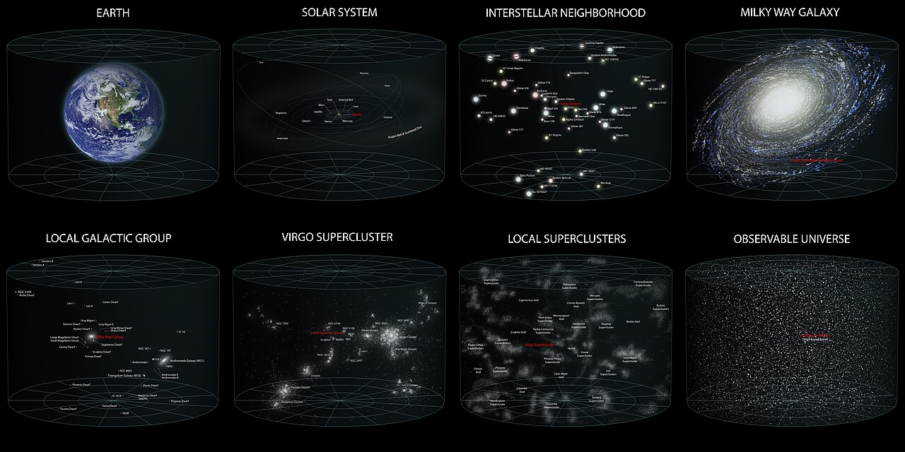

# L1 behind us — the Observable universe as previous level

Pilot doc for Issue #219. This page is the bridge from L1 (Observable
universe) into L2 (Cosmic web): what the previous level looks like, what
carries over when you zoom in, and what changes at L2 scale. Entry itself —
the visual transition and its effects — lives in `entry.md`. Part detail
(filaments, walls, giant voids, superclusters) arrives in the Round 2 loop;
the dated timeline in `lifetime.md`.
Status: pilot — the section template below is the pattern the L2 docs follow.

## What L1 is and how it looks

The Observable universe is the whole ball of space we can see: about 93
billion light-years across (8.8 x 10^26 m), centered on the observer. It is
not a photograph taken at one moment — light from the far edge has traveled
for 13.8 billion years while expansion carried its source outward, so the
sphere is a record assembled from different cosmic times. From the inside it
looks smooth: above scales of roughly 100 megaparsecs (~300 million
light-years) galaxy counts even out in every direction, the cosmological
principle confirmed by surveys such as WiggleZ, which measured the transition
from fractal clumping on small scales to homogeneity on large ones.

Target visuals (files in `images/`, credits and licenses at the bottom):

Sources: Britannica "Observable universe"; Wikipedia "Observable universe";
WiggleZ homogeneity measurement (arXiv 1205.6812); `docs/universes/ladder.md`
(R5 anchor row L1).

## What carries over into L2

Everything L1 shows is still there, only closer. The same structures — the
filaments, walls, voids and superclusters traced by galaxy surveys — become
the L2 contents: filaments, walls, giant voids, superclusters, with Laniakea
as the home supercluster (`docs/universes/ladder.md`, L2 row). The L2 anchor
is the Sloan Great Wall: 1.37 billion light-years long (1.30 x 10^25 m),
about a seventieth of the Observable diameter, sitting roughly a billion
light-years away in Corvus, Hydra and Centaurus. Laniakea, our own basin of
attraction holding the Milky Way and ~100,000 nearby galaxies, spans about
500 million light-years (~160 Mpc) — a flow-model boundary, not a visible
shell. Sources: ladder R5 anchors; Wikipedia "Sloan Great Wall";
Wikipedia "Laniakea Supercluster"; Scale of Space (Laniakea size).

## What changes at this zoom

**From smooth to structured.** At L1 the web is below resolution: the whole
Observable sphere reads as one glowing ball with brighter patches. At L2 the
homogeneity dissolves and the web topology appears — dense supercluster
complexes joined by filaments, flat walls between them, giant voids filling
most of the volume. The rule of thumb: homogeneity holds looking across L2
cells, structure rules looking inside one.

**From one cell to eight portals.** The L1 cell opens into L2 through 8
octant portals, each showing its L2 cell at a true size ratio of 1.48e-2
(`docs/universes/ladder.md`, R6 table). Populations (field galaxies shown as
points) never open; only portals do. Our path runs through the home
supercluster Laniakea, with the Sloan Great Wall as the far landmark.
Sources: ladder R6 amendment; ADR 0010 (portal vs population).

**From edge to neighborhood.** The L1 edge — the particle horizon, the oldest
light — drops out of view. What replaces it is addressable geography: named
walls (Sloan, CfA2, South Pole), named voids (Local, Bootes), named flows
(toward the Great Attractor and Shapley). The part docs name each one with
sizes and examples. Sources: L01 reference (`levels/L01/README.md`,
superclusters and voids docs).

## Key numbers

- Observable diameter: ~93 billion light-years (8.8 x 10^26 m, Planck/WMAP).
- L2 span: 10^24–10^26 m; anchor Sloan Great Wall 1.37 Gly (1.30 x 10^25 m).
- Homogeneity scale: order 100 Mpc; fractal below, smooth above (WiggleZ).
- Laniakea: ~500 million light-years across, ~100,000 galaxies (flow basin).
- L1 to L2 ratio: 1.48e-2, 8 octant portals per L1 cell.
- Age anchor: 13.787 +/- 0.020 Gyr (Planck 2018); CMB 2.725 K scaling as (1+z).

Sources: ladder R5/R6; Planck Collaboration 2018; WiggleZ (arXiv 1205.6812);
Wikipedia "Sloan Great Wall" and "Laniakea Supercluster".

## Image credits and licenses

| File | Shows | Credit (required) | License / terms |
|---|---|---|---|
| `earths-location-8maps.jpg` | Eight-map zoom Earth to Observable universe (1280px) | Andrew Z. Colvin | CC-BY-SA 3.0 (`https://creativecommons.org/licenses/by-sa/3.0/`) |
| `observable-universe-log.png` | Logarithmic Observable universe, Earth at center (1280px) | Pablo Carlos Budassi | CC-BY-SA 3.0 (`https://creativecommons.org/licenses/by-sa/3.0/`) |

Note: the Round 2 audit (T5) confirms each file, credit and term before the
loop continues; replacements are separate updates, never silent swaps.

## Sources

- Ladder: `docs/universes/ladder.md` (R5 anchors, R6 ratios, gap note)
- Britannica, Observable universe: `https://www.britannica.com/topic/observable-universe`
- Wikipedia, Observable universe: `https://en.wikipedia.org/wiki/Observable_universe`
- Wikipedia, Sloan Great Wall: `https://en.wikipedia.org/wiki/Sloan_Great_Wall`
- Wikipedia, Laniakea Supercluster: `https://en.wikipedia.org/wiki/Laniakea_Supercluster`
- WiggleZ homogeneity: `https://arxiv.org/abs/1205.6812`
- Scale of Space, Laniakea size: `https://scaleofspace.org/objects/laniakea-supercluster`
- Planck Collaboration 2018 (VI): `https://arxiv.org/abs/1807.06209`
- L01 reference index: `docs/universes/levels/L01/README.md`
