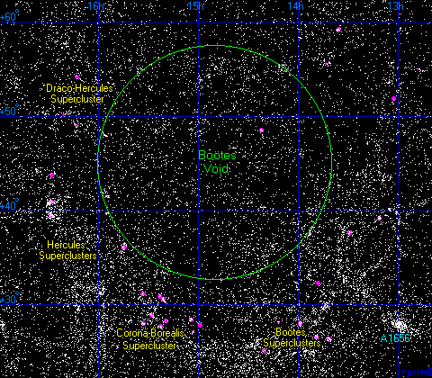

# Giant voids — the empty cells of the web

Loop doc for Issue #219 (iteration 2). Voids are the vast near-empty
expanses bounded by filaments, walls and clusters — the cells of the L2
foam, filling most of the volume with a small share of the mass. Sibling
docs: `filaments.md`, `walls.md`, `superclusters.md`; bridge in
`previous-l1.md`, entry in `entry.md`, timeline in `lifetime.md`.

## What they are and how they look

A void is a roundish region tens of megaparsecs across at a tenth or less of
the mean density — not perfectly empty (they hold ~10–20% of mean density
plus a sparse population of void galaxies), but empty enough to look like
holes in every redshift map. In lensing stacks they show a central
demagnification dip ringed by the piled-up matter of their walls. The map
below centers the Bootes void, the archetype: ~330 million light-years
across with only a handful of known galaxies inside.

Target visual (files in `images/`, credits and licenses at the bottom):

Sources: van de Weygaert and Platen review (arXiv:0912.3473); BBC Sky at
Night Magazine (Bootes void); Raghunathan et al. 2020 (BOSS void lensing).

## Example objects

- Local Void: the nearest, at least 150 million light-years across and
  apparently empty of bright galaxies; it stretches from the Local Group
  boundary out past ~60 Mpc. Its push on us is measurable: the Local Sheet
  recedes ~260 km/s from the void center. Sources: NASA Science ("Lonely
  Galaxy Lost in Space"); Tully et al. 2008; Karachentsev et al. 2025.
- Bootes (Great) Void: ~330 million light-years (~100 Mpc) across, one of
  the largest known. Kirshner and colleagues found it in 1981 as a 6000 km/s
  redshift gap holding 1 of 133 survey galaxies; deeper work later counted
  53 galaxies inside its bounds. Sources: BBC Sky at Night Magazine;
  Kirshner et al. 1981; Aldering et al. 1997 (via the Bothun review).
- KBC Void / Local Hole: a proposed ~600 Mpc (~2 billion light-year)
  diameter underdensity around us, measured at a relative underdensity of
  ~0.46 between 40 and 300 Mpc. Sources: Haslbauer et al. 2020 (MNRAS
  499:2845); UniverseMap KBC page.
- Eridanus supervoid: roughly billion-light-year scale, elongated along the
  line of sight below redshift 0.3, aligned with the microwave Cold Spot —
  the leading candidate for its Integrated Sachs-Wolfe imprint. Sources:
  Szapudi et al. (arXiv:1511.09008); Kovacs et al. 2022; Fermilab news 2022.
- Typical sizes: catalogued voids run 5–120 Mpc/h; reviews quote 20–50 Mpc/h
  near-empty roundish regions. Example void galaxy: NGC 6503, an 18-million-
  light-year-distant dwarf spiral (~30,000 light-years across) at the Local
  Void edge. Sources: Sutter et al. void catalogue (via Melchior et al.,
  arXiv:1309.2045); NASA Science (NGC 6503).

## How they were created

Voids grow from primordial density troughs in the fluctuation field. An
underdense region has weaker gravity — an effectively repulsive peculiar
pull — so it expands faster than the Hubble flow and evacuates; the evicted
matter piles at the edges into sheets, filaments and cluster boundaries.
Inner shells outrun outer ones until shell-crossing, when a dense ridge
stands. Aspherical voids round themselves off as they expand (Icke's 1984
bubble theorem) but never reach perfect spheres, because tides and
neighbors intervene. Small voids merge hierarchically: inter-void matter is
squeezed into thin walls that fade as matter drains to the enclosing
boundary. Sources: van de Weygaert and Platen review; spherical void model
(arXiv:1605.05286); Sheth and van de Weygaert 2004.

## How they change over time

Voids grow, merge and stratify: small basins expand and merge into parents
once walls and filaments coalesce (around scale factor 0.2–0.4), then large
voids simply keep growing. Merger growth outweighs steady expansion roughly
tenfold when it happens, but most voids descend from a single line. Small
voids inside overdense surroundings can be squeezed ("void-in-cloud"),
while large ones keep expanding like miniature open universes
("void-in-void"). Volume share is definition-dependent (~80% once
overlapping watershed basins are counted) against a small mass share
(single digits to tens of percent). Coherent outflows run in simulations
and observations alike. Sources: Sutter et al., "Life and death of cosmic
voids" (arXiv:1403.7525); Ceccarelli et al. (arXiv:1501.02120);
Valles-Perez et al. 2021.

## How they interact with the others

Voids push matter out into walls and filaments: evacuation runs along the
boundaries with tangential flow inside fading dividers, feeding the
filament highways and, through them, the cluster nodes. Local proof is the
260 km/s recession of our Sheet from the Local Void center — motion read as
Virgo pull plus Local Void push. Treat any single gravity-share percentage
as model-dependent (no fixed verified number; the pattern of void push plus
node pull is what is robust). Voids also serve as dark-energy probes:
stacked void shapes enable the Alcock-Paczynski test, and void lensing plus
abundances constrain growth and modified gravity. Sources: Tully et al.
2008; Hawaii Extragalactic Distance Database; Lavaux and Wandelt 2012; Bos
et al. 2012.

## Key numbers

- Typical void diameter: 20–100+ Mpc; catalogued 5–120 Mpc/h.
- Local Void: 150+ million light-years across, 60+ Mpc deep; 260 km/s local outflow.
- Bootes: ~330 million light-years, dozens of known galaxies.
- KBC: ~600 Mpc across, underdensity ~0.46.
- Eridanus: ~billion-light-year scale, below redshift 0.3.
- Volume ~80% voids; mass single digits to tens of percent.
- Lensing dip ~-0.001, stacked detections at signal-to-noise 5–13.

Sources: papers and pages named above.

## Image credits and licenses

| File | Shows | Credit (required) | License / terms |
|---|---|---|---|
| `void-bootes-map.png` | Map of the Bootes void region | Richard Powell, Atlas of the Universe | CC-BY-SA 2.5 (`https://creativecommons.org/licenses/by-sa/2.5/`) |

Note: complements (not duplicates) `L01/images/void-galaxy-ngc6503-heic1513a.jpg`,
which shows a void galaxy close-up. The Round 2 audit (T5) confirms each
file, credit and term; replacements are separate updates.

## Sources

- van de Weygaert and Platen, cosmic void review: `https://ar5iv.labs.arxiv.org/html/0912.3473`
- Spherical void model: `https://arxiv.org/pdf/1605.05286`
- Sutter et al., life and death of voids: `https://ar5iv.labs.arxiv.org/html/1403.7525`
- Ceccarelli et al., void shells: `https://ar5iv.labs.arxiv.org/html/1501.02120`
- Tully et al. 2008 (Local Void push): `https://ui.adsabs.harvard.edu/abs/2008ApJ...676..184T/abstract`
- NASA Science, lonely galaxy (Local Void): `https://science.nasa.gov/missions/hubble/lonely-galaxy-lost-in-space/`
- NASA Science, NGC 6503: `https://science.nasa.gov/asset/hubble/spiral-galaxy-ngc-6503/`
- BBC Sky at Night, Bootes void: `https://www.skyatnightmagazine.com/space-science/bootes-void`
- Szapudi et al., Eridanus supervoid: `https://arxiv.org/html/1511.09008v3`
- Fermilab on the Cold Spot: `https://news.fnal.gov/2022/01/scientists-move-a-step-closer-to-understanding-the-cold-spot-in-the-cosmic-microwave-background/`
- Commons file page: `https://commons.wikimedia.org/wiki/File:Boovoid.png`
