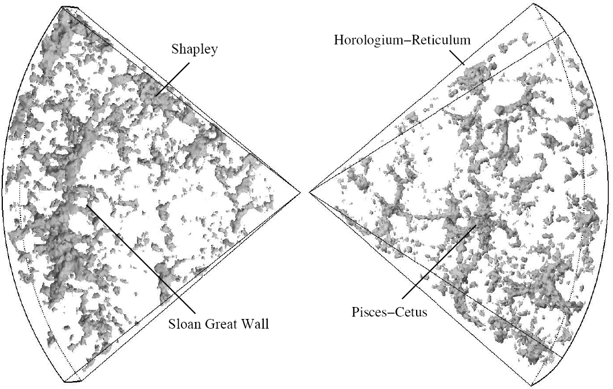

# Walls and sheets — the pancakes of the web

Loop doc for Issue #219 (iteration 1). Walls are the flattened, quasi-2D
component of L2: one axis collapsed, two still extended, sitting between
voids and filaments. Sibling docs: `filaments.md`, `voids.md`,
`superclusters.md`; bridge in `previous-l1.md`, entry in `entry.md`,
timeline in `lifetime.md`.

## What they are and how they look

A wall seen edge-on in a redshift wedge is a thin dense ridge — this is why
the CfA2 discovery slice (Geller and Huchra 1989) looks like one long line:
over 500 million light-years long, some 200 million wide, only about 15
million thick. Seen face-on the same object is a diffuse sheet with embedded
filaments, groups and clusters, much lower contrast than a node. DTFE
reconstructions (tessellated density fields whose cells shrink in dense
zones) show walls as faint continuous membranes joining bright filament
spines — the canonical view below, with the Sloan Great Wall standing out
among nearby superclusters.

Target visual (files in `images/`, credits and licenses at the bottom):

Sources: Wikipedia "Large-scale structure of the universe"; Geller and
Huchra, "Mapping the Universe", Science 246/4932 (1989); NASA APOD 2007
Nov 7; Wikipedia "Delaunay tessellation field estimator".

## Example objects

- CfA2 / Coma / Northern Great Wall: 500–750 million light-years long,
  ~200–300 million wide, ~15–20 million thick. Found around 1989 by Margaret
  Geller and John Huchra in the 2nd CfA Redshift Survey; the first
  super-large structure, holding the Hercules, Coma and Leo clusters, partly
  hidden by the Milky Way Zone of Avoidance. Sources: Wikipedia "CfA2 Great
  Wall"; Wikipedia "Large-scale structure of the universe".
- Sloan Great Wall: 1.37 billion light-years long, about a billion
  light-years away in Corvus, Hydra and Centaurus; 1.8–2.7 times the CfA2
  wall. Announced 20 October 2003 by Gott, Juric and colleagues from SDSS;
  its richest part is supercluster SCl 126; later work suggests it may be a
  chance alignment of three structures. Sources: Wikipedia "Sloan Great
  Wall"; ladder R5 anchor (1.30 x 10^25 m).
- South Pole Wall: over 1.37 billion light-years long, nearest light ~500
  million years old, arcing 200 degrees from Perseus to Telescopium over the
  south celestial pole. Announced July 2020 by Pomarede, Tully and colleagues
  from Cosmicflows-3 (ApJ 897:133) — found through its gravity imprint on
  galaxy motions, not direct counts, because dust and patchy southern
  coverage hid it. Sources: Wikipedia "South Pole Wall"; University of
  Hawaii news, 10 Jul 2020.
- Typical scales: lengths of tens to hundreds of megaparsecs, thickness only
  a few megaparsecs; individual wall masses are rarely quoted alone — use
  supercluster-complex scale (~10^17 solar masses). Sources: Wikipedia
  "Galaxy filament" (walls table); Wikipedia "Laniakea Supercluster".

## How they were created

A large ellipsoid collapses fastest along its shortest axis, making a
"pancake" when pressure is negligible (Zel'dovich 1970). Overlapping
initial fluctuations then yield "dense pancakes, filaments, and compact
clumps" (Shandarin and Zel'dovich 1989). In modern deformation-tensor form
the eigenvalue count decides the fate: three positive means cluster, two
means filament, one means sheet, none means void — with a time sequence from
walls through filaments to full collapse. Primordial overdensities favor
clusters and filaments, underdensities favor voids and sheets. Later
refinements (truncated Zel'dovich, adhesion with viscosity) handle the
bottom-up buildup and stream-crossing the first model misses. Sources:
Wikipedia "Zeldovich pancake"; Cautun et al., "Evolution of the cosmic web"
(arXiv:1401.7866).

## How they change over time

The early web holds many tenuous sheets; they merge into fewer but far more
massive structures that dominate today, while clusters and filaments end up
holding most of the mass and voids plus sheets hold most of the volume.
Matter flows voids to walls to filaments to cluster nodes, so each wall's
mass share falls as it drains — treat any single percentage as
finder-dependent (density, tidal and shear finders disagree most on tenuous
walls). Local-flow context: the Local Group moves 631 km/s against the
microwave background, modeled as one Shapley-side attractor plus one ~220
Mpc Dipole Repeller void contributing roughly equally; the "repulsion" is
missing pull from the void side, not a new force. Sources: Cautun et al.
(arXiv:1401.7866); Wikipedia "Dipole repeller".

## How they interact with the others

Walls feed filaments, which feed nodes — never picture a wall as an
isolated slab. Bright filament ridges and cluster knots sit inside the sheet
plane or stream out of it. Gravity from a wall is weak and extended (near
mean density); most bound mass lives in filaments and clusters. Voids expand
faster than average and push material toward the walls. For budgeting, walls
carry roughly 14–25% of total mass depending on the finder, sharing most of
the volume with voids — cite the NEXUS tables rather than one number.
Sources: Cautun et al.; Wikipedia "Void (astronomy)".

## Key numbers

- CfA2: ~500–750 Mly x ~200–250 Mly x ~15–20 Mly.
- Sloan: 1.37 Gly long, redshift ~0.078, 1.8–2.7x CfA2.
- South Pole Wall: >1.37 Gly, nearest ~0.5 Gly, Perseus-to-Telescopium arc.
- Wall thickness: a few Mpc; lengths in the hundreds of Mpc.
- Flows: Local Group 631 km/s vs CMB; Dipole Repeller ~220 Mpc past Shapley.

Sources: pages and papers named above; ladder R5/R6.

## Image credits and licenses

| File | Shows | Credit (required) | License / terms |
|---|---|---|---|
| `walls-2df-dtfe-sloan.gif` | DTFE view of inner 2dF survey with Sloan Great Wall | Willem Schaap / 2dF Galaxy Redshift Survey | CC-BY-SA 3.0 (`https://creativecommons.org/licenses/by-sa/3.0/`) |

Note: same survey view as `L01/images/wall-sloan-2df-dtfe.gif`; kept per
level so each level folder is self-contained. The Round 2 audit (T5)
confirms each file, credit and term; replacements are separate updates.

## Sources

- Wikipedia, CfA2 Great Wall: `https://en.wikipedia.org/wiki/CfA2_Great_Wall`
- Wikipedia, Sloan Great Wall: `https://en.wikipedia.org/wiki/Sloan_Great_Wall`
- Wikipedia, South Pole Wall: `https://en.wikipedia.org/wiki/South_Pole_Wall`
- UH news on the South Pole Wall: `https://www.hawaii.edu/news/2020/07/10/laniakea-supercluster-mapping/`
- NASA APOD, Sloan Great Wall: `https://apod.nasa.gov/apod/ap071107.html`
- Wikipedia, Delaunay tessellation field estimator: `https://en.wikipedia.org/wiki/Delaunay_tessellation_field_estimator`
- Wikipedia, Zeldovich pancake: `https://en.wikipedia.org/wiki/Zeldovich_pancake`
- Wikipedia, Galaxy filament (walls table): `https://en.wikipedia.org/wiki/Galaxy_filament`
- Cautun et al., cosmic web evolution: `https://arxiv.org/abs/1401.7866`
- Wikipedia, Dipole repeller: `https://en.wikipedia.org/wiki/Dipole_repeller`
- Commons file page: `https://commons.wikimedia.org/wiki/File:2dfdtfe.gif`
