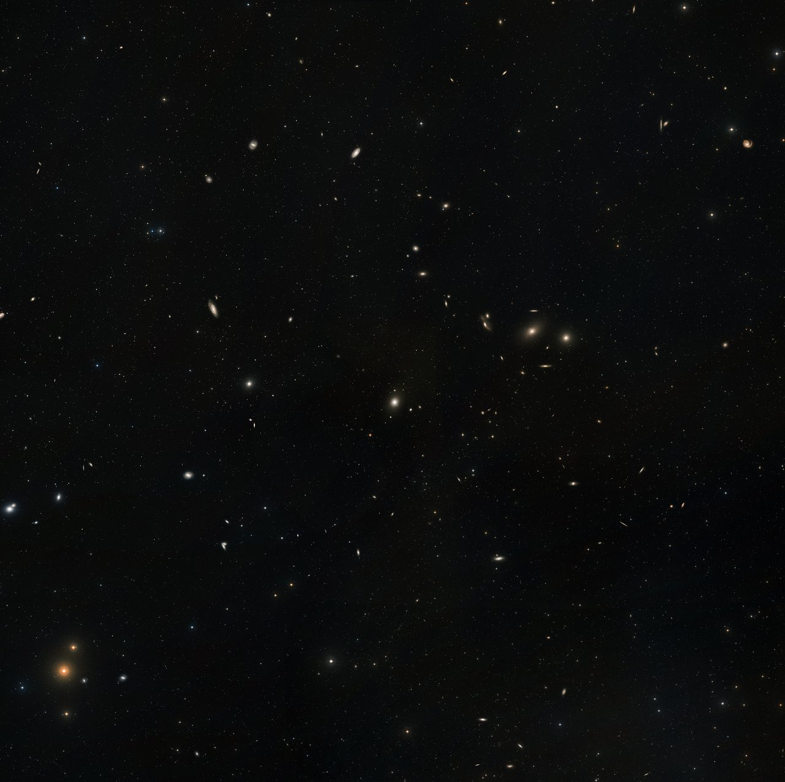

# L2 behind us — the Cosmic web as previous level

Loop doc for Issue #220 (pilot). This page is the bridge from L2 (Cosmic
web) into L3 (Galaxy clusters and groups): what the previous level looks
like, what carries over when you zoom in, and what changes at L3 scale.
Entry itself — the visual transition and its effects — lives in
`entry.md`. Part detail lives in `clusters.md`, `groups.md`, `icm.md` and
`members.md`; the dated timeline in `lifetime.md`.

## What L2 is and how it looks

The Cosmic web is the foam of the universe on 10^24–10^26 m scales: dense
supercluster complexes joined by filaments, flat walls between them, giant
voids filling most of the volume. Its anchor landmark is the Sloan Great
Wall: 1.37 billion light-years long (1.30 x 10^25 m), about a seventieth
of the Observable diameter. Our home address inside it is Laniakea, the
basin of attraction holding the Milky Way and ~100,000 nearby galaxies
across ~500 million light-years — a flow-model boundary mapped from
galaxy motions (Tully et al., Nature 2014), not a visible shell. The whole
web drifts: our region is pulled toward the Norma Cluster (the Great
Attractor, ~220 million light-years away) and beyond it the Shapley
Supercluster — 8,000+ galaxies, the most massive concentration within a
billion light-years, accounting for about half of that pull.

Target visuals (files in `images/`, credits and licenses at the bottom):

Sources: `docs/universes/ladder.md` (R5 anchors, R6 ratios, R8 form);
Wikipedia "Sloan Great Wall"; NASA APOD 2014-09-10 (Laniakea);
NASA Hubble Great Attractor focus page; ESO Messenger 124 (Shapley).

## What carries over into L3

Everything L2 shows at cluster scale is still there, only closer. The
bright knots where filaments cross — the Virgo Cluster holding our Local
Group's neighborhood, the Coma Cluster 300+ million light-years out, the
colliding Bullet Cluster 3.8 billion light-years away, El Gordo 7 billion
light-years back toward the young universe — become the L3 contents:
rich clusters, poor groups, the hot gas between their galaxies, and the
member galaxies themselves. The L3 anchor is the Virgo Cluster: ~15
million light-years across (1.42 x 10^23 m),
1,300 to 2,000 member galaxies centered 54 million light-years away on
the giant elliptical M87. What L2 calls "supercluster portals plus field
populations" resolves here into addressable objects: Virgo as home,
Coma as the rich archetype, the Local Group (30+ galaxies over ~10
million light-years) as our own poor group. Sources: ladder R5 anchors;
Wikipedia "Virgo Cluster"; NASA Hubble Virgo/M87 and Coma pages;
NASA Imagine the Universe (Local Group); Chandra Bullet Cluster handout;
NASA/ESA El Gordo pages.

## What changes at this zoom

**From foam to neighborhoods.** At L2 a cluster is a bright dot at a
filament junction. At L3 the dot opens into a bound city: hundreds to
thousands of galaxies swimming in superheated plasma at 10–100 million
kelvin that outweighs all the stars several times over (~85–90% of the
baryonic mass), inside a dark-matter halo holding ~80% of the total
mass. Virgo holds ~1.2 x 10^15 solar masses in total, only ~5% of it in
stars. Sources: Wikipedia "Intracluster medium"; NASA cluster pages.

**From one cell to thirty-two portals.** The L2 cell opens into L3
through 32 markers per cell (cluster and group portals plus field
populations), each showing its L3 cell at a true size ratio of 1.10e-2
(`docs/universes/ladder.md`, R6 table). Populations (field galaxies
shown as points) never open; only portals do. Our path runs through the
home cluster Virgo, with Coma as the far rich landmark. Sources: ladder
R6 amendment; ADR 0010 (portal vs population).

**From flows to weather.** L2 names the currents (toward Norma, toward
Shapley). L3 shows what the current does to its passengers: galaxies
falling in meet the intracluster gas as a headwind that strips their own
gas into star-forming tentacles (jellyfish galaxies such as ESO 137-001;
Virgo's NGC 4522 and NGC 4402 stripped at over 10 million km/h), while
the central giant grows by cannibalism — Abell 3827's behemoth (up to 30
trillion solar masses) shows the digested remains of at least four
smaller galaxies. Sources: NASA Webb jellyfish page; ESA Hubble
heic0911; Gemini Observatory Abell 3827 release.

## Where to go next

- `entry.md` — the L2-to-L3 dive in plain steps, effects on entry, timing.
- `clusters.md` — rich clusters: looks, assembly, mergers, examples to El Gordo scale.
- `groups.md` — poor groups: Local Group home, fossil groups, feeding clusters.
- `icm.md` — intracluster medium: X-ray glow, stripping wind, lensing mass.
- `members.md` — member galaxies: brightest cluster galaxy, infall fates, M87 jet.
- `lifetime.md` — dated stages from seeds to island universes.

## Key numbers

- L2 span: 10^24–10^26 m; anchor Sloan Great Wall 1.37 Gly (1.30 x 10^25 m).
- L3 span: ~10^23 m; anchor Virgo Cluster 15 Mly (1.42 x 10^23 m).
- Virgo: 54 Mly away, 1,300–2,000 members, total ~1.2 x 10^15 solar masses.
- Local Group: 30+ galaxies over ~10 Mly; Coma: thousands over 20+ Mly, 300+ Mly away.
- Laniakea: ~500 Mly across, ~100,000 galaxies (flow basin, home).
- L2 to L3 ratio: 1.10e-2, 32 markers per L2 cell.
- ICM: 10^7–10^8 K; M87 jet ~3,000 light-years; M87* 6.5 billion solar masses.

Sources: ladder R5/R6; pages named above; EHT M87* release (NASA 2019).

## Image credits and licenses

| File | Shows | Credit (required) | License / terms |
|---|---|---|---|
| `virgo-wide-eso0919c.jpg` | Virgo Cluster wide-field mosaic, M87 center (screensize) | ESO/Digitized Sky Survey 2 | CC-BY 4.0 (`https://www.eso.org/public/images/eso0919c/`) |

Note: the Round 2 audit (T5) confirms each file, credit and term before the
loop continues; replacements are separate updates, never silent swaps.

## Sources

- Ladder: `docs/universes/ladder.md` (R5 anchors, R6 ratios, gap note, R8 form)
- Wikipedia, Virgo Cluster: `https://en.wikipedia.org/wiki/Virgo_Cluster`
- Wikipedia, Intracluster medium: `https://en.wikipedia.org/wiki/Intracluster_medium`
- NASA Hubble, M87 in Virgo: `https://science.nasa.gov/asset/hubble/m87-and-surrounding-galaxies-in-the-virgo-cluster`
- NASA Hubble, Coma Cluster mosaic: `https://science.nasa.gov/missions/hubble/hubbles-sweeping-view-of-the-coma-cluster-of-galaxies`
- NASA Imagine the Universe, Local Group: `https://imagine.gsfc.nasa.gov/features/cosmic/local_group_info.html`
- Chandra, Bullet Cluster: `https://www.chandra.harvard.edu/graphics/resources/handouts/lithos/bullet_lithos.pdf`
- NASA Hubble, El Gordo: `https://science.nasa.gov/asset/hubble/galaxy-cluster-el-gordo-with-mass-map-and-x-ray`
- NASA APOD, Laniakea: `https://apod.nasa.gov/apod/ap140910.html`
- NASA Hubble, Great Attractor: `https://science.nasa.gov/missions/hubble/hubble-focuses-on-the-great-attractor`
- NASA Webb, jellyfish galaxy: `https://science.nasa.gov/missions/webb/a-jellyfish-galaxy-swims-into-view-of-nasas-upcoming-webb-telescope`
- ESA Hubble, stripped spirals heic0911: `https://esahubble.org/news/heic0911`
- L02 reference index: `docs/universes/levels/L02/README.md`
