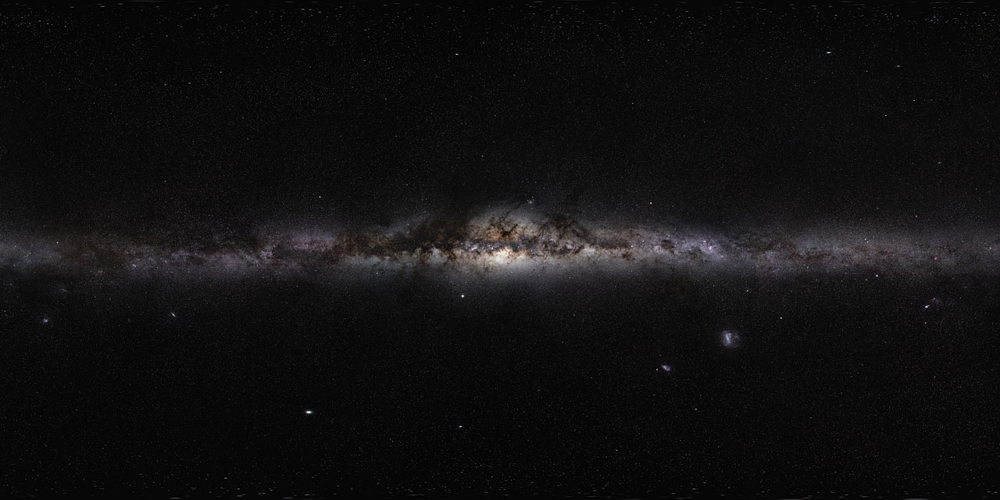

# Entry — diving from L3 into Galaxies

Loop doc for Issue #221 (pilot). This page walks the L3-to-L4 dive in
plain steps: the approach, the effects and visuals on entry, and how
long it takes. The bridge from L3 lives in `previous-l3.md`; part
detail will live in the part docs, the dated timeline in `lifetime.md`.

## The approach, in plain steps

1. **Pick the home portal.** Start in the L3 cell holding the Local
   Group. Thirty-two markers share the cell (cluster and group portals
   plus field populations); only portals open, populations stay points
   (ADR 0010). Target the Milky Way portal — ours.
2. **Watch the preview.** Above 0.02 rad the marker draws its interior
   inside itself: first a smudge of light, then a tilted spiral coin —
   disk, brighter core — growing at true size (ladder R7). At most 6
   markers preview at once.
3. **Fall through the milestones.** The L3–L4 span is crossed through
   two invisible magnification milestones, silent exact no-ops: no
   position jump, no label change (ladder gap note).
4. **Open at 0.14 rad.** The marker's dot eases to zero as the camera
   passes inside; the open cell closes back into its marker below 0.10
   rad. You are now in L4, inside the Milky Way cell.

Target visuals (files in `images/`, credits and licenses at the bottom):

Sources: ladder R6 (markers, ratios), R7 (preview, open/close angles);
ladder gap note (milestones); ADR 0010 (portal vs population).

## Effects and visuals on entry

**What appears.** Points become places: the smudge resolves into a
barred spiral — thin star-forming disk marbled with dark dust lanes
and glowing nebulae, a yellowish central bulge, faint halo around it
all. Neighbor smudges gain shapes of their own: Andromeda's tilted
disk 2.5 million light-years off, Triangulum smaller beside it, the
Magellanic Clouds as ragged companions. What L3 showed as "member
galaxies" is now architecture you can point at.

**What fades.** The cluster context falls away: Virgo's 1,300–2,000
companions, Coma's thousands, the X-ray glow of the intracluster gas —
all shrink back into the L3 marker you came through. The stripping
headwind and the central cannibals stop being weather and become
somebody else's story; here the story is the galaxy itself.

**What the markers do.** The L3 marker you entered closes behind you
into an ordinary portal, re-targeted, sitting 1/ratio cells away among
its siblings. Ahead, the L4 cell offers its own markers: 32 poor
clusters for a sparse group like ours, up to 2,000 for a rich one like
Virgo (ladder R6) — the next dive down to galactic structures.

Sources: ladder R6 (marker counts); L03 `members.md` and `icm.md`
(what the weather was); NASA galaxy-type pages.

## How long it takes

The seeded autopilot runs L1 to L10 in about 40 seconds; travel time per
rung scales with its decade span, so the L3–L4 leg (about two decades,
cluster scale down to galaxy scale) is one of the shorter crossings —
the longest is the four-decade heliopause-to-Sun leg. That compression is
honest: rung gaps on screen stay proportional to the real decade gaps.
Sources: ladder R6 (navigation, travel time); R5 (anchors).

## Key numbers

- Preview starts: marker angular radius above 0.02 rad (at most 6 markers).
- Open: 0.14 rad; close back below 0.10 rad.
- L3 to L4 ratio: 6.76e-3; 32 markers per L3 cell.
- Invisible milestones L3–L4: two, silent exact no-ops.
- Autopilot L1 to L10: about 40 s total.
- Andromeda: ~2.5 Mly away, falling toward us at ~110 km/s; Milky Way band: our edge-on home view.

Sources: ladder R6/R7; Wikipedia "Andromeda Galaxy" (approach velocity);
ESO GigaGalaxy Zoom eso0932a.

## Image credits and licenses

| File | Shows | Credit (required) | License / terms |
|---|---|---|---|
| `milkyway-panorama-eso0932a.jpg` | Milky Way 360-degree panorama, GigaGalaxy Zoom (screensize) | ESO/S. Brunier | CC-BY 4.0 (`https://www.eso.org/public/images/eso0932a/`) |

Note: the Round 2 audit (T5) confirms each file, credit and term before the
loop continues; replacements are separate updates, never silent swaps.

## Sources

- Ladder: `docs/universes/ladder.md` (R5 anchors, R6 ratios and markers, R7 preview, gap note)
- ADR 0010: portal vs population markers
- ESO, Milky Way panorama eso0932a: `https://www.eso.org/public/images/eso0932a/`
- Wikipedia, Andromeda Galaxy: `https://en.wikipedia.org/wiki/Andromeda_Galaxy`
- L03 entry reference: `docs/universes/levels/L03/entry.md`
