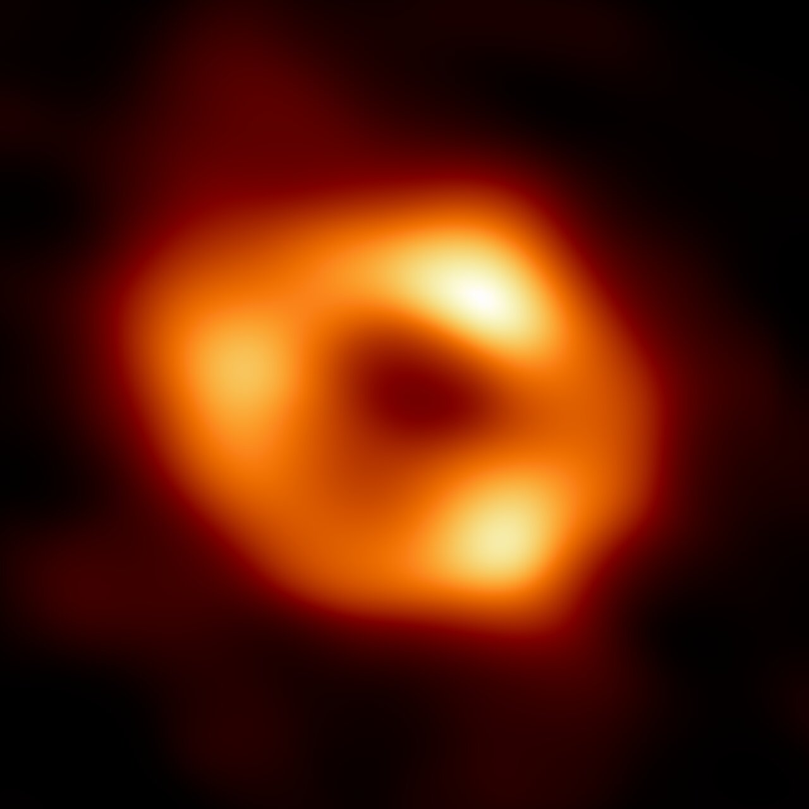

# Nuclei — galactic centers and black holes

Loop doc for Issue #221 (iteration 4). Nearly every big galaxy hosts a
supermassive black hole at its center; when matter falls in, the nucleus
lights up and can outshine the whole galaxy. Quasars, jets, and quiet
dark hearts are one family seen at different dinners. How a nucleus
interacts with the other L4 parts — disks it feeds from and quenches,
ellipticals it anchors, halos it heats — runs through every section
below.

## How it looks

A bright compact core where the galaxy's light spikes. In quiet nuclei
like ours the spike is starlight crowding around a dark mass. In active
nuclei the spike is the engine itself: quasars are star-like points
pouring out the light of trillions of Suns; blazars are jets aimed
straight at us, boosted blinding by relativity; radio galaxies like M87
throw plasma jets thousands of light-years long. The Event Horizon
Telescope resolved the shadow itself: M87* a 6.5-billion-solar-mass
ring 55 million light-years away (2019), then our own Sagittarius A* —
4.3 million Suns, 27,000 light-years away, a bright ring around darkness
(2022), flaring daily in X-rays.

Target visuals (files in `images/`, credits and licenses at the bottom):

Sources: ESO eso2208-eht-mw (Sgr A* image, flares); EHT April-2019
release (M87*); NASA Webb AGN explainer (types); NASA Chandra record
flare page.

## How it changes over time

Black holes grow with their galaxies, and the quasar era is behind us:
ten billion years ago, mergers funneled gas inward and nuclei blazed —
Hubble sees double quasars burning in merging hearts that long ago.
Today most giants are quiet; Sgr A* sips gas and flares. But quiet is
not dead: the 2013 Chandra flare from our center ran 400 times brighter
than its silent state. M87* still fires its jet, and Markarian 573
shows an active nucleus heating and expelling gas in real time.

Sources: Wikipedia "Quasar" (peak ~10 Gyr ago); Hubble quasar-merger
science page; NASA Chandra flare release; NASA SVS Markarian 573.

## How it is created

A nucleus is built from the bottom up and the top down: the galaxy
assembles around a seed black hole, and every gas-rich merger dumps
fresh fuel that grows hole and bulge together — the tight mass match
between the two is the fingerprint. Luminous red quasars at redshift ~2
are the merger-driven picture caught in the act. Between feasts the
hole waits, dark, bending the orbits of nearby stars: the S-stars
whipping around Sgr A* weighed it before any telescope saw its shadow.

Sources: Hubble quasars science page (merger-driven growth at z~2);
Wikipedia "Active galactic nucleus" (types, fueling).

## How it interacts with the others

- **With spirals:** disk gas spiraling inward feeds the hole; the lit
  nucleus answers with winds and radiation that can heat or expel the
  disk's gas and quench star birth (see `spirals.md`).
- **With ellipticals:** the biggest holes live in the biggest
  ellipticals — M87* anchors M87, and its jet heats the whole
  surrounding cluster gas (see `ellipticals.md`; L03 `icm.md`).
- **With halos:** jets and winds dump energy far outside the galaxy,
  shaping the circumgalactic gas future generations of stars will form
  from (see `halos.md`).

Sources: NASA SVS Markarian 573 (feedback in action); Chandra M87 jet
tracking; ESO Sgr A* release.

## Every giant was active once (second pass)

Quasars are not a rare species — they are a phase. The duty-cycle
picture says nearly every massive galaxy lit its nucleus at least once,
when gas was plentiful; today's quiet ellipticals are retired quasars,
their holes grown fat in youth. That is why hole mass tracks bulge mass
even where no jet has fired for billions of years: the M–sigma relation
in `ellipticals.md` is the fossil of ancient feasts.

Sources: Wikipedia "Quasar" (duty cycle, evolution); Wikipedia
"M–sigma relation".

## Size, mass, example objects

Stellar-mass holes weigh a few Suns; supermassive ones run millions to
tens of billions. The shadow imaged is ~50 microarcseconds across in
both famous cases — physics repeating at wildly different scales.

Example objects:

- **Sagittarius A*** — home nucleus, ~4.3 million solar masses,
  27,000 light-years away, faint with daily flares. Source: ESO
  eso2208-eht-mw.
- **M87*** — 6.5 billion solar masses, 55 million light-years away,
  first shadow ever imaged (2019), jet near light-speed. Source: EHT
  April-2019 release.
- **Markarian 573** — active nucleus caught heating and removing its
  galaxy's gas, quenching star birth. Source: NASA SVS 12657.

## Image credits and licenses

| File | Shows | Credit (required) | License / terms |
|---|---|---|---|
| `sgra-eht.jpg` | Sagittarius A* shadow, EHT 2022 image (screensize) | EHT Collaboration | CC-BY 4.0 (`https://www.eso.org/public/images/eso2208-eht-mwa/`) |

## Sources

- ESO, Sgr A* image: `https://www.eso.org/public/news/eso2208-eht-mw`
- EHT, M87* 2019 release: `https://eventhorizontelescope.org/press-release-april-10-2019-astronomers-capture-first-image-black-hole`
- NASA, AGN explainer: `https://science.nasa.gov/mission/webb/science-overview/science-explainers/what-are-active-galactic-nuclei`
- Wikipedia, Sagittarius A*: `https://en.wikipedia.org/wiki/Sagittarius_A*`
- NASA, Chandra record flare: `https://www.nasa.gov/news-release/nasas-chandra-detects-record-breaking-outburst-from-milky-ways-black-hole`
- L04 bridge: `previous-l3.md`; L04 ellipticals: `ellipticals.md`
