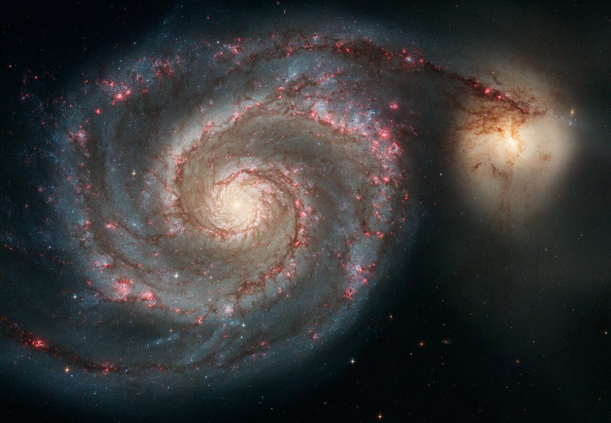

# Spirals — disk galaxies with arms

Loop doc for Issue #221 (iteration 1). Spiral galaxies are flat rotating
islands: a thin star-forming disk with arms around a dense central
bulge, wrapped in a faint halo. Our home galaxy is one. How a spiral
interacts with the other L4 parts — ellipticals it may merge into,
dwarfs it tides apart, nuclei it feeds, halos it builds — runs through
every section below.

## How it looks

Face-on, a spiral is a circular disk traced by arms: dark dust lanes on
the inner edge, pink star-forming knots, blue clusters of young stars
outward — the Whirlpool (M51) is the textbook grand design, its two arms
pumped by companion NGC 5195 gliding behind it for hundreds of millions
of years. Edge-on, the same galaxy is a squashed oval: the disk a sharp
line cut by dust, the bulge a glowing egg above and below it — the
Sombrero (M104) shows a brilliant white core with thick dust lanes from
6 degrees off its plane. The bulge holds older redder stars; the arms
hold the young blue ones. About two thirds of spirals carry a bar from
the bulge to where the arms start.

Target visuals (files in `images/`, credits and licenses at the bottom):

Sources: ESA/Hubble heic0506a (M51 pumps); NASA face-on IC 5332 and
edge-on UGC 10043 pages (orientation); ESA Sombrero release (M104);
ESAHUBBLE wordbank "spiral galaxy".

## How it changes over time

Spirals grow inside-out: a dense old core first, then higher-spin gas
settles into the disk — JWST caught the earliest case 700 million years
after the Big Bang. Massive young stars die within millions of years as
supernovae, whose blast waves compress nearby gas and restart the cycle.
Growth stalls when the gas runs out or is removed: quenching shuts star
birth down and reddens the disk, and half of all massive galaxies had
quenched by age 3 Gyr. Six billion years ago more than half of today's
spirals still looked peculiar; gas-rich mergers rebuilt them into the
grand designs we see. Andromeda fits that rebuilt story; the Milky Way
has been quieter.

Sources: Cambridge inside-out JADES result; ESA "where did today's
spirals come from"; NASA REQUIEM (early massive dead galaxies); NASA
quenching seminar.

## How it is created

A spiral is born when gas cools and settles into a spinning disk inside
a dark halo, conserving angular momentum. The arms themselves are a
traveling pattern, not fixed tubes: stars, gas and dust pass in and out
like cars through a traffic jam, bunching and compressing as they go —
which is why the pattern survives instead of winding itself up. Bars,
companions, and near misses all help drive the wave; M51's arms are the
companion-driven case. Isolated spirals keep symmetric arms from disk
modes alone.

Sources: Wikipedia "Spiral galaxy" (structure, arms debate); ESA
"face to face with a spiral's arms" (pattern picture).

## How it interacts with the others

- **With ellipticals:** a major merger scrambles two spirals' orbits into
  an elliptical (see `ellipticals.md`); minor mergers puff the disk and
  feed the bulge instead of destroying it.
- **With dwarfs:** spirals shred infalling dwarfs into streams that join
  the halo (see `halos.md`); the shredded Sagittarius dwarf tightened
  its orbit in three disk collisions that triggered our own star birth.
- **With nuclei:** disk gas funneled inward feeds the central black hole;
  the lit nucleus can then heat or expel the remaining gas and quench the
  disk (see `nuclei.md`).
- **With the cluster wind:** falling into a cluster turns the
  intracluster gas into a headwind that strips the disk's gas — Virgo's
  NGC 4522 and NGC 4402 are caught mid-stripping at over 10 million km/h.

Sources: NASA galaxy evolution and merger pages; ESA ram-pressure
stripping release (NGC 4522/4402); L03 `docs/universes/levels/L03/icm.md`.

## Weighing a spiral (second pass)

Spirals are weighed by spin: stars and gas orbit faster than the visible
mass allows — rotation curves stay flat far out instead of falling —
so most of the mass is a dark halo. The Milky Way weighs ~1–2 trillion
solar masses in total, only ~60 billion of it in stars; Andromeda's halo
weighs in similar, which is why the pair's 110 km/s fall toward each
other is a two-heavyweight bout. The same flat curves Vera Rubin mapped
in the 1970s now calibrate every spiral mass in the part docs.

Sources: Wikipedia "Galaxy rotation curve"; Wikipedia "Milky Way"
(mass); Wikipedia "Andromeda Galaxy" (mass, approach).

## Size, mass, example objects

Typical spirals span 5–100 kiloparsecs and weigh 10^9–10^12 solar masses.

Example objects:

- **Milky Way** — home barred spiral, ~100,000 light-years across,
  100–400 billion stars. Source: NASA "Our Milky Way".
- **Andromeda (M31)** — nearest major spiral, ~2.5 million light-years
  away, bright disk ~152,000 light-years, ~1 trillion stars, tilted 77
  degrees. Sources: NASA Messier 31; Wikipedia "Andromeda Galaxy".
- **Triangulum (M33)** — third spiral of the Local Group, ~2.7–3
  million light-years out, ~40 billion stars, half home's size.
  Source: NASA Messier 33.
- **Whirlpool (M51)** — grand-design face-on spiral 25 million
  light-years out in Canes Venatici, imaged by Hubble ACS in 2005.
  Source: ESA/Hubble heic0506a.

## Image credits and licenses

| File | Shows | Credit (required) | License / terms |
|---|---|---|---|
| `whirlpool-hst.jpg` | M51 Whirlpool face-on spiral with companion (screensize) | NASA, ESA, S. Beckwith (STScI), and the Hubble Heritage Team (STScI/AURA) | CC-BY 4.0 (`https://esahubble.org/images/heic0506a/`) |

## Sources

- Wikipedia, Spiral galaxy: `https://en.wikipedia.org/wiki/Spiral_galaxy`
- ESA/Hubble, M51 heic0506a: `https://esahubble.org/images/heic0506a`
- NASA, Milky Way: `https://science.nasa.gov/universe/exoplanets/our-milky-way-galaxy-how-big-is-space/`
- NASA, Messier 31: `https://science.nasa.gov/mission/hubble/science/explore-the-night-sky/hubble-messier-catalog/messier-31/`
- NASA, Messier 33: `https://science.nasa.gov/mission/hubble/science/explore-the-night-sky/hubble-messier-catalog/messier-33`
- Cambridge, inside-out growth: `https://www.cam.ac.uk/research/news/inside-out-galaxy-growth-observed-in-the-early-universe`
- L04 bridge: `previous-l3.md`; L04 entry: `entry.md`
