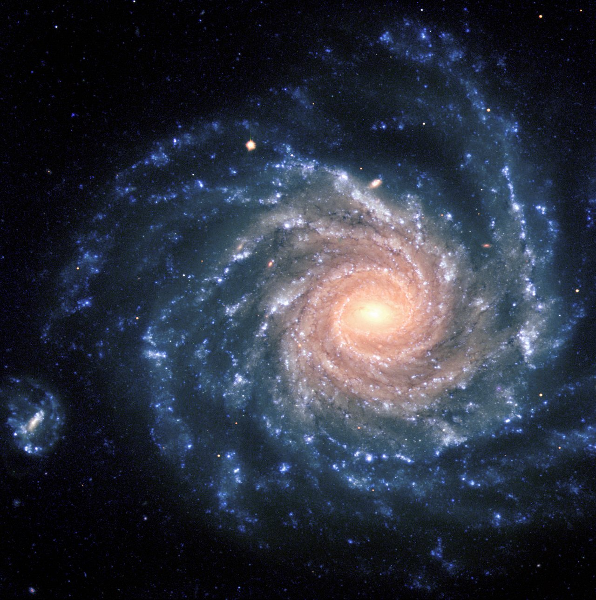

Loop doc for Issue #222 (iteration 1). The spiral arms are the Milky Way's star-forming lanes: what they look like from inside and out, how they age, what builds them, and how each arm interacts with the clouds, clusters and disk around it runs through every section below.

# Spiral arms — the Milky Way's star-forming lanes

Our galaxy is a barred spiral about 100,000 light-years across, and its arms are where almost all the action is: dark dust, glowing gas and newborn stars strung along slow-turning lanes. We live inside one of the smallest of these lanes — the Orion Spur — about 26,000 light-years from the center, so every arm map is drawn from the inside out, through dust that blocks visible light. Radio and infrared eyes do the mapping; a face-on neighbor like NGC 1232 shows what home would look like from outside.

## What it looks

Face-on, the Milky Way would be a pinwheel with two grand arms — Perseus on the outside, Scutum–Centaurus on the inside — winding off the ends of a thick central bar of stars, plus two fainter, gassier arms, Sagittarius and Norma, strung between them. That two-major-arm picture comes from star counts with NASA's Spitzer telescope: the grand arms pile up old red-giant stars as well as young ones, while the minor arms hold mostly gas and pockets of star birth. Home sits between Sagittarius and Perseus on a short side branch, the Orion Spur (also called the Local or Orion–Cygnus Arm), on the spur's inner edge about 26,000 light-years — near 8 kiloparsecs — from the galactic center. An arm is a few hundred parsecs to about a kiloparsec wide, layered like a weather front: a dark dust lane on its inner rim, then pink glowing knots of ionized gas (HII regions), then blue clusters of newborn stars trailing outward — squeeze, light up, and age, in that order. The arms wind loosely, tilted only about 12 degrees from a perfect circle (the pitch angle), so they wrap barely a quarter turn from bar to rim. From inside, dust in the plane hides the far side entirely: radio maps of gas and maser beacons do what eyes cannot, which is why the arm count stayed argued for decades.

Target visuals (files in `images/`, credits and licenses at the bottom):

Source: ESO eso9845d release (VLT view: red older center, blue young arms, distorted companion at left).

## How it changes over time

Stars and gas orbit the center far faster than the arm pattern turns — near the Sun about 220 km/s, one lap every roughly 220 million years — so everything streams through the arms like cars through a traffic jam. Gas gets squeezed as it enters, massive stars ignite and die within millions of years as supernovae, and their blast waves compress the next stretch of gas: the arm stays lit even though no single star stays in it. Gaia's billion-star velocity maps confirm the churn: stars stream toward and away from the center by about 10 km/s in patterns that fit two grand arms better than four, with extra ripples from the central bar and a likely shove from a passing dwarf galaxy a few hundred million years ago. At the Sun's pace an arm crossing comes roughly every 100 million years or so, each passage a round of compression, star birth and dispersal. Arms may also come and go: some models regrow them again and again from disk instabilities, so today's Perseus may not last forever — while open-cluster studies with Gaia favor arms that live long enough to keep their shape for billions of years, the debate between steady waves and recycled transients is still open.

Sources: ESA Gaia DR3 rotation and velocity results; American Scientist "Gaia Reveals the Milky Way"; Khoperskov bar and spiral cartography.

## How it is created

An arm is a traveling compression wave, not a fixed tube — the density-wave picture of Lin and Shu from the 1960s. Without it there is a winding problem: inner stars lap outer ones, so any arm made of fixed stuff would wind itself into a tight coil within a few orbits, far tighter than anything observed. Instead the pattern turns at its own slower pace (spiral fits near 12–19 km/s/kpc, well below the bar's ~38–40), and stars and gas overtake it inside the corotation radius and lag behind it outside. Bars, companions and near misses help drive the wave — grand designs with two symmetric arms are the strongly driven case — while quieter disks grow patchier, multi-arm ripples on their own. Maser parallaxes (BeSSeL, VERA) pin the wave down: about 200 trigonometric distances to newborn massive stars trace the arms across roughly a third of the galaxy directly. Where exactly the spiral corotation sits — inside or outside the Sun's orbit — is still argued, which is why the same Gaia data can fit both a grand two-arm wave and a busier, more transient pattern depending on the model.

Sources: Wikipedia "Density wave theory"; galaxies-book spiral-structure chapter; SF2A 2023 Gaia spiral fits; Reid et al. 2019 maser parallaxes.

### Steady wave or recycled arms — what Gaia leans toward

The classic Lin–Shu picture keeps one steady wave: the pattern turns at a fixed pace while stars and gas stream through it. The rival dynamic-spirals picture says arms are short-lived and recycled — disk instabilities grow a segment, it winds up and breaks within a few hundred million years, then a new one regrows, each piece turning at nearly the local star speed instead of one galaxy-wide pace. Reviews of spiral structure lay out both sides and note that swing amplification can boost either kind, which is why the Milky Way debate stayed open for so long.

Gaia DR3 kinematics lean toward the livelier picture without settling it. Billion-star velocity maps show streaming motions and nearby moving groups riding along with the arms, plus a still-unwound snail-shell "phase spiral" in how stars bob above and below the plane — the disk still ringing from a past shove, likely a dwarf-galaxy passage. That fits a disk out of balance better than one eternal wave. The likely answer for home is a mix: a bar-driven two-arm backbone with shorter-lived segments and spurs layered on top.

Sources: Wikipedia "Spiral arm" (material versus wave arms, swing amplification); Wikipedia "Stellar kinematics" (Gaia advances, moving groups); ESA Gaia DR3 stellar-motions story (wavy proper motions, rotation curve).

## How it interacts with the others

- **With clouds:** arms squeeze giant molecular clouds into collapse (see `clouds.md`); the Eagle and Orion complexes are spur-scale examples lit by the same compression. An arm works its gas the way a slow wave works traffic — bunching it, then letting it go.
- **With open clusters:** newborn clusters hatch inside arms and drift out as they age, dispersing their stars into the field within hundreds of millions of years (see `open.md`); Gaia open clusters still outline the arms, favoring long-lived structure.
- **With the disk, bar and bulge:** the bar's ends anchor the two grand arms, and its faster spin stirs resonances through the disk; gas funneled inward along the arms feeds the bulge and the central black hole (see `disk.md`).
- **With globulars and the halo:** ancient globular clusters ignore the arms entirely, swarming the halo on tilted orbits — the 12-billion-year record beside the arms' million-year weather (see `globulars.md`).
- **With dwarf companions:** a sinking dwarf punches through the disk and ripples it; the Sagittarius dwarf has crossed the plane several times on a tightening orbit, and a 2020 Gaia-based study dates three star-formation bursts it set off.

Sources: Hou & Han 2014 arm tracers; Castro-Ginard et al. 2021 Gaia EDR3 open clusters; L05 `disk.md`, `clouds.md`, `open.md`, `globulars.md`.

## Examples and key numbers

- **Sun's address:** ~26,000 light-years (~8 kpc) from the center, inner edge of the Orion Spur between Sagittarius and Perseus. Sources: NASA Imagine the Universe; Wikipedia "Galactic Center".
- **Sun's orbit:** ~220 km/s around the center, one lap every ~220 million years — a few dozen arm passages per galactic lifetime. Source: Sofue rotation-curve review (R0 ~ 8 kpc, V0 ~ 200–238 km/s).
- **Arm pitch:** ~12 degrees from circular, a loose wrap (major arms run 9–19°, mean ~13°). Sources: RAA spiral-structure review; Vallee pitch meta-analysis.
- **Orion Spur:** ~20,000 light-years long and a few thousand wide — a side branch, not a grand arm; nearly every naked-eye star sits inside it. Source: Wikipedia "Orion Arm" (Xu et al. 2016).
- **Arm widths:** star-forming ridges a few hundred parsecs across (0.2–0.4 kpc near the Sun), about a kiloparsec counting dust, gas and older stars. Source: RAA spiral-structure review (Reid et al. 2014).
- **Pattern speeds:** spiral pattern ~12–19 km/s/kpc; bar ~38–40 with corotation near 5–6 kpc. Sources: SF2A 2023 proceedings; Drimmel et al. 2023.
- **NGC 1232:** face-on spiral ~60 million light-years out in Eridanus, shown field ~200,000 light-years wide (twice the Milky Way), imaged by the VLT in 1998. Source: ESO eso9845d.
- **Tracers:** HII regions, giant molecular clouds and 6.7 GHz methanol masers mark the arms; Gaia maps a billion stars' motions on top. Sources: Hou & Han 2014; Reid et al. 2019; ESA Gaia.

## Image credits and licenses

| File | Shows | Credit (required) | License / terms |
|---|---|---|---|
| `ngc1232-eso9845d.jpg` | NGC 1232 face-on spiral with clear arms and small companion (screensize) | ESO | CC-BY 4.0 (`https://www.eso.org/public/images/eso9845d/`) |

## Sources

- NASA JPL, two arms go missing (Spitzer): `https://www.jpl.nasa.gov/news/two-of-the-milky-ways-spiral-arms-go-missing`
- NASA, the Milky Way galaxy: `https://science.nasa.gov/resource/the-milky-way-galaxy`
- NASA Imagine the Universe, Milky Way info (8 kpc, Orion Arm): `https://imagine.gsfc.nasa.gov/features/cosmic/milkyway_info.html`
- Wikipedia, Orion Arm: `https://en.wikipedia.org/wiki/Orion_Arm`
- Wikipedia, Galactic Center (Sun distance range): `https://en.wikipedia.org/wiki/Galactic_Center`
- Wikipedia, density wave theory: `https://en.wikipedia.org/wiki/Density_wave_theory`
- Wikipedia, spiral arm (material versus wave arms, alternative theories): `https://en.wikipedia.org/wiki/Spiral_arm`
- Wikipedia, stellar kinematics (Gaia advances, moving groups): `https://en.wikipedia.org/wiki/Stellar_kinematics`
- ESA Gaia DR3, where the stars go (proper motions, rotation curve): `https://www.cosmos.esa.int/web/gaia/dr3-where-do-the-stars-go-or-come-from`
- Galaxies-book, spiral structure (winding problem): `https://galaxiesbook.org/chapters/IV-04.-Internal-Evolution-in-Galaxies_3-Spiral-structure.html`
- Hou & Han 2014, observed spiral structure (tracers): `https://www.aanda.org/articles/aa/full_html/2014/09/aa24039-14/aa24039-14.html`
- Xu et al. 2016, local spiral structure (BeSSeL): `https://pmc.ncbi.nlm.nih.gov/articles/PMC5040477`
- Reid et al. 2019, maser parallaxes: `https://iopscience.iop.org/article/10.3847/1538-4357/ab4a11`
- RAA review, spiral structure of the Milky Way (arm widths): `https://www.raa-journal.org/issues/all/2018/v18n12/IRev/202203/P020220324633413350715.pdf`
- Vallee 2015, global pitch angle meta-analysis: `https://arxiv.org/pdf/1505.01202`
- Castro-Ginard et al. 2021, arms from Gaia EDR3 clusters: `http://ui.adsabs.harvard.edu/abs/2021A&A...652A.162C/abstract`
- American Scientist, Gaia reveals the Milky Way: `https://www.americanscientist.org/article/gaia-reveals-the-milky-way`
- ESA Gaia, Milky Way rotation curve (DR3): `https://www.cosmos.esa.int/web/gaia/iow_20230927`
- SF2A 2023, Milky Way dynamics with Gaia (pattern speeds): `http://proceedings.sf2a.eu/2023/2023sf2a.conf..91K.pdf`
- Drimmel et al. 2023, outer-disc resonance (bar 38.1): `https://www.aanda.org/articles/aa/full_html/2023/02/aa44605-22/aa44605-22.html`
- NASA Chandra, Milky Way at arms' length: `https://science.nasa.gov/missions/chandra/nasas-chandra-examines-milky-way-at-arms-length`
- Sofue, rotation and mass in the Milky Way (R0, V0): `https://ned.ipac.caltech.edu/level5/Sept16/Sofue/Sofue2.html`
- Wikipedia, Sagittarius Dwarf Spheroidal Galaxy (Gaia star-formation bursts): `https://en.wikipedia.org/wiki/Sagittarius_Dwarf_Spheroidal_Galaxy`
- ESO, NGC 1232 eso9845d: `https://www.eso.org/public/images/eso9845d/`
- ESO copyright (CC-BY 4.0): `https://www.eso.org/public/copyright/`
- L05 bridge: `previous-l4.md`; L04 home view: `docs/universes/levels/L04/spirals.md`
