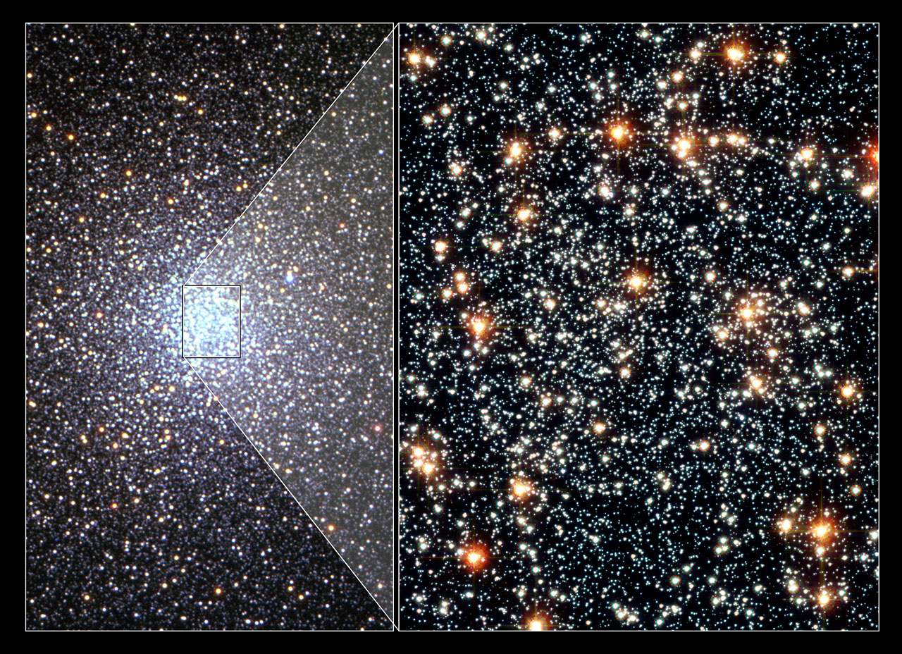

Loop doc for Issue #222 (iteration 4). Globular clusters are the halo's
ancient swarms: round gas-free balls of a hundred thousand to a million
old stars, 11-13 billion years old, looping far outside the star-forming
disk. 47 Tucanae is the featured example; Omega Centauri — already
pictured at L4 — is the bridge. How a globular relates to the other L5
parts runs through every section below.

# Globulars — ancient swarms of the halo

## What it looks

A globular is a ball of old stars, brightest at the middle and thinning
smoothly outward: thousands of yellow-red suns crowded so tight at the
core that neighbours sit a fraction of a light-year apart, against more
than four light-years between the Sun and its nearest neighbour. No dust
lanes, no pink star-birth knots — the gas is long used up or blown out,
so what you see is pure old starlight.

Target visuals (files in `images/`, credits and licenses at the bottom):

Sources: ESA/Hubble heic0616a (collage, million-star caption, 15,000
light-year distance); Wikipedia "47 Tucanae" (44-arcminute moon-sized
span) and "Globular cluster" (gas-free, core crowding).

## How it changes over time

Nothing is born here anymore; the story is aging and sorting. Hubble
watched 47 Tuc for seven years and caught mass segregation in the act:
heavy stars sink to the core while light ones speed outward, measured
across nearly 15,000 stars — slowest were 23 blue stragglers, hot stars
twice the average mass likely built by collisions in the crush.

Sorting ends in core collapse for about one Milky Way globular in five:
the core contracts, brightness climbing all the way in. Binaries hold
collapse back, soaking up passers-by and tossing them out faster; each
dive through the disk plane hits back with a tidal shock. Meanwhile the
cluster evaporates over some ten billion years while tides strip the
outskirts — torn Palomar 5 trails stars 13,000 light-years along its orbit.

Sources: ESA/Hubble heic0616 release (seven-year study, blue stragglers);
Wikipedia "Globular cluster" (one-in-five collapse, binaries, tidal
shocks, evaporation timescale, Palomar 5 tails).

## How it is created

Globulars are born where star birth runs hottest and densest: starburst
regions and colliding galaxies, where whole clusters of clusters pile up
and merge — Hubble sees this now in the Antennae. Once thought single
batches from one cloud, nearly all carry multiple populations: 47 Tuc
holds at least two generations of different age and metal content, and
NGC 2808 holds three, all born within 200 million years.

Many were not born here at all: some formed in dwarf galaxies and were
pulled in by tides, and Omega Centauri's spread of ages and metals plus
its backward orbit mark it as one such stripped dwarf core. No globular
shows active star formation today — these are among the oldest objects
anywhere, old enough to set a floor under the age of the universe.

The chemistry rules out a single burst. In nearly every ancient globular,
stars rich in sodium are poor in oxygen and vice versa, a pattern that
needs hot hydrogen burning in a first generation whose expelled gas then
formed a second generation. A cluster that looks like one ball of
same-age starlight is therefore a stack of two or more populations
wearing the same shape.

Sources: Wikipedia "Globular cluster" (starburst birth, Antennae mergers,
multiple populations, captured dwarfs, oldest objects) and "47 Tucanae"
(two populations); Wikipedia "Gaia Sausage" (NGC 2808 triple generation);
Bastian & Lardo review (element variations O/Na, multiple epochs).

## How it interacts with the others

- **With open clusters (see `open.md`):** cousins with opposite fates —
  young loose disk groups dissolve in hundreds of millions of years,
  while globulars stay bound for nearly a Hubble time in the halo.
- **With clouds (see `clouds.md`):** globulars carry no gas or dust, so
  no new stars ignite inside them — birth belongs to the clouds.
- **With the disk (see `disk.md`):** looping orbits punch through the
  plane again and again — each crossing shocks the cluster, stripping
  stars and speeding core collapse, while the disk's gas never refuels it.
- **With galaxy assembly:** metal-poor globulars map the halo, metal-rich
  ones the bulge, and orbits keep the receipts: at least eight came with
  the Gaia-Enceladus dwarf 8-11 billion years ago, up to a fifth of the
  outer-halo set from the Sagittarius dwarf, a quarter overall accreted.
- **With planets:** crowded metal-poor cores look hostile — Hubble found
  zero planets in 47 Tuc's core where ten to fifteen were expected.

Sources: Wikipedia "Globular cluster" (open-vs-globular fates, halo/bulge
split, quarter accreted, tidal shocks, Sagittarius share) and "47 Tucanae"
(empty planet survey); Wikipedia "Gaia Sausage" (eight Sausage clusters);
L05 `previous-l4.md` (halo ancients) and `open.md` (disk dispersal).

## Examples and key numbers

Typical globulars hold a hundred thousand to a million stars across
10-300 light-years; the Milky Way owns 150-plus, Andromeda up to 500, M87 up to 13,000.

Example objects:

- **47 Tucanae (NGC 104)** — featured example, second brightest globular
  after Omega Centauri, ~14,500 light-years out in Tucana, ~120
  light-years across, about a million stars in 7.0 x 10^5 solar masses,
  ~13 billion years old, naked-eye at magnitude 4.1. Source: Wikipedia
  "47 Tucanae"; ESA/Hubble heic0616a (million-star caption).
- **Omega Centauri (NGC 5139)** — the L4 bridge, largest and most massive
  Milky Way globular, ~150 light-years across, ~10 million stars in 4
  million solar masses, ~16,000 light-years away, ~11.5 billion years old,
  likely a devoured dwarf's core. Source: Wikipedia "Omega Centauri".

## Image credits and licenses

| File | Shows | Credit (required) | License / terms |
|---|---|---|---|
| `47tuc-heic0616a.jpg` | 47 Tucanae: VLT wide view beside Hubble core close-up (screensize) | Left: VLT/ESO, R. Kotak and H. Boffin (ESO); right: NASA, ESA, G. Meylan (EPFL) | CC-BY 4.0 (`https://esahubble.org/images/heic0616a/`) |

## Sources

- Wikipedia, Globular cluster: `https://en.wikipedia.org/wiki/Globular_cluster`
- Wikipedia, 47 Tucanae: `https://en.wikipedia.org/wiki/47_Tucanae`
- Wikipedia, Omega Centauri: `https://en.wikipedia.org/wiki/Omega_Centauri`
- Wikipedia, Gaia Sausage: `https://en.wikipedia.org/wiki/Gaia_Sausage`
- Bastian & Lardo, Multiple Stellar Populations in Globular Clusters: `https://arxiv.org/abs/1712.01286`
- ESA/Hubble, heic0616 release: `https://esahubble.org/news/heic0616/`
- ESA/Hubble, heic0616a image: `https://esahubble.org/images/heic0616a/`
- ESA/Hubble, usage terms (CC BY 4.0): `https://www.spacetelescope.org/copyright/`
- L05 bridge: `previous-l4.md`; L05 sibling: `open.md`
