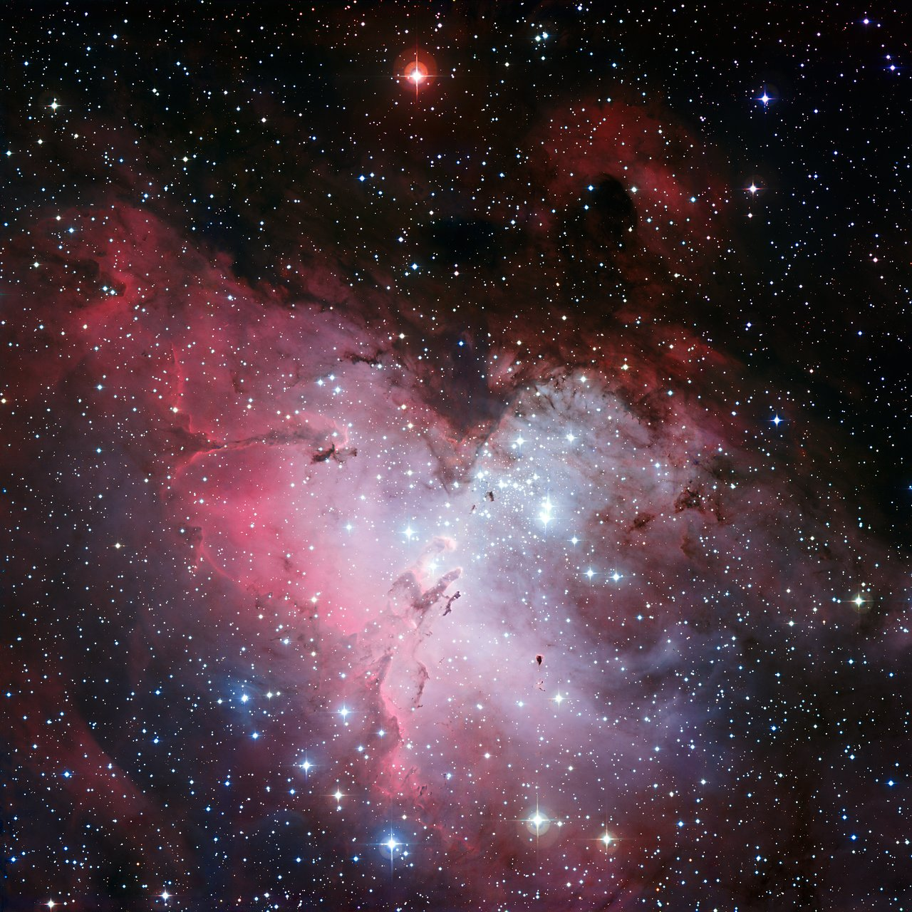

# L4 behind us — Galaxies as previous level

Loop doc for Issue #222 (Round 2 loop refresh). This page is the bridge
from L4 (Galaxies) into L5 (Galactic structures): what the previous level
looks like, what carries over when you zoom in, and what changes at L5
scale. The part docs from the loop's first pass now exist — follow the
cross-links below. Entry itself — the visual transition and its effects —
lives in `entry.md`. The dated timeline runs through `lifetime.md`.

## What L4 is and how it looks

L4 is the island-universe scale at 10^20–10^21 m: single galaxies with
shapes of their own — barred spirals with dust-marbled disks and yellowish
bulges, smooth featureless ellipticals, ragged irregulars and faint dwarfs —
many with a supermassive black hole at the center (M87* at 6.5 billion Suns;
our own Sagittarius A* at about 4 million). Its anchor landmark is home:
the Milky Way, ~100,000 light-years across (9.46 x 10^20 m), a barred
spiral of 100–400 billion stars whose disk we see edge-on as the glowing
band across our night sky. The far landmark is Andromeda (M31): the nearest
major spiral, about 2.5 million light-years away, slightly larger than home,
the galaxy we are falling toward at ~110 km/s. Around them sit the smaller
companions: Triangulum (M33), the Large and Small Magellanic Clouds, and
dozens of fainter dwarf satellites. Our Local Group — 30+ galaxies over
~10 million light-years — sits inside its larger currents, pulled toward
Virgo's 1,300 to 2,000 members and the clusters beyond.

Target visuals (files in `images/`, credits and licenses at the bottom):

Sources: `docs/universes/ladder.md` (R5 anchors, R6 ratios, R8 form);
`docs/universes/levels/L04/README.md` (L4 part docs); Wikipedia "Milky Way",
"Andromeda Galaxy", "Local Group"; EHT releases (NASA 2019 M87*, 2022
Sgr A*).

## What carries over into L5

Everything L4 shows at galaxy scale is still there, only closer. The Milky
Way L4 frames as one tilted coin — disk, brighter core, faint halo — becomes
the L5 contents: the spiral arms that marble that disk, the giant molecular
clouds where new stars are being born right now, and the star clusters young
and ancient that record its history. The L5 anchor is the molecular-cloud
complex at 100 parsecs (3.09 x 10^18 m): a single star-forming cloud the
size of the Orion complex, the unit our home neighborhood is built from. The
near landmark is the Pleiades (M45): an open cluster of ~1,000 young blue
stars about 440 light-years away in Taurus, ~100 million years old, its
central region ~8 light-years across inside a ~43-light-year span — the
nearest star cluster to Earth, passing through a wisp of interstellar dust
that scatters blue light around its brightest members. The far landmark is
the Eagle Nebula (M16/NGC 6611): a star-forming region ~7,000 light-years
out in Serpens Cauda, home of the Pillars of Creation, lit by the young
massive cluster NGC 6611. Our own address resolves here too: the Sun sits
~26,000–27,000 light-years (about 8 kiloparsecs) from the galactic center on
the inner edge of the Orion Spur — a short spur between the Perseus and
Scutum–Centaurus arms — roughly halfway between center and rim. Sources:
ladder R5 anchors; Wikipedia "Milky Way", "Pleiades", "Eagle Nebula"; ESO
Eagle Nebula eso0926a and Pleiades b11 pages; L04
`docs/universes/levels/L04/spirals.md` (Milky Way home) and
`docs/universes/levels/L04/dwarfs.md` (Magellanic companions).

## What changes at this zoom

**From coins to countryside.** At L4 a galaxy is one object with a type
label — barred spiral, elliptical, irregular. At L5 each spiral opens into
terrain: luminous arms a few thousand light-years wide winding around a
central bar and bulge, dark dust lanes edging the arms' inner rims, glowing
star-forming clouds studding them like lanterns, and clusters scattered
through — blue-white open clusters in the disk, red ancient globulars
swarming the halo (see `arms.md`, `clouds.md`, `open.md`).

**From one cell to hundreds of portals.** The L4 cell opens into L5 through
32 markers per cell for a poor group like ours, up to 2,000 for a rich one
like Virgo, each showing its L5 cell at a true size ratio of 3.24e-3
(`docs/universes/ladder.md`, R6 table). Populations (field objects shown as
points) never open; only portals do. Our path runs through the home spur,
the Orion Spur, with the Eagle and Orion cloud complexes as the far
star-forming landmarks. Sources: ladder R6 amendment; ADR 0010 (portal vs
population).

**From architecture to weather and work.** L4 shows why each galaxy looks
the way it does — disks built by settling gas, ellipticals puffed by
mergers, nuclei lit by infall. L5 shows the work in progress: clouds
collapsing into protostars, massive stars sculpting pillars and blowing
bubbles, clusters dispersing their siblings back into the field over
hundreds of millions of years while globulars keep their 12-billion-year
formation record (see `disk.md`). The black hole is still there, 26,000
light-years away at the center, but here the story is the building site,
not the building. Sources: NASA star-formation pages; L04
`docs/universes/levels/L04/nuclei.md` (Sgr A* home shadow).

## How the parts fit together

One assembly line runs through the part docs. Spiral arms (`arms.md`) crowd
gas into ridges; the ridges collapse into giant molecular clouds
(`clouds.md` — Orion, Carina); clouds hatch open clusters (`open.md` —
Pleiades, Hyades) that disperse over hundreds of millions of years; ancient
globulars (`globulars.md` — 47 Tuc) keep the 12-billion-year formation
record; and the disk, bulge, bar and diffuse gas (`disk.md`) hold the whole
line. The dated version of this story runs through `lifetime.md`, and the
dive that brings you here is in `entry.md`.

## Where to go next

- `entry.md` — the L4-to-L5 dive in plain steps, effects on entry, timing.
- `arms.md` — spiral arms: density ridges, dust lanes, Orion Spur home.
- `clouds.md` — giant molecular clouds and star-forming regions: Orion, Carina.
- `open.md` — open clusters: Pleiades, Hyades, young-disk aging and dispersal.
- `globulars.md` — globular clusters: 47 Tuc home example, halo ancients.
- `disk.md` — disk, bulge, bar plus diffuse gas and halo: what holds the parts together.
- `lifetime.md` — dated stages from cloud formation to dispersal and recycling.

## Key numbers

- L4 span: 10^20–10^21 m; anchor Milky Way 100 kly (9.46 x 10^20 m).
- L5 span: 10^17–10^19 m; anchor molecular-cloud complex 100 pc (3.09 x 10^18 m).
- Milky Way: ~100,000 ly across, 100–400 billion stars, barred spiral.
- Sun: ~26,000–27,000 ly (~8 kpc) from center, inner edge of the Orion Spur.
- Eagle Nebula: ~7,000 ly away; Pillars of Creation lit by cluster NGC 6611.
- Pleiades: ~440 ly away, ~1,000 stars, under ~100 Myr old, ~43 ly across.
- L4 to L5 ratio: 3.24e-3, 32 markers per L4 cell (2,000 rich).

Sources: ladder R5/R6; pages named above; ESO eso0926a/b11 object tables.

## Image credits and licenses

| File | Shows | Credit (required) | License / terms |
|---|---|---|---|
| `eagle-nebula-eso0926a.jpg` | Eagle Nebula three-colour mosaic with Pillars of Creation (screensize) | ESO | CC-BY 4.0 (`https://www.eso.org/public/images/eso0926a/`) |

Note: the Round 2 audit (T5) confirms each file, credit and term before the
loop continues; replacements are separate updates, never silent swaps.

## Sources

- Ladder: `docs/universes/ladder.md` (R5 anchors, R6 ratios, gap note, R8 form)
- Wikipedia, Milky Way: `https://en.wikipedia.org/wiki/Milky_Way`
- Wikipedia, Pleiades: `https://en.wikipedia.org/wiki/Pleiades`
- Wikipedia, Eagle Nebula: `https://en.wikipedia.org/wiki/Eagle_Nebula`
- NASA, Milky Way overview: `https://imagine.gsfc.nasa.gov/features/cosmic/milkyway_info.html`
- ESO, Eagle Nebula eso0926a: `https://www.eso.org/public/images/eso0926a/`
- ESO, Pleiades b11: `https://www.eso.org/public/images/b11/`
- L04 reference index: `docs/universes/levels/L04/README.md`
