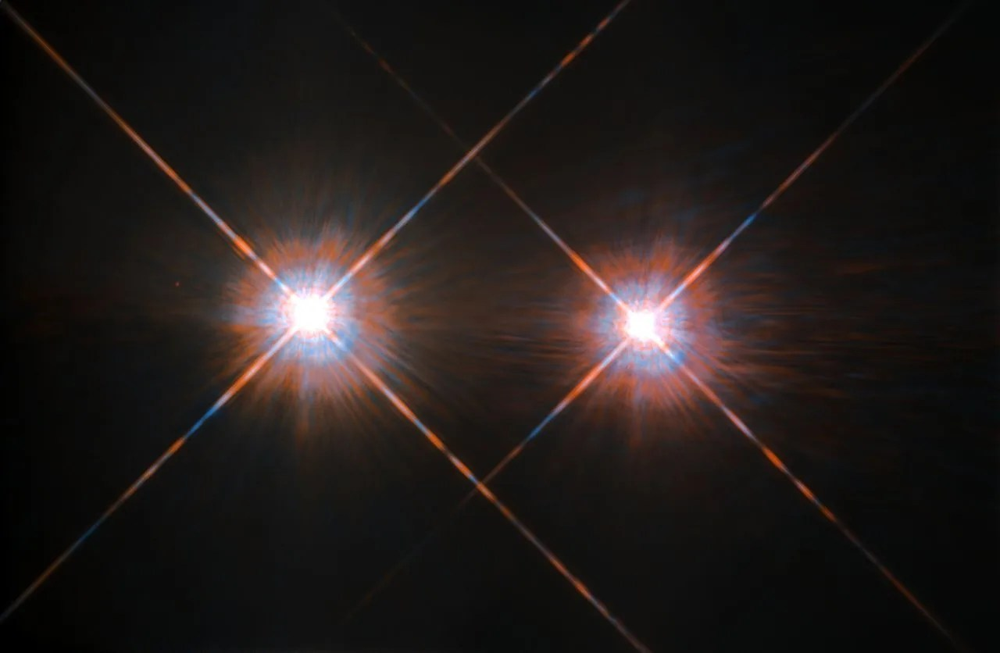

# L5 behind us — Galactic structures as previous level

Loop doc for Issue #223 (Round 1 pilot). This page is the bridge
from L5 (Galactic structures) into L6 (Stellar neighborhood): what
the previous level looks like, what carries over when you zoom in,
and what changes at L6 scale. The part docs arrive in the Round 2
loop — their names are given below in plain text. Entry itself —
the visual transition and its effects — lives in `entry.md`. The
dated timeline runs through `lifetime.md` in Round 2.

## What L5 is and how it looks

L5 is the building-site scale at 10^17–10^19 m: spiral arms winding
around a bar and bulge, dark dust lanes edging the arms, giant
molecular clouds glowing where massive stars are being born right
now — Orion, Carina, the Eagle with its Pillars of Creation — and
clusters scattered through: blue-white open clusters in the disk
(Pleiades, Hyades, Wild Duck), red ancient globulars swarming the
halo (47 Tuc). Its anchor is the molecular-cloud complex at 100
parsecs (3.09 x 10^18 m): one star-forming cloud the size of the
Orion complex. Our address inside it: the Sun sits ~26,000–27,000
light-years (about 8 kiloparsecs) from the galactic center, on the
inner edge of the Orion Spur between the Perseus and
Scutum–Centaurus arms.

Target visuals (files in `images/`, credits and licenses at the bottom):

Sources: `docs/universes/ladder.md` (R5 anchors, R6 ratios, R8 form);
`docs/universes/levels/L05/README.md` (L5 part docs); NASA Alpha
Centauri image article; ESA "Weighing the Dog Star's companion".

## What carries over into L6

Everything L5 shows at structure scale is still there, only closer.
The molecular cloud L5 frames as one glowing complex becomes the L6
setting: the dispersed birth cloud our Sun was born in, the Local
Bubble cavity around us, and the individual suns that condensed out
of such clouds. The L6 anchor is the Alpha Centauri distance, 4.37
light-years (4.13 x 10^16 m): the nearest star system, a triple —
Alpha Centauri A (Sun-like G star), B (orange K star), and Proxima
Centauri (a faint red M dwarf with the planet Proxima b, about 1.06
Earth masses on an 11.2-day orbit). The near landmark is that triple
itself. The far landmark is Sirius at 8.6 light-years: the brightest
star in our night sky, a blue-white A star with a tiny white-dwarf
companion, Sirius B, smaller than Earth yet holding about the Sun's
mass. Our own star resolves here too: the Sun, a G2V yellow dwarf,
one of hundreds of billions, utterly average except that it is ours.
Sources: ladder R5 anchors; NASA Alpha Centauri triple-system page
and Proxima b catalog; ESA Sirius companion page; RECONS census
(M dwarfs are ~75% of stars within 10 parsecs: 284 of 378).

## What changes at this zoom

**From countryside to neighbors.** At L5 a spiral arm is terrain —
ridges, clouds, clusters. At L6 each cloud complex opens into
suns: single stars, doubles and triples, cooling brown dwarfs and
fading white dwarfs, drifting through thin local gas (see the
planned `stars.md`, `multiples.md`, `dwarfs.md`).

**From one cell to a handful of portals.** The L5 cell opens into L6
through 32 markers per cell (cloud populations plus largest-cloud
portals) at a true size ratio of 1.35e-2 (`docs/universes/ladder.md`,
R6 table). Populations (shown points) never open; only portals do.
Inside L6 the next step is sparse: L6 to L7 takes no zoom gap at all
(ratio 3.55e-1, at most 6 markers, usually one system portal) —
the stellar neighborhood is mostly one system per cell. Sources:
ladder R6 amendment and gap note; ADR 0010 (portal vs population).

**From weather to hearths.** L5 shows the work in progress — clouds
collapsing, massive stars sculpting pillars, clusters dispersing.
L6 shows the finished hearths: steady suns burning for billions of
years, companions circling over decades, embers cooling over
aeons, and the thin local medium (Local Bubble, Local Interstellar
Cloud) they all move through (see the planned `ism.md` and
`systems.md`). The black hole is still there, 26,000 light-years
away — but here the story is the neighbors, not the city.

## How the parts fit together

One census runs through the planned part docs. Nearby single stars
(`stars.md`) set the population — mostly faint red M dwarfs, a few
Sun-like stars; multiples (`multiples.md`) bind many of them into
orbits, Alpha Centauri the home example; brown dwarfs and white
dwarfs (`dwarfs.md`) hold the faint endpoints, Sirius B the weighed
example; the local medium (`ism.md`) is the thin air between them —
Bubble, cloud, heliosphere; and the planetary systems (`systems.md`)
are what many of these suns hold, our own system previewing L7. The
dated version of this story runs through `lifetime.md`, and the dive
that brings you here is in `entry.md`.

## Where to go next

- `entry.md` — the L5-to-L6 dive in plain steps, effects on entry, timing.
- Round 2 part docs — `stars.md`, `multiples.md`, `dwarfs.md`, `ism.md`, `systems.md` (names fixed; files arrive with the loop).
- `lifetime.md` — dated stages from cloud collapse to white-dwarf fading (Round 2).

## Key numbers

- L5 span: 10^17–10^19 m; anchor molecular-cloud complex 100 pc (3.09 x 10^18 m).
- L6 span: 10^16–10^17 m; anchor Alpha Centauri distance 4.37 ly (4.13 x 10^16 m).
- Alpha Centauri: triple at ~4.37 ly; A is Sun-like, B orange, Proxima a red dwarf with planet b (~1.06 Earth masses, 11.2 days).
- Sirius: 8.6 ly away; A is the brightest star in our sky; B is an Earth-sized white dwarf near the Sun's mass.
- Neighborhood census: ~75% of stars within 10 parsecs are red M dwarfs (RECONS: 284 of 378).
- Sun: G2V yellow dwarf, ~26,000–27,000 ly (~8 kpc) from center, inner edge of the Orion Spur.
- Local Bubble: a low-density cavity at least ~1,000 light-years across holding the Sun and all nearby young stars.
- L5 to L6 ratio: 1.35e-2, 32 markers per L5 cell; L6 to L7 ratio 3.55e-1, at most 6 markers (usually one).

Sources: ladder R5/R6; pages named above; NASA and ESA object pages.

## Image credits and licenses

| File | Shows | Credit (required) | License / terms |
|---|---|---|---|
| `alpha-centauri-ab-hubble.jpg` | Alpha Centauri A and B glowing against black sky (screensize) | NASA/ESA Hubble | Public domain (NASA) (`https://science.nasa.gov/missions/hubble/hubbles-best-image-of-alpha-centauri-a-and-b/`) |

Note: the Round 2 audit (T5) confirms each file, credit and term before the
loop continues; replacements are separate updates, never silent swaps.

## Sources

- Ladder: `docs/universes/ladder.md` (R5 anchors, R6 ratios, gap note, R8 form)
- NASA, Alpha Centauri triple system: `https://www.nasa.gov/image-article/alpha-centauri-triple-star-system-about-4-light-years-from-earth/`
- NASA, Hubble Alpha Centauri A and B: `https://science.nasa.gov/missions/hubble/hubbles-best-image-of-alpha-centauri-a-and-b/`
- NASA, Proxima Centauri b catalog: `https://science.nasa.gov/exoplanet-catalog/proxima-centauri-b/`
- ESA, Weighing the Dog Star's companion: `https://www.esa.int/Science_Exploration/Space_Science/Weighing_the_Dog_Star_s_companion`
- RECONS census (via published summaries): M dwarfs 284 of 378 stars within 10 parsecs
- Harvard CfA, Local Bubble news: 1,000-light-year-wide bubble holding all nearby young stars
- L05 reference index: `docs/universes/levels/L05/README.md`
