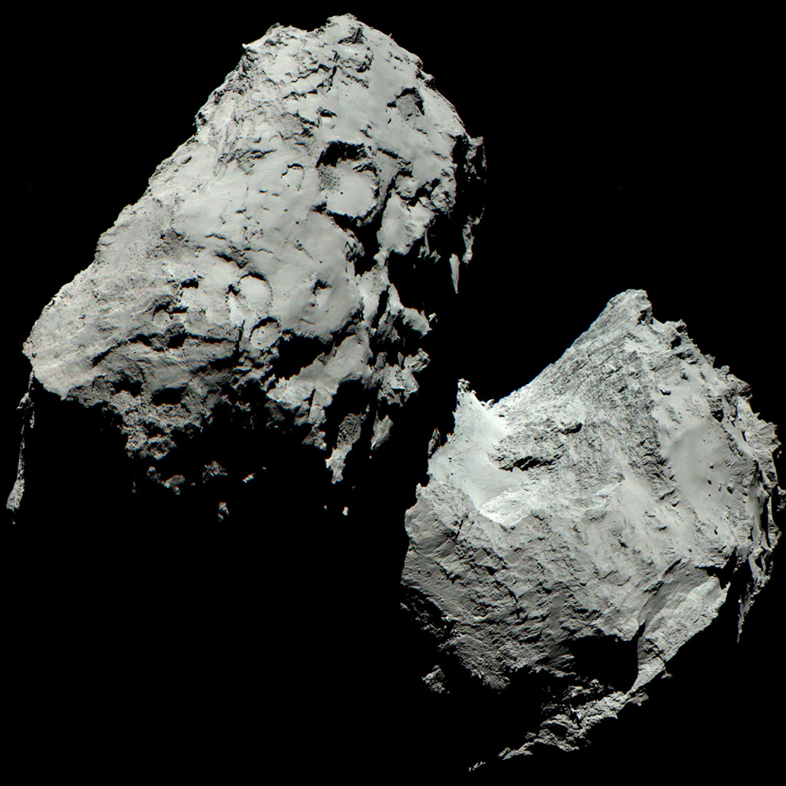

# Comets — traffic plus the heliosphere edge

Loop doc for Issue #224.

This is the traffic of the outer solar system: short-period comets, Halley-type comets, long-period comets from the Oort cloud, Centaurs crossing between the giant planets, and two confirmed visitors from other stars. It ends at the heliosphere boundary, where the Sun's wind gives way to interstellar space.

## How it looks

A comet far from the Sun looks like a dark, lumpy ball of ice and rock. Near the Sun it grows a glowing head (coma) and one or two long tails: a dust tail and a gas tail pushed away from the Sun.

Most comets here are small and very dark. Halley's nucleus reflects only about 3% of the light that hits it. Comet 67P/Churyumov-Gerasimenko looks like a grey double-lobed rock about 4 km across in Rosetta images.

Centaurs look like a halfway stage: redder, asteroid-like bodies with faint comet activity when they come closer in. Interstellar visitors look different from each other. 1I/'Oumuamua showed no coma or tail at all and appeared as a small, elongated, reddish object about 400 m long. 2I/Borisov looked like a normal comet, with a clear coma and tail.

The heliosphere itself is invisible, but NASA draws it as a bubble with layers: termination shock inside, heliosheath in the middle, heliopause at the edge, then interstellar space. NASA's IBEX ribbon — a bright band of energetic neutral atoms discovered in 2009 arching across the nose — maps where the interstellar magnetic field drapes the heliosphere; its evolving shape constrains the boundary models the Voyagers sample in place.

Sources: NASA comets overview (`https://science.nasa.gov/solar-system/comets/`); NASA 1P/Halley (`https://science.nasa.gov/solar-system/comets/1p-halley/`); NASA 67P (`https://science.nasa.gov/solar-system/comets/67p-churyumov-gerasimenko/`); ESA colour image of comet (`https://www.esa.int/ESA_Multimedia/Images/2014/12/Colour_image_of_comet`).

## How it changes over time

A comet brightens near the Sun and fades far away. Ice turns to gas, dust is released, the coma and tails grow, then shrink again on the way out. Each trip wears the nucleus down by metres.

Halley-type comets like 1P/Halley loop every few decades. Halley averages 76 years, last seen in 1986, next expected in 2061. Jupiter-family comets like 67P loop faster, steered by Jupiter. 67P takes 6.45 years.

Centaurs change orbits quickly on cosmic timescales. Pulled by the giant planets, a Centaur can become a Jupiter-family comet, be thrown outward, or be ejected.

Interstellar visitors pass through once and never return. 'Oumuamua was discovered in October 2017 already leaving. Borisov was discovered in August 2019, reached perihelion in December 2019 at about 2 AU from the Sun, and then left.

The heliosphere boundary also moves. The termination shock breathes in and out with solar activity. Voyager 1 crossed it in December 2004 at 94 AU; Voyager 2 crossed it in August 2007 at 84 AU. Voyager 1 crossed the heliopause in August 2012 at 122 AU; Voyager 2 crossed it in November 2018 at 119 AU.

Sources: NASA 1P/Halley, 67P, Voyager pages; ESA Rosetta timeline pages.

## How it is created

Comets are leftover ice from planet formation. Short-period comets mostly come from the Kuiper Belt and scattered disc; long-period comets come from the Oort cloud; Centaurs are Kuiper Belt objects caught in transit between the giant planets.

Heat creates the tails. Within a few AU of the Sun, water ice and other ices turn to gas and drag dust with them. Sunlight pushes the dust; the solar wind pushes the charged gas into a straight ion tail.

Interstellar visitors were made around other stars and ejected. 'Oumuamua and Borisov were thrown out of their home systems and happened to pass through ours. They were not made by our Sun.

The heliosphere is created by the solar wind. Fast charged particles stream out from the Sun, slow suddenly at the termination shock, pile up in the heliosheath, and stop where their pressure balances interstellar pressure at the heliopause.

Sources: NASA solar-system formation, comets, and Kuiper Belt pages; ESA Rosetta backgrounders.

## How it interacts with the others

Comets connect the reservoirs. Oort-cloud nudges send long-period comets inward. Kuiper Belt leaks feed Centaurs, and Centaurs feed Jupiter-family comets. Jupiter is the main traffic cop: it captures, redirects, and sometimes ejects them.

Centaurs cross the orbits of the giant planets, so they interact gravitationally with Jupiter, Saturn, Uranus, and Neptune. That is why their orbits are unstable over millions of years.

Comets also deliver material. Dust from Halley feeds meteor showers each year. Rosetta showed 67P releasing water, carbon dioxide, and dust that enrich the inner solar system.

The Voyagers interact with the boundary itself. Their plasma, magnetic-field, and cosmic-ray instruments measured the shock and the heliopause from the inside, then kept measuring interstellar plasma outside.

Beyond this level: the Voyagers are now in interstellar space, the preview toward L8. They still report back on interstellar magnetic field and cosmic rays.

Sources: NASA comets, 1P/Halley, and Voyager pages; ESA Rosetta results pages.

## Size and mass

Comet nuclei are kilometres or smaller. Halley is about 15 km by 8 km, often rounded to 11 km mean diameter. 67P is about 4 km across. 'Oumuamua was about 400 m long — much smaller than a typical comet nucleus.

Centaurs are bigger, typically tens to ~200 km across. They bridge comet nuclei and small dwarf planets.

Masses are tiny compared to planets. A kilometre-scale comet masses roughly 10^13–10^14 kg. Even Halley masses only about 2 x 10^14 kg. Comas and tails are huge in size (millions of km) but almost nothing in mass.

The heliosphere is huge in size and almost empty in mass. Termination shock at ~84–94 AU, heliopause at ~119–122 AU from the Voyager crossings, with the nose closer and the tail stretching hundreds of AU behind.

Sources: NASA 1P/Halley (size), 'Oumuamua and Borisov pages, Voyager distance pages; ESA 67P size pages.

## Example objects

- 1P/Halley — the famous retrograde visitor. Period 76 years; retrograde orbit tilted 18 degrees; nucleus ~11 km; last perihelion 1986, next 2061.
- 67P/Churyumov-Gerasimenko — the Rosetta comet. Jupiter-family, period 6.45 years; visited by ESA's Rosetta orbiter with Philae lander in 2014.
- 1I/'Oumuamua — first confirmed interstellar visitor. Discovered October 2017; ~400 m long; no coma seen; already leaving when found.
- 2I/Borisov — first confirmed interstellar comet. Discovered August 2019; active coma and tail; perihelion December 2019 at ~2 AU.
- Centaurs — the crossing population. Icy bodies orbiting between the giant planets, unstable, future Jupiter-family comets.
- Heliosphere boundary — the edge crossed in place. Termination shock: Voyager 1 December 2004 at 94 AU, Voyager 2 August 2007 at 84 AU. Heliopause: Voyager 1 August 2012 at 122 AU, Voyager 2 November 2018 at 119 AU. Voyagers launched 1977; grand tour 1979–1989.

Sources: NASA 1P/Halley, 67P, 'Oumuamua, Borisov, and Voyager pages; ESA Rosetta pages.

## Image credits and licenses

| File | Shows | Credit (required) | License / terms |
|---|---|---|---|
| `comet-67p-esa.jpg` | Comet 67P in colour from Rosetta OSIRIS, August 2014 (screensize) | ESA/Rosetta/MPS for OSIRIS Team (`https://www.esa.int/ESA_Multimedia/Images/2014/12/Colour_image_of_comet`) | ESA Standard Licence (free reuse with credit) |

Note: the Round 2 audit (T5) confirms each file, credit and term before the loop continues; replacements are separate updates, never silent swaps.

## Sources

- NASA, Comets overview: `https://science.nasa.gov/solar-system/comets/`
- NASA, 1P/Halley: `https://science.nasa.gov/solar-system/comets/1p-halley/`
- NASA, 67P: `https://science.nasa.gov/solar-system/comets/67p-churyumov-gerasimenko/`
- NASA, Voyager mission: `https://science.nasa.gov/mission/voyager/`
- NASA, Components of the heliosphere: `https://www.nasa.gov/image-article/components-of-heliosphere/`
- ESA, Colour image of comet: `https://www.esa.int/ESA_Multimedia/Images/2014/12/Colour_image_of_comet`
- ESA, Rosetta: `https://sci.esa.int/web/rosetta/`
