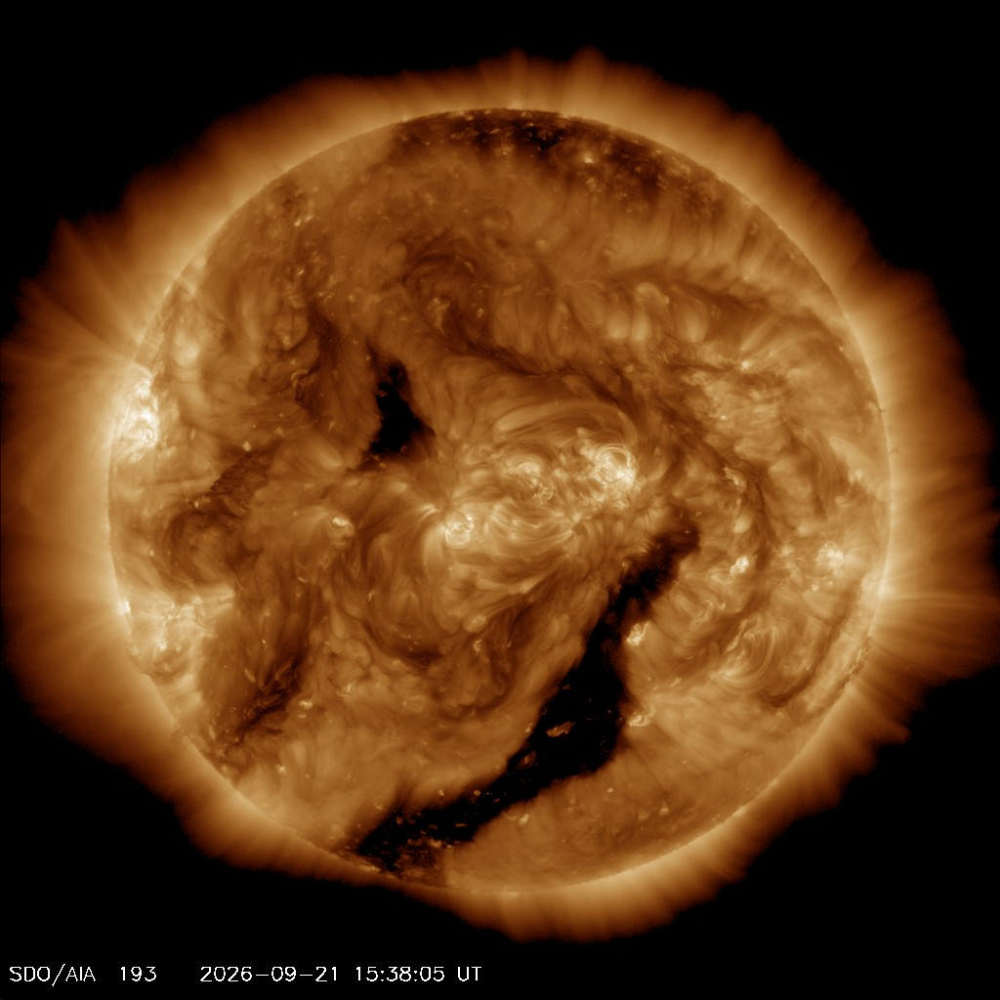

# Entering L8 — the dive from Outer solar system

Loop doc for Issue #225 (Round 1 pilot, refreshed in the Round 2 loop). This page walks the L7-to-L8
dive in plain steps: what you approach, what changes on entry, and
the numbers behind it. The bridge behind us lives in
`previous-l7.md`; the part docs and the timeline now exist — the
cross-links below say where each sight belongs.

## The approach

You leave the shell count behind and fall toward one yellow glare
among the shells — the Sun, the G2V dwarf that is ours, holding
99.8 percent of the system's mass. The distant spheres thin out
into background: the Oort shells from 1,000 AU to 100,000 AU, the
long-period reservoir the comets fall from — still there, now
behind you. Ahead, one marker brightens among the points: the
planetary-system portal of this L7 cell, holding one L8 system at a
true size ratio of 1.20e-3 across two zoom gaps. Around the glare,
the order swells into view: first the Sun's disk with light and
wind, then the four rocky worlds — Mercury, Venus, Earth with its
Moon, Mars — then the four giants as disks with rings and large
moons, then the asteroid belt with dwarf planets, then the Kuiper
edge past Neptune, then the wind bubble itself with termination
shock and heliopause near 120 AU and both Voyager craft at its
edge marking the boundary toward interstellar space.

Target visual (file in `images/`, credit and license at the bottom):

Sources: `docs/universes/ladder.md` (R6 ratios, gap note); NASA Sun
facts page; NASA solar system facts page; NASA Voyager mission
pages.

## Crossing into L8

The L7–L8 span takes two invisible magnification milestones — the
dive pushes by proximity to the targeted portal and unwinds the
same way, so generation, snapshots and labels never see a gap. Then
the portal opens (angular radius past 0.14 rad, about a third of the
view) and the cell closes back into its marker below 0.10 rad —
pure origin shifts, with the pre-entry preview having already drawn
the interior inside the marker from 0.02 rad up to the opening.

What you see, in order:

1. The shells thin and go: the Oort sphere and scattered dots
   dissolve into black, their faint light now behind you — the
   reservoir reduced to a reference shell.
2. One glare takes center: the Sun, blinding up close, a 4.6
   billion-year-old yellow dwarf about 1.4 million km across, with
   light setting the habitable zone and wind blowing the bubble.
3. The rocky worlds appear: Mercury, Venus, Earth with the Moon,
   Mars — small with solid surfaces, nearest the Sun where only
   rock withstood the early heat.
4. The giants resolve as disks: Jupiter at 5.2 AU and Saturn near
   9.5 AU as banded gas giants, Uranus near 19 AU and Neptune near
   30 AU as ice giants, with rings and large moons now round worlds
   of their own.
5. The debris shows: the asteroid belt with dwarf planet Ceres,
   then the Kuiper doughnut from 30 to about 55 AU with Pluto among
   its dots — with Eris and Sedna far at this zoom.
6. The bubble and the edge resolve: solar wind out to the
   termination shock at 80–100 AU (Voyager 1 at 94 AU in 2004,
   Voyager 2 at 84 AU in 2007) and the heliopause near 120 AU where
   Voyager 1 crossed in 2012 and Voyager 2 in 2018 — with the
   preview toward the L9 star close-up.
7. The markers fill again: from 32 portals per L7 cell to 32 per L8
   cell (one star, its planets, belt populations) at ratio
   7.76e-5 with three zoom gaps — the next dive is the star
   close-up of L9.

Sources: ladder gap note and R6/R7 amendments; ADR 0010; NASA Sun
and solar system facts pages; NASA Voyager mission pages.

## Timing and scale

The L7 anchor (Oort cloud outer edge, 1.50 x 10^16 m) gives way to
the L8 anchor (heliopause, 1.80 x 10^13 m) — nearly three decades
closer in characteristic size, ratio 1.20e-3 per rung table, one of
the longest legs of the journey. Travel time per rung runs `Δe ·
ln 10 / k`, so this leg runs long; the longest leg stays the
four-decade heliopause-to-Sun run inside it. Inside L8, distances
read in astronomical units: 1 AU for Earth, 5.2 to 30 AU for the
giants, 30 to 55 AU for the belt, near 120 AU for the heliopause,
out to 100,000 AU for the Oort rim far behind. One AU is about 93
million miles (150 million km).

## What entry proves

Entry is complete when the shells are gone, one star commands the
view, and the planets stand ordered: you count worlds and belts,
not shells. If you can name the yellow dwarf that is ours, the four
rocky worlds in order with the Moon, the four giants in order with
rings, the belt with Ceres, the Kuiper edge with Pluto, and the two
craft at the wind edge — you are in L8. The detailed looks,
lifetimes and interactions of each kind live in the part docs:
`sun.md` for the star, `terrestrials.md` for the rocky worlds,
`giants.md` for the outer disks, `belts.md` for the belts and dwarf
planets, `heliosphere.md` for the bubble and the boundary — with the
dated story in `lifetime.md` — start with its reading guide to map
each sight to its stage.

## Where to go next

- `previous-l7.md` — the L7 bridge: what carries over, what changes at this zoom.
- `sun.md`, `terrestrials.md`, `giants.md` — the star, the rocky worlds, the giants.
- `belts.md`, `heliosphere.md` — the belts and the wind bubble with the Voyager edge.
- `lifetime.md` — dated stages from solar-nebula collapse to the far-future fate.

## Key numbers

- L7 anchor: 100,000 AU (1.50 x 10^16 m); L8 anchor: 120 AU (1.80 x 10^13 m); ratio 1.20e-3.
- Portals: 32 per L7 cell (one star plus shell populations) → 32 per L8 cell; L7–L8 takes two zoom gaps, L8–L9 takes three.
- Open angle 0.14 rad, close 0.10 rad, preview from 0.02 rad (at most 6 markers).
- Sun: 4.6 billion years old, 99.8 percent of system mass, diameter about 1.4 million km.
- Planets: Mercury Venus Earth Mars rocky; Jupiter 5.2 AU, Saturn about 9.5 AU, Uranus about 19 AU, Neptune about 30 AU.
- Kuiper Belt 30–55 AU; termination shock 80–100 AU (Voyager 1 at 94 AU in 2004, Voyager 2 at 84 AU in 2007); heliopause about 120 AU (Voyager 1 in 2012 at about 122 AU, Voyager 2 in 2018); Oort inner edge near 1,000 AU, outer rim near 100,000 AU.

Sources: ladder R5/R6/R7; pages named above.

## Image credits and licenses

| File | Shows | Credit (required) | License / terms |
|---|---|---|---|
| `sun-full-disk-sdo.jpg` | Full disk of the Sun in extreme ultraviolet light showing active regions (screensize) | NASA / SDO (AIA), frame retrieved 2026-10-07 and pinned in-repo | Public domain (NASA) (`https://sdo.gsfc.nasa.gov/`) |

Note: the Round 2 audit (T5) confirms each file, credit and term before the
loop continues; replacements are separate updates, never silent swaps.

## Sources

- Ladder: `docs/universes/ladder.md` (R5 anchors, R6 ratios, R7 preview, gap note, R8 form)
- NASA, Sun facts: `https://science.nasa.gov/sun/facts/`
- NASA, Solar system facts: `https://science.nasa.gov/solar-system/solar-system-facts/`
- NASA, Oort cloud facts: `https://science.nasa.gov/solar-system/oort-cloud/facts/`
- NASA, Kuiper Belt facts: `https://science.nasa.gov/solar-system/kuiper-belt/facts/`
- NASA, Voyager mission overview: `https://science.nasa.gov/mission/voyager/mission-overview/`
- NASA, Voyager fast facts: `https://science.nasa.gov/mission/voyager/fast-facts`
- NASA, Oort cloud scale infographic: `https://science.nasa.gov/resource/oort-cloud-and-scale-of-the-solar-system-infographic/`
