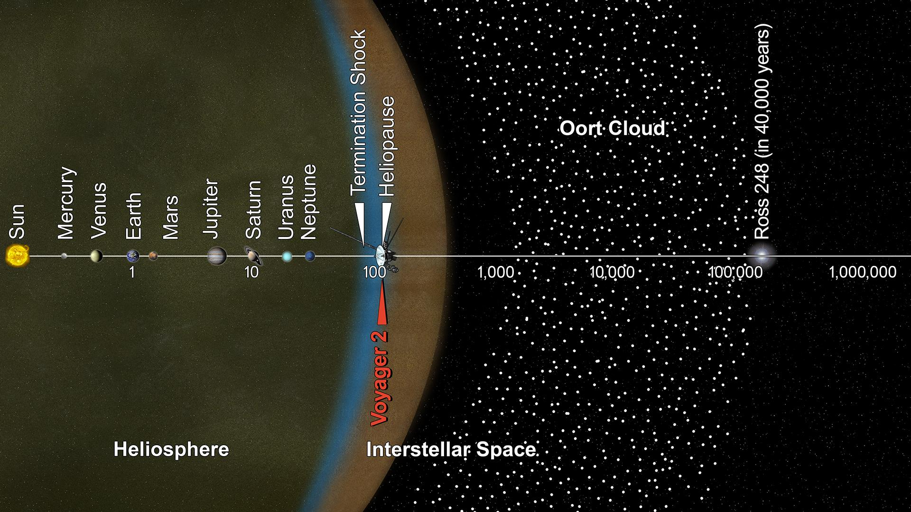

# Heliosphere — the wind bubble with the Voyager edge

Loop doc for Issue #225 (Round 2, iteration 5). The heliosphere is
the Sun's magnetic bubble: solar wind inflating against interstellar
pressure out to the heliopause near 120 AU — the L8 anchor — with
both Voyager craft at its edge. This page covers how it looks, how
it changes over time, how it was created, and how it interacts with
the rest of the planetary system, plus the preview toward L9.

## How it looks

Nothing here is visible to the eye — the bubble shows only in
diagrams. It reads in three layers: the termination shock inside,
where the supersonic wind drops subsonic and piles its field; the
turbulent heliosheath still ruled by the Sun; the heliopause
outside, where hot thin solar plasma meets cold dense interstellar
medium. Long-baseline IBEX data shapes it like a comet: the Sun
near the front, a long tail trailing behind, wrapped by the bright
winding IBEX ribbon of returning energetic atoms that maps the
interstellar field — likely a double-journey population taking
about 2 extra years to return. The Kuiper doughnut at 30 to 50 AU sits deep
inside — the bubble runs three times Pluto's distance before the
medium stops it.

Target visual (file in `images/`, credit and license at the bottom):

Sources: NASA heliosphere pages; NASA Voyager interstellar mission
page; NASA IBEX mission pages.

## How it changes over time

The bubble breathes with the 11-year solar cycle. Weak wind from
2009 to 2014 let it contract; pressure up 50 percent in late 2014
inflated it again, the heliosheath glowing two years later and the
nose filling two years after that while the far tail still waits.
The crossings prove the asymmetry: Voyager 1 met the shock in
December 2004 at 94 AU, Voyager 2 in August 2007 at 84 AU — then
Voyager 1 crossed the heliopause on August 25, 2012 at 122 AU and
Voyager 2 on November 5, 2018. Both still climb outward — 3.6 AU
per year for Voyager 1, 3.3 for Voyager 2 — still reporting through
the Deep Space Network, with Voyager 1 reaching one light-day of
distance in November 2026.

Sources: NASA IBEX boundary study; NASA Voyager fast facts and
interstellar mission pages; NASA Voyager status page.

## How it is created

The bubble is as old as the wind: the young Sun's early outflow
blew the leftover nebula gas and dust away, and today's supersonic
wind leaving the corona keeps inflating the magnetic cavity against
interstellar pressure. The boundary sits where the two push equal —
about 120 AU upwind — and has sat there, breathing, ever since the
system settled. Earth itself lives inside the Sun's atmosphere in
this sense: the wind's bubble extends past every planet.

Sources: NASA Sun facts page.

## How it interacts with the others

Shielding is the interaction: the heliosphere acts as a giant
shield, turning away galactic cosmic radiation before it reaches
the planets, while each planet's own field (or lack of one) decides
what gets through — compare Earth's magnetosphere with Mars's
stripped husk (see `terrestrials.md`). The Voyagers are the
interaction made visible: the only craft outside, tasting plasma
that never knew the Sun, while IBEX watches the whole boundary glow
from home orbit and IMAP — launched September 24, 2025, now posted
at Sun–Earth L1 — maps it ten times sharper with 30-minute solar
storm warning on the side. Beyond the edge: the Oort Cloud's
gravity still rules to 100,000 AU — the Voyagers need 300 years to
reach its inner rim and 30,000 to leave it. And inward the preview:
the L9 star close-up dives into the wind's source itself, the G2V
furnace this bubble breathes from.

Sources: NASA heliophysics heliosphere pages; NASA Voyager mission
overview; NASA IBEX and IMAP mission pages; NASA Oort scale
infographic.

## Size and mass

- 1 AU is 93 million miles (150 million km); Neptune rides 30 AU.
- L8 anchor: heliopause near 120 AU — 120 times 150 million km is 18 billion km, 1.80 x 10^13 m.
- Termination shock crossings: 94 AU (Voyager 1, 2004) and 84 AU (Voyager 2, 2007).
- Heliopause crossings: about 122 AU (Voyager 1, 2012) and Voyager 2 in 2018.
- Outbound rates: 3.6 AU per year (Voyager 1) and 3.3 (Voyager 2).
- Oort inner rim near 1,000 AU: 300 years for the Voyagers; outer rim 100,000 AU: 30,000 years.

Sources: NASA Oort scale infographic; NASA Voyager fast facts and
interstellar mission pages.

## Example objects

Example boundaries: the termination shock both craft felt slow
under them; the heliopause plasma jump Voyager 2's working
instrument caught in full; the IBEX ribbon winding across all-sky
maps; the Oort rim where the Sun's gravity finally yields. Example
craft: Voyager 1 up out of the plane toward Ophiuchus, Voyager 2
down toward Sagittarius and Pavo — each within 1.7 light-years of
another star 40,000 years from now.

Sources: NASA Voyager interstellar mission and FAQ pages; NASA
IBEX pages.

## Image credits and licenses

| File | Shows | Credit (required) | License / terms |
|---|---|---|---|
| `heliosphere-voyager-nasa.jpg` | Diagram of the termination shock, heliosheath and heliopause with Voyager 2 past 119 AU (screensize) | NASA / JPL-Caltech | Public domain (NASA) (`https://science.nasa.gov/resource/oort-cloud-and-scale-of-the-solar-system-infographic/`) |

## Sources

- NASA, Heliosphere: `https://science.nasa.gov/heliosphere/`
- NASA, Heliophysics heliosphere: `https://science.nasa.gov/heliophysics/focus-areas/heliosphere/`
- NASA, Voyager interstellar mission: `https://science.nasa.gov/mission/voyager/interstellar-mission/`
- NASA, Voyager fast facts: `https://science.nasa.gov/mission/voyager/fast-facts`
- NASA, Voyager mission overview: `https://science.nasa.gov/mission/voyager/mission-overview/`
- NASA, Voyager status: `https://science.nasa.gov/mission/voyager/where-are-voyager-1-and-voyager-2-now/`
- NASA, Voyager FAQ: `https://science.nasa.gov/mission/voyager/frequently-asked-questions/`
- NASA, IBEX mission: `https://science.nasa.gov/mission/ibex/`
- NASA, IBEX 11-year boundary study: `https://www.nasa.gov/missions/ibex/nasas-ibex-charts-11-years-of-change-at-boundary-to-interstellar-space/`
- NASA, IMAP mission: `https://science.nasa.gov/mission/imap/`
- NASA, Oort scale infographic: `https://science.nasa.gov/resource/oort-cloud-and-scale-of-the-solar-system-infographic/`
- NASA, Kuiper Belt facts: `https://science.nasa.gov/solar-system/kuiper-belt/facts/`
- NASA, Sun facts: `https://science.nasa.gov/sun/facts/`
