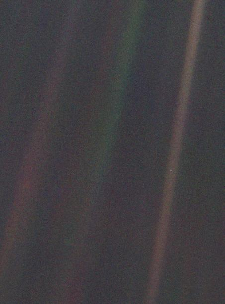

# Lifetime — the dated story of the planetary system

Loop doc for Issue #225 (Round 2, iteration 6). This page runs the
full dated timeline the part docs tell piece by piece: from the
solar nebula's collapse through planet building, migration,
bombardment and belt sculpting, the long stable era, the Voyager
crossing era, and the Sun's red-giant fate with the far future
after. Dates carry sources; the reading guide maps each stage to
its part doc.

## 4.6 Ga — solar nebula collapses, Sun and planets form

A spinning cloud of gas and dust collapses; the Sun takes 99.8
percent of the matter and lights 4.6 billion years ago, while the
rest flattens into a disk and clumps into spheres. Rocky material
alone survives the inner heat (see `terrestrials.md`); ice and gas
settle outside into the giants (see `giants.md`); Jupiter's pull
freezes the belt as rubble (see `belts.md`); the young wind blows
the leftovers out and inflates the first bubble (see
`heliosphere.md`). Earth settles near 4.5 billion years back; the
Moon-forming impact follows.

Sources: NASA solar system facts page; NASA Sun and Earth facts
pages; NASA Oort cloud facts page.

## 4.5–4.4 Ga — giants migrate, belts sculpted, Oort emplaced

The four giants shift orbits: Uranus and Neptune are forced outward
through the icy disk while Jupiter slingshots 7 to 10 Earth masses
of it — most to the Oort Cloud or out of the system, the rest
sculpted into classical, resonant and scattered Kuiper populations
under Neptune's stirring. Ceres freezes in the belt as an embryo
that never finished. The Oort shells take their spherical shape
from 1,000 AU to 100,000 AU.

Sources: NASA Kuiper Belt facts page; NASA Ceres facts page.

## 4.1–3.8 Ga — bombardment and comet delivery

Migration's wreckage rains inward: the Late Heavy Bombardment scars
the Moon, Mercury and Mars while Jupiter corrals the flow. Comets
from the fresh reservoirs deliver water and organics; Earth's
oceans gather and life begins about 3.8 billion years ago. The
Kirkwood gaps are carved where resonances make orbits chaotic.

Sources: Late Heavy Bombardment and Nice model references; NASA
Kirkwood and Kuiper context; NASA Earth facts page.

## 3.8 Ga–present — stable era, life, slow erosion

The system settles into the long calm: planets on fixed tracks,
belts grinding slowly down through collisions and Yarkovsky drift,
storms evolving on the giants, the bubble breathing with each solar
cycle. Earth alone blooms. Humanity arrives late: Sputnik on
October 4, 1957; Voyager 2 on August 20, 1977 and Voyager 1 on
September 5; Jupiter in March 1979 and Saturn in 1980–81; Uranus on
January 24, 1986 and Neptune in 1989 — each the only visit; the Pale
Blue Dot portrait on February 14, 1990 from 3.7 billion miles;
Pluto on July 14, 2015 and Arrokoth on January 1, 2019; DART's
deflection at Dimorphos on September 26, 2022.

Sources: NASA solar system and Earth facts pages; NASA Voyager,
Uranus, Neptune, New Horizons and DART pages; Voyager Pale Blue Dot
page.

## 2004–2018 — Voyager era: launches, shock, heliopause

The edge is touched: Voyager 1 crosses the termination shock in
December 2004 at 94 AU, Voyager 2 in August 2007 at 84 AU; Voyager
1 enters interstellar space on August 25, 2012 at 122 AU, Voyager 2
on November 5, 2018. Both keep climbing — 3.6 and 3.3 AU per year —
while IBEX maps the breathing boundary from home and IMAP, launched
September 24, 2025, takes station at Sun–Earth L1 for the sharp
view.

Sources: NASA Voyager fast facts and interstellar mission pages;
NASA IBEX and IMAP pages.

## 1.3 Myr–5 Gyr future — passages, red giant fate, stripped cloud

Stellar passages come first: Gliese 710 passes 10,520 AU out in
about 1.29 million years, stirring the outer shells into showers.
The Voyagers reach the Oort inner rim in 300 years and leave the
rim in 30,000. Then the Sun's fate: in about 5 billion years it
swells into a red giant, engulfing Mercury and Venus and possibly
Earth, before settling as a white dwarf — the planets' orbits
shifting through the mass loss while passing stars strip the Oort
Cloud away entirely.

Target visual (file in `images/`, credit and license at the bottom):

Sources: Gliese 710 reference; NASA Sun facts page; NASA Oort
cloud facts page.

## Reading guide

- For the star's birth and death: `sun.md` with the nebula collapse and the red-giant fate.
- For the rocky buildup and life: `terrestrials.md` with accretion, the Moon impact and 3.8 Ga life.
- For the giants' youth and migration: `giants.md` with frost-line growth and the Nice-model shift.
- For the debris record: `belts.md` with Ceres the embryo, the gaps, and Arrokoth the untouched leftover.
- For the wind and the edge: `heliosphere.md` with shock, heliopause and the Voyager dates.
- For the bridge behind and the arrival: `previous-l7.md` and `entry.md`.

## Cross-check (second pass)

Timescales aligned across the part docs: nebula 4.6 Ga and Earth
4.5 Ga match in `sun.md` and `terrestrials.md`; giant migration 4
Ga with 7–10 Earth masses moved matches in `giants.md` and
`belts.md`; bombardment 4.1–3.8 Ga with life at 3.8 Ga matches in
`belts.md` and `lifetime.md`; shock crossings 2004/2007 and
heliopause 2012/2018 match in `heliosphere.md` and the timeline;
red-giant fate in 5 Ga matches in `sun.md` and the far-future
stage. No epoch gaps: collapse, migration, bombardment, stable era,
Voyager era, far future run unbroken.

## Image credits and licenses

| File | Shows | Credit (required) | License / terms |
|---|---|---|---|
| `pale-blue-dot-voyager.jpg` | Earth as a pale blue dot in a sunbeam from 3.7 billion miles (screensize) | NASA / JPL-Caltech (Voyager) | Public domain (NASA) (`https://science.nasa.gov/mission/voyager/voyager-1s-pale-blue-dot/`) |

## Sources

- NASA, Solar system facts: `https://science.nasa.gov/solar-system/solar-system-facts/`
- NASA, Sun facts: `https://science.nasa.gov/sun/facts/`
- NASA, Earth facts: `https://science.nasa.gov/earth/facts/`
- NASA, Oort cloud facts: `https://science.nasa.gov/solar-system/oort-cloud/facts/`
- NASA, Kuiper Belt facts: `https://science.nasa.gov/solar-system/kuiper-belt/facts/`
- NASA, Ceres facts: `https://science.nasa.gov/dwarf-planets/ceres/facts/`
- NASA, Voyager mission: `https://science.nasa.gov/mission/voyager/`
- NASA, Voyager fast facts: `https://science.nasa.gov/mission/voyager/fast-facts`
- NASA, Voyager Pale Blue Dot: `https://science.nasa.gov/mission/voyager/voyager-1s-pale-blue-dot/`
- NASA, Uranus exploration: `https://science.nasa.gov/uranus/exploration/`
- NASA, Neptune: `https://science.nasa.gov/neptune/`
- NASA, New Horizons: `https://science.nasa.gov/mission/new-horizons/`
- NASA, DART: `https://science.nasa.gov/mission/dart/`
- NASA, IBEX mission: `https://science.nasa.gov/mission/ibex/`
- NASA, IMAP mission: `https://science.nasa.gov/mission/imap/`
