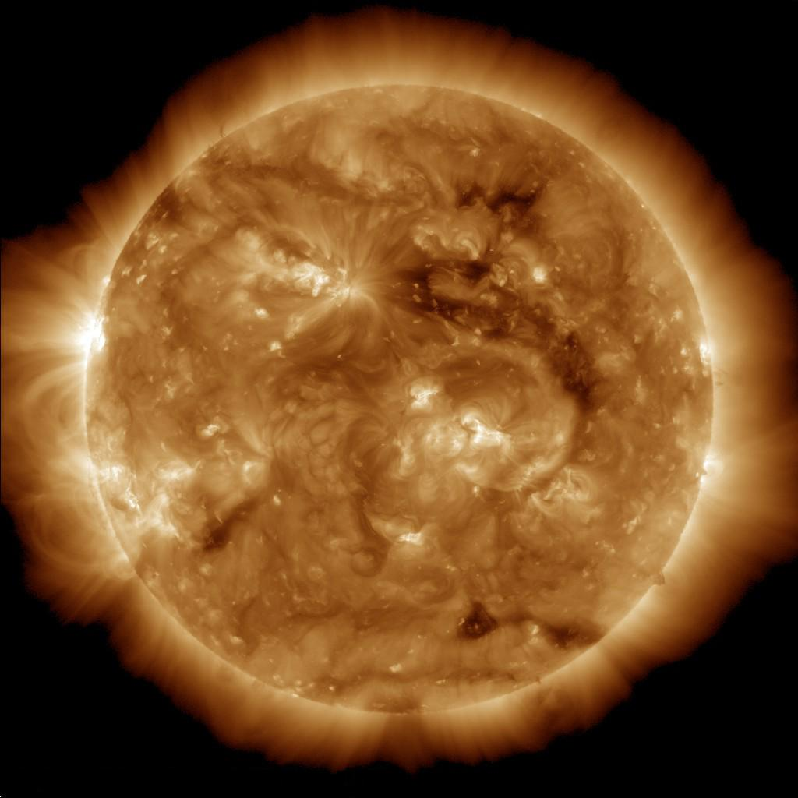

# The atmosphere — the crown of the star

Loop doc for Issue #226 (Round 2, iteration 3). The atmosphere is
the crown of L9: the chromosphere, the transition region, and the
corona with prominences, coronal holes, and spicules. This page
covers how it looks, how it changes over time, how it is created,
and how it interacts with the heliosphere and the planets. The face
below is in `surface.md`; the wind it feeds is in `activity.md`.

## How it looks

Above the photosphere the air stacks in three shells. First the
chromosphere, a thin reddish layer (hydrogen H-alpha glow, hence
"color-sphere") between about 250 and 1,300 miles up, warming from
about 4,000–6,000 degrees at its bottom to 8,000–20,000 degrees at
its top. Then the transition region, a thin irregular skin only
about 60 miles thick where the temperature leaps from 20,000 to
about 1,000,000 degrees, glowing in ultraviolet only reachable
from space. Then the corona: super-heated past 1,000,000 degrees,
extending more than a million km out with no fixed upper edge —
hotter the farther it stretches, while just 1,000 miles below sits
the 10,000-degree surface. The crown carries structure:
prominences as great red-glowing looped walls of plasma anchored in
the photosphere and looping hundreds of thousands of miles into
the corona (seen as dark filaments against the disk); coronal holes
as large dark regions in ultraviolet and X-ray where thin plasma
lets fast wind escape; and up to 10 million spicule jets bursting
as fast as 60 miles per second, thousands of miles long, living
five to ten minutes each.

Target visual (file in `images/`, credit and license at the bottom):

Sources: NASA layers-of-the-Sun page; NASA solar chromosphere,
transition region, and corona pages; NASA SDO pages.

## How it changes over time

The crown breathes with the 11-year cycle. Coronal holes can form
at any time but grow prominent near solar minimum, when persistent
holes settle near the poles and migrate to lower latitudes; during
minimum they can outlast many rotations. Eclipses give the honest
portrait: the corona shows only when the Moon blocks the disk (or
a coronagraph does), as a pearly white crown whose shape follows
the spot cycle — and during the few minutes of totality almost
nothing changes. On the longest clock the crown has shone for 4.6
billion years and will keep shining about 5 billion more; the dated
story is in `lifetime.md`.

Sources: NASA SDO coronal-hole pages; NASA corona pages.

## How it is created

The crown is heated from below, and how exactly is still open.
Constant boiling below generates tangled magnetic islands; when
field lines snap back they expel plasma and energy upward — the
birth of spicules and a share of coronal heat. But the full feat —
a million-degree crown over a 5,500-degree surface — remains one
of the greatest unanswered questions in astrophysics: no one can
really explain how this corona exists, and without a permanent
heating mechanism the plasma would cool within about an hour. Write
it as the puzzle it is, not a solved story.

Sources: NASA SDO coronal-heating page; NASA corona-questions page.

## How it interacts with the others

The corona is where the solar wind originates: it continues outward
as a supersonic stream of plasma permeating the entire solar
system — humans live well within the extended atmosphere of our
Sun. Coronal holes are the fast lanes: their open field lines send
material speeding out at about 700 km per second, and where a fast
stream piles into slower wind the squeeze can slam into planetary
magnetic bubbles — one such stream lit bright auroras at Saturn.
Erupting prominences are the loud exits: when a loop goes unstable
and bursts outward it can detach as a coronal mass ejection, the
space-weather driver covered in `activity.md`, while the steady
wind holds open the whole heliosphere met up close in
`companions.md` and far away in L8.

Sources: NASA SDO pages; NASA solar wind pages.

## Size and mass

- Chromosphere: about 250 to 1,300 miles above the photosphere; 4,000–20,000 degrees.
- Transition region: about 60 miles thick; 20,000 to 1,000,000 degrees.
- Corona: from about 1,300 miles up, past 1,000,000 degrees, extending more than a million km (large structures about a solar radius tall; the eye sees only within about 2 solar radii at eclipse); one solar radius is about 700,000 km; Earth sits about 200 solar radii out.

Sources: NASA layers-of-the-Sun page; NASA corona pages.

## Example objects

Example features: an eruptive prominence (looped plasma wall, also
a filament on-disk); a polar coronal hole (fast-wind source); a
spicule swarm (10 million jets at once); an eclipse crown (pearly
white, cycle-shaped). Example numbers: one 700-km-per-second fast
stream; one million-degree puzzle; one Saturn aurora display.

Sources: pages named above.

## Image credits and licenses

| File | Shows | Credit (required) | License / terms |
|---|---|---|---|
| `corona-hole-sdo.jpg` | Extreme-ultraviolet Sun with a dark coronal hole, source of fast solar wind (screensize) | NASA / SDO (AIA) (`https://science.nasa.gov/photojournal/pulses-from-the-sun`) | Public domain (NASA) |

## Sources

- NASA, Layers of the Sun: `https://www.nasa.gov/image-article/layers-of-sun`
- NASA, Solar chromosphere: `https://solarscience.msfc.nasa.gov/chromos.shtml`
- NASA, Transition region: `https://solarscience.msfc.nasa.gov/t_region.shtml`
- NASA, Solar corona: `https://solarscience.msfc.nasa.gov/corona.shtml`
- NASA, Eruptive prominence: `https://www.nasa.gov/image-article/an-eruptive-solar-prominence`
- NASA, Coronal holes and fast wind: `https://science.nasa.gov/blogs/solar-cycle-25/2020/08/07/coronal-holes-and-fast-solar-wind`
- NASA, Pulses from the Sun (PIA17669): `https://science.nasa.gov/photojournal/pulses-from-the-sun`
