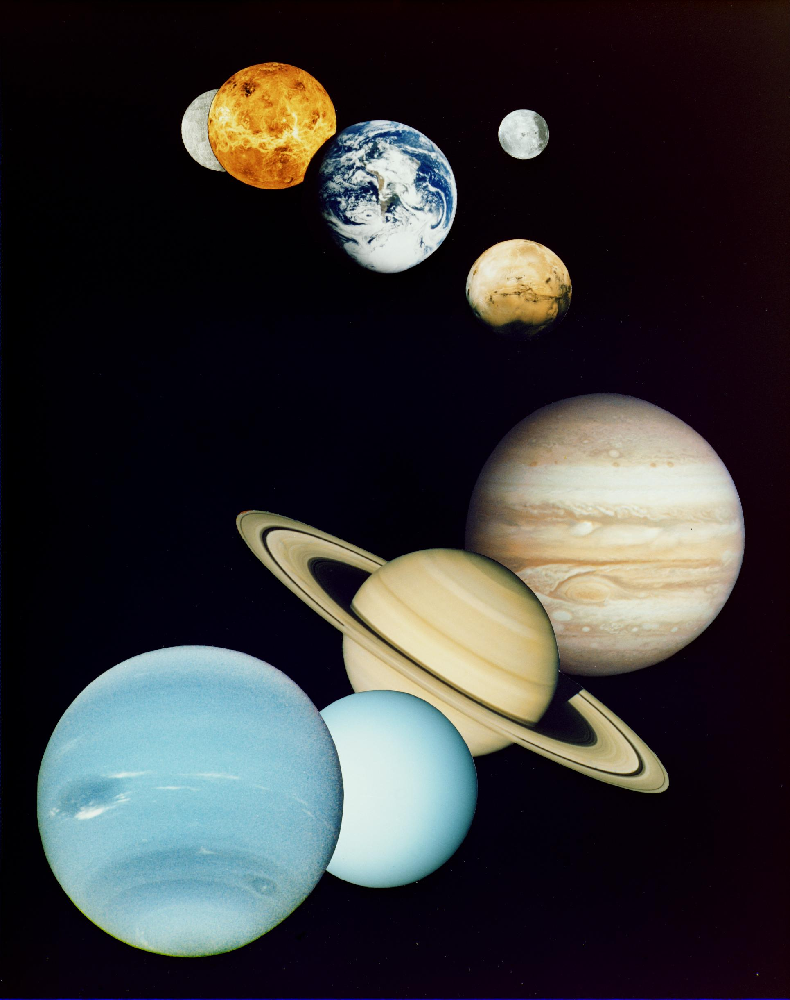

# The companions — the company of the star

Loop doc for Issue #226 (Round 2, iteration 5). Companions are the
company of L9: the same planets as nearby points, the large moons,
the dust and sungrazers, and the rare stellar companions — with
the preview toward L10. This page covers how the company looks,
how it changes over time, how it was created, and how it interacts
with the star. The voice that shapes it is in `activity.md`.

## How it looks

From star-zoom the system shrinks to company. The eight planets
stand as nearby points at 0.39 to 30.1 AU: Mercury, Venus, Earth
with its Moon — 384,400 km out, 3,474 km across, tidally locked so
the same face always points home (the L10 dive) — Mars, then
Jupiter, Saturn, Uranus, Neptune — the
inner four roughly to scale with each other, the outer four
roughly to scale with each other. Around the giants ride swarms of
moons like miniature systems of their own — Mercury and Venus
alone have none — with Ganymede larger than the planet Mercury and
Io, Europa, Ganymede, Callisto the great four. Between the points
hangs the zodiacal glow: sunlight reflected by a cloud of tiny
dust particles orbiting the Sun. Through the glare dive the
sungrazers: comets passing very close to the Sun like small solar
probes through its atmosphere — on March 25, 2024 a Czech
volunteer spotted the 5,000th comet in SOHO data, most of them
Kreutz sungrazers skimming the outer atmosphere, more than half of
all known comets found in SOHO's watch with volunteers spotting
most. And beyond them all,
rare stellar company: more than half of all stars in the sky have
one or more partners — and company is not always one star plus
planets, as Kepler-16b proves: a Saturn-size circumbinary world
orbiting two suns on a 229-day year, a real Tatooine minus the
desert. Our own Sun travels alone, its nearest
neighbor the triple Alpha Centauri system 4.25 light-years out.

Target visual (file in `images/`, credit and license at the bottom):

Sources: NASA solar system facts page; NASA NSSDC planetary fact
sheet; NASA Juno and Sungrazer pages; NASA multiple-star page.

## How it changes over time

The company keeps time by Kepler's law: the square of a period
grows with the cube of its distance. Mercury laps the Sun in 88
days, Earth in 365, Saturn in 10,759 — and Neptune needs 60,190
days, about 165 years. A close planet has a short year, a far one
a long one; that single rule spaces the whole company. Where
stellar companions exist they waltz slower still: Alpha Centauri A
and B take 80 years per orbit, while Proxima needs more than half
a million years to circle the pair. On the longest clock the
company thins: when the Sun swells red the inner points fall
silent — the dated endgame is in `lifetime.md`.

Sources: NASA orbits-and-Kepler page; NASA years-on-other-planets
page; NASA nearest-star page.

## How it is created

The company is leftover Sun-stuff. Even though the Sun gobbled up
more than 99 percent of the disk, material remained — and some of
it grew big enough to become spheres: planets and dwarf planets.
That is why the same 4.6-billion-year birthday runs through every
point of company. Stellar companions form their own ways — disk
fragmentation, core fragmentation, dynamical capture — and capture
happens small too: Triton is thought to be a Kuiper Belt object
caught by Neptune's gravity, the exception that proves the
co-formed rule. Most moons and all eight planets grew up in the
disk; Triton was adopted.

Sources: NASA solar system formation page; NASA solar system facts
page; NASA Triton page.

## How it interacts with the others

Gravity is the first interaction: it holds every planet in orbit
around the Sun. Wind is the second: Jupiter's magnetosphere, like
Earth's, deflects the solar wind but gets pushed around by its
gusts — stretched into a windsock tail reaching Saturn's orbit —
and shock waves from solar outbursts brighten Jupiter's polar
auroras, while Saturn's auroral storms answer mainly to solar-wind
pressure. Light is the third: the habitable zone it sets picks out
Earth, sitting comfortably inside. And the company points onward:
at least one planet, possibly more, orbits Proxima — and the next
dive after this company overview is Earth with its Moon (L10), the
only planet-and-moon pair with humans.

Sources: NASA orbits-and-Kepler page; NASA Juno magnetosphere
pages; ESA Hubble Saturn-aurora page; NASA nearest-star page.

## Size and mass

- Planets: Mercury 0.39 AU to Neptune 30.1 AU; five named dwarf planets; hundreds of moons.
- Years: Mercury 88 days; Earth 365 days; Saturn 10,759 days; Neptune 60,190 days (about 165 years).
- Moons: Ganymede larger than Mercury; Galilean four Io, Europa, Ganymede, Callisto.
- Stellar company: more than half of all stars have partners; nearest neighbor Proxima Centauri 4.25 light-years; Alpha A+B nearest Sun-like pair at 4.3 light-years, 80-year orbit.

Sources: NASA NSSDC planetary fact sheet; NASA Space Place pages;
NASA multiple-star page.

## Example objects

Example company: Earth with its Moon (next dive, L10); Jupiter
with the Galilean four (mini system); Ganymede (moon bigger than a
planet); Triton (the captured exception); Kepler-16b (two-sun
world); SOHO-5000 (volunteer-spotted sungrazer). Example numbers: one 88-day year; one 165-year year; one
4.25-light-year neighbor.

Sources: pages named above.

## Image credits and licenses

| File | Shows | Credit (required) | License / terms |
|---|---|---|---|
| `planets-montage-jpl.jpg` | Montage of the Sun's planets in order, Mercury to Neptune (screensize) | NASA / JPL (`https://science.nasa.gov/photojournal/solar-system-montage/`) | Public domain (NASA) |

## Sources

- NASA, Solar system facts: `https://science.nasa.gov/solar-system/solar-system-facts/`
- NASA, Planetary fact sheet: `https://nssdc.gsfc.nasa.gov/planetary/factsheet/`
- NASA, Orbits and Kepler's laws: `https://science.nasa.gov/solar-system/orbits-and-keplers-laws/`
- NASA, Solar system formation: `https://spaceplace.nasa.gov/solar-system-formation/en/`
- NASA, Multiple star systems: `https://science.nasa.gov/universe/stars/multiple-star-systems/`
- NASA, Nearest star system: `https://science.nasa.gov/exoplanets/other-stars-other-worlds/our-nearest-celestial-neighbor-an-exotic-3-star-system/`
- NASA, Solar system montage (PIA00545): `https://science.nasa.gov/photojournal/solar-system-montage/`
- NASA, Moon facts: `https://science.nasa.gov/moon/facts`
- NASA, Kepler-16b Tatooine: `https://science.nasa.gov/exoplanets/other-stars-other-worlds/kepler-16-b-almost-a-real-life-tatooine/`
- NASA, SOHO 5000th comet: `https://science.nasa.gov/science-research/heliophysics/esa-nasa-solar-observatory-discovers-its-5000th-comet`
