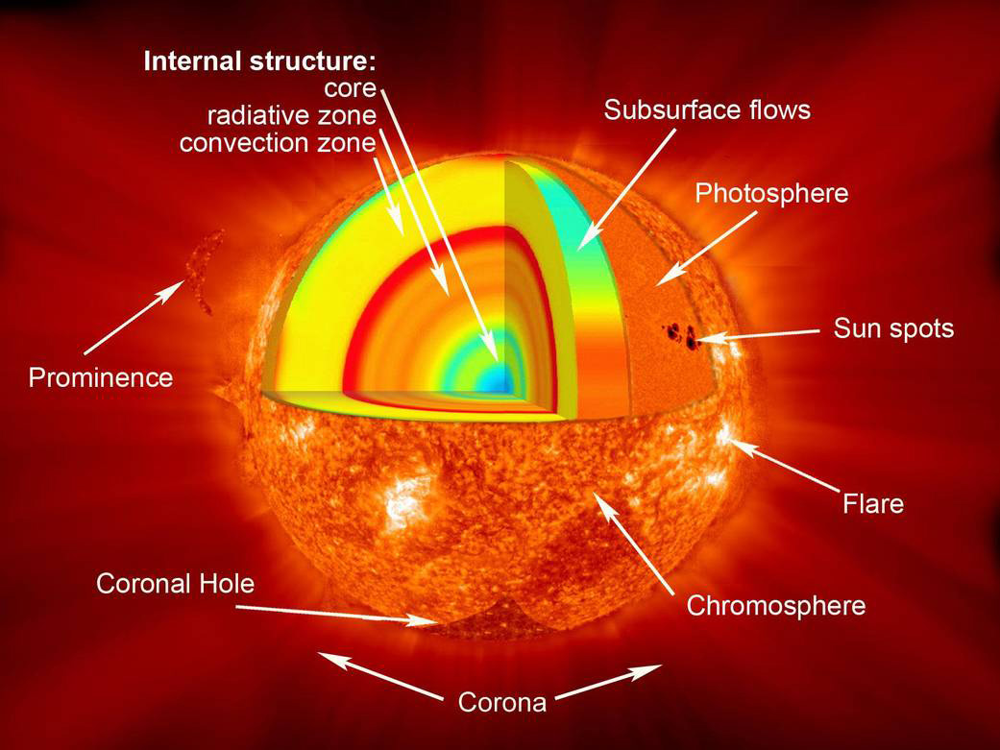

# The interior — the engine of the star

Loop doc for Issue #226 (Round 2, iteration 1). The interior is the
engine of L9: the core, the radiative zone, and the convection zone
where the Sun's light is born and begins its long climb out. This
page covers how it looks in cutaway, how it changes over time, how
it was created, and how it interacts with the rest of the star. The
bridge behind us is in `previous-l8.md`; the dive that brings you
here is in `entry.md`.

## How it looks

Cut the Sun open and three regions show. At the center sits the
core, the innermost 25 percent, where the temperature is about 15
million degrees C (27 million degrees F) and the density is about
150 g/cm³ — nuclear burning is almost completely shut off beyond
its outer edge, about 175,000 km from the center. Around it lies
the radiative zone, from 25 percent of the way to the surface out
to 70 percent, where the temperature falls from 7,000,000 degrees C
to about 2,000,000 degrees C and energy is carried by light itself:
photons bouncing from particle to particle. Outside that runs the
convection zone, the outermost 30 percent, from a depth of about
200,000 km right up to the visible surface — heat trapped there
makes the fluid unstable and it starts to boil, rising bubbles of
hot plasma carrying the energy the last stretch. Between the two
sits a thin interface layer, the tachocline, where the Sun's
magnetic field is thought to be generated.

Target visual (file in `images/`, credit and license at the bottom):

Sources: NASA Sun facts page; NASA solar interior page.

## How it changes over time

The engine burns steadily but not forever. Nuclear reactions
consume hydrogen to form helium through the proton-proton chain,
and the Sun eats about four million tonnes of hydrogen fuel every
second — and has done so since it was born, around 4.6 billion
years ago. The climb of each photon outward takes on the order of
hundreds of thousands of years (NASA pages give 170,000 years and
about a million years for different paths — read both as the same
long delay, not a single number). On the longest clock the fuel
runs down: the Sun is a little less than halfway through its life,
with about 5 billion years left before it swells into a red giant
and ends as a white dwarf. The dated version of that story runs
through `lifetime.md`.

Sources: NASA Sun facts page; ESA Sun page; NASA solar interior page.

## How it is created

The interior was built the day the Sun lit. About 4.6 billion
years ago a giant spinning cloud of gas and dust — the solar
nebula — collapsed under its own gravity; most of the material was
pulled toward the center to form the Sun, which accounts for 99.8
percent of the solar system's mass, while the leftovers spread
into a disk of gas and dust that made the planets. When the center
grew hot and dense enough, fusion ignited — and the layered engine
above has run ever since.

Sources: NASA Sun facts page.

## How it interacts with the others

Everything above is fed from below. Energy from the core is
carried outward by radiation, then by boiling convection, and the
nuclear reactions where hydrogen fuses into helium power the Sun's
heat and light — the light the surface (`surface.md`) shines with
and the habitable zone lives on. Two subtler exports escape: the
ghost particles called neutrinos, made in the same reactions,
pass right through the overlying layers — about 66 billion cross
each square centimeter of Earth every second — yet only about a
third of the expected electron neutrinos showed up. The solvers
have names: Sudbury's 1,000 tons of heavy water saw one-third
while Super-Kamiokande saw about half, and the difference was the
smoking gun — the total matched the Sun's model, so the missing
ones had changed identity in flight (neutrino oscillation, Nobel
2015, confirmed June 2001). Super-Kamiokande even images the Sun
in neutrinos, straight from the core. Watchers probe all of it
without going inside: helioseismology reads the interior the way
geologists read the Earth with seismic waves — six identical GONG
telescopes ringing the globe for round-the-clock Sun sound, joined
by SOHO's Michelson Doppler Imager and now SDO's HMI watching the
full disk at 6173 Å.

Sources: NASA Sun facts page; NASA solar interior, dynamo, and
helioseismology pages.

## Size and mass

- Whole star: diameter about 865,000 miles (1.4 million km); radius about 435,000 miles (700,000 km); mass over 330,000 Earths; volume 1.3 million Earths.
- Core: innermost 25 percent, about 138,000 km thick; 15 million degrees C; density about 150 g/cm³.
- Radiative zone: 25 to 70 percent of the way out; 7,000,000 down to 2,000,000 degrees C.
- Convection zone: outermost 30 percent, from about 200,000 km deep to the surface; about 2,000,000 degrees C at its base.

Sources: NASA Sun facts page; ESA Sun page; NASA solar interior page.

## Example objects

Example layers: the fusing core (pp-chain furnace); the radiative
zone (photon random-walk); the tachocline (dynamo seat); the
boiling convection zone (granulation roots). Example numbers: one
4-million-tonnes-per-second burn rate; one million-year photon
climb; one red-giant fate.

Sources: pages named above.

## Image credits and licenses

| File | Shows | Credit (required) | License / terms |
|---|---|---|---|
| `interior-structure-nasa.jpg` | Cutaway of the solar interior showing core, radiative zone and convection zone (screensize) | NASA | Public domain (NASA) (`https://science.nasa.gov/sun/facts/`) |

## Sources

- NASA, Sun facts: `https://science.nasa.gov/sun/facts/`
- NASA, Solar interior: `https://solarscience.msfc.nasa.gov/interior.shtml`
- NASA, Solar dynamo: `https://solarscience.msfc.nasa.gov/dynamo.shtml`
- NASA, Helioseismology: `https://solarscience.msfc.nasa.gov/Helioseismology.shtml`
- NSO, GONG network: `https://nso.edu/telescopes/nisp/gong/`
- SDO, HMI instrument: `http://hmi.stanford.edu/`
- Nobel Prize, Missing neutrinos: `https://www.nobelprize.org/prizes/themes/solving-the-mystery-of-the-missing-neutrinos/`
- Super-Kamiokande, Solar neutrinos: `https://www-sk.icrr.u-tokyo.ac.jp/en/sk/about/research/`
- ESA, The Sun: `https://www.esa.int/Science_Exploration/Space_Science/The_Sun`
