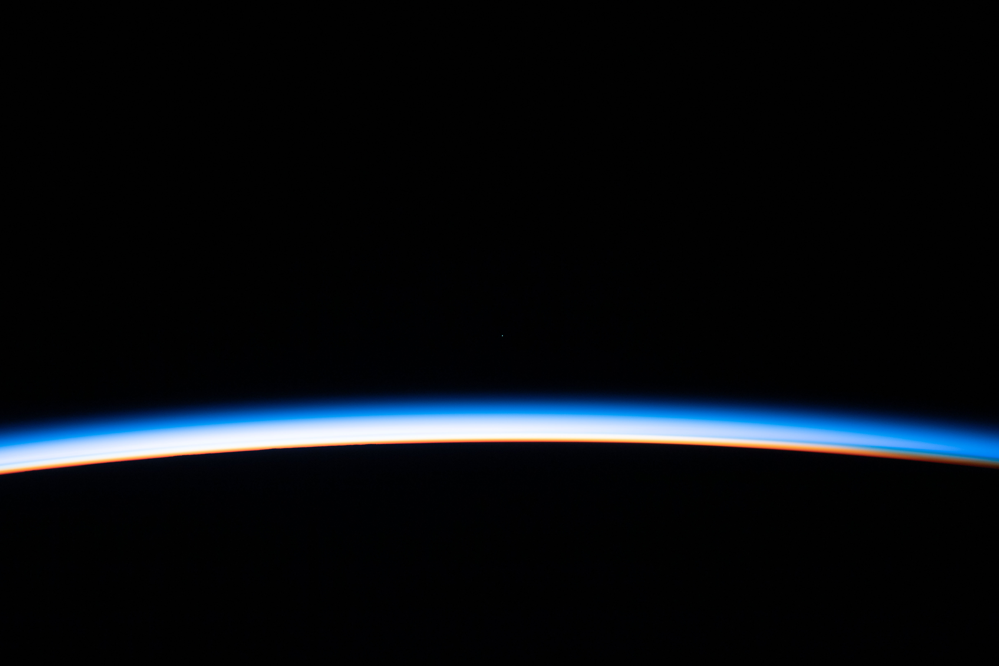

# The atmosphere — Earth's blanket of air

Loop doc for Issue #227 (Round 2 iteration 3). This page is the L10
part doc for the air: what it looks like, how it changes over time,
how it was made, and how it touches the other parts. The dive that
brings you here lives in `entry.md`; the star-scale story behind us
is in `previous-l9.md`; the dated version runs through `lifetime.md`.

## How it looks

From the ground the air looks like nothing at all — a blue sky by
day, black sky with stars by night. The blue comes from sunlight
bouncing off the tiny air molecules themselves, which scatter blue
light more than red. Sunsets turn orange and red because the light
travels a longer path and the blue is scattered away.

From space the same air is a thin bright rim hugging the planet —
a fragile blue skin over the oceans and land of `surface.md`. Almost
all of it sits close to the ground: half of all the air is packed
into the lowest 5 or 6 km, and you would have to climb only about
12 km to leave most weather behind.

Going up, the blanket sorts itself into five layers. The lowest is
the troposphere, from the ground up to about 12 km on average —
taller over the equator (18–20 km), shorter over the poles (about
6 km). Almost all weather lives here: clouds, rain, snow, storms,
and the winds that carry them. Temperature falls as you climb, from
about 17°C at the ground to about −51°C at the top.

Above it sits the stratosphere, reaching up to about 50 km. Here
the air is thin and dry, and temperature climbs again because a
gas called ozone soaks up the Sun's harsh ultraviolet light and
warms the layer. The ozone sits mostly 15–30 km up and works like
sunscreen for the whole planet. Passenger jets cruise near the
bottom of this layer, above the weather.

High above the jets, the winds around the equator slowly flip
direction, from east-to-west to west-to-east and back again, about
every 28 months. Scientists call this slow back-and-forth the
quasi-biennial oscillation. It happens far above ordinary weather,
but it can nudge air movements and storm paths lower down.

Sources: NASA Global Modeling and Assimilation Office
quasi-biennial oscillation pages; NOAA Climate Prediction Center
stratosphere pages.

Next is the mesosphere, from about 50 to 85 km. Temperature falls
again, to the coldest chills in the whole blanket. The air here
is finally thick enough to slow down falling space rocks, so this
is where most meteors burn up as shooting stars.

Near the top of that same layer, about 80 km up, live the highest
clouds of all — thin, glowing-blue night clouds that shine after sunset
in summertime. Scientists call them noctilucent clouds. Studies using
NASA's AIM mission found that water vapor left behind by rocket and
shuttle launches can help seed them, which makes them a useful sign of
change at the edge of space.

Sources: NASA AIM mission noctilucent-cloud pages; NOAA NESDIS
noctilucent-cloud pages.

Above that stretches the thermosphere, from about 85 up to about
600 km. Thin wisps of air here drink in the Sun's most energetic
light and can reach 2,000°C — yet you would feel freezing cold,
because there are too few molecules to carry heat to your skin.
This is the home of the aurorae: glowing green and red curtains
near the poles, painted when trapped solar particles strike the
air (see `magnetosphere.md`). The space station orbits inside this
layer, about 400 km up.

Last and thinnest is the exosphere, fading from about 600 km out
to some 10,000 km. Molecules here drift so far apart that some
escape into space entirely, and most satellites circle within or
below it.

Target visual (file in `images/`, credit and license at the bottom):

Sources: NASA Earth facts page; NASA Earth's Atmospheric Layers
image article; NOAA JetStream layers of the atmosphere page.

## How it changes over time

Weather is what the air is doing today; climate is what it usually
does over decades. Weather changes by the hour as sunshine, winds,
and moisture move around the troposphere. Climate changes slowly,
as oceans, ice, air, and life trade heat and gases back and forth.

The seasons are the year's big rhythm, and they come from Earth's
tilt, not from distance. Our planet leans 23.4 degrees off upright,
so for half the year the northern half tips toward the Sun and gets
stronger, longer sunshine, and six months later the lean points the
other way. The lean is steadied by the Moon (see `moons.md`), which
keeps the seasons regular over thousands of years.

The ozone shield has its own story. In the 1980s scientists found
a hole opening in the ozone layer over Antarctica each spring,
caused by human-made chemicals called CFCs once used in spray cans
and fridges. Countries banned them under a 1987 agreement, the
Montreal Protocol, and NASA and NOAA report the hole has been
slowly healing since — full recovery is expected around the middle
of this century.

The deeper change is warming. The same gases that keep Earth cozy
— carbon dioxide, methane, and water vapor — trap heat like a
blanket, and burning coal, oil, and gas has thickened that blanket.
NASA and NOAA track the result: the planet's average surface
temperature has risen about 1 degree Celsius and more since the
late 1800s, with warmer oceans, shrinking ice, and stronger
downpours and heat waves. Unlike daily weather, this shift plays
out over decades and centuries.

Sources: NOAA JetStream climate-vs-weather and atmosphere pages;
NASA Earth facts page; NASA Ozone Watch; NOAA Global Monitoring
Laboratory.

## How it was created

Earth was not born with the air we breathe. The newborn planet's
first gases were mostly hydrogen and helium, and the young Sun's
fierce wind stripped them away. The air we have now came from the
planet itself: volcanoes and vents in the young crust breathed out
steam, carbon dioxide, and nitrogen for hundreds of millions of
years — the same kind of outgassing that still feeds the air today
through the engine in `interior.md`.

Water arrived from above as well as below. Icy rocks from the outer
solar system — asteroids and comets — slammed into the young Earth
and delivered part of its water, which gathered into the oceans of
`surface.md`. Those oceans then soaked up huge amounts of carbon
dioxide from the air, locking it into rocks and seabeds and
leaving nitrogen behind as the main gas.

Oxygen came last, and life made it. About 2.4 billion years ago,
tiny ocean microbes that fed on sunlight began releasing oxygen as
waste — just as plants do today. For hundreds of millions of years
rusting rocks and seas swallowed the oxygen up, until at last it
began piling up in the air. Animals, including us, arrived much
later, into an atmosphere that life itself had prepared: nitrogen
to breathe around, oxygen to burn food with, and an ozone layer
above to block the Sun's harshest light.

Sources: NASA Earth facts page (atmosphere and formation sections);
NOAA ocean and atmosphere pages; NASA astrobiology pages on the
Great Oxidation.

## How it interacts with the others

The air never sits alone — it trades with every other part of L10.

With the surface (`surface.md`), the trade never stops. Oceans
evaporate water into the air and take rain back; that round trip
is the water cycle that feeds all weather. Ice reflects sunlight
and cools the air, while open dark ocean soaks up heat and warms
it. Plants breathe carbon dioxide in and oxygen out; the air
returns the favor with rain and warmth.

The wind also carries food for forests. Dust blown off the Sahara
Desert crosses the whole Atlantic Ocean each year, and part of it
settles over the Amazon rainforest. That dust carries nutrients such as
phosphorus that act like fertilizer for the forest.

Sources: NASA Earth Observatory Saharan-dust-to-Amazon pages; NOAA
dust-and-ocean pages.

With the shield (`magnetosphere.md`), the meeting is violent and
beautiful. The solar wind — the stream of charged particles
blowing off the Sun at a million miles an hour — constantly tries
to strip air molecules away into space. Earth's magnetic field
bends that wind around the planet like a rock splitting a river,
so most of it slides past. The small part that leaks in near the
poles paints the aurorae and heats the thermosphere. Without the
shield, the slow leak would be far faster.

With the Moon (`moons.md`), the touch is gentle. The Moon's pull
raises great tides in the oceans, but in the thin air its tug is
tiny — weather barely notices it. The Moon's real gift to the air
is steadiness: by holding Earth's tilt stable, it keeps the seasons
regular for thousands of years.

With the deep planet (`interior.md`), the link runs both ways.
Volcanoes still breathe gases and ash into the sky, topping up the
air and occasionally cooling it for a year or two after big
eruptions.

The 2022 Hunga Tonga undersea eruption behaved differently from most
big eruptions. Instead of mostly ash and sulfur, it threw a record
amount of water vapor high into the stratosphere. Follow-up studies in
2023–2024 found that this extra vapor trapped a small amount of extra
heat for a few years — too small to change the long-term warming trend,
but large enough for scientists to track closely.

Sources: NASA Earth Observatory Hunga Tonga pages; NASA Aura water-vapor
eruption studies (2023–2024). And the surface carries air back down: rain washes
carbon dioxide into the seas, and sinking ocean plates drag carbon
and water deep into the Earth, closing the loop.

Sources: NASA Earth facts page (atmosphere and magnetosphere
sections); NOAA JetStream atmosphere and ocean pages; NASA Moon
facts page.

## Key numbers

- Recipe near the ground: about 78 percent nitrogen, 21 percent
oxygen, 1 percent everything else (argon, carbon dioxide, neon,
and more).
- Weight of the sky: average surface pressure 1013 hPa — the same
as about 10 tonnes of air pressing on every square metre.
- The working layer: the troposphere averages about 12 km deep
(about 6 km over the poles, 18–20 km over the equator) and holds
nearly all weather and clouds.
- The sunscreen: the ozone layer sits roughly 15–30 km up inside
the stratosphere, which tops out near 50 km.
- The shooting-star zone: the mesosphere runs about 50–85 km;
the aurora layer (thermosphere) runs about 85–600 km.
- The edge of space: the Kármán line at 100 km, where the air is
too thin for ordinary wings; the exosphere fades out near
10,000 km.
- The anchor world: Earth is 12,756 km across; the air's weather
layer is a thousand times thinner than the planet is wide.
- For scale from `entry.md`: the Moon sits 384,400 km out and the
Sun 150 million km out — the whole blanket fits in a sliver of
the Earth–Moon gap.

Sources: NASA Earth facts page; NOAA JetStream layers and air
pressure pages; Kármán line definition (100 km).

## Example objects

Earth is the anchor: the only world with nitrogen–oxygen air,
open oceans, and an ozone shield — the living standard every other
atmosphere is measured against.

Venus is the warning. Slightly smaller than Earth, it kept its
carbon dioxide instead of burying it in oceans and rocks. The
result is a runaway blanket: an atmosphere 93 times heavier than
ours, surface heat around 467°C — hot enough to melt lead — under
permanent clouds of sulfuric acid.

Mars is the thin leftover. Its air is mostly carbon dioxide too,
but there is almost none of it — under 1 percent of Earth's
surface pressure — so heat escapes straight to space. The sky
is a dusty pink from floating dust, and planet-wide dust storms
can blot out the Sun for months.

Titan is the strange cousin. This large moon of Saturn wears the
only thick moon-air in the solar system: mostly nitrogen like
ours (about 95 percent) with methane instead of oxygen. Sunlight
bakes the methane into an orange smog that hides the surface,
where methane rains into rivers, lakes, and seas.

Io is the wisp. Jupiter's volcanic moon holds only the faintest
trace of air — mostly sulfur dioxide breathed out by its nonstop
volcanoes. Jupiter's giant magnetic field strips it away almost
as fast as it forms, so the air never builds up.

Sources: NASA Venus, Mars, Titan, and Io facts pages; NASA Earth
facts page.

## Image credits and licenses

| File | Shows | Credit (required) | License / terms |
|---|---|---|---|
| `atmosphere-rim-nasa.jpg` | Thin blue rim of Earth's atmosphere curving over the dark planet, photographed from orbit (screensize) | NASA / JSC ISS Expedition imagery, frame pinned in-repo | Public domain (NASA) (`https://images.nasa.gov/`) |

Note: the Round 2 audit confirms each file, credit and term before the
loop continues; replacements are separate updates, never silent swaps.

## Sources

- NASA, Earth facts: `https://science.nasa.gov/earth/facts/`
- NASA, Earth's Atmospheric Layers (image article): `https://www.nasa.gov/image-article/earths-atmospheric-layers/`
- NOAA JetStream, Layers of the Atmosphere: `https://www.noaa.gov/jetstream/atmosphere/layers-of-atmosphere`
- NOAA JetStream, Climate vs. Weather: `https://www.noaa.gov/jetstream/global/climate-vs-weather`
- NASA Ozone Watch: `https://ozonewatch.gsfc.nasa.gov/`
- NASA, Venus facts: `https://science.nasa.gov/venus/facts/`
- NASA, Mars facts: `https://science.nasa.gov/mars/facts/`
- Ladder: `docs/universes/ladder.md` (R5 anchors, R6 ratios)
- Siblings: `entry.md`, `previous-l9.md`, `interior.md`, `surface.md`, `moons.md`, `magnetosphere.md`, `lifetime.md`
