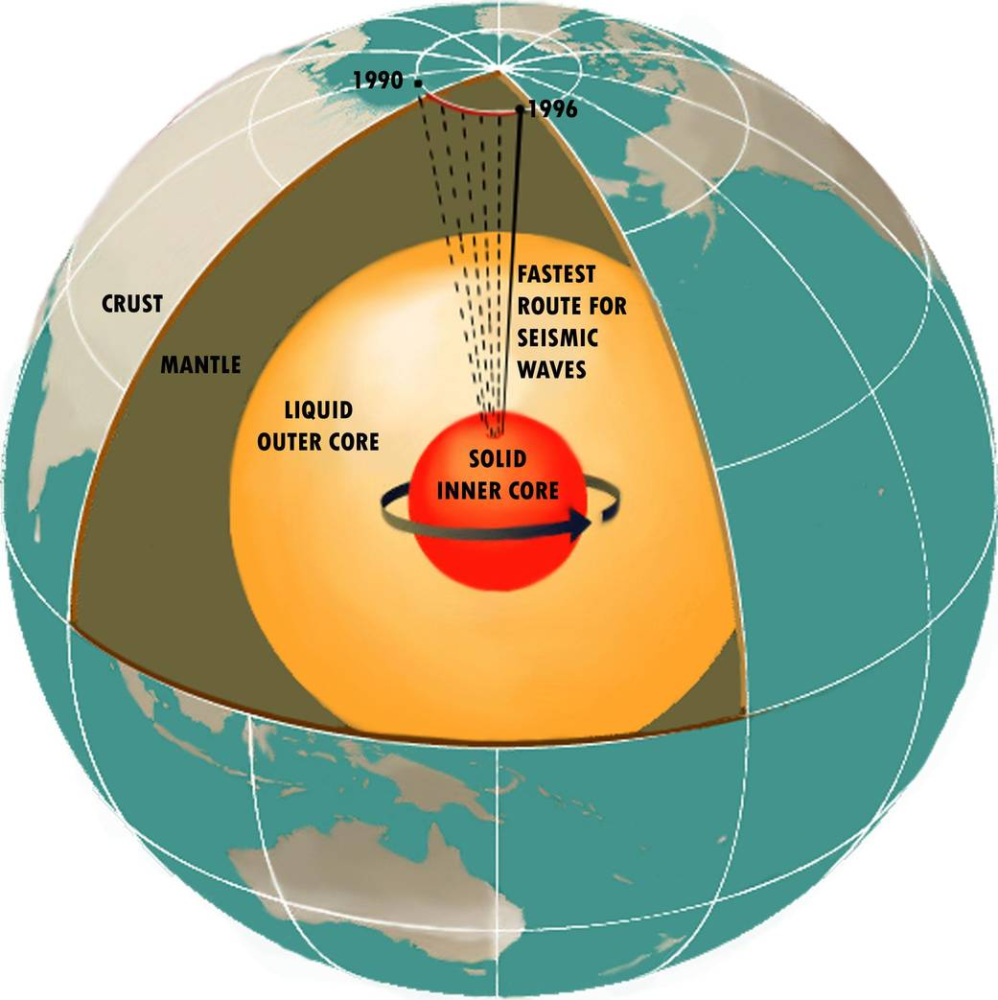

# The interior — the engine under our feet

Loop doc for Issue #227 (Round 2 iteration 1). This page looks
inside the L10 planet: the hot middle that powers everything above
it. The dive that brought you here lives in `entry.md`; the world
it opened lives in `previous-l9.md`. The face, the air, the friend,
and the shield live in `surface.md`, `atmosphere.md`, `moons.md`,
and `magnetosphere.md`. The dated story runs through `lifetime.md`.

Think of Earth like a peach. The thin skin is the crust we live on.
The thick soft middle is the mantle. The hard pit at the center is
the core, made mostly of iron, hotter than anything on the surface.

Target visual (file in `images/`, credit and license at the bottom):

Sources: NASA cut-away diagram of Earth's interior; NASA Earth
interior graphic (PIA25063); USGS Inside the Earth pages.

## How it looks

Nobody has ever seen the deep inside directly. The deepest hole ever
dug goes down only about 12 km, which barely scratches the skin.
What we know comes from earthquake waves bending and slowing as they
pass through different layers, plus lab tests on rocks squeezed very
hard and heated very hot.

Sources: USGS Inside the Earth (`pubs.usgs.gov/gip/dynamic/inside.html`
and `pubs.usgs.gov/gip/interior/`); NASA Earth interior pages.

From outside to center, the layers are:

**The crust — the thin skin.** This is the ground under our feet,
only about 5 km thick under the oceans and about 30 km thick under
the continents on average, reaching up to about 70 km under big
mountain ranges. It is hard, brittle rock that can crack — those
cracks are faults where quakes happen. It holds only about 1 percent
of Earth's volume, but it is home to all of us.

Sources: USGS Inside the Earth pages; NASA Earth facts page.

**The mantle — the thick hot middle.** Under the crust lies a layer
of dense, hot rock about 2,900 km thick, reaching from the crust down
to about 2,890 km below the surface. It is mostly solid rock rich in
iron and magnesium, but it is so hot that over very long times it can
flow slowly, like warm fudge. The top of the mantle is cooler and
stiffer; together with the crust it forms the plates (see
`surface.md`). The bottom of the mantle is under huge pressure and
much denser.

Sources: USGS Inside the Earth pages; NASA Earth interior graphic
(PIA25063).

**The outer core — the liquid iron sea.** Below the mantle, from
about 2,890 km down to about 5,150 km, lies a layer about 2,260 km
thick made mostly of liquid iron mixed with nickel. It does not let
side-to-side earthquake waves through, which is how we know it is
liquid. As Earth spins, this liquid iron churns and flows, and that
moving metal makes our magnetic shield (see `magnetosphere.md`).

Sources: USGS interior pages; NASA cut-away diagram of Earth's
interior.

**The inner core — the hot iron ball.** At the very center sits a
solid ball of iron and nickel about 1,220 km in radius (about
2,440 km across), which is about 70 percent as wide as the Moon.
Even though it is as hot as the face of the Sun, about 5,500 degrees C,
it stays solid because the pressure at the center is so enormous.
It spins a little faster than the rest of the planet.

Sources: NASA cut-away diagram of Earth's interior; USGS interior
pages; NASA Earth interior graphic (PIA25063).

Together the core (inner plus outer) reaches about 3,480 km in radius
from the center, which is a little more than half of Earth's full
radius of about 6,371 km. The mantle holds about 84 percent of Earth's
volume, the core about 15 percent, and the crust about 1 percent.

Sources: USGS interior pages; NASA Earth facts page (Earth diameter
12,756 km).

## How it changes over time

Earth is slowly cooling down, like a baked potato left on the table.
It loses heat to space all the time, and the heat inside today comes
from two sources: leftover heat from when the planet formed, and heat
made by tiny natural parent materials in the crust and mantle slowly
breaking apart and giving off warmth.

Sources: USGS Inside the Earth pages; NASA Earth science pages.

As the planet cools, the inner core grows. Long ago there was no
solid center at all — the whole core was liquid. As heat escapes,
more and more of the liquid freezes onto the solid ball, which is now
about 1,220 km in radius. Scientists believe this freezing started
roughly a billion years ago, and it gives off extra heat that keeps
the outer liquid churning.

Sources: NASA Earth science pages; published inner-core age papers
(lab and seismic studies).

The magnetic shield changes with it. The field gets stronger and
weaker over time, its poles wander, and every few hundred thousand
years or so the north and south poles swap places entirely. Rocks
that hardened long ago still carry the direction of the old field,
so we can read these flips like tree rings.

Sources: USGS geomagnetism pages; NASA science pages on Earth's
magnetic field.

Very slowly, the moving plates also change the inside. Old seafloor
slides down into the mantle at the edges of plates (see `surface.md`),
carrying water and air chemicals down with it, while hot plumes rise
from deep near the core to feed volcanoes such as Hawaii.

Sources: USGS plate-tectonics pages.

## How it was created

About 4.56 billion years ago, Earth grew piece by piece from dust,
pebbles, and rocks circling the young Sun. Each crash added heat,
until the young Earth was largely melted — a whole ball of glowing
liquid rock with liquid metal mixed in.

Sources: NASA solar system formation pages; USGS interior pages.

Then the heavy stuff sank and the light stuff floated. Iron metal
sank to the middle to form the core, while lighter rocky material
rose to form the mantle and crust. Scientists call this sorting
"settling into layers," and it happened early, while the planet was
still mostly melted.

Sources: USGS interior pages.

A giant crash finished the job. A body about the size of Mars struck
the young Earth, melting much of the planet again and throwing hot
rock into orbit that gathered into our Moon — about 3,474 km across,
now circling about 384,400 km away (see `moons.md`). After the crash,
the melted rock cooled, leaving a solid crust on top, a slowly
flowing mantle in the middle, and a metal core at the center.

Sources: NASA Moon facts and formation pages; USGS interior pages.

## How it interacts with the others

The interior is the engine; everything else is moved or guarded by it.

Heat from inside drives the face (see `surface.md`). The slow flow of
the mantle drags the plates a few centimeters per year — about as fast
as fingernails grow — opening oceans at mid-ocean ridges, closing them
where plates dive down, raising mountains like the Himalayas where
plates collide, and feeding volcanoes where hot rock rises. Quakes
cluster along the plate edges, marking where the skin is breaking.

Sources: USGS Inside the Earth and plate-tectonics pages; NASA Earth
facts page (Earth diameter 12,756 km, oceans over 71 percent).

Moving iron makes the shield (see `magnetosphere.md`). The churning
liquid outer core works like a giant power plant, making the magnetic
field that bends the solar wind — the stream of charged gas from the
Sun 150 million km away — around the planet and paints the northern
and southern lights. Without that shield, the wind would strip air
and water away much faster.

Sources: NASA cut-away diagram of Earth's interior; NASA Sun facts
page; NASA magnetosphere science pages.

Leaking gas built the blanket (see `atmosphere.md`). Long ago,
volcanoes breathed out steam, carbon dioxide, and other gases that
collected into the first air and oceans. Even today, volcanoes and
mid-ocean ridges keep adding gases, while sinking plates carry air
chemicals and water back down — a slow two-way breath between the
inside and the outside.

Sources: USGS volcano and outgassing pages; NASA Earth facts page
(air 78 percent nitrogen, 21 percent oxygen).

The friend feels the pull too (see `moons.md`). The Moon, about 30
Earths away in a line, raises tides in the oceans and even tiny tides
in the solid Earth itself, slowly braking Earth's spin — days were
shorter long ago — while the Moon drifts slightly farther each year.

Sources: NASA Moon facts page (distance 384,400 km, orbit 27 days);
USGS tide and Earth-rotation pages.

## Key numbers

- Earth size: 12,756 km across (7,926 miles); full radius about 6,371 km.
- Core radius: about 3,480 km from the center (inner ball about 1,220 km
in radius, liquid outer layer about 2,260 km thick).
- Mantle: about 2,900 km thick (from crust down to about 2,890 km depth).
- Crust: about 5 km under oceans to about 30 km under continents on
average, ranging 5–70 km.
- Temperatures: surface mild; bottom of mantle about 4,000 C;
center of core about 5,500 C, as hot as the Sun's face.
- Volumes: mantle about 84 percent, core about 15 percent, crust about
1 percent of Earth's volume.
- This is how the interior interacts with the rest of the planet:
heat pushes the plates, moving iron guards the air, and volcanoes
feed the air — engine, shield, and blanket working as one.

Sources: USGS Inside the Earth pages; NASA cut-away diagram page;
NASA Earth interior graphic (PIA25063); NASA Earth facts page.

## Example objects

Earth is the anchor: full-size layered world, 12,756 km across, with a
3,480-km core, a 2,900-km mantle, and living plates, volcanoes, and a
strong magnetic shield.

Sources: NASA Earth facts page; USGS interior pages; ladder R5 anchors
(`docs/universes/ladder.md`); `previous-l9.md` and `entry.md`.

- Mars — the small-core neighbor. Mars is only about half as wide as
Earth (about 6,790 km), and its core is smaller and mostly quiet now.
Its shield faded long ago, much of its air was lost, and its plates
stopped moving — a look at what a cooled engine leaves behind.

Sources: NASA Mars facts page.

- Mercury — the huge-core oddball. Mercury is small (about 4,880 km
across) but holds a giant iron core filling most of its inside, with
only a thin rocky shell over it. It still keeps a weak magnetic field
despite its size.

Sources: NASA Mercury facts page.

- The Moon — the settled layered body. Our Moon, about 3,474 km across
and about 384,400 km away, split into layers long ago — crust, mantle,
and a small iron core — but it is too small to stay hot inside, so it
has no plates, no air, and almost no shield today.

Sources: NASA Moon facts page; `moons.md`.

- Io — the squeezed heater. Jupiter's moon Io, about the size of our
Moon, is constantly kneaded by Jupiter's pull, so its inside stays
melted and erupts all the time — the most volcanic world known, heated
by squeezing rather than by birth heat.

Sources: NASA Io facts and Juno mission pages.

Together they show the rule: bigger worlds stay hot and active longer;
small ones cool faster unless something keeps squeezing them.

Sources: NASA planet and Moon facts pages.

## Image credits and licenses

| File | Shows | Credit (required) | License / terms |
|---|---|---|---|
| `interior-structure-nasa.jpg` | Cut-away view of Earth's layers, from thin crust to glowing core (screensize) | NASA / Dixon Rohr, frame pinned in-repo | Public domain (NASA) (`https://www.nasa.gov/image-article/cut-away-diagram-of-earths-interior/`) |

Note: the Round 2 audit confirms each file, credit and term before the
loop continues; replacements are separate updates, never silent swaps.

## Sources

- NASA, cut-away diagram of Earth's interior: `https://www.nasa.gov/image-article/cut-away-diagram-of-earths-interior/`
- NASA Science, Earth interior graphic (PIA25063): `https://science.nasa.gov/photojournal/earth-interior-graphic/`
- NASA, Earth facts: `https://science.nasa.gov/earth/facts/`
- NASA, Moon facts: `https://science.nasa.gov/moon/facts/`
- NASA, Sun facts: `https://science.nasa.gov/sun/facts/`
- USGS, Inside the Earth (This Dynamic Earth): `https://pubs.usgs.gov/gip/dynamic/inside.html`
- USGS, The Interior of the Earth: `https://pubs.usgs.gov/gip/interior/`
- Ladder: `docs/universes/ladder.md` (R5 anchors, R6 ratios and counts)
- Bridge and dive: `previous-l9.md`, `entry.md`
