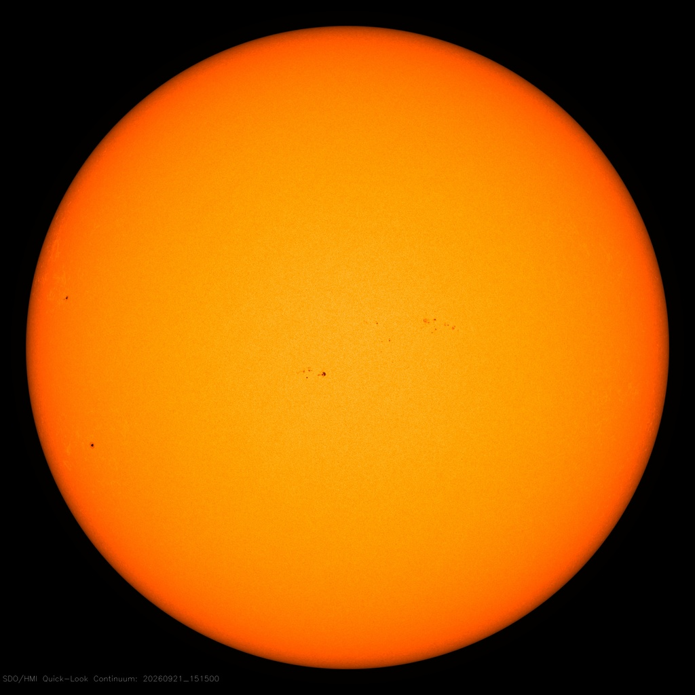

# L9 behind us — Star close-up as previous level

Loop doc for Issue #227 (Round 1 pilot, refreshed in the Round 2 loop). This page is the bridge
from L9 (Stars) into L10 (Planets and moons): what
the previous level looks like, what carries over when you zoom in,
and what changes at L10 scale. The part docs from the loop's first
pass now exist — follow the cross-links below.
Entry itself — the visual transition and its effects — lives in
`entry.md`. The dated timeline will run through `lifetime.md`.

## What L9 is and how it looks

L9 is the star close-up scale at about 10^9 m: one star filling
the whole view. Its anchor is the Sun's width, 1.39 x 10^9 m
(about 1.4 million km, or about 865,000 miles across), the
official IAU 2015 size. Our Sun is the example star: a 4.5 to
4.6-billion-year-old yellow dwarf (type G2V) holding 99.8 percent
of the solar system's weight, sitting about 93 million miles
(150 million km) from Earth — about eight light-minutes away.

Inside the view are the layers. Deep down is the interior: the
core where fusion makes the heat and light, wrapped in the zones
that carry that energy outward. Then comes the face we actually
see, the photosphere — the bright "surface" layer, only about
250 miles thick, glowing at about 5,500 degrees C
(10,000 degrees F), marked by dark sunspots and bright patches.
Above that stretches the atmosphere: the thin pinkish
chromosphere and the huge hot crown, the corona, reaching up to
about 2 million degrees C, with arches, streamers, dark holes,
and red tongues of gas (prominences) lifting off the edge.

Around all of that is the action: flares — sudden bright flashes
as powerful as billions of bombs — great clouds of charged gas
thrown outward (coronal mass ejections) at over a million miles
per hour, and the steady solar wind streaming past the planets.
Far off, tiny and faint, sit the companions: the eight planets as
nearby points going around the Sun, plus dust rings, and — around
a few other stars — a rare second star nearby.

Target visuals (files in `images/`, credits and licenses at the bottom):

Sources: `docs/universes/ladder.md` (R5 anchors);
`docs/universes/levels/L09/README.md` (L9 part docs
`interior.md`, `surface.md`, `atmosphere.md`, `activity.md`,
`companions.md`); NASA Sun facts page.

## What carries over into L10

Everything L9 shows at star scale is still there, only closer.
The blinding disk L9 frames as the whole becomes the surroundings:
the Sun, the G2V dwarf about 100 times wider than Earth and about
10 times wider than Jupiter, still shining from about 93 million
miles away — its light still taking eight minutes to reach us.
The wind L9 watches leaving the crown becomes the weather up
close: the same stream of charged gas that brushes past Earth and
paints the northern and southern lights. The warmth L9 counts as
the habitable zone's gift becomes the ground under our feet —
liquid water, air to breathe, and seasons from Earth's tilt.
The companion points L9 keeps at the edge become the subject:
one of those dots — Earth, the third planet from the Sun — now
fills the view, with its own Moon going around it at about
239,000 miles (384,400 km) away. Sources: ladder R5 anchors;
NASA Sun facts page; NASA Earth facts page; NASA Moon facts page.

## What changes at this zoom

**From one star to one planet with moons.** At L9 the view holds
one star close-up at about 10^9 m. At L10 each L9 cell opens
into one planet with its moons at 10^6–10^8 m: a single round
world with its lands, waters, air, and night lights, plus the
moons going around it — the inside, the face, the air, the moons,
and the magnetic shield with its space weather (see `interior.md`,
`surface.md`, `atmosphere.md`, `moons.md`,
`magnetosphere.md`).

**From a dense step to a sparse one.** The L9 cell opens into L10
at a true size ratio of 9.33e-3 (`docs/universes/ladder.md`, R6 table) —
the Earth (1.28 x 10^7 m across) against the Sun (1.39 x 10^9 m) —
with about 12 markers per cell (the planets plus rare companions).
The L9–L10 span takes two invisible magnification milestones, the
same quiet stepping the ladder's gap note describes for most long
spans. Populations (shown points) never open; only portals do.
Sources: ladder R6 amendment and gap note; ADR 0010 (portal vs
population).

**From reading a star to standing on a world.** L9 shows a burning
ball — layers, face, crown, outbursts, and distant companion
points. L10 shows what one of those companion points holds up
close: the rocky inside with core, mantle, and crust; the surface
of oceans, land, ice, and life; the air of nitrogen and oxygen
that shields and warms; the Moon — about 3,474 km across, some 30
Earths away in a line — going around every 27 days and pulling
the tides; and the magnetic shield that bends the solar wind into
the auroras. The star is still there, 93 million miles off — but
here the story is the planet, not the star. Sources: NASA Sun
facts page; NASA Earth facts page; NASA Moon facts page.

## How the parts fit together

One planet runs through the planned part docs. The interior
(`interior.md`) sets the engine — core, mantle, crust; the surface
(`surface.md`) sets the face — oceans, land, ice, life; the
atmosphere (`atmosphere.md`) sets the blanket — air, clouds,
weather, climate; the moons (`moons.md`) set the company — our
Moon's shape, phases, and tides; and the shield (`magnetosphere.md`
with the activity) sets the voice — the magnetic field, the solar
wind bending around it, auroras, and space weather. The dated
version of this story runs through `lifetime.md`, and the dive
that brings you here is in `entry.md`. Sources: L09 part docs
as the pattern; NASA Earth, Moon, and Sun facts pages.

## Where to go next

- `entry.md` — the L9-to-L10 dive in plain steps, effects on entry, timing.
- `interior.md`, `surface.md`, `atmosphere.md` — the engine, the face, the blanket.
- `moons.md`, `magnetosphere.md` — the company and the shield.
- `lifetime.md` — dated stages from dust and collision to today's living world.

## Key numbers

- L9 span: about 10^9 m; anchor Sun diameter 1.39 x 10^9 m (IAU 2015).
- L10 span: 10^6–10^8 m; anchor Earth equatorial diameter 1.28 x 10^7 m (7,926 miles / 12,756 km).
- Sun: G2V yellow dwarf, 4.5–4.6 billion years old, 99.8 percent of system mass, diameter about 1.4 million km (865,000 miles); face (photosphere) about 5,500 degrees C; core about 15 million degrees C; crown (corona) up to about 2 million degrees C; 93 million miles (150 million km) from Earth, 8 light-minutes.
- Earth–Moon: Moon diameter about 3,474 km; average distance 384,400 km (238,855 miles, about 30 Earths in a row); Moon circles Earth about every 27 days; Moon's pull steadies Earth and raises the tides.
- L9 to L10 ratio: 9.33e-3, about 12 markers per L9 cell; L9–L10 takes two zoom gaps.

Sources: ladder R5/R6; pages named above; NASA object pages.

## Image credits and licenses

| File | Shows | Credit (required) | License / terms |
|---|---|---|---|
| `sun-fulldisk-sdo.jpg` | Full face of the Sun in golden light, a round disk with darker spots (screensize) | NASA/SDO | Public domain (NASA) (`https://sdo.gsfc.nasa.gov/data/`) |

Note: the pilot audit confirms the file, credit and term before the
loop continues; replacements are separate updates, never silent swaps.

## Sources

- Ladder: `docs/universes/ladder.md` (R5 anchors, R6 ratios, gap note, R8 form)
- L09 reference index: `docs/universes/levels/L09/README.md`
- L09 part docs (pattern for L10 parts): `interior.md`, `surface.md`, `atmosphere.md`, `activity.md`, `companions.md`
- NASA, Sun facts: `https://science.nasa.gov/sun/facts/`
- NASA, Earth facts: `https://science.nasa.gov/earth/facts/`
- NASA, Moon facts: `https://science.nasa.gov/moon/facts/`
- SDO, The Sun Now (full-disk images): `https://sdo.gsfc.nasa.gov/data/`
