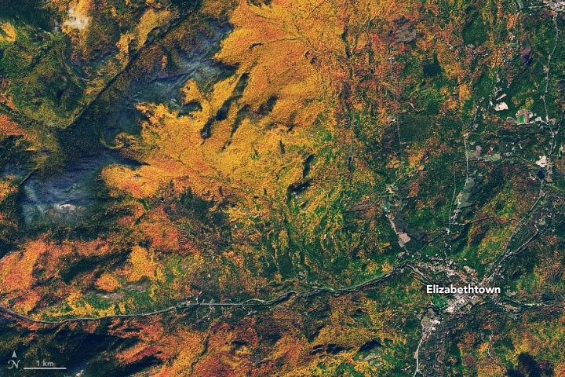

# Plains — the flat of regions

Loop doc for Issue #228 (Round 2, iteration 3). This page describes plains, basins,
lowlands, and deserts at L11 scale: looks, changes, creation, and interactions with
continents, ranges, waters, and rivers. Bridge in `previous-l10.md`, dive in
`entry.md`, timeline in `lifetime.md`.

## How it looks

From orbit a plain reads as a broad flat fill — green farmland, tan desert, pale
basin floors — cut by thin river lines and dotted with towns. Lowlands lie near sea
level, smooth and farmed; basins dip below surrounding land with salt flats or lakes
at the center; deserts glow tan with dune stripes. The frame below shows farmland
and towns on flat ground with valleys at the edge — the settled flat at 100-km scale.

Target visual (file in `images/`, credit and license at the bottom):

Sources: `docs/universes/ladder.md` (L11 row); USGS plains pages; NASA Earth
facts page.

## How it changes over time

Plains fill and empty. Rivers lay silt mm per year; wind lays dust; ice sheets
flatten and leave till. Basins sink as ground stretches or loads, then fill with
lakes that dry to salt. Deserts grow and shrink with climate — Sahara greens and
browns over tens of thousands of years. Farmland changes them fastest: fields,
roads, and towns in decades. A plain is a worn range or a filled basin: build flat,
hold flat, or dry flat. Second pass: QBO winds steer dust; Saharan dust feeds
Amazon soils; Hunga Tonga 2022 shows eruptions reset plains in days. Sources: USGS basin pages; NASA land-change stories.

## How it is created

Plains are made by wearing high ground flat or filling low ground up: erosion from
ranges, deposition by rivers and wind, lava flooding flat, glacial scouring smooth,
tectonic stretching dropping basins. Great Plains wear from the Rockies; Amazon
fills from the Andes; Sahara sands blow from old lake beds. Basins drop along
faults (Great Basin) or sag under loads. Sources: USGS landform pages; NASA
Observatory.

## How it interacts with the others

A plain interacts with every part. It wears from ranges (`mountains.md`) that shed
it; it sits on continents (`continents.md`) as their cover; it drains by rivers
(`rivers.md`) that water or flood it; it meets seas at flat coasts with wide beaches
(`oceans.md`). Air dries it to desert or rains it to farm; life roots or grazes it.
Plains hold people, rivers feed plains, seas take plains at the edge. Sources:
USGS water pages; NASA climate pages.

## Typical size and mass

- Size: Great Plains about 2,800 km long, 500–800 km wide; Amazon basin about
  7 million km2; Sahara about 9 million km2. L11 frames 100–1,000 km sections —
  whole basins, dune fields, farm belts.
- Mass: a 500 x 500 km plain with 1 km of fill holds on the order of 10^17 kg
  of sediment. Dune sand meters thick; loess tens of m thick.
- Relief: plains under 200 m variation over 100 km; basins to 100 m below sea
  level (Death Valley −86 m); deserts flat to dune-high (tens of m).

Sources: USGS pages; NASA elevation pages.

## Example objects

Example: Great Plains — worn from the Rockies, farmed belt hundreds of km wide.
Example: Amazon basin — filled from the Andes, river-threaded flat. Example:
Sahara — wind-built sand seas over old rock. Example: Elizabethtown frame area —
farmed plain with valleys (target image). Sources: USGS regional pages; NASA frames.

## Key numbers

- L11 frames: 100–1,000 km; Great Plains 2,800 km; Sahara 9 million km2.
- Fill: rivers lay mm per year; dunes move m per year; basins sink mm per year.
- Relief: plains under 200 m per 100 km; Death Valley −86 m; dunes to 100 m high.
- Climate: deserts under 250 mm rain per year; plains farms 500–1,000 mm.

Sources: ladder L11 row; USGS; NASA.

## Image credits and licenses

| File | Shows | Credit (required) | License / terms |
|---|---|---|---|
| `plains-nasa.jpg` | Farmland plains and towns from orbit, flat green ground with valleys (screensize) | NASA Earth Observatory / Landsat team, frame pinned in-repo | Public domain (NASA) (`https://earthobservatory.nasa.gov/`) |

Source: NASA Earth Observatory image record 150482 (Elizabethtown).
Note: audit confirms file, credit and term; replacements are separate updates.

## Sources

- Source: Ladder `docs/universes/ladder.md` (L11 row)
- Source: NASA, Earth facts `https://science.nasa.gov/earth/facts/`
- Source: USGS, plains and basins `https://www.usgs.gov/science`
- Source: NASA, Earth Observatory `https://earthobservatory.nasa.gov/`
