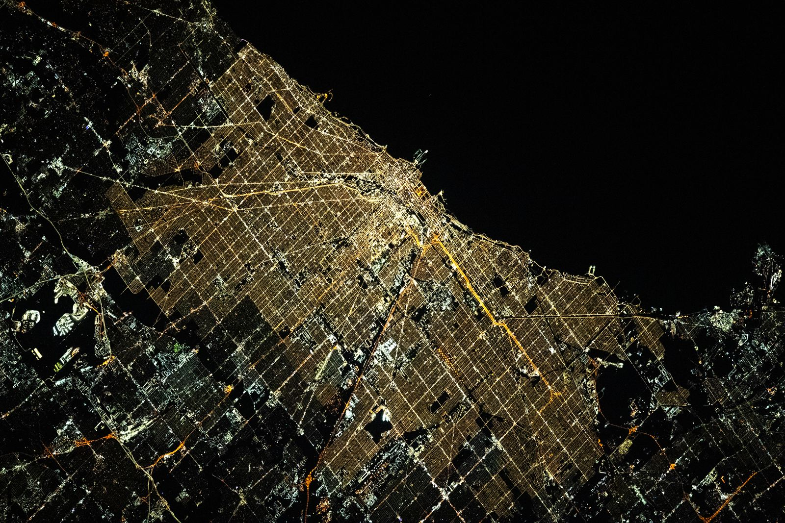

# Shops — storefronts, malls, commercial cores

Part doc for Issue #230 (Round 2 loop). One of six L13 parts: shops and commercial buildings at 10–100 m.
The bridge from L12 lives in `previous-l12.md`; the dive lives in `entry.md`; the timeline in `lifetime.md`.

## How it looks

A shop is a glass box for display: aluminum and glass facades, big clear windows, doors with
glass in them, and brand layered on top — fascia sign, perpendicular blade, awning, window
graphics. Three forms share the trade. The high street lines narrow units side by side along
the sidewalk, one to four floors, shop below with offices or homes above, in continuous active
frontage. The big box stands alone: one huge single-floor shoebox on a concrete slab, flat
roof on steel trusses, block walls in metal siding, ringed by parking, built for cars. The
enclosed mall turns the street inside out: stores facing a common indoor walkway one to three
levels deep, parking wrapped around the outside, department anchors at the ends. By night the
downtown core glows white — commercial, industrial, and transport light — against the warm
sodium of the residential streets around it.

Target visual (file in `images/`, credit and license at the bottom):

Sources: PRL Glass storefront pages; NACTO street-guide pages; NASA Earth Observatory Chicago lights pages.

## How it changes over time

Shops turn over every few years; a share of leases now track tenant revenue instead of fixed
rent to survive the churn. Interiors are stripped and rebuilt on a five-to-ten-year beat:
first the base shell with air, sprinklers, and grid ceilings, then the tenant's own millwork,
lighting, and branding. Malls live and die by their anchors: when the department stores close,
vacancies spread and foot traffic thins — the dead-mall cycle — pushed by online retail, which
reached 16.4 percent of US sales in 2025. The afterlife is conversion: dead malls become data
centers with barely a touch, or senior housing and clinics with heavy surgery. Young shoppers
still buy most general merchandise in stores, for trying on and instant taking home.

Sources: RICS turnover-lease pages; Stovall fit-out pages; Census e-commerce release; ScienceDirect mall-reuse pages.

## How it is created

The lineage runs fixed-price Paris department store in 1852, to the first unified open mall
outside Kansas City in 1922, to the first fully enclosed air-conditioned mall near Minneapolis
in 1956, to the 1980s megamalls with hotels and water parks inside. Strip malls and big boxes
typically rise as Type II non-combustible frames — metal skeleton, block walls, sprinklers
buying extra area — while small restaurants and offices go up cheapest in Type V wood. The
developer delivers structure, envelope, and shared core; the landlord delivers the base shell;
each tenant funds its own fit-out. Planners weigh community support, access, site size,
zoning, and economics before a single footing is dug.

Sources: Britannica shopping-centre pages; Samuels construction-type pages; Stovall fit-out pages.

## How it interacts with the others

The high street is pedestrian-first: streets are over 80 percent of urban public space, and
shared commercial streets, parklets in old parking bays, and active glass fronts turn foot
traffic into the economic metric. The big box and power center are car-first: huge footprints
force highway sites with oceans of surface lot, often beyond transit's reach. The mall runs a
controlled interior street where anchors pay less rent because they drag the crowds past the
small shops, and food courts and cinemas stretch the stay. Above and behind, downtown office
space feeds the whole system its daytime population of workers, diners, and errand-runners.

Sources: NACTO street-guide pages; Michigan Journal mall pages; Wisconsin Extension office pages.

## Typical size and mass

A single high-street shop runs about 12–18 ft wide and 50–80 ft deep; independents hold
1,000–5,000 sq ft. A big box starts past 50,000 sq ft and can approach 200,000. Centers step
up by class: neighborhood 30,000–125,000 sq ft, community to 400,000, regional mall
400,000–800,000, super-regional past 800,000 averaging 1,255,000. The Mall of America totals
5,689,000 sq ft with 520 stores; Macy's Herald Square holds over a million sq ft of retail
in one 1902 block; Oxford Street packs 300 shops into a mile and a fifth with some 300,000
visitors a day.

Sources: ICSC center-classification pages; MECSR center-type pages; Visit London Oxford Street pages.

## Example objects

- Fifth Avenue and Macy's Herald Square, New York — flagship canyon and the largest US department store, a full block opened 1902.
- Oxford Street, London — Europe's busiest shopping street, some 300 shops over 1.2 miles from Marble Arch to Tottenham Court Road.
- Ginza, Tokyo — high-end district of old department stores beside designer flagships, the Fifth Avenue of the east.

Sources: Storefront best-streets pages; Visit London pages; 34th Street Macy's pages.

## Image credits and licenses

| File | Shows | Credit (required) | License / terms |
|---|---|---|---|
| `commercial-chicago-nasa.jpg` | Chicago downtown core glowing white against warm residential streets (screensize, detail of full scene) | Astronaut photograph ISS070-E-105097 (Expedition 70 crew, Nikon D5 400mm), ISS Crew Earth Observations Facility and Earth Science and Remote Sensing Unit, NASA Johnson Space Center | Public domain (NASA) (`https://science.nasa.gov/earth/earth-observatory/windy-city-of-lights-153622`) |

Note: the loop audit confirms each file, credit and term; replacements are separate updates, never silent swaps.

## Sources

- NACTO, street design guide: `https://nacto.org/publication/urban-street-design-guide`
- ICSC, center classification: `https://www.icsc.com/uploads/research/general/US_CENTER_CLASSIFICATION.pdf`
- MECSR, center types: `https://www.mecsr.org/insights-expert-articles/a-guide-to-shopping-center-types-sizes-classifications-and-characteristics`
- Britannica, shopping centre: `https://www.britannica.com/topic/shopping-centre`
- US Census, e-commerce 2025: `https://www2.census.gov/retail/releases/historical/ecomm/25q4.pdf`
- PRL Glass, storefronts: `https://prlglass.com/blog/storefront-systems-for-retail-offices-and-hospitality`
- RICS, turnover leases: `https://ww3.rics.org/uk/en/journals/property-journal/how-do-turnover-leases-affect-retail-valuation-.html`
- Visit London, Oxford Street: `https://www.visitlondon.com/things-to-do/place/5042973-oxford-street`
- 34th Street, Macy's: `https://34thstreet.org/activities/macys-herald-square`
- NASA, Chicago lights: `https://science.nasa.gov/earth/earth-observatory/windy-city-of-lights-153622`
