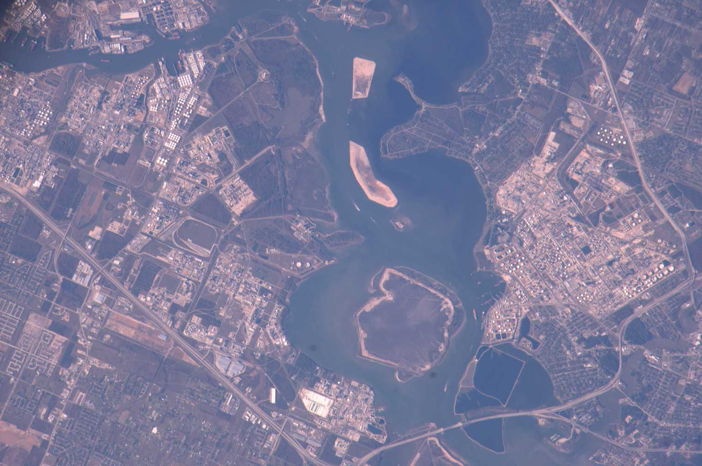

# Works — warehouses, factories, sheds, chimneys

Part doc for Issue #230 (Round 2 loop). One of six L13 parts: industrial buildings at 10–100 m.
The bridge from L12 lives in `previous-l12.md`; the dive lives in `entry.md`; the timeline in `lifetime.md`.

## How it looks

A warehouse is a large plain box on the city's edge: white or metal roof, rows of dock doors,
staging aprons for trucks, pallet racks and forklifts inside. Docks stand about 4 ft 4 in
above the pavement for trucks, 3 ft 9 in above the rails for railcars, with a leveller for
every five bays and a drain for every two. A factory is a building or group where machines
make goods, crowned by the chimney that carries smoke above the roof. Classic plants sprawl —
boiler house, turbines, transformers, tank farms, rail sidings — and the great ones become
landmarks: Battersea's four 101-m chimneys on the Thames, still standing over shops and homes
today. From orbit the works read as bright clusters on the water: refineries, wakes, and
dredge islands strung along the channel.

Target visual (file in `images/`, credit and license at the bottom):

Sources: Britannica warehouse pages; WBDG warehouse pages; NASA Earth Observatory ship-channel pages.

## How it changes over time

Warehouses are the newest buildings in America — over half raised since 1990 — and they keep
swelling: only about a third stay under 25,000 sq ft while an equal share passes 100,000.
Firms build new rather than retrofit, chasing placement, power, access, and layout. The old
giants get second lives instead of demolition: Bankside's oil power station went dark in 1981
and reopened in 2000 as Tate Modern, seven gallery floors threaded inside the brick shell;
Battersea closed in 1983 and reopened in 2022 as shops and homes on 42 acres; Ford's Rouge
grew a 10-acre living sedum roof over its truck plant. A shed that cannot adapt is a shed
that falls.

Sources: EIA warehouse pages; Tate Modern history pages; Battersea heritage pages; MotorCities Rouge pages.

## How it is created

Distribution sheds go up fastest as pre-engineered metal buildings: factory-toleranced frames
with clear spans to 60 m, bays every 6–9 m, eaves 12–18 m for the e-commerce giants — a
100,000 sq ft box in seven to ten months against ten to fourteen conventional. Tilt-up
concrete competes where walls run tall and security matters: panels cast on site and craned
upright, at two to three times the prefab price. Cold chains add insulated panels; fulfillment
floors are engineered for mezzanine loads. The design rule is growth: size for today's goods
plus tomorrow's, keep the bays high and the berths clear of structure.

Sources: PEB Steel and SteelCo warehouse pages; WBDG warehouse pages.

## How it interacts with the others

Works live on freight corridors: Houston's ship channel runs 50 miles from the interior to the
Gulf, 530 ft wide and 45 ft deep, carrying petrochemicals out and grain in, with refineries
planted by the oilfields along its banks. Ports burn all night — Antwerp's docks outshine its
city center, Long Beach glows orange with round-the-clock sodium cargo light. The self-made
extreme is the Rouge: a mile and a half by a mile with its own hundred miles of rail, 120
miles of conveyors, its own power plant that could light a city, its own bus network and
fifteen miles of paved road. What the works exhale, the neighborhood breathes.

Sources: NASA ship-channel and night-cities pages; Henry Ford Rouge pages.

## Typical size and mass

The average US warehouse covers 17,400 sq ft; small runs 5–15,000, mid 50–100,000, large past
100,000 toward 500,000. Clear spans reach 60 m with eaves 6–12 m; prefab steel runs 25–45 kg
per square meter. The Rouge at full stretch held 93 buildings and some 16M sq ft of floor —
about a square mile and a half — with 100,000 workers at peak turning raw steel into a car
every 49 seconds. Battersea's stacks rise 101 m overall, half stack on half wash tower.

Sources: EIA warehouse pages; MotorCities Rouge pages; Battersea heritage pages.

## Example objects

- Ford River Rouge Complex, Dearborn — 1915–28, a mile and a half by a mile, 93 buildings, once the world's largest integrated factory, the template for Wolfsburg, Mirafiori, and Ulsan.
- Bankside Power Station to Tate Modern, London — 1947–63 oil station to 2000 Herzog and de Meuron gallery, machinery out and seven floors in.
- Battersea Power Station, London — 1929–55 coal giant, a fifth of London's power, gas-washing pioneer, reopened 2022 as the centerpiece of 42 acres.

Sources: MotorCities Rouge pages; Tate Modern history pages; Battersea heritage pages.

## Image credits and licenses

| File | Shows | Credit (required) | License / terms |
|---|---|---|---|
| `industrial-shipchannel-nasa.jpg` | Houston Ship Channel refineries, wakes and dredge islands (screensize, detail of full scene) | Astronaut photograph ISS012-E-9567 (Expedition 12 crew), ISS Crew Earth Observations Facility and Earth Science and Remote Sensing Unit, NASA Johnson Space Center | Public domain (NASA) (`https://science.nasa.gov/earth/earth-observatory/houston-ship-channel-texas-6142`) |

Note: the loop audit confirms each file, credit and term; replacements are separate updates, never silent swaps.

## Sources

- EIA, warehouses: `https://www.eia.gov/consumption/commercial/pba/warehouse-and-storage.php`
- EIA, commercial overview: `https://www.eia.gov/consumption/commercial/pba/overview.php`
- Britannica, warehouse: `https://www.britannica.com/technology/warehouse`
- WBDG, warehouse: `https://www.wbdg.org/space-types/warehouse`
- Tate, Tate Modern history: `http://tate.org.uk/about-us/history-tate/history-of-tate-modern`
- Battersea, heritage: `https://batterseapowerstation.co.uk/about/heritage-history`
- MotorCities, Rouge: `https://www.motorcities.org/locations/ford-rouge-factory-complex`
- NASA, ship channel: `https://science.nasa.gov/earth/earth-observatory/houston-ship-channel-texas-6142`
- NASA, night cities: `https://science.nasa.gov/earth/earth-observatory/cities-at-night-the-view-from-space`
