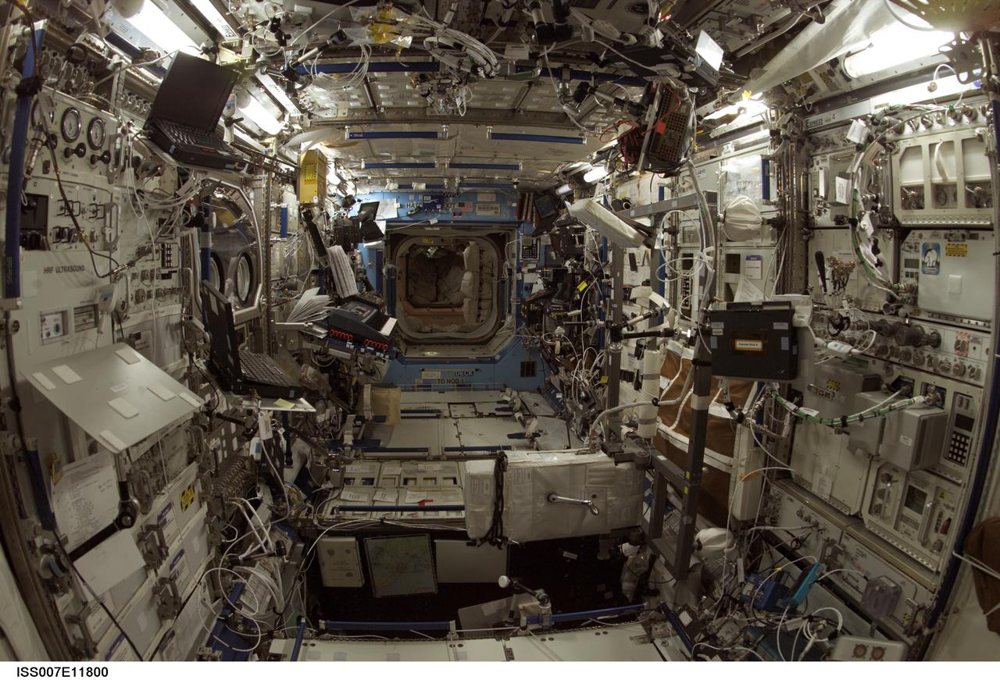

# Entering L14 — the dive from buildings to rooms

Loop doc for Issue #231 (Round 1 pilot). This page walks the L13-to-L14
dive in plain steps: what you approach, what changes on entry, and
the numbers behind it. The bridge behind us lives in `previous-l13.md`;
the part docs and the timeline now exist —
the cross-links below say where each sight belongs.

## The approach

You leave the whole building behind and fall toward one chamber of its face — a room with its
furniture about 1 to 10 m across, the size of a bedroom, a parlor, a laboratory module.
The building thins out into enclosure: walls pale and straight, floors dark and level in rows,
ceiling flat overhead, still there, now around you. Far behind lies the building wash:
the coarse mass of walls and roofs, the broad haze, the block reduced to a dot. Ahead, one marker brightens
among the points: the room portal of this L13 cell, holding one L14 interior — shell below,
furniture rising beside it, shelves with kept things, the lamp glow as a warm point,
storage stripes and textiles between. Around the point, the room itself swells into view: first the pale chamber, then the wall planes, then the furniture edges, then the chairs and shelves, then the handles and fabrics inside — down to the 1 m end point.

Target visual (file in `images/`, credit and license at the bottom):

Sources: `docs/universes/ladder.md` (L13 and L14 rows, gap note); NASA ISS Destiny module page;
NPS pages.

## Crossing into L14

The L13–L14 span is crossed through quiet magnification the dive pushes by proximity
to the targeted portal and unwinds the same way, so generation, snapshots and labels
never see a gap. Then the portal opens (angular radius past 0.14 rad, about a third of the
view) and the cell closes back into its marker below 0.10 rad —
pure origin shifts, with the pre-entry preview having already drawn
the interior inside the marker from 0.02 rad up to the opening.

What you see, in order, on this entry:

1. The building thins and goes: the broad mass with its walls and roofs
   dissolves into the enclosure around you — the building reduced to
   shell for the room.
2. One chamber takes everything: a room with its furniture about 1 to 10 m across, the size of
   a bedroom or parlor, with shell, pieces, and kept things in one frame.
3. The chamber becomes interior: floors level and hard underfoot, walls pale within reach,
   ceiling flat overhead at 7 to 8 ft — the curved face, lit from inside.
4. The lines resolve: the interior doors 30 in wide by 80 in tall, the hallways 36 in at minimum,
   with trim and handles as thin lines.
5. The pieces resolve: beds 60 by 80 in for a queen, tables at 28 to 30 in, chairs at 17 to 19 in,
   counters finished at 36 in with wall cabinets 12 in deep above.
6. The kept things show: shelves, rugs, curtains and lamps as near shapes in the enclosure,
   with the 1 m end point — the reach, the shelf, the door swing — closing in.
7. The markers fill again: from many building portals per L13 cell to many room portals per L14 cell — this dive ends the beyond-MVP tail at the 1 m end point.

Sources: ladder gap note and R7 preview angles; ADR 0010; NASA ISS pages; ICC dwelling pages.

## Effects on entry

Entry is gentle here because the L13-to-L14 leg is short — only about one
decade in characteristic size, crossed quietly as the dive falls from 10^1 m toward
10^0 m. On entry, the building markers fade out of the frame, and the coarse shapes of L13
walls and roofs fade with them — they belong to the building view, not to the room. What stays and grows is the targeted room marker:
it swells from the preview size at 0.02 rad up to the open angle at 0.14 rad, drawing
its shell, pieces, and kept things inside itself before the entry completes. Population
points never open (ADR 0010) — they are shown and counted but never targeted, so
only the true room portal carries you through this entry. At most 6 markers preview
at once, largest on screen first, so the entry view stays calm even when the room
is crowded. The lamp glow reads warm against the pale shell; the equipment racks of a
laboratory module read as lined walls, and the chairs of an assembly room read as rows.
Room detail at this zoom runs at centimeters per pixel: a 60-in bed fills half the frame,
so a chair is a large shape and a handle a small one.

Sources: `docs/universes/ladder.md` (L13 and L14 rows, R7 preview
angles, gap note); ADR 0010; NASA ISS pages; ICC pages.

## Timing

The L13 span (buildings 10^1–10^2 m) gives way to
the L14 span (rooms 10^0–10^1 m) — about one decade
closer in characteristic size. Travel time per rung runs `Δe ·
ln 10 / k`, so this leg runs shortest; the long four-decade
heliopause-to-Sun run is far behind us. Inside L14, distances read
in fractions of the room: beds about 2 m long, counters about 1 m high, doors
about 0.8 m wide — with the building 10 to 100 m around,
about 8 light-minutes from the Sun, the Moon 384,400 km out. Earth spins once in
23.9 hours and circles the Sun in 365.25 days; the rooms turn with it from day
into night.

Sources: ladder L13 and L14 rows; NASA pages (sizes,
distances, light time); Census pages (house sizes).

## What entry proves

Entry is complete when the building wash is gone, one chamber of interior commands the
view, and the chamber shows shell and pieces: you count chairs, shelf lines,
and lamps, not buildings. If you can name the room below as shell with furniture along
it, the day-night change as lamp and window light, the door lines and counter edges, and the bed
as a 60 by 80 in shape — you are in L14. The
detailed looks, lifetimes and interactions of each kind will live in the
part docs to come: the shell and furniture, the storage and light, the layout —
start with the reading guide to map each sight to its stage.

Sources: NASA ISS pages; NPS pages.

## Where to go next

- `previous-l13.md` — the L13 bridge: what carries over, what changes at this zoom.
- `shell.md`, `furniture.md`, `storage.md` — the enclosure, the big pieces, the keeping.
- `light-power.md`, `textiles-decor.md`, `layout.md` — the served, the soft, the plan.
- `lifetime.md` — dated stages from single-room huts to today's rooms.

## Key numbers

- L13 span: buildings 10^1–10^2 m (10 to 100 m); houses tens of m; stadiums hundreds of m.
- L14 span: rooms 10^0–10^1 m (1 to 10 m); beds about 2 m; counters 36 in; doors 30 by 80 in.
- Portals: many building portals per L13 cell → many room portals per L14 cell (counts fixed in the loop).
- Open angle 0.14 rad, close 0.10 rad, preview from 0.02 rad (at most 6 markers).
- Destiny module: ISS Expedition 7 view `iss007e11800`, August 2003, 1280 by 871 px; racks lining both walls of a narrow chamber.
- Assembly detail: chairs at 17–19 in seat height, tables at 28–30 in; a queen bed half a bedroom.
- Light travel for context: Moon to Earth about 1.3 s; Sun to Earth about 8 minutes.

Sources: ladder L13/L14 and R7 and gap note; pages named above.

## Image credits and licenses

| File | Shows | Credit (required) | License / terms |
|---|---|---|---|
| `destiny-lab-interior-nasa.jpg` | Interior of the Destiny laboratory module: equipment racks lining both walls (screensize) | NASA, Johnson Space Center (image ID `iss007e11800`) | Public domain (U.S. Government work) (`https://images.nasa.gov/details/iss007e11800`) |

Note: the Round 2 audit confirms each file, credit and term before the
loop continues; replacements are separate updates, never silent swaps.

## Sources

- Ladder: `docs/universes/ladder.md` (L13 and L14 rows, R7 preview, gap note)
- NASA, image details iss007e11800: `https://images.nasa.gov/details/iss007e11800`
- NPS, NPGallery Assembly Room asset page: `https://npgallery.nps.gov/AssetDetail/4e4d7280-1dd8-b71b-0ba3-d7bec43b2b9c`
- US Census, new-housing highlights: `https://www.census.gov/construction/chars/highlights.html`
- ICC, IRC dwelling room rules: `https://codes.iccsafe.org/s/IRC2021P3/chapter-3-building-planning/IRC2021P3-Pt03-Ch03-SecR304.1`
