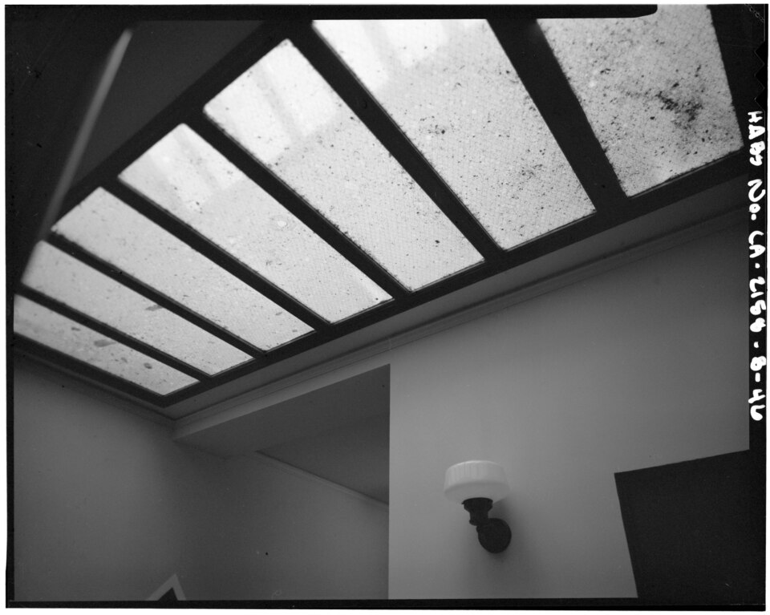

# Light, air, power — lamps, fixtures, outlets, vents

Part doc for Issue #231 (Round 2 loop). One of six L14 parts: the served systems at 1–10 m.
The bridge from L13 lives in `previous-l13.md`; the dive lives in `entry.md`; the timeline in `lifetime.md`.

## How it looks

Light, air, and power read as points and grilles on the shell: ceiling fixtures and hanging
lamps, wall switches, duplex outlets along the baseboards, registers and returns in floor and
wall, radiators under windows. Room lamps use the Edison screw — E26 (26 mm, North American
120 V) and E27 (27 mm, European 230 V), seven threads to the inch, interchangeable in practice;
the big Mogul E39/E40 screws serve 250 W and up, street and industrial lamps. Wall power is the
fixed female receptacle on its branch circuit, the plug its male counterpart with protruding
pins — North America general-purpose is the grounded NEMA 5-15, 15 A class, its sockets backed
by recessed contacts, shutters, covers, and switches. Air shows as registers: a register is a
grille plus a damper (a grille alone has none), supply low — floor or low wall, near window or
door — returns central, high or low, about one per room; floor registers take foot traffic and
rarely sit within 6 in of a corner. Heat emitters run cast-iron column (steam or hot water,
rare in new build now), fin-tube baseboard (copper pipe with aluminum fins, in at the bottom
and out at the top), welded steel panel (wall-hung, typed by panels and fin sets), plus
aluminum, fan-assisted, underfloor radiant, and skirting-board variants.

Target visual (file in `images/`, credit and license at the bottom):

Sources: Edison screw, plug-and-socket, register, and radiator pages; DOE light-bulb history; HABS Union Terminal photo CAL,19-LOSAN,64-B-46.

## How it changes over time

Light climbs a life-and-efficacy ladder. Incandescent runs about 1,000 hours at 10 to 17 lumens
per watt, under 5 percent of its energy leaving as visible light. Fluorescent runs 6,000 to
15,000 hours at 50 to 100 lumens per watt (its mercury making it hazardous waste). The best
commercial LEDs pass 200 lumens per watt, over half the input turned to light, fading gradually
instead of burning out suddenly. The filament history runs cotton thread (~14 hours, October
1879) to bamboo (~1,200 hours, the decade's standard), tungsten (1904) with Langmuir nitrogen
fill (1913, doubling efficiency) — yet by the 1950s only a tenth of incandescent energy became
light, pushing fluorescents then LEDs. The CFL bridged them: 1930s phosphor tubes near triple
the incandescent, dominant American light by 1951; the residential spiral shelved in the 1970s,
back mid-1980s at $25–35 with bulky fit complaints, mature at three-quarters less energy and
ten times the life. Heating ages noisily: steam systems develop water-hammer banging when
condensate pools (often after settlement breaks the pipe fall); hot-water radiators want
bleeding at the bleed screw; blocking a baseboard or register top or bottom kills its
convection loop — the heater simply stops working; heating air without humidifying drops
relative humidity, drying skin and shrinking wood floors.

Sources: LED and incandescent lamp pages; DOE light-bulb history; radiator and register pages.

## How it is created

Power met the room through the lamp socket first. When commercial power arrived in the 1880s
it sold for lighting, and small appliances plugged into light sockets — the Edison screw was
the only standard connector, so toasters, fuses, and adapters all used it; wall two-pin
plug-and-sockets reached Britain near 1885, three-pin earthed near 1910, the first national
plug standard 1915. The supply chain dates precisely: Swan's carbon lamp demonstrated December
1878, re-demonstrated January 1879, shown to some 700 at Newcastle on 3 February 1879 — that
hall the first public building lit by electricity, Swan's own house the first house lit,
Newcastle's Mosley Street the first electrically lit street in 1880. Edison's team tested
successfully 22 October 1879 (thirteen and a half hours), filed the carbon-filament patent 4
November 1879, settled on bamboo past 1,200 hours; the screw itself patented 1881 from an 1880
kerosene-can-lid prototype, E-designations standardized through DIN 1924–25, endorsed by the
IEC 1930–31. Central power starts 4 September 1882 at Pearl Street, New York — six 100 kW
dynamos on a 50-by-100-ft site, 400 lamps to 82 customers, past 10,000 lamps within two years,
the world's first underground urban network; Holborn Viaduct proved the same model in London
the same year. Central heating matures alongside: Strutt's hot-air furnace 1793, Perkins
high-pressure hot water in the 1830s, San Galli's room radiator 1855–57, the American Radiator
Company 1892.

Sources: plug-and-socket and Edison screw pages; incandescent lamp pages; Pearl Street and Savoy Theatre pages; DOE light-bulb history; central-heating and radiator pages.

## How it interacts with the others

Light and power obey the shell's spacing and serve the furniture's use. Receptacles land so no
point along a wall line sits more than 6 ft from one — 12 ft apart at most, every wall space 2
ft or wider served. Air placement fights the cold: supplies near window and door where loss is
greatest, returns near the building's center; a heating register belongs across from its window
with enough throw to reach it, or the cold downdraught pools and circulation fails — and
furniture or covers blocking a baseboard or register, top or bottom, defeat the loop, so both
paths stay open. Electric light decoupled light from the room's air: gas burners each consumed
as much oxygen as several people plus great heat, while incandescents consumed none and gave no
perceptible heat — which is what allows lamp-plus-daylight layering today. On the wiring side,
polarized plugs and shelled sockets keep switches breaking the live side. Every fixture answers
the layout's zones (see `layout.md`), every outlet the furniture's arrangement (see
`furniture.md`), every vent the storage's walls (see `storage.md`).

Sources: IRC power-distribution pages; register and radiator pages; Savoy Theatre pages; plug-and-socket pages.

## Typical size and mass

Lamp bases E26/E27 at 26–27 mm; Pearl Street's whole station 50 by 100 ft for 600 kW DC; the
Savoy's 1881 load near 1,200 Swan lamps on an 89 kW outdoor generator, its proscenium 30 ft
high by 30 wide with a 27-ft stage. Edison's 1879 bamboo lamp reached 1,200 hours against the
modern incandescent's ~1,000 and fluorescent/LED's 6,000 to 25,000-plus. One room's served set
— a ceiling fixture, a lamp, four to six receptacles, one supply register and one return —
masses a few dozen kilograms of brass, copper, steel, and glass.

Sources: Edison screw and Pearl Street pages; Savoy Theatre pages; DOE light-bulb history.

## Example objects

- The Savoy Theatre, London, opened 10 October 1881 — the first public building in the world lit entirely by electricity, some 1,200 Swan incandescents; the stage stayed gas until 28 December 1881, when Carte broke a glowing bulb on stage to prove its safety, and The Times judged the electric light visually superior to gas.
- Pearl Street Station, New York, 4 September 1882 to 1890 — the First District underground network; 1:24 working models survive at the Smithsonian, the Con Edison Learning Center, and the Henry Ford Museum, one original dynamo at Greenfield Village; the radiator era's marker is 1924's American Radiator Building.
- The Dobson skylight-and-lamp hallway, Los Angeles Union Passenger Terminal — ceiling daylight and hanging electric lamp sharing one third-floor hall, photographed as HABS found it.

Sources: Savoy Theatre and Pearl Street pages; American Radiator Company pages; HABS Union Terminal photo CAL,19-LOSAN,64-B-46.

## Image credits and licenses

| File | Shows | Credit (required) | License / terms |
|---|---|---|---|
| `light-skylight-lamp-habs.jpg` | Union Terminal hallway: ceiling skylight with hanging electric lamp, doors and baseboards (screensize, detail of full scene) | Historic American Buildings Survey HABS CAL,19-LOSAN,64-B-46, Library of Congress, Prints & Photographs Division | Public domain (U.S. federal HABS work) (`https://commons.wikimedia.org/wiki/File:VIEW_TO_NORTHWEST;_SOUTH_END_OF_HALLWAY,_MBE_BUILDING,_THIRD_FLOOR,_SKYLIGHT_AND_LAMP_(Dobson)_-_Los_Angeles_Union_Passenger_Terminal,_Mail,_Baggage,_and_Express_Building,_HABS_CAL,19-LOSAN,64-B-46.tif`) |

Note: the loop audit confirms each file, credit and term; replacements are separate updates, never silent swaps.

## Sources

- Edison screw: `https://en.wikipedia.org/wiki/Edison_screw`
- Plugs and sockets: `https://en.wikipedia.org/wiki/AC_power_plugs_and_sockets`
- Register (air): `https://en.wikipedia.org/wiki/Register_(air_and_heating)`
- Radiator (heating): `https://en.wikipedia.org/wiki/Radiator_(heating)`
- DOE, light-bulb history: `https://www.energy.gov/articles/history-light-bulb`
- Pearl Street Station: `https://en.wikipedia.org/wiki/Pearl_Street_Station`
- Savoy Theatre: `https://en.wikipedia.org/wiki/Savoy_Theatre`
- Central heating: `https://en.wikipedia.org/wiki/Central_heating`
