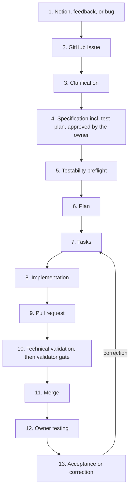

# AI-Driven GitHub Workflow

## Purpose

The project needs a workflow that uses the GitHub repository as the central system for organizing all development work.

## Owner Needs

The owner needs to:

- Submit notions, feedback, and bugs, as draft files in `drafts/`, in a session, or directly as Issues.
- Answer clarification questions.
- Approve the specification (goal, acceptance criteria, test plan) before implementation starts.
- Participate in planning decisions when a choice changes what the product does.
- Test the completed application.
- Confirm whether the implementation matches the original notion.
- Report problems found during testing.

The owner does not need to:

- Write specifications.
- Create technical tasks.
- Write code.
- Write tests.
- Perform technical validation.
- Review pull requests.
- Manage workflow statuses.
- Inspect implementation details.

## AI Needs

In this document, "the AI" means the main agent unless the validator agent is named (see AI Operating Model).

The AI needs to:

- Create a GitHub Issue for every notion, feedback item, or bug.
- Take drafts from `drafts/` into Issues and remove the draft files.
- Ask clarification questions when the input is incomplete.
- Define the specification including test plan and testability needs, and obtain the owner's approval.
- Run the testability preflight and block implementation until it passes.
- Record the owner's answers and decisions.
- Create the implementation plan.
- Create and organize tasks as sub-issues.
- Implement the approved work on a feature branch.
- Create and manage pull requests, without auto-close keywords for the parent Issue.
- Create and execute tests.
- Perform technical validation on the pull request.
- Perform visual validation for any user-visible UI change.
- Obtain an independent validator pass before merge.
- Record validation results.
- Correct technical problems.
- Present the completed application for owner testing.
- Record the owner's test feedback.
- Create correction work when the result is not correct.
- Complete the work when technical validation and owner testing are successful.

## GitHub Needs

The GitHub repository needs to contain and organize:

- Issues.
- Specifications.
- Plans.
- Tasks.
- Sub-issues.
- Labels.
- Projects.
- Milestones.
- Pull requests.
- Validation results.
- Owner feedback.
- Completion status.

All work must remain traceable from the original notion, feedback, or bug to the completed implementation.

### Artifact Map

Traceability is implemented as follows:

- Parent Issue (one per notion, feedback item, or bug): holds the original notion verbatim, the draft path when it came from a draft, clarification Q&A, owner decisions, spec link, test plan, validation results, and owner acceptance.
- Specification: recorded as an Issue comment (or linked `spec.md` in the repo) and frozen with an explicit owner approval comment before implementation. Its goal, acceptance criteria, and test plan are written in non-technical terms so the owner can approve them without inspecting implementation details.
- Plan: recorded as an Issue comment (or linked `plan.md` in the repo) after the testability preflight passes. The plan is owned by the AI and does not need owner approval; if planning reveals a choice that changes what the product does, the AI asks the owner before continuing.
- Tasks: created as GitHub sub-issues of the parent Issue. The parent's board status does not change while sub-issues are worked. Sub-issues are excluded from the Project board; only parent Issues are tracked there.
- Implementation: one feature branch and one pull request per round of work on the parent Issue (the initial work, then each correction round), linked manually (no auto-close keywords).
- Validation: technical checks on the PR plus validator pass/fail evidence posted as an Issue comment, each naming the commit SHA it covers.
- Completion: parent Issue closed by the AI only when owner testing passes or the owner explicitly abandons the item.

## Workflow Needs

The workflow needs to follow this sequence:

1. Notion, feedback, or bug
2. GitHub Issue
3. Clarification
4. Specification (including test plan and testability needs), approved by the owner
5. Testability preflight
6. Plan
7. Tasks
8. Implementation
9. Pull request
10. Technical validation, then validator gate (both on the PR)
11. Merge
12. Owner testing (on the merged result in the test environment)
13. Acceptance or correction

Correction re-enters at Tasks and follows the same path back to Owner testing.

## Completion Needs

Work is complete only when:

- The approved specification is implemented.
- Technical validation is successful on the pull request (CI green).
- The validator gate passes on the pull request for the commit that is merged.
- The pull request is merged.
- The owner tests the merged result in the test environment.
- The owner confirms that the implementation matches the original notion.

## Owner Vocabulary

The owner's words are defined once here and mirrored in `.agent/project-config.json`:

- Approval words: `approved`, `owner-test-only approved`, `abandoned`.
- Acceptance word for Done: `accept`.

An approval or acceptance is a comment whose body, trimmed, is exactly the word (or begins with the word on its own line). The AI records the comment URL on the Issue and never posts a comment beginning with one of these words. Until a dedicated bot identity exists, this exact-match rule plus the shared-identity disclosure below is the whole protection.

## Operating Principle

The owner provides the intention and tests the final result.
The AI manages the GitHub workflow, specification, planning, tasks, implementation, technical validation, pull request, and corrections.

## Notion Preservation

The AI must preserve the original notion.
The final implementation must be evaluated against the original input, not only against the technical specification.
The AI must ask before changing the notion.
If implementation reveals that the original idea is incomplete, contradictory, or technically impossible, the AI must stop and ask the owner.

## Owner Testing

Owner testing is product acceptance, not technical review.
The owner only tests whether the application behaves as intended, and is not responsible for checking the code or technical evidence.
The owner tests the merged result in the test environment (preview deployment, staging, or local build stated on the Issue), not production. A separate release to production happens only after Done.
When the AI presents an item for testing, it posts on the Issue, in non-technical terms: where to test, the steps to follow (the test plan), and what the owner should see.
Problems found during owner testing are reported on the same Issue and handled as correction; they do not become new Issues.

## Correction

Correction is part of the same workflow.
If the owner's test shows that the result is wrong, the AI must create correction work and continue until the notion is accepted or explicitly abandoned.
Correction work follows the same path as the original work: tasks, implementation, pull request, technical validation, validator gate, merge, then owner testing again.
Abandonment is explicit: the owner states it on the Issue and the AI moves the item to Done with reason `abandoned`.
Correction loops are bounded: after two failed owner-test rounds the AI must stop, summarize what changed, move the item to "Needs your answer", and ask for a decision before continuing.
The same bound applies to the validator gate: after two consecutive validator fails on the same item, the AI stops, summarizes, and asks the owner for a decision instead of trying again. That number "two" is written here only; skills refer to it as the bound in this document rather than repeating a digit. The `correction` skill tracks rounds in a machine-readable marker (`<!-- correction:round k owner-fails=m validator-fails=v -->`) and reads the latest marker instead of prose.

## Drafts Folder

The `drafts/` folder is the owner's intake space. Every Markdown file in it, except `README.md`, is one notion, feedback item, or bug written in the owner's own words. Subfolders may be used to organize drafts; they carry no meaning for the workflow.
The owner can also submit by stating the notion in a session or by filing an Issue directly on GitHub. All three paths lead to the same kind of Issue.
Taking a draft means: the AI creates the Issue with the file's content verbatim as the body, the type label, and the draft's path; then removes the file from `drafts/`. Agent-authored drafts are allowed when the owner asks for them in a session; the author is named in the file's first paragraph. If the file was committed, the removal is committed with a message that names the Issue. From then on the Issue is the record and the draft is not needed.
A draft is taken once. Before creating an Issue, the AI checks for an existing Issue that names the same draft path.
A draft that names an existing Issue, or clearly refers to an item in In review, is recorded on that Issue instead of opening a new one.
If a draft's content must also exist as a repository document (the workflow document itself is the example), the take moves the file to its permanent place under `docs/` instead of deleting it.
At the start of a session, and whenever the owner asks, the AI lists untaken drafts and asks which to take; the owner can answer "all".
Workflow artifacts (specifications, plans, validation evidence, capability records) never live in `drafts/`. They live on the Issue or under `docs/`.

## Project Board

Create one GitHub Project under the repo owner, link it to the repo, and turn on auto-add so every parent Issue (one per notion, feedback item, or bug) lands on its board. Sub-issues are excluded from the board so the owner never sees technical tasks.
The board needs only six statuses: Todo, Needs your answer, In progress, In review, Needs correction, and Done.
The AI moves every item, and the owner only looks at the board to see what is waiting on them, which is either a question to answer or something to test.
A merged PR moves the item to In review, never to Done. The parent Issue must never be closed automatically: do not use `Closes #123`, `Fixes #123`, or `Resolves #123` for the parent Issue in the PR body. Link with `Related to #123` or task lists only. Only sub-issues may use auto-close keywords.
After the owner tests, the AI marks it Done if it is right or Needs correction if it is not. Done also covers explicitly abandoned items with reason recorded on the Issue.

### Status Transitions

Each status says whose turn it is: "Needs your answer" and "In review" are the owner's turn; every other status is the AI's.

| Status | The item enters when | The item leaves when |
|---|---|---|
| Todo | The Issue is created (auto-add), from a draft, a session, or directly on GitHub. | The AI starts work on it (→ In progress). |
| Needs your answer | The AI asks a clarification question, requests specification approval, requests testability access, reports a validator BLOCKED, or stops after a bounded loop. | The owner answers on the Issue (→ back to In progress or Needs correction, or → Done if the owner abandons). |
| In progress | The AI is clarifying, specifying, planning, implementing, or validating new work; a validator FAIL returns the item here. | A validator PASS is recorded and the PR is opened (→ In review), or the AI needs an answer (→ Needs your answer). |
| In review | The PR is squash-merged and post-merge validation passes on the merge commit; the merged result awaits owner testing. | The owner accepts (→ Done) or reports a problem (→ Needs correction). A new commit on the branch needs a new validator pass; without one the item returns to In progress. |
| Needs correction | The owner's test failed. The item stays here while the AI corrects, re-validates, and merges. | The correction PR is merged (→ In review), or the AI needs an answer (→ Needs your answer). |
| Done | The owner accepts the result, or explicitly abandons the item. | Never. Follow-up work is a new Issue. |

## AI Operating Model

The workflow uses instructions, skills, and two agents. All of them are written in the repository, so the work never depends on what an agent remembers between sessions.

### Instructions

Short rules that every agent always follows:

- Preserve the original notion. Ask the owner before changing it.
- Stop and ask the owner if the notion is incomplete, contradictory, or technically impossible.
- A merged pull request moves the item to "In review", never to "Done". The parent Issue is not closed automatically. Never use auto-close keywords for the parent Issue.
- An item cannot move to "In review" without CI green plus a validator pass recorded on the Issue for the exact commit that is merged.
- Implementation does not start until the specification is approved by the owner and the testability preflight passes, unless the owner explicitly approves owner-test-only.
- Credentials and secrets are never written in Issues, comments, or code. Secrets live in the environment/store only; validation checks access without echoing values.
- The validator never writes or edits code in the repository.

### Skills

Step-by-step procedures loaded only when a stage needs them. The thirteen stages map to twelve skills as follows:

| Stage(s) | Skill |
|---|---|
| 1–3 (Issue, clarification) | `clarification` |
| 4 (specification) | `specification` |
| 5 (testability preflight) | `testability-preflight` |
| 6 (plan) | `planning` |
| 7 (tasks) | `tasks` |
| 8 (implementation) | `implementation` |
| 9 (pull request, opening) | `pull-request` |
| 10 (technical + visual validation, validator gate) | `technical-validation`, `visual-validation` |
| 11 (merge gate and merge) | `pull-request` |
| 12–13 (owner testing, verdict) | `present-for-owner-testing` (re-entry to stage 7 via `correction`) |

`wait-checks` is a helper skill with no stage of its own, used inside `pull-request` while waiting on CI. `AGENTS.md` mirrors this list; CI fails when a skill directory is not named here.
Each skill defines its inputs, outputs, and done-criteria. The specification skill requires: goal, non-goals, acceptance criteria, test plan (human steps + expected results), and testability needs (environment, accounts, seed data, third-party services). It is done only when the owner has approved the specification on the Issue. Each spec revision is numbered (`Spec v<k>`); a new version voids the previous approval and needs a new `approved`, and the validator's input names the approved version by link.

### Agents

#### Main Agent

Owns the workflow from intake to completion. It:

- Talks to the owner.
- Writes the specification, plan, and tasks.
- Implements and corrects.
- Opens pull requests and moves items on the Project board.

#### Validator Agent

Independently checks the work. It:

- Never writes or edits code in the repository.
- Runs in a fresh context with only three inputs: the original notion (verbatim), the approved specification (including test plan and testability needs), and the result (PR preview / test environment URL + commit SHA). It does not receive the main agent's reasoning or transcript.
- Checks that the result matches the specification, and that the specification and result still match the original notion.
- Records a pass or fail with reasons and evidence on the Issue, naming the commit SHA it checked. A pass applies only to that commit; any later commit on the branch needs a new validator pass before merge.
- If the validator finds that the specification has drifted from the original notion, the main agent must stop and ask the owner. On a fail, the item returns to the main agent for correction.
- Also runs the testability preflight (see Testability Check). There is no result yet at that point, so its inputs are the approved specification and `docs/validator-capabilities.md`.

### Validation Layers

Three checks happen in this order, each by a different actor, and none replaces another:

1. Technical validation (main agent, on the PR): CI green, automated tests, runtime validation (the app is actually launched with real env/migrations/seed data, a real health check passes, the feature is exercised end to end plus one edge/error path, and ALL logs are scanned for errors), and visual validation (screenshots of every user-visible UI change compared against the specification). This is the main agent's self-check before it calls the validator. Run it with `python scripts/validation/validate.py --issue N --sha <head-sha>`; evidence lands under `.agent/validation/issue-<n>/<timestamp>/`.
2. Validator gate (validator agent, on the PR preview): the independent check described above.
3. Owner testing (owner, on the merged result in the test environment): product acceptance.

### Branching and Merge

- One feature branch and one pull request per round of work on a parent Issue (`feat/<issue>-<slug>` or `fix/<issue>-<slug>`). A correction round after a merge uses a new branch and pull request for the same Issue. Maintenance changes with no parent Issue (tooling fixes, doc corrections) use `chore/<slug>`; the PR body states "no parent Issue" so the pass-link guard and merge gate expect no validator pass.
- Pull request runs CI plus technical validation. Merge requires: CI green, a validator pass recorded on the Issue for the exact commit being merged, and no auto-close keyword for the parent Issue.
- Squash rule: the merge gate covers the PR head SHA. A squash merge creates a different commit on `main`, so post-merge validation must run on the merge commit before the item enters In review. Both SHAs are recorded on the Issue.
- Validation evidence is never committed: `.agent/validation/issue-<n>/<timestamp>/` is gitignored and the Issue comment is the record. `requirements.md` is part of the specification and is committed with the feature PR.
- The AI may merge once those gates pass; the owner never reviews code. Branch protection should enforce CI as a required check.

### Validator Environment

The validator tests the real application in an isolated test environment, launched for real (same env vars, migrations, and seed data as the real setup) with a real health check, never just "process started".
It interacts through the public interface a consumer uses: UI (screen, clicks, typing, navigation), API, or CLI. It does not use internal APIs, the database, or the code to perform the behavior being tested. These are allowed only to prepare a starting state.
It can start from a known state (test accounts, seed data, reset).
It can read errors and logs, and must: scan all of them for failures, test at least one edge or error path per feature, never mock the thing under test, and check each requirement from `.agent/validation/issue-<n>/requirements.md` as MET / PARTIAL / NOT MET / UNVERIFIABLE with concrete evidence. That file is produced by the `specification` skill from the approved spec (one criterion per acceptance criterion plus one per owner-expectation sentence, in the owner's words, with the AI adding the probe); owner approval of the spec counts as confirmation of the criteria text, and the owner never sees the probe syntax.
It records evidence (screenshots / request logs and steps taken) on the Issue. For every pull request, the frame proof step (`scripts/validation/frame_proof.py`, run inside `validate.py`) captures the after frames at the head commit and the before frames at the base commit, and the validator posts the before/after pictures inside the verdict comment on the parent Issue (a one-line no-change note naming the frame count when no frame differs); the merge gate requires the `Visual:` line, so a verdict without the proof cannot merge.
Aspects that need human judgment, such as feel, timing, and overall quality, are left to owner testing.

### Testability Check

For every notion, after the specification (with test plan) is approved and before the plan is created, the main agent must confirm that the validator can test the result the way a consumer would.
The specification includes a test plan: the steps a human would take to verify the notion, and what they should see.
The main agent lists what the validator needs to run that plan: access to the test environment, test accounts, starting data, and any third-party services.
The main agent asks the owner only for what the owner alone can provide, in non-technical terms. The question is posted on the Issue and the item moves to "Needs your answer".
The validator runs a preflight: it reaches the starting state described in the test plan and performs the first step that does not depend on the new work (for example, signing in with the test account and reaching the screen where the change will appear). The main agent's statement that access exists is not enough.
Implementation does not start until the preflight passes.
If the notion cannot be tested by the validator, the main agent must:

- Build the missing capability as a separate work item first, or
- Obtain the missing access from the owner, or
- With the owner's explicit approval, mark the notion as owner-test-only, recorded on the Issue.

A notion is never left untested silently. Capabilities already proven are recorded once in `docs/validator-capabilities.md`, and later notions check only what is new.

### Sync and Governance

This workflow document is the source of truth for the process. Instructions and skills implement it and must not contradict it.
When the process changes, this document is changed first. Instructions and skills are updated in the same pull request.
Rules that protect the owner (notion preservation, the validator gate, the testability check, secrets handling) can be changed only with the owner's explicit approval recorded on the Issue or PR.
Owner approval is recorded as an explicit comment (`approved` / `owner-test-only approved` / `abandoned`) on the Issue or PR, never implied.
The AI may propose changes to skills freely. Changes to the instructions above require the owner's approval.
The validator's tools are built and changed by the main agent in separate work items, never in the item they are used to validate.
Labels, Projects, and Milestones beyond the six board statuses are optional; if used, define the minimal set in the repo and do not require the owner to manage them.
