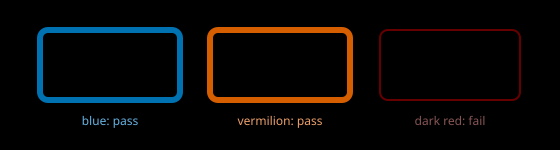

# Accessibility: analysis

Interpretation for Astrolith. Facts in [research](./research.md).

## Contrast on black

### Contrast on black

Black is the background for almost everything, which simplifies one side
of every ratio and sharpens the other: every tint, line, icon, and numeral
is measured against near-black in linear luminance [ACC-S001] [ACC-S002].
Body and meter numerals hold 4.5:1; large numerals, icons, fills, reticles,
sticks, and required chart lines hold 3:1 adjacent [ACC-S001] [ACC-S002]
[ACC-S003]. Thin plus faint fails twice, so the line-weight floor from
[foundations](../../foundations/documents/README.md) and the ratio floor
are one combined rule, not two. Dark red markers and red text are the
known failure: protanopes read dark red as near-black even when
trichromats see the hue clearly [ACC-S008].

*Figure 1. Blue and vermilion hold luminance on black; dark red does
not, even before thinning.*

## Colour-blind-safe tints

The categorical palette must survive red-green deficiency, the common
case in any audience [ACC-S007]. That rules out red-green-only state
coding for hull, heat, hazards, and portal states (C1 and C2 in the
[topic critique](../../documents/critique.md)). The safe anchor is
blue-vermilion (Wong) or the Tol bright and vibrant families, built on
the intact blue-yellow axis with luminance separation [ACC-S009]
[ACC-S010]. Every nominal distinction keeps shape plus label plus
brightness redundancy per SC 1.4.1 [ACC-S006]: a hazard is a spiked
silhouette with a label and a brightness step, never a red tint alone.

## Motion-sensitivity options

Dive zoom, starfield parallax, screen shake, bob, sway, and blur are all
interaction-triggered motion and must be disableable with an in-game
toggle that honours the operating-system Reduce Motion setting
[ACC-S011]. The comfortable default keeps the camera player-controlled,
holds the horizon, avoids acceleration and fast fly-pasts, and offers an
opaque backing behind text over moving scenes [ACC-S011]. Field of view
and sensitivity need settings, not hard-coded values, because the wrong
field of view on a small screen at close distance causes sickness on its
own. Reduced motion substitutes shortened or instant transitions with
context retained (see
[motion](../../motion/documents/README.md)), never a stripped state that
loses the player's place.

## Open questions

- Device-measured ratios for every tint at its drawn weight are missing.
- CVD participant proofing has not been scheduled.
- The exact reduced-motion substitution per transition (cut versus short
  fade) is a specification choice.

## References

- [ACC-S001](./sources.md#acc-s001--contrast-minimum) through
  [ACC-S011](./sources.md#acc-s011--motion-sensitivity)
