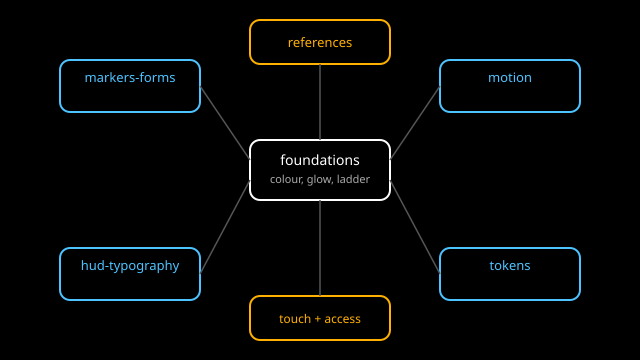

# Design system

Scope: the visual and interaction language of Astrolith as a luminous
abstract instrument. This topic records how the game looks, moves, reads,
and handles on a phone: colour and glow, marker forms, motion, HUD and
type, touch input, accessibility, code tokens, and stylistic references.
It is a design reference, not a decision record. Frozen rules stay in
`docs/`; per-level descriptive content stays in the universe topic; camera
research stays in the navigation topic.

Overview: Astrolith shows cosmic levels L1 to L9 as glowing points, lines,
and outlines only, with per-class tints, emissive billboards, bloom, and a
filmic tonemap. Surfaces, vessel, and hazards are flat two-tone
silhouettes with unlit fills. The HUD carries a scale bar, a level label,
a distance readout, and four meters (fuel, oxygen, hull, heat). Touch is
the design target: tap to target, pinch to dive, stick or tilt to evade,
one thumb for the spine. The tokens subtopic records how these choices are
written as named Rust constants and kept in sync with
`crates/universe-render/src/style.rs` (read-only reference; this topic
never edits code).

This topic separates facts from interpretation. Each subtopic holds
`research.md` (external facts with source identifiers), `analysis.md`
(what the facts mean for Astrolith), `recommendations.md` (what to do),
and `sources.md` (source records). Where research contradicts or questions
`drafts/game-style.md` or an ADR, the concern is recorded in
[critique.md](./critique.md) with the exact draft line or ADR quoted. The
draft and the ADRs are never edited from here.

## Subtopics

| Subtopic | Covers |
|---|---|
| [Foundations](../foundations/documents/README.md) | Colour, light and glow, line weight and point size, brightness ladder |
| [Markers and forms](../markers-and-forms/documents/README.md) | Points, rings, outlines, portal versus population, two-tone silhouettes |
| [Motion](../motion/documents/README.md) | Fades by angular size, camera easing, transition timing, continuity |
| [HUD and typography](../hud-and-typography/documents/README.md) | Scale bar, level label, four meters, type and numerals, minimal chrome |
| [Touch and input](../touch-and-input/documents/README.md) | Tap targets, pinch to dive, stick or tilt to evade, one-thumb play, safe areas |
| [Accessibility](../accessibility/documents/README.md) | Contrast on black, colour-blind-safe tints, motion-sensitivity options |
| [Tokens](../tokens/documents/README.md) | Named values in code and sync with `style.rs` |
| [References](../references/documents/README.md) | Powers of Ten, Out There, Kingdom Two Crowns, FTL, mobile UI patterns |

## Images

Each subtopic holds its own diagrams in its `images/` folder. The
topic-level diagram below shows how the subtopics relate.

*Figure 1. How the eight subtopics relate. Foundations feed the visible
layers; touch and accessibility constrain every layer; references inform
the whole.*

## Related topics

- Parent index: [Guides](../../README.md).
- [Navigation](../../navigation/documents/README.md): camera motion,
  planet approach, transitions and hysteresis. Motion here cites it; it
  does not restate it.
- [Universe](../../universe/documents/README.md): per-level look,
  bridge and entry pages, lifetimes. Foundations and markers link to it;
  they do not duplicate per-level description.
- Read-only outside `guides/`: `drafts/game-style.md` (owner-chosen
  luminous abstract style), ADRs `0002`, `0015`, `0016`, `0017`, `0019`,
  and `crates/universe-render/src/style.rs` (current colour values).

## Documentation status

New topic, researched October 2026. Open questions and contradictions are
listed in [critique.md](./critique.md) and in each subtopic analysis.
Nothing here is a decision: numeric token values, timing budgets, and
palette choices are recommendations for a future specification and the
owner.
