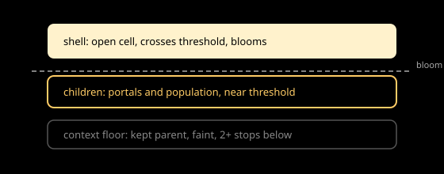

# Foundations

Scope: colour, light and glow, line weight and point size, and the
brightness ladder. This subtopic holds the physical and perceptual base
that every other design-system subtopic builds on: which hues identify
which class, how emissive values and bloom make them glow, how the filmic
tonemap and manual exposure shape them, how thick a line or large a point
must be to read on a phone, and how shell, children, and context floor
brightness steps keep hierarchy legible.

Overview: Astrolith renders cosmic levels as HDR emissive indicators on
black, viewed through bloom and the neutral TonyMcMapface filmic operator
with a manual exposure control. Per-class tints identify content; a
brightness ladder in exposure stops separates the open shell, its
children, and the kept parent context. Lines are gizmo strokes in pixels;
points are billboards or small markers with an explicit size token. See
[research](./research.md) for facts, [analysis](./analysis.md) for what
they mean here, [recommendations](./recommendations.md) for the proposed
tokens, and [sources](./sources.md) for records.

## Documents

| Document | Type | What it covers |
|---|---|---|
| [Research](./research.md) | research | sRGB versus linear, HDR emissive and bloom, tonemap choice, exposure stops, line and point legibility, token-format precedent |
| [Analysis](./analysis.md) | analysis | How the facts map onto the current `style.rs` values and the L1 to L9 look |
| [Recommendations](./recommendations.md) | recommendations | Proposed colour, glow, size, and ladder tokens and their sync rule |
| [Sources](./sources.md) | sources | `FOU-S001` to `FOU-S013` with claims supported and limits |
| [Critique](../../documents/critique.md) | critique | Topic-level contradictions with the draft and ADRs |

## Images

| Image | Shows | Linked from |
|---|---|---|
| [Brightness ladder](../images/brightness-ladder.svg) | Shell, children, and context floor as exposure stops above and below the bloom threshold | [Analysis](./analysis.md#brightness-ladder) |

*Figure 1. The brightness ladder. Only the shell crosses the bloom
threshold; children stay near it; context rests faint.*

## Related topics

- Parent topic: [Design system](../../documents/README.md).
- Sibling: [Markers and forms](../../markers-and-forms/documents/README.md)
  applies these tokens to points, rings, and outlines.
- Sibling: [Tokens](../../tokens/documents/README.md)
  records how the tokens are named in Rust and synced with `style.rs`.
- [Universe](../../../universe/documents/README.md): per-level look; this
  subtopic does not describe any single level.
- [Navigation](../../../navigation/documents/README.md): exposure and glow
  do not change dive math; motion timing lives there and in
  [Motion](../../motion/documents/README.md).
- Read-only code reference: `crates/universe-render/src/style.rs`
  (`point_color_for_level`, `sibling_color_for_level`, `tint_color`,
  `scaled`, `PICK_PIXELS`).

## Documentation status

Researched October 2026. Awaiting owner specification for numeric token
values. Known gaps: measured contrast of each tint at its drawn weight on
device OLED is not yet done; bloom threshold softness is at defaults and
unmeasured.
