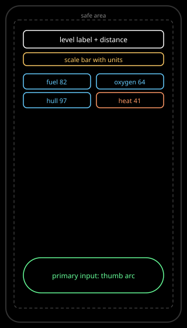

# HUD and typography: analysis

Interpretation for Astrolith. Facts in [research](./research.md).

## Layout

### Layout

Portrait first: status (level label, dynamic scale bar, distance readout)
top inside the safe area; four meters compact and persistent below status
or upper-side; primary dive and evade input in the bottom thumb arc. Top
corners are read-only by reach [HUD-S010]; burying the dodge control there
would force a grip shift mid-hazard. Landscape is a second layout, not a
stretched portrait. The current prototype scale HUD (level name, distance
order, rung-growing bar beside the window title, ADR 0015) is the seed;
the game HUD promotes it into the safe area and pairs it with meters.

*Figure 1. Status top, meters compact, input bottom. Nothing anchors to
physical screen edges.*

## Meters

Four meters (fuel, oxygen, hull, heat) are the survival state. Each meter
is icon plus number plus bar [HUD-S001] [HUD-S005]. Numbers carry the
precise value for route decisions ("can I afford this detour"); bars
carry the glanceable fraction; icons disambiguate under monochromacy and
at small sizes. Alert states add a glyph or the word LOW rather than
shifting hue alone, which also answers C1 in the
[topic critique](../../documents/critique.md). Out There proves three
meters plus permadeath tension works on phones; FTL proves ship systems
as UI works but its dense multi-panel desktop HUD does not transfer
(see [references](../../references/documents/README.md)).

## Scale and distance

The scale bar recomputes every level with labelled ground units (metres,
kilometres, astronomical units, light-years) in two to four divisions,
always paired with the level label and the distance readout [HUD-S006].
The bar answers "what does this span mean"; the label answers "where am
I"; the distance answers "how far to the target". No static bar, no
unlabelled decoration.

## Type

A three- to four-step scale only (for example level label, distance,
meter number, caption) with tabular figures on every changing number
[HUD-S007] [HUD-S008] [HUD-S009]. Minimum type token at or above the
11 pt equivalent; no live value in caption sizes or thin weights. White
or off-white semibold numerals on near-black, verified with an analyser
rather than by eye. Bevy text builds one atlas per face-plus-size handle,
so the token set stays small by construction (see
[tokens](../../tokens/documents/README.md)).

## Chrome budget

The universe is the picture; chrome is near zero [HUD-S004]. Persistent
chrome is status plus meters plus one primary input affordance. Everything
else (route detail, event text, settings) is transient and dismisses
faster than it enters (see
[motion](../../motion/documents/README.md)). This is the Kingdom
two-tone minimalism applied to overlay: keep the coin-purse reading, not
the kingdom-builder panels.

## Open questions

- Meter order and orientation (row versus column, heat placement for
  colour-blind safety) need a specification mock and a CVD proof.
- Portrait versus landscape variants are sketched but not laid out.
- Event and gamebook text styling (Out There lineage) awaits the gameplay
  notion.

## References

- [HUD-S001](./sources.md#hud-s001--hud-taxonomy) through
  [HUD-S010](./sources.md#hud-s010--mobile-layout-patterns)
