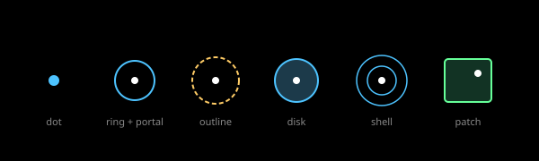

# Markers and forms: analysis

Interpretation for Astrolith. Facts in [research](./research.md).

## Form vocabulary

### Form vocabulary

ADR 0017 gives every marker a body (drawn at its own size and form) and,
for portals, a portal offset where the child cell opens. Forms include
dot, body, disk, spheroid, clump, ring, shell, orbit, arc, arm, thread,
sheet, patch, grid, rect, and box. Rendering maps each form to gizmo
primitives; markers below `FORM_ANGLE` draw dots at their own size, above
it their form, above preview angle their preview, and at open angle they
open.

The Bertin mapping [MRK-S001] [MRK-S002] says the form list is a nominal
code and must be read that way: disk versus ring versus shell tells the
player what kind of thing this is, never how important it is. Importance
is carried by size and brightness steps from
[foundations](../../foundations/documents/README.md). Portal versus
population is likewise nominal: same body grammar, plus a portal mark and
a label for portals, plain dots for populations that only show.

*Figure 1. Dots grow into rings, outlines, and drawn forms; portal marks
stay on or in the body.*

## Portal versus population

The portal and population split (ADR 0010, kept by ADR 0017) is a degree
of interest rule [MRK-S006]: far views show landmark portals, near views
admit populations. Semantic zoom [MRK-S005] justifies changing
representation with size rather than merely enlarging the dot. The
space-scale diagram [MRK-S007] is the tool to check the trajectory: a
dive path should cross each semantic boundary once, with the hysteresis
band from [MRK-S008] to [MRK-S010] preventing flicker at the edge.

## Selection and halo

Tap to target needs a visible selection state distinct from hover and
from the portal mark. The USGS point-depiction precedent (symbol plus
outline) and the Esri halo rule (effective but invisible) together say:
a thin outline ring plus a label halo, never a hue change alone, and the
halo must not become a second shape [MRK-S003]. Colour-only selection
would also fail SC 1.4.1 [MRK-S004].

## Two-tone silhouettes

Surfaces, vessel, and hazards as flat two-tone silhouettes with unlit
fills follow the Alto's, Thomas Was Alone, and Kingdom precedent: flat
fills scale without shimmer, read at tiny sizes, and cost the least on a
phone GPU [MRK-S011] [MRK-S012] [MRK-S013] [MRK-S014]. Two tones give one
lit edge and one shadow edge with no lighting model, matching the draft
line "flat two-tone silhouettes and simple fills" and ADR 0016 flat-tone
planet body. Hazard reads must differ by silhouette shape first (spikes,
arcs, wells) and tint second, so protanopes keep the distinction.

## Open questions

- Exact form per level (which rung uses ring versus shell versus grid) is
  a specification task with the universe topic.
- Hazard silhouette list awaits the gameplay notion; this topic must not
  invent hazards.
- Label halo widths at the line-weight floor need a device test.

## References

- [MRK-S001](./sources.md#mrk-s001--bertin-visual-variables) through
  [MRK-S014](./sources.md#mrk-s014--unity-unlit-shader)
