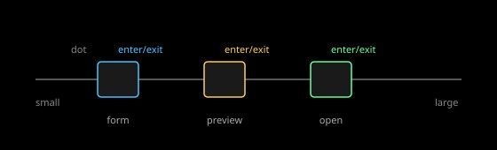

# Motion

Scope: fades by angular size, camera easing, transition timing, and
continuity across levels. This subtopic sets how things appear, move, and
persist as the player dives: which size gates trigger which
representation, which easing shapes flights, how long transitions last,
and what must never visibly pop.

Overview: Astrolith fades representations by angular size with hysteresis
so gates do not flicker, eases flights with an in-out curve that starts
and ends at rest, budgets durations by distance and kind (fast fades,
slower flights, exits faster than entrances), and holds the R7 continuity
rule that entering or leaving a dimension changes nothing on screen.
Camera math itself lives in the navigation topic; this subtopic holds the
feel and timing layer on top. See [research](./research.md),
[analysis](./analysis.md), [recommendations](./recommendations.md), and
[sources](./sources.md).

## Documents

| Document | Type | What it covers |
|---|---|---|
| [Research](./research.md) | research | Zoom-pan optimum, easing functions, Material and Apple timing, flyTo auto-duration, LOD fades, hysteresis |
| [Analysis](./analysis.md) | analysis | Angular gates, easing choice, duration budget, continuity against ADRs 0012, 0013, 0018, 0019 |
| [Recommendations](./recommendations.md) | recommendations | Gate, easing, timing, and continuity tokens and rules |
| [Sources](./sources.md) | sources | `MOT-S001` to `MOT-S010` with claims and limits |
| [Critique](../../documents/critique.md) | critique | Topic-level contradictions with the draft and ADRs |

## Images

| Image | Shows | Linked from |
|---|---|---|
| [Fade gates](../images/fade-gates.svg) | Dot, form, preview, and open thresholds with the hysteresis band | [Analysis](./analysis.md#gates) |

*Figure 1. Enter at the larger angle, exit at the smaller one. The band
between is retained state.*

## Related topics

- Parent topic: [Design system](../../documents/README.md).
- [Navigation](../../../navigation/documents/README.md): the canonical
  camera research (multi-scale camera, planet approach, transitions and
  hysteresis) and gap list G1 to G10 with requirements R1 to R12. This
  subtopic cites it and does not restate it.
- Siblings: [Foundations](../../foundations/documents/README.md) for the
  brightness side of fades;
  [Accessibility](../../accessibility/documents/README.md) for reduced
  motion.
- Read-only ADRs: `0012` (streaming), `0013` (navigation model), `0018`
  (destination room), `0019` (continuous planet-to-room camera).

## Documentation status

Researched October 2026. Numeric gate values and duration tokens are
recommendations; the specification sets them with owner-feel tuning in a
correction round (ADR 0019 anticipates this).
