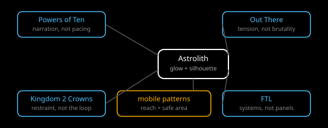

# References

Scope: Powers of Ten, Out There, Kingdom Two Crowns, FTL, plus mobile
game UI patterns: what to take from each and what not to. This subtopic
grounds taste in precedent so future choices cite evidence rather than
preference.

Overview: Powers of Ten gives scale narration and decade pacing as a
model, not a game rate. Out There gives resource-survival tension with
fuel, oxygen, and hull on phones. Kingdom Two Crowns gives one-input
minimalism with two-tone silhouettes. FTL gives ship systems as UI with
pausable real-time, minus its dense desktop panels. Mobile patterns give
thumb reach, safe-area discipline, and portrait-first layouts. See
[research](./research.md), [analysis](./analysis.md),
[recommendations](./recommendations.md), and [sources](./sources.md).

## Documents

| Document | Type | What it covers |
|---|---|---|
| [Research](./research.md) | research | Each reference with facts, take, and do-not-take |
| [Analysis](./analysis.md) | analysis | What the set means together for luminous abstract |
| [Recommendations](./recommendations.md) | recommendations | Borrowing rules per reference with validation |
| [Sources](./sources.md) | sources | `REF-S001` to `REF-S009` with claims and limits |
| [Critique](../../documents/critique.md) | critique | Topic-level contradictions with the draft and ADRs |

## Images

| Image | Shows | Linked from |
|---|---|---|
| [Reference map](../images/reference-map.svg) | Four references plus mobile patterns with take arrows into Astrolith | [Analysis](./analysis.md#synthesis) |

*Figure 1. Take the narration, the tension, the minimalism, and the
systems; leave the film rate, the brutality, the builder loop, and the
dense panels.*

## Related topics

- Parent topic: [Design system](../../documents/README.md).
- Siblings: every subtopic cites at least one reference; HUD cites Out
  There and FTL, motion cites Powers of Ten, markers cite Kingdom.
- [Universe](../../../universe/documents/README.md): Powers of Ten also
  appears in navigation research; this subtopic does not restate camera
  math.
- Read-only draft line: "References: the current build, Powers of Ten,
  Out There, Kingdom Two Crowns, FTL."

## Documentation status

Researched October 2026. No playtest with the cited games on phones was
run; takes are from published descriptions and reviews, noted per source.
