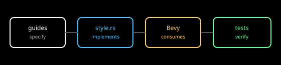

# Tokens: analysis

Interpretation for Astrolith. Facts in [research](./research.md).

## Tiers

Three tiers map directly onto the existing code shape. Reference holds
raw palette primitives (per-class tints as sRGB authoring values).
Semantic holds role decisions (`shell`, `child`, `context-floor`,
`outline`, `focus`, meter roles) aliasing reference entries. Component
holds element assignments (gizmo width for markers, fill pair for vessel,
bar and track for meters, font size per HUD role, duration per transition
kind). The tiers follow Material [TOK-S003] with W3C name, value, type,
and description shape [TOK-S001] and Apple purpose-first naming [TOK-S004].

## Naming

Names are role-first, stable, and dot-joined in prose (`colour.shell`,
`size.line.floor`, `time.fade.short`), rendered as Rust `SCREAMING_SNAKE`
constants in code. Names never encode values (no `BLUE_66CCFF` as a role);
values change, names do not [TOK-S003] [TOK-S004]. Aliases are explicit
constants, not copies: `FOCUS` aliases the shell tint so a palette fix
propagates [TOK-S001] [TOK-S002].

## Bevy mapping

Each tier maps to typed constants the renderer already consumes: `Color`
sRGB authoring values converted to linear at use; `f32` emissive
strengths above 1.0 for the ladder; `ev100` exposure with presets;
`TonyMcMapface` as the fixed operator; pixel widths and world sizes for
lines and points; pixel font sizes in a small frozen set to bound atlas
growth; millisecond durations per transition kind [TOK-S005] [TOK-S006]
[TOK-S007] [TOK-S008] [TOK-S009].

## Sync direction

### Sync direction

Specification flows one way: this topic proposes names, types, values,
and descriptions; `style.rs` implements them once; tests and screenshots
verify. The guides never edit code and the code never redefines a token
under a second name. Drift is caught by naming tests (every semantic role
resolves), value tests (ladders ordered, floors held), and visual proof
(screenshots at minimum and maximum exposure). The Style Dictionary
single-dictionary plus transform precedent [TOK-S002] is honoured
manually: the guides are the dictionary, the constants file is the
single transform output.

*Figure 1. Guides specify; `style.rs` implements; tests and screenshots
verify. No reverse flow.*

## Open questions

- Exact constant names await the specification; this topic proposes the
  shape, not the spelling.
- Whether timing tokens live beside colour tokens in one file or a
  second timing file is a code-organisation choice for the implementer.
- Atlas-bounding needs a Bevy-build check once the font set freezes.

## References

- [TOK-S001](./sources.md#tok-s001--w3c-design-tokens-format) through
  [TOK-S009](./sources.md#tok-s009--bevy-text)
