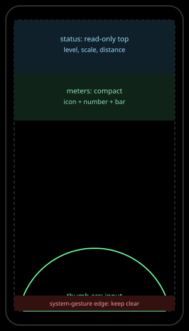

# Touch and input

Scope: tap targets, pinch to dive, a virtual stick or tilt to evade,
one-thumb play, and safe areas. This subtopic defines how the game
handles on a phone: how big a target must be, which gestures do what,
what the alternatives are, where controls may sit, and what stays clear
of the operating system.

Overview: tap targets pad to 48 dp (44 pt on iOS) with a 24 px floor and
spacing fallback; pinch to dive is the expected zoom gesture with a
single-pointer alternative; tilt to evade always has a virtual-stick
alternative and either input alone suffices; frequent input lives in the
bottom thumb arc inside the safe area, clear of system-gesture zones;
status stays top. Desktop mouse and keyboard remain for development and
testing only. See [research](./research.md),
[analysis](./analysis.md), [recommendations](./recommendations.md), and
[sources](./sources.md).

## Documents

| Document | Type | What it covers |
|---|---|---|
| [Research](./research.md) | research | Apple and Material target sizes, safe areas and insets, gesture norms, WCAG pointer and motion rules |
| [Analysis](./analysis.md) | analysis | Target padding, gesture assignments, one-thumb layout, desktop versus touch split |
| [Recommendations](./recommendations.md) | recommendations | Target, gesture, layout, and safe-area rules with validation |
| [Sources](./sources.md) | sources | `TCH-S001` to `TCH-S009` with claims and limits |
| [Critique](../../documents/critique.md) | critique | Topic-level contradictions with the draft and ADRs |

## Images

| Image | Shows | Linked from |
|---|---|---|
| [Touch zones](../images/touch-zones.svg) | Thumb arc, safe area, and system-gesture edges | [Analysis](./analysis.md#layout) |

*Figure 1. Input bottom, status top, system edges clear. Targets pad
beyond their visible size.*

## Related topics

- Parent topic: [Design system](../../documents/README.md).
- Siblings: [HUD and typography](../../hud-and-typography/documents/README.md)
  for the overlay that shares the safe area;
  [Accessibility](../../accessibility/documents/README.md) for target and
  motion minima;
  [Motion](../../motion/documents/README.md) for flight timing that
  gestures trigger.
- Read-only draft lines: "Tap to target, pinch to dive in and out, tilt
  or a virtual stick to evade during transit. One thumb must be enough
  for the spine." Desktop controls stay for development and testing.

## Documentation status

Researched October 2026. Gesture tuning (pinch sensitivity, stick gain,
tilt dead zone) and the overlap-cycling rule are specification tasks.
