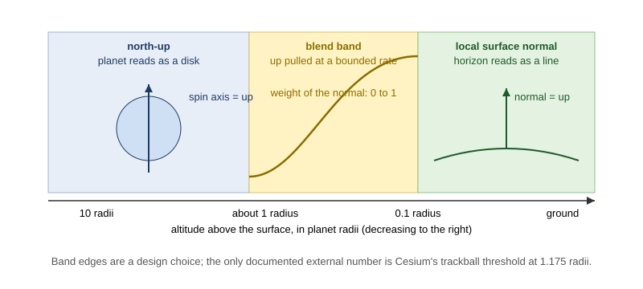

# Planet approach: from orbit to the ground

Document type: research. Facts carry a source identifier; paragraphs
marked *Interpretation* or *Relevance to Astrolith* are the author's
reading. Recommendations live in the [analysis](./analysis.md). Sources
are in [sources.md](./sources.md).

Scope: what a camera does when it approaches and lands on a planet: which
way is up, how behaviour changes with altitude, how fly-to flights are
shaped, how roll stays continuous when the reference frame turns, and what
games and globes do at atmosphere entry. Scale precision and speed laws
are in [multi-scale-camera.md](./multi-scale-camera.md); gates and fades
are in [transitions-and-hysteresis.md](./transitions-and-hysteresis.md).

## 1. The up-vector policy

A camera orientation is a position plus an orthonormal basis: in CesiumJS
`view`, `up`, and `right = view x up` [NAV-S011]. The question on a
planet is which world direction `up` should follow:

| Policy | Definition | Where it is used | Source |
|---|---|---|---|
| North-up (globe) | Screen-up is the planet's spin axis projected into the view; the globe looks like a map. | Google Earth default start view; `n` resets north-up, `u` resets top-down tilt. | [NAV-S013][NAV-S014] |
| Local normal (ENU) | Screen-up follows the ellipsoid surface normal at the camera or at the target; heading, pitch, and roll are measured against East, North, Up there. | CesiumJS `flyTo` orientation, `lookAtTransform(eastNorthUpToFixedFrame(...))`, `maximumTiltAngle` "relative to the ellipsoid normal". | [NAV-S010][NAV-S012] |
| Constrained axis | The camera may not rotate past a chosen axis; used to keep a globe from turning upside down. | CesiumJS `constrainedAxis`; KSP "the flight camera is no longer able to go upside down". | [NAV-S011][NAV-S019] |
| Free roll | No up reference; the camera carries its own orientation (spacecraft). | Gaia Sky spacecraft mode with an attitude indicator and a "stabilise" control for yaw, pitch and roll. | [NAV-S016] |

Google Earth also changes *tilt* with altitude by default: zooming in
auto-tilts the view away from straight down to show 3D buildings, and an
option "Do not automatically tilt while zooming" turns it off [NAV-S015];
the keyboard shortcut table lists "Zoom plus automatic tilt" as its own
gesture [NAV-S013]. *Interpretation:* the globe view is nadir-down and
north-up; the near-ground view is oblique and heading-free. Google Earth
blends between them by altitude rather than switching, and the 2013 user
complaints in [NAV-S015] show that an automatic tilt the user did not ask
for is felt as loss of control.

*Figure 1. Up-vector policy by altitude as practised by globe viewers:
north-up (spin axis) while the planet is a disk, local surface normal
once the horizon is a line, and a blend band between. The band widths are
illustrative, not measured.*

## 2. Altitude-gated behaviour (CesiumJS)

CesiumJS switches controller behaviour by camera height, with defaults
for Earth that scale with the ellipsoid radius on other bodies [NAV-S010]:

| Setting | Default (Earth) | Scale factor | Meaning |
|---|---|---|---|
| `minimumTrackBallHeight` | 7,500,000 m | 1.175 x minimum radius | Below this, drags that start on the sky become free look instead of rotating the globe like a trackball. |
| `minimumPickingTerrainHeight` | 150,000 m | 0.025 x minimum radius | Below this, picking uses terrain or scene content instead of the ellipsoid. |
| `minimumCollisionTerrainHeight` | 15,000 m | 0.0025 x minimum radius | Below this, the camera is tested for collision with terrain. |
| `minimumPickingTerrainDistanceWithInertia` | 4,000 m | 0.00063 x minimum radius | Below this, terrain collision is tested during inertial zoom. |
| `minimumZoomDistance` | 1 m | none | Closest camera magnitude when zooming. |
| `enableCollisionDetection` | true | none | Also used with 3D Tiles to keep the camera above a tileset surface. |

Inertia defaults are 0.9 for spin and translate and 0.8 for zoom;
`maximumMovementRatio` 0.1 bounds any input to a tenth of the window per
frame [NAV-S010].

*Interpretation:* the gates are ratios of the planet radius (1.2, 0.025,
0.0025, 0.0006), which is exactly the kind of scale-relative threshold a
nested-cell viewer can express in cell units.

## 3. Fly-to and land

- CesiumJS `flyTo`: a flight from the current pose to a destination with
  an auto-computed duration when none is given, a `maximumHeight` at the
  peak, a `pitchAdjustHeight` above which the camera pitches down to keep
  Earth in view, and an easing function; the destination orientation can
  be given as heading, pitch, roll relative to ENU [NAV-S011][NAV-S012].
- SpaceEngine: `G` goes to the selected object, `G` twice goes faster,
  and `Shift-G` or `Ctrl-G` *lands* on a selected planet [NAV-S017].
- Celestia: `G` travels toward the selection; "if you press G again,
  you'll approach the star even closer" [NAV-S018].
- Gaia Sky: focus mode locks motion to a focus object (optionally locking
  relative position and orientation so the camera rotates with the
  object); game mode can add gravity "so that when the camera is closer to
  a planet than a certain threshold, gravity will pull it to the ground"
  [NAV-S016].
- Google Earth: zooming in auto-tilts by default [NAV-S015].

*Interpretation:* every surveyed tool separates "go to" (an animated
flight that ends at a standoff distance) from "land" (a second action, or
a gravity threshold). None lands by zooming alone.

## 4. Roll continuity when the reference frame turns

### 4.1 The look-at degeneracy

A look-at builds `right = normalize(forward x up)`. When `forward` is
parallel to `up` the cross product vanishes and the roll is undefined.
Bevy 0.19.1 documents its fallback: for `look_to` and `looking_at`, "if
direction is parallel with up, an orthogonal vector is used as the
'right' direction" [NAV-S029]. The call never fails, but the roll it
chooses near the degenerate direction is arbitrary, so a camera that
looks nearly straight down a planet's axis with north-up can spin.

Astrolith's own frame code shows the same pattern: `basis_from_up` in
`universe-core/src/frame.rs` picks a reference vector of +Y when the up
vector's Y component is below 0.9 in magnitude and +Z otherwise, then
crosses to get the X axis. The switch at 0.9 is a discrete change of the
basis (and therefore of the child cell's heading) as a function of the
patch normal.

### 4.2 Carrying the up vector

The documented alternatives to recomputing `up` from a global reference
every frame are:

- Constrain rotation instead of recomputing: CesiumJS `constrainedAxis`
  keeps the camera from rotating past an axis [NAV-S011]; KSP keeps its
  flight camera from going upside down [NAV-S019].
- Lock to a moving frame: Cesium's `lookAtTransform` fixes the camera's
  reference frame to a local ENU frame so heading and pitch are measured
  there [NAV-S012]; Gaia Sky's "lock orientation" rotates the camera with
  its focus object [NAV-S016]; KSP's orbital camera "will no longer change
  orientations when switching spheres of influence" [NAV-S019].
- Keep a free attitude with explicit stabilization: Gaia Sky spacecraft
  mode [NAV-S016].

*Interpretation (standard practice, no single source):* the common
implementation of a continuous up is to carry the previous frame's up
vector, project it onto the plane perpendicular to the new forward, and
only *pull* it toward the policy up (north or local normal) at a bounded
angular rate. This keeps the roll continuous through the look-at
degeneracy because the carried up is never parallel to forward unless the
camera itself turned that way. The analysis document turns this into a
candidate requirement.

## 5. Atmosphere entry and ground handoff in globes

- Google Earth: the straight-down globe becomes an oblique view by
  auto-tilt as the user zooms in [NAV-S015]; terrain can be exaggerated
  between 0.01 and 3, with 1.5 called natural [NAV-S014].
- CesiumJS: terrain collision starts 15 km up; picking switches from the
  ellipsoid to terrain at 150 km; the globe is a quadtree HLOD streamed
  out of core [NAV-S004][NAV-S010].
- Outerra: one depth pass from grass to mountains tens of kilometres away
  (logarithmic depth), the engine that the realism review already cites
  as the planet-rendering reference [NAV-S005][NAV-S006].
- SpaceEngine: landing is an explicit command [NAV-S017]; the manual
  describes landscape LOD and per-frame tile loading limits but not the
  camera path.

## 6. Games

| Game | What the primary source supports | What is not claimed |
|---|---|---|
| Kerbal Space Program | Floating origin in both the local scene and scaled space; double-precision flight math; scaled-space handoff with tuned thresholds near planets; camera cannot go upside down; orbital camera keeps orientation across sphere-of-influence changes [NAV-S019]. | How the local/scaled handoff is scheduled during atmospheric entry. |
| No Man's Sky | Seamless transition "from space down to an interactive and populated terrain" by continuous voxel generation, polygonization, texturing, and population [NAV-S021]. | Any camera-specific rule; only the talk abstract was read. |
| Star Citizen | 64-bit world coordinates with camera-relative rendering and ship-local physics grids [NAV-S020]. | Atmosphere-entry camera behaviour. |
| Elite Dangerous, Outer Wilds | No primary engineering source was found during this run. | Nothing; they are listed only so a later refresh knows the gap. |

## 7. Relevance to Astrolith (interpretation)

Read from `universe-core` and `universe-render` at commit `1364571`:

- The camera is built every frame as
  `Transform::from_translation(position).looking_at(look, Vec3::Y)` in
  open-cell units (`camera.rs`). Up is the open cell's +Y, always.
- Opening an L10 region portal rotates the child frame so the region's
  +Y is the patch normal (`Universe::open` in `nav.rs`, using the
  `Form::Patch { normal }`; `frame.rs` `basis_from_up`). Below L11 every
  further open uses the identity up, so the camera's +Y stays the region
  normal from L11 to L14.
- Consequence: on the L10 to L11 open, screen-up changes *instantly* from
  the planet's +Y to the patch normal. For a patch on the equator that is
  a 90 degree roll in one frame; for a patch near the south pole it is
  close to 180 degrees, and the `basis_from_up` reference switch at 0.9
  adds a heading jump. The look point is re-locked along the travel ray
  (#403) so the *direction* is continuous; the *roll* is not. This is the
  strongest single candidate for "feels bad from L10 to L11" and is
  classified as a likely defect from code reading, not yet measured.
- Above L10 nothing turns, so the same mechanism cannot explain the L11
  to L14 legs; those are covered by the gates and speed law in
  [transitions-and-hysteresis.md](./transitions-and-hysteresis.md) and
  [multi-scale-camera.md](./multi-scale-camera.md#43-relevance-to-astrolith-interpretation).
- The planet body is a sphere of radius 0.35 cells at L10
  (`PLANET_RADIUS_CELL`); the region portal sits on it with radius
  `ratio/2 = 0.019` cells. Dive speed is measured to the portal sphere,
  not to the planet surface, so the camera can be moving at a speed set
  by a 2 percent-of-cell target while the planet fills the view.
- There is no altitude-gated behaviour: no tilt policy, no collision with
  the planet sphere outside the dive line, no minimum standoff except the
  settle rule (`SETTLE_DIVES = 8` dives after entry during which the cell
  cannot close) and the horizon rule (`HORIZON_SECS = 5`).

## 8. Open questions

- Should screen-up blend from the planet axis to the local normal across
  an altitude band (Figure 1), or be carried and pulled at a bounded rate
  (section 4.2), or both?
- Which altitude, in planet radii, should start the blend: Cesium's
  trackball threshold (1.175 radii) is the only documented number.
- Is "land" a separate action in Astrolith, or does the dive into the
  region portal count as landing?

## References

- [NAV-S004](./sources.md#nav-s004--graphics-tech-in-cesium-the-graphics-stack)
- [NAV-S005](./sources.md#nav-s005--logarithmic-depth-buffer-outerra)
- [NAV-S006](./sources.md#nav-s006--maximizing-depth-buffer-range-and-precision-outerra)
- [NAV-S010](./sources.md#nav-s010--screenspacecameracontroller-cesiumjs-reference)
- [NAV-S011](./sources.md#nav-s011--camera-cesiumjs-reference)
- [NAV-S012](./sources.md#nav-s012--control-the-camera-cesiumjs-tutorial)
- [NAV-S013](./sources.md#nav-s013--use-keyboard-shortcuts-to-navigate-in-google-earth)
- [NAV-S014](./sources.md#nav-s014--explore-the-earth-on-your-computer)
- [NAV-S015](./sources.md#nav-s015--why-does-google-earth-keep-tilting-the-view-when-i-zoom-in)
- [NAV-S016](./sources.md#nav-s016--camera-settings-gaia-sky-documentation)
- [NAV-S017](./sources.md#nav-s017--spaceengine-faq)
- [NAV-S018](./sources.md#nav-s018--celestia-readme)
- [NAV-S019](./sources.md#nav-s019--kerbal-space-program-readme-and-changelog-0170)
- [NAV-S020](./sources.md#nav-s020--monthly-studio-report-may-2015-star-citizen)
- [NAV-S021](./sources.md#nav-s021--continuous-world-generation-in-no-mans-sky-gdc-2017)
- [NAV-S029](./sources.md#nav-s029--transform-bevy-0191-api-documentation)
