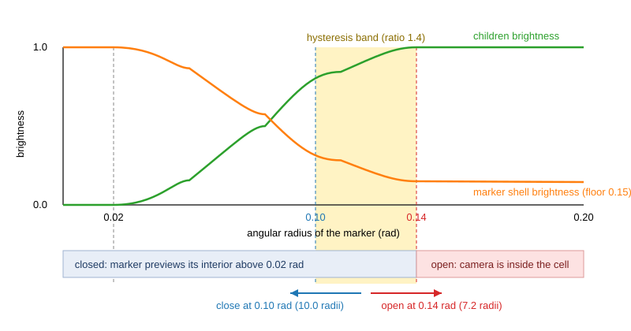

# Transitions and hysteresis: changing level without a pop

Document type: research with an analysis section. Facts carry a source
identifier; sections marked *Interpretation* or *Relevance to Astrolith*
are the author's reading. Recommendations live in the
[analysis](./analysis.md). Sources are in [sources.md](./sources.md).

Scope: how level-of-detail and reference-frame transitions are made
invisible: two-threshold (hysteresis) gates, fading by angular size
instead of switching, the continuity invariants a frame change must
keep, easing and turn-rate limits for the look direction, and prior art
in zoomable user interfaces and terrain LOD.

## 1. Hysteresis: why open and close need two thresholds

A Schmitt trigger is a comparator with hysteresis: the output goes high
when the input rises above one threshold and low when it falls below a
different, lower threshold; between the two the output keeps its state.
A noisy signal near one threshold "can cause only one switch in output
value, after which it would have to move beyond the other threshold in
order to cause another switch" [NAV-S028].

The same two-threshold rule appears wherever a discrete state depends on
a continuous distance:

- Kerbal Space Program tuned "the rotating reference frame thresholds
  when nearing planets, to reduce terrain mesh jitter" and the scaled-space
  scale "to make the terrain/scaled transition more seamless" [NAV-S019].
- CesiumJS switches controller behaviour at fixed heights (trackball to
  free look, ellipsoid to terrain picking, collision on) [NAV-S010]; the
  reference does not document a hysteresis band on those heights.
- Unity LOD levels switch at screen-height percentages and optionally
  cross-fade over a "Fade Transition Width" fraction of the level's range
  [NAV-S027].

### 1.1 Astrolith's gates (facts from the ladder and code)

The ladder fixes three angular-radius thresholds (R6, R7): preview at
`PREVIEW_ANGLE = 0.02` rad, open at `OPEN_ANGLE = 0.14` rad, close at
`CLOSE_ANGLE = 0.10` rad. The open and close gates form a Schmitt
trigger on angular radius with a band of 0.04 rad, a ratio of 1.4.

In distance terms (angular radius `θ = asin(r / d)` for a sphere of
radius `r` at distance `d`):

| Event | Angular radius | Distance to the marker centre | In child-cell units after the open |
|---|---|---|---|
| Preview starts | 0.02 rad | `50.0 r` | 25.0 cells |
| Open | 0.14 rad | `7.17 r` | 3.58 cells |
| Close | 0.10 rad | `10.0 r` | 5.01 cells |

So after an open the camera must retreat by a factor 1.40 (0.146 decades)
before the cell closes. At `KEY_RATE = 1.5` that is about 0.22 s of held
key; `SETTLE_DIVES = 8` additionally forbids closing during the first
eight dive steps after entry, and `MIN_HORIZON_DIST = 4.0` cells is set
"below the angular close distance (`0.5 / sin(CLOSE_ANGLE)` is just over
5.0)" so slow flight still sheds exited cells (`nav.rs` doc comments).

*Figure 1. Astrolith's gates on the angular-radius axis. Preview begins at
0.02 rad; the marker shell dims to its 0.15 floor and the children
brighten to 1 over 0.02-0.14 rad; the open fires at 0.14 rad and the
close only at 0.10 rad, so the band between is a memory. Curves follow
the ladder R7 description; the diagram is schematic.*

*Interpretation:* a 1.4 ratio is a narrow band for a camera whose speed
is proportional to distance. The settle counter exists because the band
alone was not enough (#403), which is itself evidence that the band is
thin. The threshold ratio is a tuning value the specification can own.

## 2. Fading by angular size instead of switching on level

### 2.1 Prior art

- Geomorphing: Hoppe's view-dependent progressive meshes create runtime
  geomorphs that "eliminate 'popping' artifacts by smoothly interpolating
  geometry", giving visually smooth terrain flyovers at 72 frames per
  second [NAV-S026].
- Cross-fade LOD: Unity's LOD Group offers Fade Mode None, Cross Fade
  (dithered blend between the current and next LOD), and SpeedTree vertex
  interpolation; the fade either spans a width of the LOD range or runs
  for a fixed time after the threshold [NAV-S027].
- Hierarchical LOD streaming: CesiumJS renders the globe from a
  geographic quadtree with out-of-core HLOD, choosing tiles per view
  [NAV-S004]. Whether Cesium or Google Earth cross-fade tiles was not
  established from a primary source in this run.

### 2.2 Astrolith's fade (facts from the ladder)

Ladder R7: every marker whose angular radius exceeds 0.02 rad draws its
interior inside itself at the exact positions the open cell will show;
the marker's dot fades from full brightness at 0.02 rad to a 0.15 floor
at 0.14 rad while its children brighten from 0 to 1 over the same range;
past the open angle the dot eases to zero. "Both curves are continuous,
so the open and close events ... are pure origin shifts." The headless
`--verify` run samples the curves at the three thresholds and prints a
brightness-continuity summary (`frame.rs`, `headless.rs`).

*Interpretation:* this is the Unity cross-fade with a width equal to the
whole preview band, keyed on angular size rather than screen height, and
with the continuity checked by a test. It is the strongest part of the
current design and the specification should keep it.

## 3. Continuity invariants at a frame change

The ladder states the invariant for *drawn content*: "Entering or leaving
a dimension changes nothing on screen" (R7), and the open and close are
exact inverses (origin shift with the stored portal position, R10). The
verify line records the preview position error per opening.

*Interpretation:* a complete list of what the eye can notice at a frame
change is longer than "what is drawn where". Candidate invariants, each
testable in the headless replay:

| Invariant | Holds today? (code reading) | Why it matters |
|---|---|---|
| World-space position of every drawn point is identical before and after the open or close. | Yes by construction (R7, R10, verify position error). | The classic pop. |
| Brightness of every drawn point is continuous through the open or close. | Yes (R7 curves, verified). | A flash reads as a cut. |
| Camera look direction is continuous. | Yes: the eased look point is "untouched" at entry and exit and the target is re-locked along the travel ray (#403). | A snap of the view is a cut. |
| Camera up (roll) is continuous. | No at L10 to L11: the child frame's +Y becomes the patch normal and the camera uses +Y as up (see [planet-approach.md](./planet-approach.md#7-relevance-to-astrolith-interpretation)). | The horizon spins. |
| Linear speed is continuous. | Approximately: the gap `h` is re-measured to the new target in the new cell; because the open happens at 7.17 marker radii and the new target lies within half a child cell of the centre, the new gap differs from the old by at most tens of percent. | A speed step feels like a jolt. |
| Angular velocity of the look direction is bounded. | Not bounded explicitly; the look lerp has rate 6 per second (time constant 0.17 s), the re-lock chooses the portal ahead so the swing is usually small. | Fast swings are the perceived velocity in the van Wijk metric [NAV-S022]. |
| Near plane is continuous. | Yes: it follows the gap, which is approximately continuous. | Clipping flicker. |

## 4. Easing and turn-rate limits

Facts:

- CesiumJS limits inputs to a fraction of the window per frame
  (`maximumMovementRatio` 0.1) and coasts with inertia (0.9 spin and
  translate, 0.8 zoom); flights use an easing function over a duration
  computed from the distance [NAV-S010][NAV-S011][NAV-S012].
- Gaia Sky offers a cinematic behaviour with "acceleration and momentum,
  leading to very smooth transitions" and a default responsive behaviour
  with minimal momentum [NAV-S016].
- Van Wijk and Nuij define smoothness and efficiency on perceived
  velocity and solve for the path analytically [NAV-S022].
- Astrolith eases the look point with `lerp(desired, 1 - exp(-6 dt))`
  each frame (`camera.rs`), which is a first-order filter with a 0.17 s
  time constant; there is no cap on angular rate.

*Interpretation:* a first-order lerp is smooth but not rate-bounded: a
90 degree retarget produces a 90 degree swing with most of it inside the
first 0.3 s. A rate limit (degrees per second) or a slerp with a maximum
step keeps the perceived velocity bounded regardless of how far the new
target is. Both are standard; neither is sourced here beyond the general
metric in [NAV-S022].

## 5. Zoomable user interfaces

- Pad (Perlin and Fox, 1993) introduced the infinite zoomable surface and
  semantic zooming: an object's representation changes with scale rather
  than merely shrinking [NAV-S025].
- Pad++ (Bederson and Hollan, 1994) made it a general interface toolkit
  with portals and explored "alternate interface physics" [NAV-S024].
- Space-scale diagrams (Furnas and Bederson, 1995) plot space against
  scale so that zoom and pan sequences become paths, the tool on which
  the van Wijk and Nuij optimum is defined [NAV-S023][NAV-S022].
- Prezi is a well-known commercial ZUI; it was not researched here.

*Relevance to Astrolith (interpretation):* the dive is a ZUI in three
dimensions. Astrolith's body-and-portal markers (ladder R10: a marker is
drawn as a disk, ring, patch, box, or dot at its own size with the portal
on it) are semantic zoom: the same object is a dot at 0.004 rad, a form at
preview size, and a cell once opened. The ZUI literature's main lesson
for the camera is that the *path* through space-scale, not the content,
decides whether a transition feels continuous.

## 6. Relevance to Astrolith: the L10 to L14 sequence (interpretation)

Reading the code at commit `1364571`, one open from level `L` to `L+1`
runs in this order:

1. The targeted portal crosses 0.02 rad: its interior is drawn inside the
   marker; the dot starts to dim.
2. Between 0.02 and 0.14 rad the children brighten; the dot reaches its
   0.15 floor.
3. At 0.14 rad `Universe::open` runs: the path descends, the origin shifts
   to the portal, and at L10 only, the child frame is rotated so that +Y
   is the patch normal.
4. `sync_camera` rebuilds the transform with `Vec3::Y` up in the new frame
   (roll changes instantly at L10 to L11).
5. The target is re-locked along the travel ray; if nothing lies ahead
   the dive glides until a marker is locked (#403).
6. For eight dive steps the cell cannot close; after that it closes at
   0.10 rad of the cell's own shell.

Steps 1-3 and 6 are continuous or protected. Step 4 is the roll
discontinuity at the planet. Step 5 can change `h`, and therefore speed,
by the offset of the new target inside the child cell. L11 to L12 and
L12 to L13 add two invisible magnification milestones each (ladder gap
note, R11), which are exact no-ops on the path and cannot pop by
construction; L13 to L14 has none.

Classification of observations:

- Confirmed defect candidate (from code reading, not measured): roll step
  at L10 to L11.
- Likely risk: the 1.4 open/close ratio combined with speed proportional
  to distance; mitigated by the settle counter.
- Likely risk: unbounded angular rate of the look retarget.
- Design trade-off: measuring `h` to the portal sphere (consistent speed
  per decade) versus to the planet surface (consistent perceived speed).
- Missing information: no measurement of actual roll, angular rate, or
  speed steps across the L10 to L14 journey exists; the headless verify
  prints position and brightness continuity only.

## 7. Open questions

- What open/close ratio (today 1.4) and what settle rule does the
  specification want, and should they be expressed in decades of distance
  rather than radians?
- Should the verify line gain roll, angular-rate, and speed continuity
  columns so the invariants in section 3 become golden-tested?
- Should the preview band (0.02-0.14 rad) and the fade curves stay as
  they are? The research found nothing better than a cross-fade keyed on
  angular size.

## References

- [NAV-S004](./sources.md#nav-s004--graphics-tech-in-cesium-the-graphics-stack)
- [NAV-S010](./sources.md#nav-s010--screenspacecameracontroller-cesiumjs-reference)
- [NAV-S011](./sources.md#nav-s011--camera-cesiumjs-reference)
- [NAV-S012](./sources.md#nav-s012--control-the-camera-cesiumjs-tutorial)
- [NAV-S016](./sources.md#nav-s016--camera-settings-gaia-sky-documentation)
- [NAV-S019](./sources.md#nav-s019--kerbal-space-program-readme-and-changelog-0170)
- [NAV-S022](./sources.md#nav-s022--smooth-and-efficient-zooming-and-panning)
- [NAV-S023](./sources.md#nav-s023--space-scale-diagrams-understanding-multiscale-interfaces)
- [NAV-S024](./sources.md#nav-s024--pad-a-zooming-graphical-interface-for-exploring-alternate-interface-physics)
- [NAV-S025](./sources.md#nav-s025--pad-an-alternative-approach-to-the-computer-interface)
- [NAV-S026](./sources.md#nav-s026--smooth-view-dependent-level-of-detail-control-and-its-application-to-terrain-rendering)
- [NAV-S027](./sources.md#nav-s027--lod-group-component-reference-unity-manual)
- [NAV-S028](./sources.md#nav-s028--schmitt-trigger)
