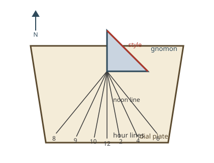

# How a Horizontal Garden Sundial Works

A horizontal sundial is a flat dial plate that lies level, paired with an
inclined gnomon. Sunlight casts the gnomon's shadow onto the plate, and the
position of that shadow against marked hour lines shows the solar time [S001].

## Parts

- **Dial plate.** A flat horizontal plate. It carries the hour lines and often
  a motto or a small correction plaque.
- **Gnomon.** The shadow-casting blade, usually a triangle standing on the
  plate with its sloped edge uppermost.
- **Style.** The time-telling edge of the gnomon (normally its sloped upper
  edge). Only the shadow of this edge is read; the rest of the gnomon's broad
  shadow is ignored [S001].
- **Hour lines.** Lines on the plate radiating from the base of the gnomon,
  one per hour, labelled with hour numbers. On a horizontal dial they are not
  evenly spaced: lines near noon bunch differently than lines near morning and
  evening, because the flat plate meets the Sun's rays at a changing angle
  through the day.
- **Noon line.** The straight hour line pointing true north (in the Northern
  Hemisphere) from the gnomon base. The style's shadow falls on it at local
  apparent noon.

*Figure 1. Parts of a horizontal garden sundial: dial plate, gnomon with style
edge, and hour lines.*

## How it works

The Earth turns once a day about its rotation axis, so the Sun appears to
circle the sky at a steady rate. A gnomon whose style sits parallel to the
Earth's rotation axis inherits that steadiness: the style's shadow sweeps
across the plate at a uniform angular rate, and fixed hour lines can mark it
[S001].

Latitude dependence follows directly from that alignment. The angle between
the style and the horizontal plate must equal the dial's geographic latitude,
and the plate must be oriented so the style points toward true north (in the
Northern Hemisphere). A dial made for one latitude reads incorrectly at
another unless its gnomon angle and hour-line layout are remade for the new
latitude [S001]. Many inexpensive decorative dials ignore this and cannot be
adjusted to tell the correct time.

## How to read it

1. Check the dial is level, outdoors in direct sun, and oriented with the
   gnomon pointing toward true north (Northern Hemisphere).
2. Find the thin shadow of the style, the sloped upper edge of the gnomon —
   not the broad blur of the whole blade.
3. Read the hour number of the hour line nearest the style's shadow. Between
   lines, interpolate roughly.
4. Remember the reading is local apparent solar time, not clock time. It does
   not include longitude, time-zone, daylight-saving, or equation-of-time
   adjustments; a garden dial is read as an approximation.

## Limitations

- Works only in direct sunlight; overcast skies give no shadow.
- Reads solar time, which can differ from clock time by tens of minutes.
- Only accurate at the latitude it was laid out for, and only when level and
  correctly aligned to true north.

## References

- [S001](./sources.md#s001--sundial)
