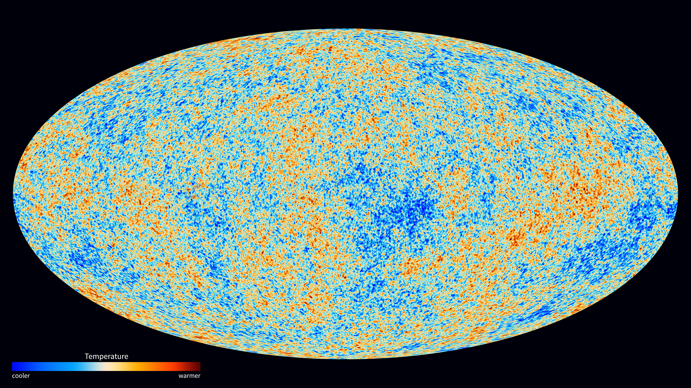
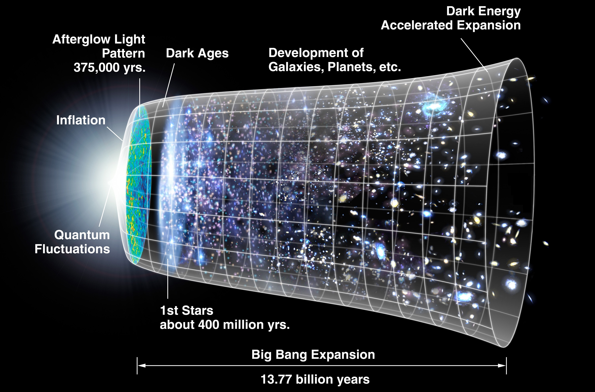

# Cosmic background

The background is everything the
web sits in: the microwave afterglow, the expanding space itself, the dark
matter scaffolding and the dark energy driving acceleration. Template follows
the pilot (`cosmic-web.md`): looks, creation, change over time,
interactions, numbers, example probes, target visuals, sources.

## How the background looks

The microwave background is an all-sky glow with no source object: a perfect
2.725 K blackbody in every direction, isotropic to ~1 part in 25,000 after
subtracting our 370 km/s motion dipole, with intrinsic ripples of ~1 in
100,000 — the seeds of all structure, teased out through COBE to WMAP to
Planck. Its acoustic peaks encode curvature (first peak) and the baryon vs
dark-matter densities (second and third); fainter E-polarization, and still
fainter B-modes, carry lensing and possibly primordial-wave signals. The CMB
holds ~400x more photons than all stars ever emitted (~411 per cm^3).
Sources: CMB summary; COBE summary; BAO summary.

Expansion looks like universal recession: galaxies in all directions recede
proportionally to distance (v = H0 x D) — metric growth of space itself, not
motion into anything; bound systems do not expand, and recession past the
Hubble sphere is superluminal without violating relativity. Dark matter shows
only by gravity: flat rotation curves, cluster dispersions (Zwicky's Coma),
lensing (Bullet offset), clustering excess. Dark energy shows only by
acceleration: distant Type Ia supernovae 10-15% farther than a matter-only
universe allows, plus the flatness-plus-30%-matter remainder. Sources:
expansion and Hubble-law summaries; dark matter and dark energy summaries;
1998 supernova teams (Nobel 2011).

## How the background was created

CMB photons are relic light from ~378,000 years (z~1090-1100), when protons
and electrons finally bound into neutral hydrogen and Thomson opacity
collapsed — recombination and decoupling, distinct but contemporaneous, with
helium recombining earlier behind the still-opaque curtain. The bottleneck
runs through excited states (Lyman-alpha escape plus 2s two-photon decay),
modeled today to 0.1%. The freed shell we see is the surface of last
scattering. Sources: recombination summary.

Expansion comes from the hot dense start plus inflation: the Friedmann
scale-factor history runs from ~0.1 s to today under general relativity, and
inflation's quantum fluctuations, frozen before equilibration, became the
density ripples gravity later amplified. Dark matter clumped first into
blobs and filaments — the scaffolding galaxies lit up. Dark energy's nature
is unknown: cosmological constant vs evolving fields; DESI DR1-DR2
(2024-2025, 14M+ galaxies and quasars in DR2, BAO precision ~0.24%) hints
at slowly decreasing density (2.6-4.2 sigma depending on dataset combo,
below the 5-sigma discovery threshold), consistent with Lambda alone so
far. Sources: Lambda-CDM summary; dark
matter summary; dark energy and DESI summaries.

## How the background changes over time

Everything cools and dilutes by its equation of state: radiation as a^-4,
matter as a^-3, vacuum energy constant — hence the radiation to matter to
Lambda sequence. The CMB cools as (1+z): ~3000 K at emission, 2.725 K today.
Deceleration flipped to acceleration ~9.8 Gyr in (z~0.4-0.66 depending on
convention); peculiar velocities decay as 1/a, sorting the universe toward
pure Hubble flow. With constant Lambda the particle horizon converges and an
event horizon caps the ever-observable volume. Sources: expansion summary;
Lambda-CDM summary; dark energy summary.

## How the background interacts with structure

The CMB backlights everything after it: hot cluster electrons
inverse-Compton kick CMB photons (thermal Sunyaev-Zel'dovich), redshift-free
— high-z clusters detect as easily as nearby ones — while bulk motions add
kinematic SZ; Planck's nine bands mapped SZ clusters, lensing, ISW and
foregrounds. Expansion stretches the frozen 150-Mpc sound-horizon ruler:
radial BAO reads H(z), transverse reads angular distance — dark matter dug
the wells (baryon shell plus central dark overdensity), dark energy now
suppresses the digging, measured through H(z), distances, cluster counts and
w0-wa fits. The first acoustic peak (BOOMERanG/Maxima 2000) demanded a flat
universe with only ~30% matter — the original dark-energy remainder.
Sources: SZ summary; BAO summary; dark energy summary; Planck spacecraft
summary.

## Key numbers

- T0 = 2.725 K (FIRAS 2.72548 +/- 0.00057 K); recombination ~3000-4000 K.
- Age: 13.787 +/- 0.020 Gyr (Planck 2018); 13.772 (WMAP9); 13.798 (Planck
  2013+BAO) — dataset combos, not errors.
- H0 tension: 67.4 +/- 0.5 (Planck, model-inferred) vs 70-73 (local ladder);
  gravitational-wave sirens give ~70 as a third route.
- Budget: ~4.9% ordinary, ~26.5% dark matter, ~68.5% dark energy (Planck
  2018; 2013 and WMAP9 differ by ~1-2 points with data combo).
- Equality ~47-50 kyr; last-scattering thickness ~118 kyr; Lambda takeover
  z~0.4-0.66; reionization optical depth 0.054, z~7.7.
- Base-6 extras: ns=0.965, sigma8=0.811. Open threads: S8 lensing tension,
  Cold Spot, low quadrupole — all marginal.

Sources: Lambda-CDM parameters summary; WMAP and expansion summaries.

## Example probes

- COBE (1989): FIRAS perfect blackbody + DMR 10^-5 seeds (Nobel 2006) —
  precision cosmology starts.
- WMAP (2001): 45x sensitivity and 33x resolution over COBE, 13-arcmin
  full-sky temperature plus E-polarization; flat Lambda-CDM, 13.77 Gyr.
- Planck (2009): 3x finer than WMAP, nine bands; 2013 map, 2015
  polarization, 2018 legacy parameters; SZ catalog, lensing, ISW.
- SDSS BAO (2005): 150-Mpc acoustic peak in 46,748 LRGs confirms the WMAP
  sound horizon; 6dF, WiggleZ, BOSS extend it.
- Supernova cosmology (1998): High-Z plus SCP teams find acceleration
  (Nobel 2011); JLA re-analyses debated, consensus stands.
- DESI (2021-): 5,000-fiber 3D map; DR1 (public 2025): 18.7M objects
  (13.1M galaxies, 1.6M quasars, 4M stars);
  DR2 (March 2025, published October 2025): 14M+ galaxies and quasars,
  BAO precision ~0.24% — BAO plus RSD plus evolving-dark-energy test,
  preference up to ~4.2 sigma with supernova combos, still below
  discovery threshold.

Sources: COBE, WMAP, Planck spacecraft, BAO, DESI, accelerating-expansion
summaries.

## Image credits and licenses

| File | Shows | Credit (required) | License / terms |
|---|---|---|---|
| `planck-cmb-2013.jpg` | Planck 2013 CMB all-sky map (shared with pilot) | ESA and the Planck Collaboration | ESA free use with credit |
| `background-expansion-timeline.jpg` | NASA expansion-history diagram | NASA / WMAP Science Team | Public domain (USGov-NASA) via Wikimedia mirror |

## Sources

- CMB: `https://en.wikipedia.org/wiki/Cosmic_microwave_background`
- Recombination: `https://en.wikipedia.org/wiki/Recombination_(cosmology)`
- Expansion: `https://en.wikipedia.org/wiki/Expansion_of_the_universe`
- Hubble law: `https://en.wikipedia.org/wiki/Hubble%27s_law`
- Lambda-CDM: `https://en.wikipedia.org/wiki/Lambda-CDM_model`
- Dark matter: `https://en.wikipedia.org/wiki/Dark_matter`
- Dark energy: `https://en.wikipedia.org/wiki/Dark_energy`
- Accelerating expansion: `https://en.wikipedia.org/wiki/Accelerating_expansion_of_the_universe`
- BAO: `https://en.wikipedia.org/wiki/Baryon_acoustic_oscillations`
- SZ effect: `https://en.wikipedia.org/wiki/Sunyaev%E2%80%93Zeldovich_effect`
- COBE: `https://en.wikipedia.org/wiki/Cosmic_Background_Explorer`
- WMAP: `https://en.wikipedia.org/wiki/Wilkinson_Microwave_Anisotropy_Probe`
- Planck spacecraft: `https://en.wikipedia.org/wiki/Planck_(spacecraft)`
- DESI: `https://en.wikipedia.org/wiki/Dark_Energy_Spectroscopic_Instrument`
- DESI DR2 results guide: `https://www.desi.lbl.gov/2025/03/19/desi-dr2-results-march-19-guide`
- DESI DR2 extended dark-energy analysis: `https://link.aps.org/doi/10.1103/w4c6-1r5j`
- WMAP 9-yr file: `https://en.wikipedia.org/wiki/File:WMAP_2012.png`
- Timeline file: `https://en.wikipedia.org/wiki/File:CMB_Timeline300_no_WMAP.jpg`
