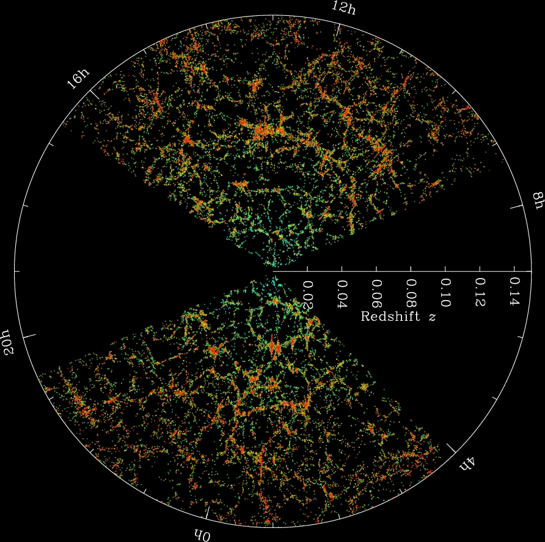
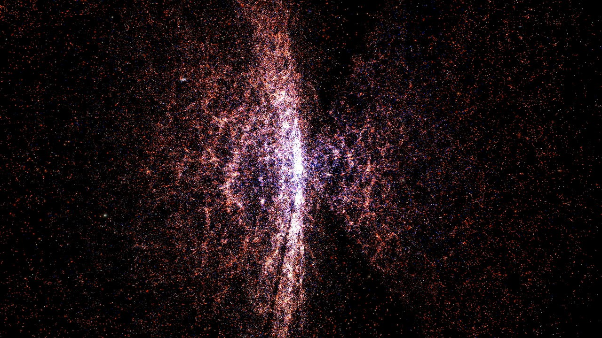

# Cosmic web — the whole (creation and evolution)

Pilot doc for Issue #211. This page describes the cosmic web as a whole:
what it looks like today, how it was created, how it changed through time,
and how its parts interact. Per-part detail lives in sibling docs in this folder (`voids.md`, `filaments.md`, `walls.md`,
`nodes.md`, `superclusters.md`, `background.md`) and the dated timeline in
`lifetime.md`.
Status: pilot — the section template below is the pattern the part docs follow.

## What it is and how it looks

The cosmic web is the large-scale arrangement of all matter in the
observable universe: dense cluster nodes joined by filaments, flat walls
(sheets) between them, and vast near-empty voids filling most of the volume.
It is best seen in two complementary views. Simulations show the dark-matter
backbone directly; galaxy surveys show the luminous tracers sitting inside it.

Target visuals (files in `images/`, credits and licenses at the bottom):

The TNG300 slice above is a thin projection through the 302.6 Mpc
IllustrisTNG box (V. Springel; freely shareable for talks and docs with
credit): brightness traces projected gas density, hue traces mean gas
temperature, so hot cluster nodes glow against cooler filaments.

The Millennium run (Springel et al. 2005, Max Planck Institute for
Astrophysics; ~10 billion particles in a 500 Mpc/h box) shows the
dark-matter backbone directly — the density field galaxies trace.
It remains the archetypal whole-web simulation view alongside TNG.

The two survey views above are complementary: the SDSS pie slice
(M. Blanton / SDSS-III) is the observed wedge to ~2 billion light-years
with Earth at the apex, while the NASA 3-D render (NASA / Chicago /
Adler) flies through the same structure. Galaxy surveys show luminous
tracers; simulations show the dark backbone they sit in.

The lensing map closes the loop: Planck CMB lensing reconstructs all
intervening matter — dark plus ordinary — between Earth and the last
scattering surface, independent of galaxy light.

Sources: IllustrisTNG media page (`https://www.tng-project.org/media`);
Millennium (Springel et al. 2005); SDSS-III gallery and BOSS;
NASA SVS / JPL photojournal; Planck legacy lensing map.

## How it was created

**Seeds from inflation.** At about 10^-36 to 10^-32 seconds after the Big
Bang, exponential expansion stretched space by a factor of roughly 10^26 to
10^30 and amplified minute quantum fluctuations to cosmological scales.
Denser patches later grew by gravity into stars, galaxies and clusters.
The imprint survives in the microwave background: photons climbing out of
slightly denser patches lose energy and look colder, so the observed
temperature pattern is a snapshot of the density pattern at decoupling.
The simplest inflation models predict near-scale-invariant, Gaussian
fluctuations, confirmed in detail by WMAP and Planck. Sources: ESA Planck
"CMB and inflation" page; ESA Planck "Planck and the CMB"; NASA WMAP
overview and accomplishments; NASA LAMBDA graphic history.

**Frozen sound waves.** For the first ~380,000 years the universe was an
opaque plasma; pressure fought gravity and drove sound waves through the
photon-baryon fluid. When the plasma cooled to ~3000 K (redshift ~1100),
electrons and protons formed neutral hydrogen, light escaped, and the wave
pattern froze in — visible today both as the microwave background and as a
preferred galaxy separation of ~150 Mpc (baryon acoustic oscillations).
The scale works as a calibrated ruler: the radial BAO interval reads the
expansion rate H(z), the transverse angle reads the angular diameter
distance. BOSS first mapped it in ~1.5 million luminous galaxies to
z ~ 0.7 plus 160,000 quasar Lyman-alpha forests at z ~ 2.2-3 over
10,000 square degrees; later surveys sharpened it further (see
[How the web is mapped](#how-the-web-is-mapped)). Sources: ESA Planck
"Planck and the CMB"; NASA LAMBDA graphic history; SDSS-III BOSS.

**First collapse.** Matter-radiation equality at ~47,000 years let
perturbations grow instead of being washed out. Dark matter, feeling no
radiation pressure, gathered first into filaments; ordinary matter fell in
afterward. The Dark Ages (no stars) lasted until the first massive stars lit
up ~200 million years in and reionized the gas by ~1 billion years.
Webb now sees into that transition directly: galaxies beyond redshift 14
(~280 million years), star clusters at ~460-600 million years, and faint
dwarf starbursts as the likely main reionizers; star formation then peaked
at cosmic noon (~2-3 billion years). Sources: ESA "Cosmic eras";
NASA Webb "Early universe"; NASA WMAP timeline.

**Anisotropic collapse.** Collapse happens fastest along one axis at a time,
so Zel'dovich dynamics naturally produce the web topology: collapse on three
axes makes knots (halos), on two makes filaments, on one makes sheets, on
none leaves voids. In the Zel'dovich approximation (1970), particle
displacements follow the initial potential gradient, and the number of
collapsed eigenvalues of the deformation tensor sets the morphology.
Matter flows voids to walls to filaments to cluster
nodes. Sources: IllustrisTNG baryons paper; Cautun et al. cosmic-web
evolution papers; Zel'dovich approximation (see `filaments.md` for the
creation detail).

## How it changes over time

**From gauze to rope.** The early web is dominated by tenuous filaments and
sheets; they merge, so today's web has fewer but far more massive
structures. One IllustrisTNG deformation-tensor census (2 cMpc/h smoothing)
reports knots rising from ~8% to ~33% of mass between redshifts 4 and 0
while sheets fall from ~42% to ~21% and voids from ~17% to ~6% — other
finders give different shares, so every part doc cites its method. Sources:
Martizzi et al. (IllustrisTNG baryons); Cautun et al.

**Present shares are method-dependent.** As an orientation, not a single
truth: filaments hold ~40-50% of mass in ~5-10% of volume; voids fill
~70-85% of volume with only ~15-25% of mass; nodes hold a large mass in under
1% of volume; walls sit between. Different finders move these by factors of
two or more, so part docs always cite their method. Sources: Cautun et al.
NEXUS+; Aragon-Calvo et al. MMF; IllustrisTNG deformation-tensor census.

**Gas heats up.** About 30-50% of ordinary matter today is warm-hot
intergalactic gas (100,000 to 10,000,000 K), shock-heated as it falls into
filaments; at redshift 2 it was only ~11%, the rest cool diffuse gas.
Filaments are therefore the prime reservoir of the "missing" baryons.
Highly ionized oxygen (O VI, O VII, O VIII) in TNG and EAGLE traces this
phase, and stacked Sunyaev-Zel'dovich plus X-ray detections are now
weighing filament gas directly. Sources: Dave et al.; Cen and Ostriker;
Tuominen et al. (EAGLE); IllustrisTNG oxygen maps.

**Expansion freezes the build.** Dark energy took over ~9.8 billion years in
(redshift ~0.4-0.66 depending on convention) and now accelerates expansion
while slowing structure growth: no new large bound structures freeze in
anymore, and in the far future filaments dissolve as bound clusters
separate. DESI DR1-DR2 plus CMB plus supernovae (2.8-4.2 sigma depending
on combo, below the 5-sigma bar) hints the dark-energy density may slowly
decline — consistent with a constant so far, but the sharpest thread to
watch. Sources: NASA "Dark energy"; DESI DR2 cosmology paper;
Wikipedia "Future of an expanding universe".

## How the parts interact

Gravity is the messenger. One 300 Mpc/h-box inventory finds
filament-induced forces averaging ~60% of local gravity, voids ~20%, nodes
~17%, walls ~14% — walls are massive but pull weakly because they are
extended. Shares are box- and method-specific; the pattern (filaments rule
almost everywhere, nodes only their neighborhood) is robust. Galaxies form in
nodes and filaments, drain out of voids, and the gas in filaments feeds both
star formation and the hot halos of clusters. Hot cluster electrons also
up-scatter CMB photons (thermal Sunyaev-Zel'dovich effect), so CMB maps
double as cluster finders. Laniakea-scale flows show whole
supercluster regions streaming toward common attractors. Sources: Cosmic Web
Dynamics 2024; Cautun et al.

## How the web is mapped

Three independent tracers agree on the same web. Redshift surveys map
galaxies in 3-D: SDSS/BOSS proved the 150 Mpc BAO ruler in galaxies;
DESI sharpened it to ~0.24% overall (0.65% above redshift 2 from the
Lyman-alpha forest alone, when the universe was ~3 billion years old)
across six tracer samples. DESI DR1 (public March 2025) holds 18.7 million
high-quality redshifts (13.1 million galaxies, 1.6 million quasars,
4 million stars); DR2 (first three years, March 2025 papers, chains
October 2025) doubles the precision over DR1; the five-year survey
completed in April 2026 with 50 million-plus redshifts. Weak lensing and
CMB lensing map total matter independent of light; the Sunyaev-Zel'dovich
effect finds clusters by their CMB shadow with nearly redshift-free
selection. ESA Euclid (launched July 2023, first data March 2025 with
26 million galaxies) is mapping billions of galaxies to 10 billion
light-years over a third of the sky — the next source of map updates.
Sources: DESI DR2 guide; SDSS-III BOSS; ESA Euclid pages; NASA LAMBDA.

## Key numbers

- Age of the universe: 13.787 +/- 0.020 Gyr (Planck 2018 final).
- Observable diameter: ~93 billion light-years (8.8 x 10^26 m).
- CMB temperature today: 2.725 K, scaling as (1+z).
- Budget: ~5% ordinary matter, ~27% dark matter, ~68% dark energy.
- Recombination: ~380,000 years, redshift ~1100. First stars: ~200 million
  years. Cosmic noon (peak star formation): 2-3 Gyr. Dark-energy takeover:
  ~9.8 Gyr.
- BAO standard ruler: ~150 Mpc (~490 million light-years today; only
  ~0.14 Mpc radius at recombination). Typical filaments: 50-80 Mpc long;
  voids: 10-100 Mpc across.

Sources: Planck Collaboration 2018; NASA WMAP overview; ESA Planck pages;
NASA "Dark energy".

## Example probes

- Planck (ESA, 2009-2013): first all-sky 2.7 K map at 5-arcminute detail;
  nine bands separate CMB from Galaxy; lensing map weighs all matter;
  SZ catalog finds clusters by their CMB shadow. See `background.md`.
- SDSS/BOSS: million-galaxy BAO ruler; pie-slice walls-and-voids view
  above; Lyman-alpha forest reaches z ~ 2-3.
- DESI (2021-2026): 5,000-fiber spectrograph on the Mayall telescope;
  DR1 18.7M redshifts, DR2 BAO at 0.24%, completed survey 50M-plus;
  evolving-dark-energy and neutrino-mass tests.
- IllustrisTNG / Millennium: gravity plus gas in boxes to 300-500 Mpc;
  deformation-tensor and NEXUS+ censuses give the method-dependent shares.
- Euclid (2023-): billions of galaxies to 10 billion light-years;
  next map update after DESI.

Related parts: [Voids](./voids.md), [Filaments](./filaments.md),
[Walls](./walls.md), [Nodes](./nodes.md),
[Superclusters](./superclusters.md), [Background](./background.md),
and the dated [Lifetime](./lifetime.md).

## Image credits and licenses

| File | Shows | Credit (required) | License / terms |
|---|---|---|---|
| `tng300-gas-dens-temp-375Mpc.jpg` | TNG300 gas density + temperature slice | V. Springel / IllustrisTNG Collaboration | Free distribution for talks/posters/docs; contact for commercial (non-academic) use. Source: `https://www.tng-project.org/media` |
| `millennium-cosmic-web.jpg` | Millennium dark-matter web + cluster zoom | Volker Springel / Max Planck Institute for Astrophysics | CC-BY-SA 4.0 (`https://creativecommons.org/licenses/by-sa/4.0/`) |
| `sdss-pie2-galaxy-map.jpg` | SDSS observed galaxy wedge to 2 Gly | M. Blanton and the Sloan Digital Sky Survey | SDSS-III gallery: free for non-commercial/educational use with credit |
| `nasa-svs-sdss-journey3.jpg` | NASA 3-D render of SDSS structure | NASA/University of Chicago and Adler Planetarium and Astronomy Museum | NASA SVS free use with credit |
| `planck-cmb-2013.jpg` | Planck 2013 CMB all-sky map | ESA and the Planck Collaboration | ESA free use with credit |
| `planck-lensing-matter-map.jpg` | Planck lensing all-matter map | ESA/NASA/JPL-Caltech | Free use with credit |

Note: licenses vary (not all strict public domain).

## Sources

- Planck Collaboration 2018 (VI): `https://arxiv.org/abs/1807.06209`
- ESA, Planck and the CMB: `https://www.esa.int/Science_Exploration/Space_Science/Planck/Planck_and_the_cosmic_microwave_background`
- ESA, CMB and inflation: `https://www.esa.int/Science_Exploration/Space_Science/Planck/The_cosmic_microwave_background_and_inflation`
- ESA, Cosmic eras: `https://www.esa.int/Science_Exploration/Space_Science/Cosmic_eras`
- NASA LAMBDA, graphic history: `https://lambda.gsfc.nasa.gov/resources/graphic_history/microwaves.html`
- NASA WMAP overview: `https://science.nasa.gov/mission/wmap/wmap-overview/`
- NASA Webb, early universe: `https://science.nasa.gov/mission/webb/early-universe/`
- NASA, dark energy: `https://science.nasa.gov/dark-energy/`
- SDSS-III BOSS: `https://www.sdss3.org/surveys/boss.php`
- IllustrisTNG media: `https://www.tng-project.org/media`
- IllustrisTNG baryons I: `https://ar5iv.labs.arxiv.org/html/1810.01883`
- Cautun et al., evolution of the cosmic web: `https://ar5iv.labs.arxiv.org/html/1401.7866`
- Cautun et al., z=2 to 0: `https://ar5iv.labs.arxiv.org/html/1501.01306`
- Cosmic Web Dynamics 2024: `https://ar5iv.labs.arxiv.org/html/2407.16489`
- MMF (Aragon-Calvo et al.): `https://ar5iv.labs.arxiv.org/html/1007.0742`
- DESI DR2 results guide (March 2025): `https://www.desi.lbl.gov/2025/03/19/desi-dr2-results-march-19-guide`
- DESI DR2 BAO cosmology (galaxies and quasars): `https://arxiv.org/abs/2503.14738`
- DESI DR2 Lyman-alpha BAO: `https://arxiv.org/abs/2503.14739`
- ESA Euclid mission: `https://www.esa.int/Science_Exploration/Space_Science/Euclid`
