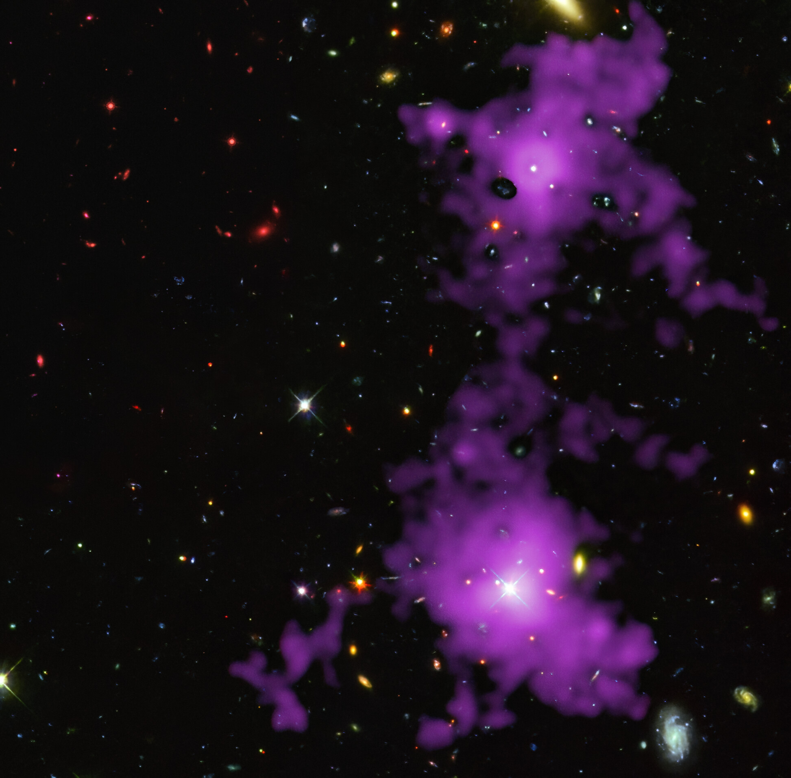

# Filaments

Filaments are the thread-like
bridges of the cosmic web: dense rivers of dark matter, gas and galaxies
joining cluster nodes across tens of megaparsecs. Template follows the pilot
(`cosmic-web.md`): looks, creation, change over time, interactions, numbers,
examples, target visuals, sources.

## How filaments look

In redshift surveys filaments appear as thread-like galaxy bridges tens of
megaparsecs long and only 1-2 Mpc thick, forming a network around voids;
statistical filamentarity in SDSS holds to ~80 Mpc/h, longer impressions are
chance alignments. Sources: SDSS DR4 filament study; Bharadwaj et al.

The sharpest observed gas bridge is a 3-million-light-year purple Lyman-alpha
filament linking two quasar-host galaxies 11 billion light-years away (150 h
of VLT/MUSE overlaid on Hubble WFC3/WFPC2 imaging, ESO Picture of the Week
29 January 2025): gas clumped by dark-matter gravity, ~85% of the
matter invisible. Davide Tornotti (Milano-Bicocca) led the study, published
in Nature Astronomy; the field lies in Grus. A JWST strand at ~830 Myr
after the Big Bang shows a
3-million-light-year line of 10 galaxies anchored by a quasar, expected to
become a massive cluster like Coma. Sources: ESO potw2504a (and the
Tornotti et al. Nature Astronomy paper); NASA Webb earliest-strands release.

In simulations filaments are dark-matter and gas threads at once: short ones
near nodes, long ones in sparse regions. In the IllustrisTNG rendering
convention brightness is projected baryonic mass density and hue is mean gas
temperature; voids render near-black, filaments yellow-green, halos white,
with hydrodynamical shocks lighting filament boundaries. Sources:
IllustrisTNG media; MIT News gallery.

## How filaments are created

Filaments are born from anisotropic collapse: the tidal field amplifies seed
asymmetries, first one axis collapses into a sheet, then the second axis into
a filament, finally all three into a node. In eigenvalue language a filament
is (+,+,-): collapse on two axes, expansion on the third. The NEXUS+
census makes it quantitative: filaments hold ~50% of mass in ~6% of volume
(nodes ~11%, walls ~24%, voids ~15% of mass), and long near-straight
branches exceed 100 h^-1 Mpc, bridging massive clusters along approximate
lines. Large-scale tidal fields and density peaks fix the bridges between peaks, confirmed in
essentially all Lambda-CDM N-body runs. Filaments form at wall intersections
from matter flowing voids to walls to filaments;
clusters form where filaments intersect, fed by inflow along the spines.
Sources: Cautun et al. (MNRAS 441); Cautun et al. understanding (z = 2 to 0);
"How filaments are woven" review;
caustic-skeleton work (A3 cusps).

## How filaments change over time

The early web is gauze: at redshift 5, ~33-45% of mass sits in sheets, only
~18-30% in filaments and ~2-3% in clusters. Sheets drain into filaments, so
by today more than half the mass is filamentary: the filament share rises
from ~30% at z=2.1 to ~40% at z=0 while sheets shrink. High-mass segments
(mass per length peaking near 10^12 solar masses per Mpc) grow more common
late; typical segment widths grow from ~0.3 Mpc at z=2 to ~1.0-1.5 Mpc at z=0.
Most prominent present filaments connect to massive clusters; most high-z
filaments connect to none. Sources: Zhu and Feng; Cautun et al.
understanding review; Yang et al. widths; MTNG evolution.

Gas heats as filaments fatten: the warm-hot intergalactic medium (WHIM,
10^5-10^7 K) is ~40% of gas at z=0 but only ~10% at z=2.1, and about half of
all WHIM mass lives in filaments at every redshift — filaments are the
missing-baryon reservoir. The benchmark individual case is the Shapley
filament between cluster pairs A3530/32 and A3528-N/S: 7.2 Mpc long in 3D,
(21 +/- 3)% excess X-ray emission at 6.1 sigma, gas at 0.8-1.1 keV
(~10 million K) with electron density ~10^-5 cm^-3 and baryon overdensity
30-40 — the first X-ray spectroscopy of pure WHIM in a single pristine
filament, matching simulations (Migkas et al., A&A 698, June 2025; ESA
"models were right" release). Earlier stacked work averaged over
collections; this one weighs a single thread. Sources: Large-Scale
Environment II; Martizzi et al. (IllustrisTNG baryons); Migkas et al.; ESA June-2025 release.

Caveat: observed width evolution (grow vs shrink with time) depends on
estimator, sample and smoothing; dark-matter-only widths (~0.1-0.6 Mpc) are
far smaller than galaxy scale radii (~2-5 Mpc). Always cite the method.
Source: Galaxy Transformation Across the Web.

## How filaments interact with the rest of the web

**Feeding nodes.** Warm gas funnels along filaments into clusters; inflow is
anisotropic, aligning cluster major axes with
their filaments. Abell 2744 (Pandora, z = 0.308, ~3.5 Gly, a pile-up of 4+
components) is an active node: XMM-Newton found hot-gas structures coherent
over ~8 Mpc in four filaments (E, S, SW, NW) tied to the core, with gas at
10-20 million K — colder than the 100-million-K center but hotter than the
average web — and only 5-10% of filament mass in baryonic gas, the rest dark
matter. Weak-lensing tracing (Eckert et al., confirmed by 2026 Magellan
matched-filter work) shows the same filament directions. Sources: Eckert et
al. (Nature 2015); Cha et al. WL tracing; cosmic gas accretion
(IllustrisTNG); PMC baryon content of the web.

**Spinning galaxies up.** Low-mass blue galaxies align their spins with
filaments; high-mass red ones go perpendicular, flipping in the
10^10.25-10^10.75 solar-mass stellar range (~3 x 10^10): first confidently
seen with SAMI kinematics on GAMA filaments, matching Horizon-AGN, while
MaNGA finds no overall signal — the effect is weak (~10%) and
finder-dependent. Filaments themselves rotate: stacking thousands of SDSS
filaments reveals redshift/blueshift across the spine, clearest edge-on and
stronger with massive endpoint halos — angular momentum on the largest known
scale. Sources: Welker et al. (SAMI); Horizon-AGN summary; Tempel and
Libeskind; Wang et al. (Nature Astronomy 2021); Oxford spinning-filament
summary; 2025 Siena Atlas re-analysis.

**Feeding star formation — then quenching it.** Filaments host more
star-forming gas than knots; cold streams feed galaxies from the environment.
Near Coma, galaxies get redder toward filament spines and bluer outward to
~1 Mpc (H-alpha rises and g-r / FUV-NUV colours shift blue away from the
spine): the intrafilament medium accelerates transformation even before
clusters do. An 8-degree filament extends from Coma's center carrying excess
post-starburst (E+A) galaxies; weak-lensing now traces intracluster
filaments inside Coma itself, aligned with the ~10-Mpc spectroscopic
filaments feeding it from the Coma supercluster. Late on, galaxies quench
near nodes and filaments as gas supply fades. Sources: Mahajan et al. (Coma
UV catalogue); Falcone et al. (Coma E+A filament); HyeongHan et al. (Coma
intracluster filaments); 2026 Coma dark+luminous WL study; Martizzi et al.;
slime-mold filament work.

**Dominating gravity.** In one 300 Mpc/h-box inventory, filament-induced
forces average ~60% of local gravity and are the largest share in ~97% of
volume (voids ~20%, nodes ~17%, walls ~14%) — shares are method- and
box-specific, the ranking is the point. Filaments rule inside filaments, most
void interiors and all walls; nodes dominate only their immediate
neighborhood. Sources: Cosmic Web Dynamics 2024.

**Detected directly.** Stacking Planck thermal Sunyaev-Zel'dovich maps on
~260,000 SDSS luminous-red-galaxy pairs gives a 5.3-sigma filament signal
(Delta-y ~ 1.3 x 10^-8 after halo subtraction); DisPerSE-identified
filaments at 0.2 < z < 0.6 give 4.4-sigma tSZ with gas near 10^6 K; stacking
~1,000,000 CMASS pairs gives filament gas density ~5.5x the cosmic mean
baryon density at ~(2.7 +/- 1.7) x 10^6 K. CMB-lensing stacking independently
weighs filament mass (first detection He et al. 2018, filament bias ~1.5).
A single 7.2-Mpc
Shapley filament shows 6.1-sigma X-ray WHIM at ~10 million K. Sources:
Tanimura et al. (2017 LRG pairs; 2020 DisPerSE; 2020 stacked X-ray);
de Graaff et al.; He et al. CMB lensing; Migkas et al.

**Mapped by new surveys.** DESI's Early Data Release now has its first public
probabilistic cosmic-web catalogue (ASTRA, 2026): every BGS/LRG/ELG/QSO
object across ~175 deg^2 classified as void, sheet, filament or knot, with
environment-dependent star formation matching GAMA/SDSS benchmarks. Euclid's
Quick Release Q1 (63 deg^2, March 2025) already yields filament-connectivity
studies of clusters and galaxy shape alignments in the web. Kinematic SZ
with ACT + DESI (2025) now traces gas motion in filaments and halos,
complementing the thermal-SZ weighing above. Sources: Zapata-Zuluaga et al.
(ASTRA); Euclid Q1 (Gouin et al. connectivity; Laigle et al. alignments);
Hadzhiyska/Zhou et al. kSZ.

## Key numbers

- Lengths: common 50-80 Mpc; significant to ~80 Mpc/h (SDSS 2D), ~130 Mpc
  (3D); long straight branches exceed 100 Mpc/h.
- Widths: 1-2 Mpc classic; ~1.0-1.5 Mpc at z=0, ~0.3 Mpc at z=2 (TNG
  segments); galaxy scale radii 2-6 Mpc depending on sample.
- Mass share: ~39-50% of cosmic mass in ~6-14% of volume (finder-dependent);
  linear density ~10^12 solar masses per Mpc.
- Connectivity: ~2 filaments at 10^14 solar-mass halos, ~5 above 10^15.

Sources: Coil review; ELUCID statistics; MMF phenomenology; Cosmic Web
Dynamics inventory.

## Example objects

- Sloan Great Wall: ~315 h^-1 Mpc comoving (Gott et al. 2005; ~230 h^-1 Mpc
  of rich superclusters per Einasto et al. 2016), z ~ 0.07-0.09; richest core
  SCl 126 is a rich filament with tendrils while SCl 111 is a "multi-spider";
  the wall's spine runs Scl 136-126-111-91-258, and cosmic-flow streamlines
  sink at SCl 126 rather than the densest SCl 111.
- Quipu: 428 Mpc long at z = 0.027-0.065, ~2 x 10^17 solar masses — largest
  confirmed structure (Bohringer et al., A&A 2025); one of five
  superstructures (with Shapley, Serpens-Corona Borealis, Hercules,
  Sculptor-Pegasus) holding ~45% of clusters and ~30% of galaxies.
- CfA2 Great Wall: 251 Mpc long, Coma at its core; Coma supercluster spans
  ~500 deg^2 with Abell 1367 forming at a filament intersection.
- Pisces-Cetus: ~1-billion-light-year filament complex, Abell 85/133 + ~20
  clusters.
- Perseus-Pisces: ~300-million-light-year wall anchored by Perseus A426.
- Hercules-Corona Borealis (~3 Gpc): unconfirmed; would dwarf Quipu if real.

Sources: Wikipedia "Galaxy filament"; Quipu discovery (A&A 2025); SGW
morphology; Coma UV catalogue.

## Image credits and licenses

| File | Shows | Credit (required) | License / terms |
|---|---|---|---|
| `filament-bridge-eso-potw2504a.jpg` | Lyman-alpha bridge between two quasars | ESO/D. Tornotti et al./Hubble: M. Revalski, P. Francis et al. | CC-BY 4.0 (ESO public images reproducible with credit) |
| `millennium-cosmic-web.jpg` | Millennium dark-matter threads + cluster (shared with pilot) | Volker Springel / Max Planck Institute for Astrophysics | CC-BY-SA 4.0 |

## Sources

- SDSS DR4 filament study: `https://arxiv.org/pdf/astro-ph/0601179v3`
- ESO potw2504a: `https://www.eso.org/public/images/potw2504a`
- ESO copyright: `https://www.eso.org/public/copyright/`
- STScI JWST strand: `https://www.stsci.edu/contents/news-releases/2023/news-2023-124`
- NASA Webb earliest strands: `https://science.nasa.gov/missions/webb/nasas-webb-identifies-the-earliest-strands-of-the-cosmic-web`
- Tornotti et al., Nature Astronomy filament: `https://www.nature.com/articles/s41550-024-02463-w`
- IllustrisTNG media: `https://www.tng-project.org/media`
- Cautun et al., evolution: `https://academic.oup.com/mnras/article/441/4/2923/1213214`
- Cautun et al., understanding: `https://arxiv.org/html/1501.01306v1`
- Zhu and Feng: `https://iopscience.iop.org/article/10.3847/1538-4357/aa61f9`
- Martizzi et al., baryons: `https://academic.oup.com/mnras/article/486/3/3766/5475663`
- Cosmic Web Dynamics 2024: `https://arxiv.org/html/2407.16489v1`
- Tanimura et al. SZ+lensing: `https://arxiv.org/abs/1911.09706`
- Tanimura et al., LRG-pair tSZ (5.3 sigma): `https://arxiv.org/abs/1709.05024`
- He et al., CMB lensing by filaments: `https://arxiv.org/abs/1709.02543`
- Eckert et al., A2744 filaments (Nature 2015): `https://arxiv.org/abs/1512.00454`
- Cha et al., A2744 WL filaments: `https://arxiv.org/abs/2604.07445`
- Welker et al., SAMI spin flip: `https://arxiv.org/abs/1909.12371`
- Wang et al., filament spin: `https://arxiv.org/abs/2106.05989`
- Falcone et al., Coma E+A filament: `https://iopscience.iop.org/article/10.3847/2515-5172/abe7ee`
- HyeongHan et al., Coma intracluster filaments: `https://arxiv.org/html/2606.12523v1`
- Migkas et al., ESA missing-matter release: `https://www.esa.int/Science_Exploration/Space_Science/XMM-Newton/The_models_were_right_astronomers_find_missing_matter`
- DESI EDR cosmic-web catalogue (ASTRA): `https://arxiv.org/abs/2604.01456`
- Euclid Q1 release: `https://www.euclid-ec.org/science/q1`
- SGW spine and streamlines (2026): `https://arxiv.org/pdf/2606.04578`
- Einasto et al., SGW superclusters: `https://www.aanda.org/articles/aa/full_html/2016/11/aa28567-16/aa28567-16.html`
- de Graaff et al.: `https://inspirehep.net/literature/1627851`
- Migkas et al. Shapley WHIM: `https://arxiv.org/abs/2506.14917`
- Filament spin (Nature Astronomy): `https://www.nature.com/articles/s41550-021-01380-6`
- Oxford spinning filament: `https://www.physics.ox.ac.uk/news/astronomers-spot-one-largest-spinning-structures-ever-found-universe`
- Coma UV catalogue: `https://arxiv.org/pdf/1805.09029`
- Quipu discovery: `https://www.aanda.org/articles/aa/abs/2025/03/aa53582-24/aa53582-24.html`
- ELUCID statistics: `https://academic.oup.com/mnras/article/533/1/1048/7729281`
- NASA slime-mold web: `https://science.nasa.gov/image-detail/amf-f593e7a5-9fc5-4ed8-b02f-673122a4c410`
