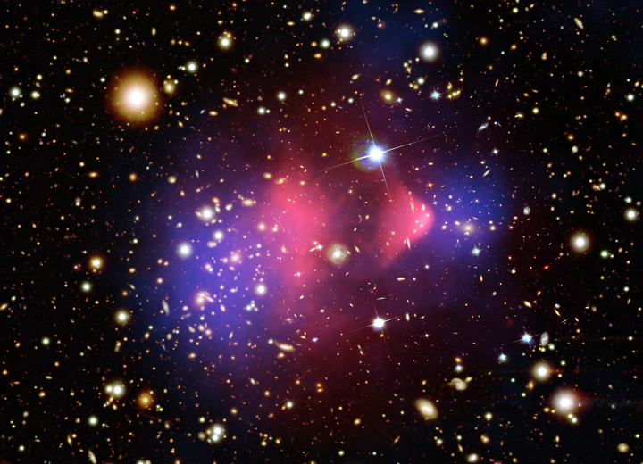
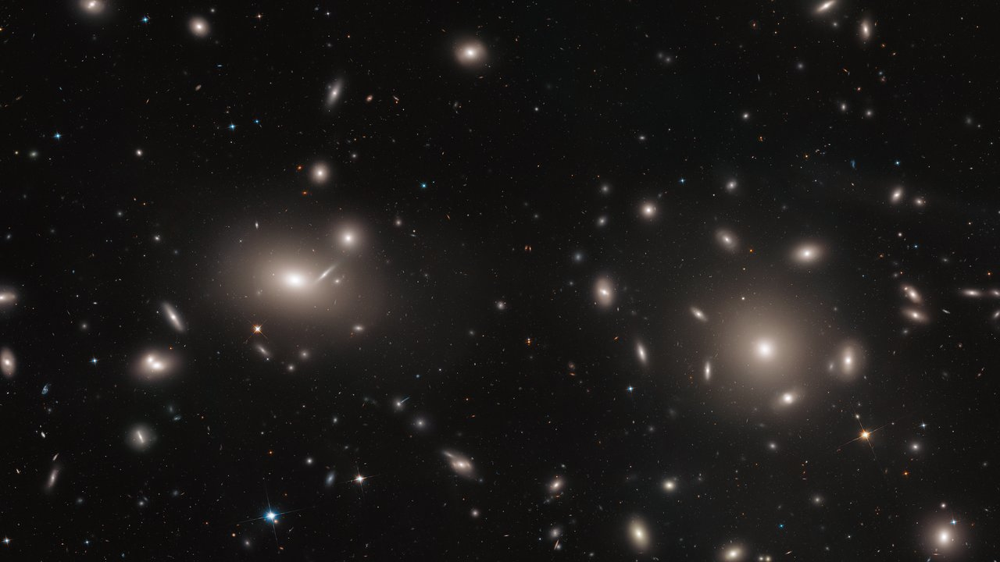

# Cluster nodes

Nodes are the intersections of
the cosmic web: galaxy clusters and groups where filaments meet — the densest,
hottest, most massive bound places in the universe. Template follows the
pilot (`cosmic-web.md`): looks, creation, change over time, interactions,
numbers, examples, target visuals, sources.

## How nodes look

A cluster holds hundreds to thousands of galaxies plus two more massive
residents: vast hot-gas clouds and dark matter outweigh the galaxies — the
intracluster medium (ICM) is superheated plasma at 10-100 million K
(30-100 million C in the Chandra Field Guide census), ~15% of
cluster mass vs ~5% in stars, glowing in X-rays invisible to optical
telescopes, its bremsstrahlung and emission lines yielding temperature,
density and metallicity. The hot envelope outweighs all cluster galaxies
combined, yet about ten times more mass — dark matter — is needed to bind
it. Sources: Chandra Field Guide; intracluster medium
summary; CfA "Staying Warm".

At the bottom of the gravity well sits the brightest cluster galaxy — a giant
elliptical among the most massive galaxies known, lying close to the
geometric and kinematic centre and coincident with the X-ray
peak (e.g. ESO 325-G004 at 100 billion suns; Abell 2261-BCG spans over a
million light-years, ~20 Milky Way diameters). A 95-cluster Chandra survey
found the star-formation trigger in such galaxies unchanged over 10 Gyr:
below a critical ICM-entropy threshold the hot gas inevitably cools into new
stars. The concentrated mass lenses
background light into arcs and funhouse warps, letting astronomers map the
dark matter directly. Sources: brightest-cluster-galaxy summary; NASA El
Gordo mass map; Chandra BCG survey (Jan 2024); ESA/Hubble Abell 2261.

The Bullet Cluster composite is the textbook node portrait: hundreds of
gold-white galaxies, two pink X-ray clumps holding most baryonic matter, and
blue lensing mass cleanly separated from the gas — direct dark-matter
evidence from a head-on merger whose subcluster crossed the core ~150 Myr
ago at ~10 million km/h. The bow shock runs at Mach ~3 (shock speed
~4700 km/s); the dark-matter clump itself moves slower (~2600 km/s in
hydrodynamical models), which is why the early "too fast for Lambda-CDM"
claim settled toward consistency. Sources: Chandra
1E0657-56 album; Bullet Cluster summary; Markevitch et al.; Springel &
Farrar.

In simulations nodes are white-hot convergence points: TNG renders gas blue
(cold) to white (hot) with rapid flicker around nodes from supernova and
black-hole feedback, thin slices showing low-Mach filament shocks converging
into quasi-spherical accretion shocks with >1000 km/s inflows. Observed
counterparts (Abell 2142, Hydra A) show merger weather millions of
light-years across. Sources: IllustrisTNG media; Chandra Field Guide.

## How nodes are created

Nodes are three-axis collapse: an overdense cloud flattens to a pancake,
stretches to a filament, then compacts to a clump when all three eigenvalues
pass singularity — generically anisotropic, since equal eigenvalues have zero
probability. Infalling gas converts collapse energy to heat via compression
and shocks up to the virial temperature; real collapse is messier than
spheres — filament flows pierce deep without shocking at the virial radius,
mergers drive the strongest shocks. The ICM ends at 10-100 million K
X-ray temperatures (Virgo: 30 million K). Sources: Zel'dovich dynamics
summaries; Kravtsov and Borgani cluster formation; Heidelberg cosmic-web
blog; N-body confirmations (Millennium).

## How nodes change over time

Clusters assemble hierarchically over billions of years: dark-matter clumps
plus galaxy groups of dozens merge into clusters of hundreds to thousands;
gas heating in the pile-up is violent and depends on dark-matter content and
expansion rate. Knot mass share grows strongly to the present (~8% at z=4 to
~33% at z=0 in the IllustrisTNG deformation-tensor census; NEXUS+ tags
~11% of mass in under 0.1% of volume at z=0 — absolute shares are
finder-dependent, so always cite the method). Nodes form at filament intersections
and most of their mass arrived via filaments. Sources: Chandra Field Guide;
Cautun et al. 2014; Martizzi et al. (IllustrisTNG baryons); understanding review; tracing-the-web review.

Mergers are still on: Virgo's subgroups are visibly infalling (a young,
still-forming cluster); El Gordo is two subclusters colliding at several
million km/h. Protoclusters at z~2-6 are the unvirialized ancestors —
Chandra+JWST caught JADES-ID1 at z~5.68 taking its first hot breath just 1 Gyr after
the Big Bang (66 members, M500 ~1.8 x 10^13 solar masses, kT ~2.7 keV —
earlier than virialization models at z~2-3 expect); the Spiderweb galaxy at z~2.16 is a future giant elliptical
mid-assembly, now with the first resolved proto-ICM temperature profile at
z > 2 (strong cool core, ~0.1 Gyr central cooling time, AGN power
~10^43-10^44 erg/s). Simulated clusters suffer 2-5 major mergers each. Sources:
Virgo and El Gordo summaries; Lee et al. 2014; Bogdan et al. (Nature 2026);
Spiderweb feeding-feedback (A&A 2024); ESA/Webb Spiderweb (Dec 2024);
Venemans thesis.

## How nodes interact with the rest of the web

Filaments are the supply lines: matter flows along them into clusters, and
connectivity scales with mass — ~10^14 solar-mass clusters average two
filaments, >=10^15 average five (MMF; re-confirmed with gas-traced filaments
in The Three Hundred and observed in Euclid Q1 clusters at 0.2 < z < 0.7);
filaments within 10 Mpc/h hold ~70% of halo
mass on average. The Abell 222/223 dark-matter filament (weak-lensing,
cluster-mass) and the 23-Mly Shapley X-ray filament linking four clusters
validate the picture and house missing baryons. Sources: Aragon-Calvo et al.
MMF; Noh and Cohn; CERN Courier Dietrich et al.; XMM Shapley 2025;
Euclid Q1 connectivity.

Nodes push back: central black holes inflate radio lobes (Perseus shows dark
X-ray cavities), jets and sloshing heat the ICM and suppress cooling flows;
most of the outburst energy sits in bubble enthalpy rather than shocks
(sound-wave ripples carry under 8%), and the feedback-cooling balance shows
no redshift evolution over 9 Gyr of cluster growth. Entropy and metallicity
profiles plus the luminosity-temperature relation all
require this feedback. Sources: intracluster medium summary; AGN feedback
studies; Chandra Field Guide; Perseus energetics; SPT-Chandra 48-cluster
study.

Nodes weigh the universe: X-ray cluster counts test cosmic content and
evolution — eROSITA's first all-sky 12,247 clusters (5,259 in the cosmology
sample) give ~29% matter, confirming Lambda-CDM and easing the S8 tension
(S8 = 0.86). SZ selection is nearly redshift-free: the Planck PSZ2 catalogue
holds 1,653 SZ detections (1,203 confirmed — the first SZ sample over a
thousand clusters), including low-z X-ray-underluminous systems missed by
ROSAT. Sources: eROSITA cosmology
(MPE; Ghirardini et al. 2024; Bulbul et al. 2024); Planck PSZ2 (2015);
LSST weak-lensing calibration work.

## Key numbers

- Sizes: regular clusters 1-10 Mpc; irregulars (Virgo) similar but poorer;
  ~15 Mpc spans are supercluster cores or infall envelopes, not one halo.
- Masses: 10^14-10^15 solar masses; R200 ~1-2 Mpc; knots <1% of volume.
- ICM: 10^7-10^8 K (roughly 1-10 keV; Coma 8-9 keV, Bullet 14-17 keV);
  ~15% of mass; Virgo ICM ~3 x 10^14 solar masses of
  ~1.2 x 10^15 total.
- Coma: binding mass ~7 x 10^14 solar masses, dispersion 1000 km/s, ICM
  8-9 keV — and 1933 home of Zwicky's dark-matter inference (~90% dark).

Sources: Durham ICC lectures; AY616 notes; Yonsei A115 analysis; Coma
summary; cosmic-variance study.

## Example objects

- Virgo: 53.8 Mly away (16.5 Mpc; JWST TRGB recalibration gives 16.17 Mpc),
  ~1,300-2,000 members, binding mass ~10^15 solar
  masses, prolate 4:1 filament of spirals plus concentrated ellipticals, three
  subgroups still merging; orbit modelling finds it will grow ~30% in mass
  over a Hubble time. (Older 65 Mly figure superseded.)
- Coma (Abell 1656): >1,000 galaxies at ~320 Mly, supergiant ellipticals
  NGC 4874/4889 at the core, first dark-matter case.
- Bullet (1E0657-56): z=0.296, ~3.8 Gly away, ICM among the hottest known
  (17.4 keV); velocity debate settled toward Lambda-CDM consistency.
- El Gordo: z=0.87, ~2.1 x 10^15 solar masses (wide-field HST weak lensing;
  strong-lensing gives 1.84 x 10^15 within 1 Mpc), record distant giant,
  merger at half the universe's age; JWST PEARLS confirms the double mass
  peaks with 60 lensed-image families and keeps it the most massive known at
  z > 0.8, near the Lambda-CDM ceiling — claimed
  tension still debated (wide-field lensing compatible; some analyses
  challenge). Sources add: JWST PEARLS (Diego et al. 2023; Frye et al. 2023);
  MUSE/VLT lens model (Caminha et al. 2023); Kim et al. 2021 WL.

Sources: Virgo, Coma, Bullet, El Gordo summaries; Chandra albums; NASA and
ESA/Webb El Gordo pages.

## Image credits and licenses

| File | Shows | Credit (required) | License / terms |
|---|---|---|---|
| `node-bullet-cluster-1e0657.jpg` | Bullet composite: galaxies + X-ray gas + lensing map | X-ray: NASA/CXC/CfA/M.Markevitch et al.; Optical: NASA/STScI; Magellan/U.Arizona/D.Clowe et al.; Lensing Map: NASA/STScI; ESO WFI; Magellan/U.Arizona/D.Clowe et al. | Public domain (NASA/SAO, no copyright claimed; use per NASA guidelines) |
| `node-coma-core-potw1849a-screen.jpg` | Hubble ACS Coma core | NASA, ESA, J. Mack and J. Madrid et al. | CC-BY 4.0 (ESA/Hubble public images reproducible with visible credit) |

## Sources

- Chandra Field Guide, groups and clusters: `https://chandra.si.edu/xray_sources/galaxy_clusters.html`
- Chandra 1E0657-56 album: `https://chandra.harvard.edu/photo/2006/1e0657/`
- Chandra image use: `https://chandra.harvard.edu/photo/image_use.html`
- CfA Staying Warm: `https://www.cfa.harvard.edu/news/staying-warm-hot-gas-clusters-galaxies`
- ESA/Hubble Coma core: `https://esahubble.org/images/potw1849a/`
- ESA/Hubble copyright: `https://www.spacetelescope.org/copyright/`
- IllustrisTNG media: `https://www.tng-project.org/media`
- Cautun et al. 2014: `https://academic.oup.com/mnras/article/441/4/2923/1213214`
- Kravtsov and Borgani: `https://ned.ipac.caltech.edu/level5/Sept12/Kravtsov/Kravtsov3.html`
- MMF (ADS): `http://ui.adsabs.harvard.edu/abs/2010MNRAS.408.2163A/abstract`
- CERN Courier, A222/223 filament: `https://cerncourier.com/a/dark-matter-filament-binds-galaxy-clusters`
- eROSITA cosmology: `https://www.mpg.de/21542664/erosita-confirms-standard-model-of-cosmology`
- NASA El Gordo mass map: `https://science.nasa.gov/asset/hubble/galaxy-cluster-el-gordo-with-mass-map`
- Durham ICC lectures: `https://www.icc.dur.ac.uk/~tt/Lectures/Galaxies/Clusters/Cambridge/gal_lss.html`
- Chandra BCG star-formation survey (Jan 2024): `https://chandra.harvard.edu/photo/2024/bcgs/`
- ESA/Hubble Abell 2261 BCG: `https://esahubble.org/images/heic1216a/`
- Planck PSZ2 catalogue: `https://arxiv.org/abs/1502.01598`
- eROSITA eRASS1 cluster catalogue: `https://www.aanda.org/articles/aa/full_html/2024/05/aa48264-23/aa48264-23.html`
- eROSITA eRASS1 cosmology: `https://www.aanda.org/articles/aa/full_html/2024/09/aa48852-23/aa48852-23.html`
- JWST PEARLS El Gordo lens model: `https://www.aanda.org/articles/aa/full_html/2023/04/aa45238-22/aa45238-22.html`
- JWST PEARLS El Gordo view (Frye et al. 2023): `https://iopscience.iop.org/article/10.3847/1538-4357/acd929`
- MUSE El Gordo lens model (Caminha et al. 2023): `https://www.aanda.org/10.1051/0004-6361/202244897`
- El Gordo wide-field weak lensing (Kim et al. 2021): `https://iopscience.iop.org/article/10.3847/1538-4357/ac294f`
- JADES-ID1 protocluster (Bogdan et al., Nature 2026): `https://www.nature.com/articles/s41586-025-09973-1`
- Spiderweb proto-ICM feeding and feedback (A&A 2024): `https://www.aanda.org/articles/aa/full_html/2024/02/aa47538-23/aa47538-23.html`
- ESA/Webb Spiderweb new members (Dec 2024): `https://www.esa.int/Science_Exploration/Space_Science/Webb/Webb_finds_surprises_in_Spiderweb_protocluster_field`
- JWST TRGB-SBF Virgo distance (2025): `https://beta.iopscience.iop.org/article/10.3847/1538-4357/adb399`
- Euclid Q1 cluster connectivity: `https://pubs.euclid-ec.org/public/coordinated_release/gouin_etal.pdf`
- Planck-SZ AGN cavity feedback (2023): `https://arxiv.org/abs/2306.09829`
- SPT-Chandra feedback-cooling evolution (2023): `https://beta.iopscience.iop.org/article/10.3847/1538-4357/acc38d`
