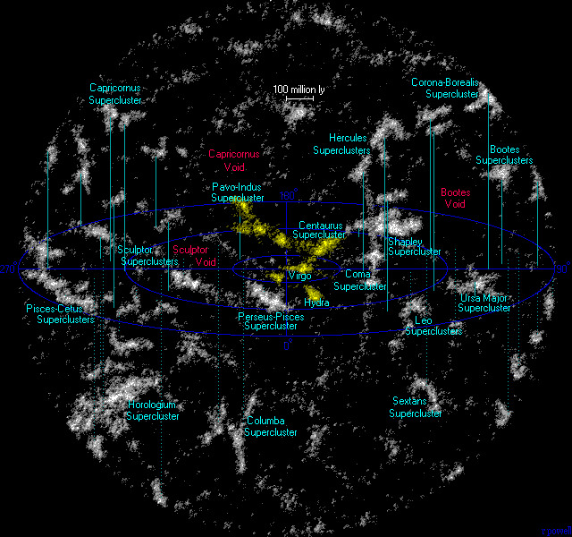

# Superclusters

Superclusters are the largest
galaxy systems: sprawling complexes of clusters, filaments and walls spanning
hundreds of megaparsecs — mostly unbound, still assembling, and already
dissolving into the accelerated expansion. Template follows the pilot
(`cosmic-web.md`): looks, creation, change over time, interactions, numbers,
examples, target visuals, sources.

## How superclusters look

Superclusters are large flattened or filamentary high-density systems
extending to tens of megaparsecs, surrounding voids in a cellular pattern;
in redshift surveys they appear as aggregates on scales past 100 million
light-years, a sponge of dense regions spaced by voids. Rich clusters trace
them like peaks trace mountain chains: a typical supercluster holds 2-15
rich clusters. Two definitions coexist — density-contour superclusters
(partitioning nodes plus filament sections) and velocity-field basins of
attraction, where peculiar velocities point inward on average. Morphology
splits into spiders (one central mass fed by many filaments) and filament
types (mass spread along one massive thread); the richest are elongated,
poor ones mostly spherical. Superclusters host ~15% of all galaxies in ~1%
of volume. Sources: Bahcall lectures; Fairall essay; Einasto 2025 review;
SLOW-IV.

The home view in flow form: Laniakea rendered with density in color (red
dense, blue void), galaxies as white dots, white streams flowing inward to
the Great Attractor valley, an orange contour enclosing ~160 Mpc — outside it
galaxies stream elsewhere. By contrast, wall views (Sloan, CfA2) show thin
sheets in redshift space: hundreds of millions of light-years across, only
~20 deep. Sources: NASA APOD Laniakea; EarthSky boundaries; NASA large-scale
structures.

## How superclusters are created

Superclusters are next up from clusters in the hierarchy, but unlike clusters
they are not virialized. Dark-matter gravity versus dark-energy antigravity
governs their formation from the largest primordial overdensities; high
density cores are older and more evolved than their outskirts. Sheets
collapse first, then filaments, then nodes at the intersections — so a
supercluster is a nested miniature universe of the whole web, with
filaments as the accretion channels shaping even halo orientations.
Occasionally the pattern surprises: the richest nearby superclusters sit in
two huge perpendicular planes hundreds of megaparsecs across, of unclear
origin in Lambda-CDM. Sources: Chon et al. definitions; SGW collapsing-cores
paper; A2142 paper; Shapley quenching paper; Einasto 2025 review.

## How superclusters change over time

Superclusters stayed loose and linear until recent times: overdensities of
just a few times the mean, decoupling from the Hubble flow last. Only around
z~0.5 did a few begin turnaround; when matter density fell below twice
dark-energy density (z~0.7), acceleration took over and growth slowed — the
largest bound structures are forming right now, and the richest ones assemble
after the present (Shapley faces two major mergers in forward runs to 119
Gyr). In the far future the web gains contrast: superclusters grow more
spherical and compact, voids emptier — but many will split, with collapsing
cores surrounded by expanding non-collapsing regions; some Sloan
superclusters fall apart into smaller ones. The collapse threshold today is
~7.8x mean matter density. Sources: quasi-spherical paper; A2142 paper;
SLOW-IV; SDSS WHL catalog; Einasto SGW cores.

Laniakea itself will not survive: at ~0.94x mean density it is no significant
overdensity and fails future-collapse criteria — as a whole it disperses
while only dense subregions collapse. Follow-ups call such velocity basins
"supercluster cocoons" or "watersheds", reserving "supercluster" for the
dense traditional systems inside; proposed term for true survivors:
superstes-clusters. Sources: Chon et al.; Laniakea summary (Einasto 2019).

## How superclusters interact with the rest of the web

A galaxy between structures sits in a gravitational tug-of-war, and peculiar
velocities (observed minus Hubble flow) map the hidden mass: Tully's team
mapped ~8,000 galaxies (Cosmicflows-2) and traced the watershed surface where
flows diverge — that enclosed inward-flow volume is Laniakea, with motions
running downhill into the Great Attractor valley. Laniakea as a whole drifts
toward the Shapley concentration ~650 Mly away; the prime suspect for our
motion graduated from the Great Attractor (150 Mly) to Shapley (600 Mly,
2+ dozen rich clusters). Opposite Shapley pulls a void effectively pushes:
the Dipole Repeller and Cold Spot Repeller are repulsion basins, and push
and pull weigh about equally in the CMB dipole (Local Group: 631 km/s).
 Cosmicflows-3 shows one attraction basin (Shapley extension) plus two
repulsion basins nearby. Sources: UH News; Tully et al. (Nature); Dupuy and
Courtois dynamic cosmography; Hoffman et al. Dipole Repeller;
Cosmicflows-3 papers.

## Key numbers

- Extents: observed superclusters to ~150 Mpc/h flattened; median SDSS WHL
  ~65 Mpc.
- Masses: poor ~10^14 solar masses; typical median ~5.8 x 10^15; richest
  ~10^16; basins (Laniakea) ~10^17 — near mean density, unbound.
- Share: superclusters ~15% of galaxies in ~1% of volume; 54% of catalogued
  clusters live in one; number density ~10^-6 per cubic Mpc/h^3.
- Laniakea: ~500 Mly diameter (~160 Mpc), 10^17 suns in 100,000+ galaxies,
  center ~250 Mly away — dispersing, not bound.
- Shapley core: 2 x 10^15 to 1.3 x 10^16 solar masses within 8 Mpc/h.
- "Largest" is definition- and epoch-dependent (see examples).

Sources: Bahcall catalog; SDSS WHL; Einasto 2025; UH News; Nature Tully;
Chon et al.; ESO Messenger Shapley.

## Example objects

- Laniakea (home): "immense heaven", 2014, subsumes Virgo and
  Hydra-Centaurus, includes Great Attractor, Pavo-Indus filament, Antlia
  Wall; neighbors Shapley, Hercules, Coma, Perseus-Pisces — all drifting
  toward Shapley, possibly one greater basin.
- Shapley: found 1930, >8,000 galaxies, >10^16 suns within ~1 Gly, >120 Mly
  across — most massive local concentration; Planck+ROSAT+DSS composite core
  spans Abell 3558/3562.
- Sloan Great Wall complex: 2003, ~1.37 Gly long, richest nearby system,
  collapsing cores 30-57 Mpc/h; single wall vs complex debated; extreme-value
  analyses strain Gaussian initial conditions.
- Quipu (2025): >400 Mpc, ~2 x 10^17 suns, 68 clusters — largest confirmed
  superstructure; with four companions holds 45% of clusters in 13% of
  volume.
- Hyperion proto-supercluster: z~2.45, 300 Mly across, ~10^15 suns just
  2.3 Gyr after the Big Bang — surprisingly massive so early.
- Hercules-Corona Borealis: 2-3 Gpc putative GRB wall, 2025 reanalysis says
  bigger — still disputed (homogeneity limit); would dwarf everything if
  real.
- South Pole Wall: >=1.37 Gly, twice as close as Sloan, wrapping Laniakea's
  southern border opposite Shapley.

Sources: UH News; ESA Shapley pages; ESO Messenger; SGW complex (A&A);
Quipu (phys.org/Live Science); ESO Hyperion; HCB summaries; South Pole Wall
summary.

## Image credits and licenses

| File | Shows | Credit (required) | License / terms |
|---|---|---|---|
| `supercluster-laniakea-context.gif` | Nearby superclusters + voids within 1 Gly, Laniakea yellow | Richard Powell / Atlas of the Universe | CC-BY-SA 2.5 (`https://creativecommons.org/licenses/by-sa/2.5/`) |

Schematic only, not a flow-field map: the scientifically ideal Tully/SDvision
flow visualization is not cleared (NASA-hosted but third-party rights), so
it stays out until written permission exists.

## Sources

- Bahcall superclusters: `https://ned.ipac.caltech.edu/level5/Sept01/Bahcall2/Bahcall9.html`
- Fairall essay: `https://ned.ipac.caltech.edu/level5/ESSAYS/Fairall/fairall.html`
- Einasto 2025 review: `https://arxiv.org/pdf/2505.22082v1`
- SLOW-IV: `https://www.aanda.org/articles/aa/full_html/2025/10/aa53421-24/aa53421-24.html`
- Tully et al. (Nature): `https://www.nature.com/articles/nature13674`
- UH News Laniakea: `https://www.hawaii.edu/news/2014/09/03/uh-scientist-maps-supercluster-of-galaxies-names-it-laniakea/`
- NASA APOD Laniakea: `https://apod.nasa.gov/apod/ap140910.html`
- NASA large-scale structures: `https://science.nasa.gov/universe/galaxies/large-scale-structures/`
- Chon et al. definitions: `https://www.aanda.org/articles/aa/full_html/2015/03/aa25591-14/aa25591-14.html`
- Quasi-spherical paper: `https://arxiv.org/pdf/2210.13294`
- SDSS WHL catalog: `https://ar5iv.labs.arxiv.org/html/2309.06251`
- SGW complex: `https://www.aanda.org/articles/aa/full_html/2016/11/aa28567-16/aa28567-16.html`
- SGW collapsing cores: `https://arxiv.org/pdf/1608.04988`
- Dupuy and Courtois: `https://www.aanda.org/articles/aa/full_html/2023/10/aa46802-23/aa46802-23.html`
- Hoffman et al. Dipole Repeller: `https://arxiv.org/abs/1702.02483v1`
- ESO Hyperion: `https://www.eso.org/public/news/eso1833`
- Commons Laniakea.gif: `https://commons.wikimedia.org/wiki/File:Laniakea.gif`
