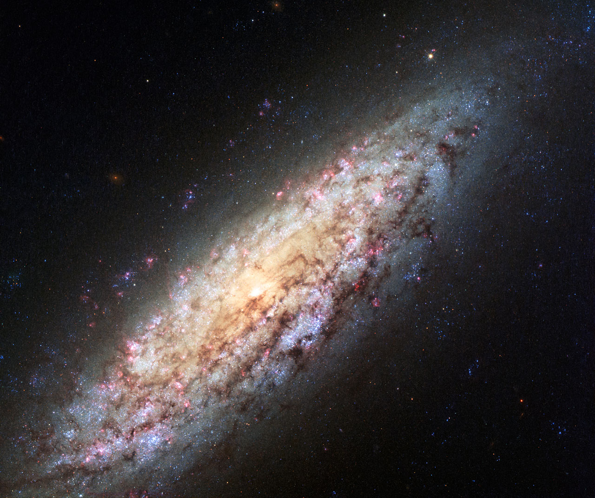

# Voids

Voids are the great underdense
regions of the cosmic web: vast volumes with few or no bright galaxies that
fill most of space while holding little mass. There is no single universal
void definition — like dark-matter halos, each void catalog reflects its
finder. Finders fall into three classes: topological / watershed (ZOBOV,
VIDE, REVOLVER: Voronoi tessellation plus watershed merging, effective
radius of the equal-volume sphere, volume-weighted barycenter as center),
spherical (Sparkling, PopCorn, VoidFinder/VAST: spheres grown to a fixed
integrated density contrast, usually Delta_v = -0.8, overlaps cleaned), and
dynamical (velocity-field reconstructions marking evacuated regions).
Recent cosmology mostly uses watershed finders, with spherical finders kept
for lensing-friendly samples and 2-D projected analyses. Key finder choices
— density threshold, merging/overlap rule, center definition, minimum radius
— reshape every number below, so each claim cites its finder. Template
follows the pilot (`cosmic-web.md`): looks, creation, change over time,
interactions, numbers, examples, target visuals, sources.

## How voids look

Voids look almost empty, but "empty" means underdense in bright galaxies, not
zero matter: even the emptiest regions hold more than ~15% of the mean matter
density, while bright-galaxy counts run around 1/10 of the cosmic mean.
Sources: Void astronomy summary; van de Weygaert and Platen review;
precision-voids review (Contarini et al. 2026).

Small-void samples need a purity cut: below about 2.5 times the tracer mean
separation the catalog fills with spurious (Poisson) voids — empty patches
where faint tracers simply go undetected. Standard cuts therefore keep only
voids larger than ~2.5x mean separation (about 13.5 Mpc/h in halo samples,
about 6.3 Mpc/h in dense dark-matter samples), discarding most small
spherical-finder candidates while keeping ~80% of watershed ones. Sources:
precision-voids review.

In simulations voids are the dark gaps of the web — N-body renders show blue
fibrous matter with empty regions between; ESA describes the simulated
large-scale matter as a wispy network of clusters, filaments and voids.
Sources: Millennium Simulation frame; ESA Planck simulation page.

Voids are roughly spherical on average but never perfect spheres: external
tides keep real voids prolate, stacked analyses peak near ellipticity ~0.15,
smaller voids more elliptical — sphericity is a stacked idealization, and it
grows as voids expand. Their edges are sharp: mean density runs ~10% in the
body, ~20% at the edge, ~100% in the walls just outside, with a universal
two-parameter density profile plus a compensation wall of piled-up galaxies
at about the void radius. The Hamaus et al. form (PRL 112, 2014) fits
watershed voids across size, redshift and tracer with just central density
plus scale radius (a 4-parameter start collapses: the other two track the
scale radius in the under- vs over-compensated regimes split by the
compensation scale), and linear theory turns the density fit straight into
the velocity profile. Small voids tend to be overcompensated (tall wall,
outer infall); large voids undercompensated (no wall, outflow throughout) —
which is why VIDE stacks show wall-plus-infall for small voids while
spherical-finder stacks stay outflow-positive. Wall height is
finder-dependent (watershed finders show taller walls than spherical ones).
Redshift-space distortions stretch stacked voids along the line of sight;
joint RSD plus Alcock-Paczynski modeling recovers the growth rate and
geometric distortion together, and accounting for peculiar velocities cuts
AP systematics from ~15% to ~5% (forecasts per 1 (Gpc/h)^3: ~2% on f/b at
MAIN depth, ~0.2% on D_A H). Sources: precision-voids review;
Hamaus et al. universal profile (PRL 112, 2014); Hamaus et al. RSD around
voids (JCAP 2015); Pan et al. SDSS DR7.

## How voids are created

Voids grow from the same primordial quantum fluctuations as everything else,
by gravitational instability in reverse: overdense regions collapse and
evacuate their surroundings. Because void density sits below the cosmic mean,
voids expand faster than average expansion — an effective antigravity — with
a long curvature-dominated youth that prevents clusters and massive galaxies
from forming inside. The idealized definition is a spherical underdensity at
shell crossing, the void analogue of halo collapse: linear-theory threshold
near Delta_v ~ -2.7 mapping to a nonlinear density contrast about -0.8,
which is why spherical finders grow spheres to Delta_v = -0.8. In the
excursion-set hierarchy the void size distribution needs two barriers, not
one: one barrier counts voids inside larger voids (mergers), the other
removes voids inside collapsing clouds (crushing). The model predicts a
well-peaked size distribution about a characteristic radius that evolves
self-similarly — unlike the halo mass function, which has no small-scale
cutoff — with the void-in-cloud barrier producing the small-scale cutoff.
Sources: void astronomy
summary; Sheth and van de Weygaert hierarchy (MNRAS 350, 2004); DES void-tracer work;
precision-voids review.

Dark energy rules the void interior: matter is sparse, so vacuum energy
dominates, accelerates void growth, and makes void statistics sensitive to
the dark-energy amount and its evolution. The joint existence of the largest
voids and clusters already requires ~70% dark energy, and void imprints on
the microwave background (cold spots over voids via the integrated
Sachs-Wolfe effect) are independent physical evidence for it. Sources:
precision-voids review; void cosmology modeling.

Bootes likely assembled by coalescence of smaller voids — possibly explaining
a sparse galaxy string through its center — and fits Lambda-CDM. Sources:
Bootes Void summary.

## How voids change over time

Voids are the organizers of the web: dense regions contract while voids
expand, and the dominant voids mark the transition to nonlinear structure.
Two fates compete in the Sheth and van de Weygaert hierarchy. Small voids
merge into larger ones (void-in-void, like soap bubbles:
outward-moving galaxy fractions in large voids rise from ~78% to ~86% over
the studied interval), while voids near dense environments get squeezed out
of existence by their surroundings (void-in-cloud — the majority fate by
count, often at large-void boundaries, where collapse of the surrounding
overdensity crushes the embedded dip). Internal substructure fades as matter
flows outward, voids deepen with time at fixed radius, and small voids are
on average more elliptical because expansion sphericalizes them as they
grow. Sources: CAVITY
voids paper; void-evolution study; MNRAS life and death of voids; Sheth and
van de Weygaert hierarchy; precision-voids review (Contarini et al. 2026).

Size functions grow in size and number over time in dark-matter samples; with
fixed-mass halo tracers the trend hides because bias evolves inversely to
contrast — a tracer-selection effect, not physics. Outflow runs
center-to-edge and dies to zero outside, turning to inflow near tall
compensation walls. Sources: precision-voids review.

## How voids interact with the rest of the web

Matter streams out of voids onto walls, filaments and nodes — the Local
Sheet, one wall of the Local Void, rushes away from the void center at 260
km/s, and the Milky Way recedes from the Local Void at ~970,000 km/h. The
surrounding flow pattern motivates the Dipole Repeller picture: an effective
repulsion center that is really missing attraction. Sources: Local Void
summary; precision-voids review.

Void galaxies live differently: small, gas-rich, blue star-forming spirals
and irregulars with calmer merger histories and higher starburst fractions
than wall samples — evolving as if in a lower-density universe — while the
missing dwarfs remain a tension for galaxy formation. Voids stay near-linear
(single-stream outflow) where clusters go multi-stream, so galaxy
properties keep a cleaner cosmological imprint down to small scales.
Local Void members
include Pisces A/B (which drifted out into denser gas ~100 Myr ago, doubling
star formation), NGC 7077, NGC 6503, NGC 6789 and ESO 461-36. Sources: void
astronomy summary; CAVITY paper; Local Void summary; precision-voids review.

Voids are precision probes: redshift-space distortions plus the
Alcock-Paczynski effect on stacked voids constrain expansion history (a Euclid
stand-alone probe); stacked void-galaxy cross-correlations average voids of
similar size after rescaling by void radius, keeping the compensation-wall
shape while beating down noise — individual voids carry no statistical
weight. Velocity modeling assumes linear-theory outflow tied to the
integrated density profile (outward where the interior is underdense,
infall near tall walls); unbiased profiles need volume-weighted, not
mass-weighted, velocity sampling, and empty radial shells must be excluded
rather than zeroed. Weak lensing reads void mass directly through
outward-bending anti-lensing (de-magnification plus radial shear, free of
galaxy bias); void-CMB cross-correlation
measures ISW/Rees-Sciama imprints by stacking CMB patches at void positions
so uncorrelated primary fluctuations average away; void abundance tests gravity where
screening fails (screening mechanisms stay ineffective in voids, amplifying
modified-gravity signals); neutrino free-streaming reshapes small-void statistics.
The void auto-correlation (exclusion dip below typical void size, peak
beyond) is modeled but rarely measured — current catalogs are too sparse,
a gap next-generation volumes should close. Euclid forecast (Radinovic et
al., A&A 677, 2023, Flagship mocks with pre-void-finding reconstruction):
voids alone reach ~0.3% on D_M/D_H, 5-8% on f sigma_8 per bin over
0.9 <= z < 1.8, Delta Omega_m = +/-0.0028, and ~6% on the dark-energy
equation of state — beating either Euclid clustering or lensing alone on
Omega_m. Sources: precision-voids review
(Contarini et al. 2026); void lensing (MNRAS); Euclid void forecast
(Radinovic et al. 2023); IN2P3 probe slides.

## Key numbers

- Diameters: typically 10-100 Mpc; supervoids reach hundreds of Mpc to Gpc.
- SDSS DR7: 1,054 voids, largest just over 30 Mpc/h effective radius, median
  ~17 Mpc/h (finder- and cut-dependent; updates give 15-19 Mpc/h).
- Density: galaxy counts <1/10 mean; matter floor >~15% mean; Lambda-CDM
  sample contrast typically -0.8 (~20% of mean).
- Volume: voids fill ~75-80% of space with a small fraction of mass.
- Catalog cuts matter: minimum radius ~10 Mpc, significance and purity cuts
  reshape counts — always cite finder (watershed vs spherical vs dynamical).

Sources: SDSS DR7 (Pan et al.); VAST catalogs; CAVITY paper; SDSS void
galaxies; precision-voids review.

## Void catalogs (finder landscape)

Catalog numbers are finder outputs, not sky facts. The reference chain:

- SDSS DR7 (Pan et al., VoidFinder): 1,054 voids, largest just over
  30 Mpc/h effective radius, median ~17 Mpc/h (updates give 15-19 Mpc/h).
- VAST (Douglass et al.): multi-algorithm SDSS catalogs (VoidFinder plus
  VIDE watershed) that make finder dependence explicit by publishing
  parallel samples.
- CAVITY: watershed-selected voids with dedicated integral-field follow-up
  of their galaxies — the environmental-counterpart sample.
- DESIVAST (Rincon et al., ApJ 982, 2025): DESI DR1 Bright Galaxy Survey
  volume-limited to z = 0.24 — 1,461 interior VoidFinder voids, 420 with
  V^2/REVOLVER pruning, 295 with V^2/VIDE pruning. Properties agree
  broadly with overlapping SDSS catalogs, but volume overlap differs
  significantly (galaxy selection plus survey masks), a caution for
  cross-survey comparisons.
- Coming: DESI full-survey (50M+ redshifts, completed April 2026) and
  Euclid (Q1 March 2025, 26M galaxies) will multiply void counts and open
  the auto-correlation to cosmology.

Rule of thumb: always cite finder (watershed vs spherical vs dynamical),
tracer, minimum radius (~10 Mpc floor), and pruning — counts without them
do not compare.

## Example objects

- Local Void: next door, largely hidden in the Zone of Avoidance, >=45 Mpc
  across (listed 60 Mpc, with 150-Mpc-scale emptiness in the ESA/Hubble
  account and up to 150-300 Mpc passages included in wider reconstructions).
  Cosmicflows-3 bounds it by the Perseus-Pisces and Norma-Pavo-Indus
  filaments ~8,500 km/s apart, finds void passages onward to the Hercules
  and Sculptor voids, and traces a minor Virgo-Perseus filament threading
  the void with substantial galaxies in its depths. Dynamically it pushes:
  ~200-250 km/s of deviant Local Group motion, with void repulsion plus
  Virgo attraction accounting for about half of our CMB-frame motion.
  Strangely galaxy-poor, dynamically measured via dwarf ESO 461-36.
  Distinct from the KBC hypothesis. Sources: Tully et al. Cosmicflows-3
  (ApJ 2019); ESA/Hubble heic1513.
- Bootes ("Great Nothing"): found 1981 (Kirshner et al.), ~700 Mly away,
  ~330 Mly across (radius/diameter and h conventions vary: commonly quoted
  ~60 Mpc/h radius class, ~100+ Mpc diameter), just 60 galaxies where
  ~2,000 are expected — the archetypal giant void that made voids
  undeniable.
- KBC / Local Hole: hypothetical ~600 Mpc underdensity containing us, invoked
  for the Hubble tension — disputed. The MOND-side case (Haslbauer et al.,
  MNRAS 2020) puts the local contrast at Delta ~ 0.46 +/- 0.06 over
  40-300 Mpc around the Local Group and argues mass conservation in such a
  void could raise the local H0, while finding the void itself in
  6-sigma tension with Lambda-CDM expectations from the MXXL simulation;
  standard-cosmology supernova tests instead see no bubble bias and read the
  data as consistent with homogeneity. Treat as hypothesis, not established
  fact — and do not confuse it with the observed Local Void above.
  Sources: Haslbauer et al. (MNRAS 499, 2020); supernova Hubble-bubble
  tests.
- Eridanus supervoid + CMB Cold Spot: a ~1.8-billion-light-year supervoid
  3 Gly away lines up with the ~70-microK Cold Spot. Tomography (Kovacs and
  Garcia-Bellido, MNRAS 2016) maps it as an elongated ellipsoid —
  central Delta_0 ~ -0.25, transverse radius ~195 Mpc/h, line-of-sight
  radius ~500 Mpc/h — whose expected ISW imprint (~-40 microK) cannot
  account for the Cold Spot in Lambda-CDM. DES Year-3 confirms it as a
  z < 0.2 redMaGiC underdensity and, at S/N >= 5, the most prominent
  large-scale dip in the DES lensing mass maps — yet still only ~10-20% of
  the temperature depression via ISW. The wider puzzle: R >= 100 Mpc/h
  supervoids elsewhere show ISW amplitudes A_ISW ~ 5.2 +/- 1.6 against the
  Lambda-CDM expectation of 1, while null surveys oppose any causal link —
  unresolved (primordial vs defect vs method artefact all live).
  Sources: Kovacs et al. (MNRAS 462, 2016); Kovacs et al. DES view (2021,
  MNRAS 510); Mackenzie et al. null result.

General object summaries (Local Void, Bootes Void, Local Hole, CMB Cold
Spot) plus the DES Eridanus paper (MNRAS 510) and the Mackenzie et al. null
result shape the per-object verdicts above.

## Image credits and licenses

| File | Shows | Credit (required) | License / terms |
|---|---|---|---|
| `void-galaxy-ngc6503-heic1513a.jpg` | Hubble view of dwarf spiral NGC 6503 at the Local Void edge | NASA, ESA, D. Calzetti (University of Massachusetts) and H. Ford (Johns Hopkins University) | CC-BY 4.0 (ESA/Hubble public images reproducible with visible credit) |
| `millennium-cosmic-web.jpg` | Millennium dark-matter web, voids as dark gaps (shared) | Volker Springel / Max Planck Institute for Astrophysics | CC-BY-SA 4.0 |

## Sources

- Precision-voids review: `https://pmc.ncbi.nlm.nih.gov/articles/PMC13053520/`
- van de Weygaert and Platen: `https://arxiv.org/abs/0912.2997`
- Hamaus et al. profile: `https://arxiv.org/abs/1403.5499`
- Hamaus et al. RSD around voids: `https://arxiv.org/abs/1507.04363`
- Sheth and van de Weygaert hierarchy: `https://arxiv.org/abs/astro-ph/0311260`
- Pan et al. SDSS DR7: `https://academic.oup.com/mnras/article/421/2/926/1125048`
- SDSS void galaxies: `https://www.sdss4.org/dr17/manga/manga-target-selection/ancillary-targets/the-structure-of-void-galaxies/`
- CAVITY voids: `https://www.aanda.org/articles/aa/full_html/2023/05/aa45578-22/aa45578-22.html`
- Life and death of voids: `https://academic.oup.com/mnras/article/445/2/1235/1408011`
- DES Eridanus: `https://academic.oup.com/mnras/article/510/1/216/6468992`
- Kovacs Eridanus tomography: `https://arxiv.org/abs/1511.09008`
- DES view of Eridanus: `https://arxiv.org/abs/2112.07699`
- Tully et al. Local Void (Cosmicflows-3): `https://arxiv.org/abs/1905.08329`
- Haslbauer et al. KBC void: `https://arxiv.org/abs/2009.11292`
- DESIVAST (DESI DR1 voids): `https://arxiv.org/abs/2411.00148`
- Euclid void forecast: `https://arxiv.org/abs/2302.05302`
- Void lensing: `https://academic.oup.com/mnras/article/546/4/stag114/8429613`
- ESA simulation page: `https://sci.esa.int/web/planck/-/51104-numerical-simulation-of-the-cosmic-web`
- ESA/Hubble NGC 6503: `https://esahubble.org/news/heic1513/`
- ESA/Hubble copyright: `https://www.spacetelescope.org/copyright/`
