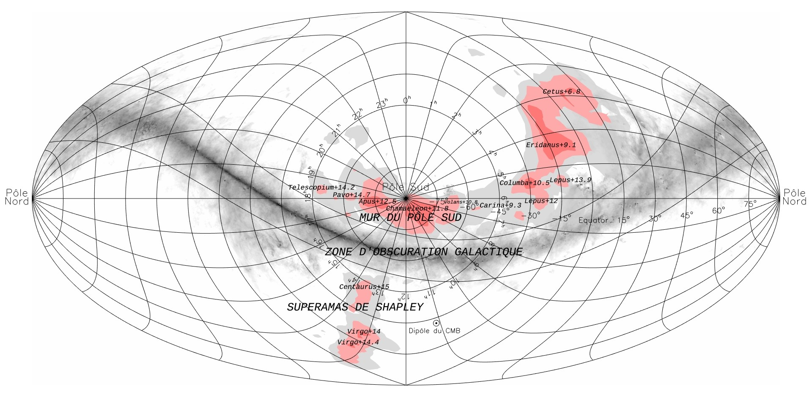

# Walls (sheets)

Walls — also called sheets or
pancakes — are the flattened membranes of the cosmic web: galaxy
concentrations hundreds of megaparsecs across but only a few megaparsecs
thick, bounding voids and feeding filaments. Template follows the pilot
(`cosmic-web.md`): looks, creation, change over time, interactions, numbers,
examples, target visuals, sources.

## How walls look

Redshift surveys show galaxies lying on bubble-like surfaces around empty
voids — first seen in the 1989 CfA slice of ~1,100 galaxies (de Lapparent,
Geller and Huchra; Geller and Huchra 1989, Science 246, 897). The CfA Great
Wall appears in wedge slices as a thin continuous ridge (seen nearly edge-on),
while in planar projection it is a broad quilt ~600 by 250 million
light-years (30 million thick; Geller–Huchra 1998 ZCAT map) with embedded clusters,
filaments and amorphous structure, Coma
near its core. NASA describes it as ~500 million light-years long, ~300
million wide, only ~15 million thick — the spread reflects different boundary
and Zone of Avoidance cuts. Sources: CfA Harvard ZCAT; NASA Imagine
the Universe.

SDSS maps 2 billion light-years deep show sheets and filaments as a twisting
web punctuated by voids, each galaxy a point colored by luminosity, with blank
slices where the Milky Way hides the sky. In NEXUS+ slices walls render as
extended tenuous planar networks, distinct from line-like filaments, and
host only low-mass halos — so walls look sparsely populated with widely
spaced dim galaxies and are hard to pick out. Sources: NASA Imagine;
Cautun et al. understanding review.

*Figure 1. 2dF DTFE reconstruction with the Sloan Great Wall labelled —
the wall-family archetype seen in redshift-survey projection.*

*Figure 2. Cosmicflows-3 density field showing the South Pole Wall beside
the Galactic dust-obscuration zone, opposite the Shapley concentration —
the velocity-reconstruction counterpart to redshift walls.*

## How walls are created

In 1970 Zel'dovich showed an ellipsoidal overdensity collapses fastest along
its shortest axis — pressure negligible — flattening into a pancake; plane
collapse then compresses and shock-heats the gas. Overlapping primordial
fluctuations make a whole population of pancakes, filaments and clumps.
Modern language: tidal shear deforms matter into walls and filaments, already
imprinted in the primordial tidal field; simulations start from
Zel'dovich displacements at redshift 60 and grow the web from there. The
original pancake picture was top-down (superclusters fragment into
protogalaxies), while hierarchical growth needs the truncated Zel'dovich
approximation — cut the small-scale power before displacing — and
generalisations cover a non-zero cosmological constant. Plane collapse
compresses infalling gas through shock waves, heating it. Void
expansion helps: underdense regions expand faster than average, piling matter
onto boundary shells. Sources: Zel'dovich pancake summary; Shandarin and
Zel'dovich 1989; Cosmic Web Dynamics review.

## How walls change over time

The early universe is full of tenuous sheets pervading most of the volume.
By redshift ~1 most have merged into more prominent filaments; evolution
slows after z~0.5 with only minor changes to today. Walls drain two ways:
typical sheets get less massive (wall surface-density distribution shifts to
lower values) and the whole wall network shrinks in extent. Particle tracking
from z=2 to z=0 shows walls lose over half their mass —
mostly to filaments — while voids lose half theirs to walls and filaments:
the canonical voids to sheets to filaments to nodes flow. Apparent reverse
trickles are misidentified tenuous structures, not real backflow. Sources:
Cautun et al. understanding review.

Gas in walls stays cool: at z=0 the warm-hot medium dominates filaments and
knots, but cool diffuse gas still dominates sheets and voids. Sources:
Martizzi et al. (IllustrisTNG baryons).

Caveat: exact mass-share tracks (e.g. sheets halving over time) are
classifier-, tracer- and smoothing-dependent; quote them only with the method
named. Stream-number finders give 10-20% where others give up to ~50%.
Finder families differ: Hessian single-scale (T-web tidal, V-web shear),
multiscale Hessian (MMF, NEXUS/NEXUS+ with log-Gaussian density — most
sensitive to tenuous walls), topological (SpineWeb, DisPerSE via DTFE +
persistence), phase-space/stream-counting (ORIGAMI, MSWA), stochastic
(Bisous cylinders). All agree on prominent walls; tenuous-wall detection
diverges. Sources: large-scale velocity-dispersion review; Cosmic Web
Dynamics review; Tracing the Cosmic Web comparison (Libeskind et al. 2018).

## How walls interact with the rest of the web

Walls are the conduit: galaxies are pulled out of voids, cross sheets, join
filaments and fall into node attractors. Filaments dominate the dynamics
everywhere — inside filaments, across most void interiors, and inside all
wall regions — so even void motion cannot be understood without the
surrounding web. Node gravity reaches only its immediate neighborhood, while
void outflows segment the volume and push matter onto boundaries. The Local
Void alone contributes ~240 km/s to the Local Group's motion. Sources: CEA
IRFU South Pole Wall release; Cosmic Web Dynamics review.

One figure to handle carefully: wall mass (~28% in one NEXUS+ box) coexists
with dynamical subdominance — walls pull weakly because they are extended.
No fetched source prints an exact wall gravity share; treat any single
percentage as box- and method-specific. Source: Cosmic Web Dynamics review.

Walls host field populations: low-mass halos and dilute dim galaxies, plus
the embedded clusters that mark them — Hercules, Coma and Leo in the CfA
wall. Sloan's richest supercluster SCl 126 sits in its densest region. Note
the Sloan wall is not gravitationally bound as a whole: "structure" here is
descriptive, and one analysis reads it as three chance-aligned structures.
Sources: Cautun et al.; Adventures in Deep Space Great Wall; NASA Imagine;
Clowes et al. via Sloan Great Wall summary.

## Key numbers

- CfA2 / Coma wall: ~600 x 250 x 30 million light-years (survey-limited;
  length varies 500-600 Mly with boundary and Zone of Avoidance cuts).
- Sloan Great Wall: ~1.37 billion light-years visual ridge (~420 Mpc),
  ~1 billion light-years distant; peer-reviewed length ~433 Mpc at z=0.078
  (median z=0.07804, mean density ~6x sample mean; CfA wall in same SDSS cut
  ~251 Mpc at z=0.0306); 80% longer than the CfA wall in Gott et al. comoving
  coordinates; not bound.
- South Pole Wall: >=1.37 billion light-years, 220 Mpc rectilinear section,
  ~500 million light-years away, found through velocities (dust blocks the
  direct view). Detail: Cosmicflows-3 (17,669 distances; Vpec = Vobs − H0 d)
  characteristic ~12,000 km/s; Apus-to-Lepus run ~250 Mpc plus Lepus-to-Funnel
  ~170 Mpc gives end-to-end ~420 Mpc (0.11c); Chamaeleon+11.8 peak at
  11,800 km/s (~157 Mpc). Largest contiguous local-volume feature; whether the
  Lepus bend joins the Funnel, and where connectivity ends toward Shapley
  (~250 Mpc Lepus–Shapley across obscuration), remains method- and
  edge-limited.
- Thickness: ~15 million light-years (galaxy ridge) vs 5-8 Mpc/h
  (dark-matter boundary, MMF density profiles; filaments ~2 h^-1 Mpc for
  scale) — definition-dependent. Density: ~1-5x mean; MMF mean 1+delta ~1.1,
  median ~0.9 for walls.
- Mass share: ~28% walls in one NEXUS+ box vs ~5.5% in MMF — always cite the
  finder. Detail: MMF inventory mass 28.1/39.2/5.5/27.2% and volume
  0.4/8.8/4.9/85.9% (clusters/filaments/walls/voids); NEXUS+ same-box
  comparison gives walls ~24% mass, ~18% volume. Density alone cannot
  separate morphologies (overlapping ranges).

Sources: CfA Harvard ZCAT; Gott et al. 2005; Einasto et al. 2011; Pomarede et
al. 2020 (ApJ 897, 133); Lietzen et al. 2016 (BOSS Great Wall);
Bohringer et al. 2025 (Quipu, A&A 695, A59); NASA Imagine; multiscale
phenomenology review.

## Example objects

- CfA2 Great Wall (Coma wall): found 1989 by Geller and Huchra; Hercules,
  Coma, Leo clusters; full extent unknown behind the Milky Way.
- Sloan Great Wall: announced 2003 by Gott, Juric et al. from SDSS; SCl 126
  core with tendrils; SCl 111 multispider of chains.
- South Pole Wall: announced 2020 by Pomarede, Tully et al. from
  Cosmicflows-3 (~18,000 galaxy velocities); largest contiguous local feature,
  skirting Laniakea's southern border opposite Shapley.
- Dipole Repeller: ~220 Mpc away (16,000 ± 4,500 km/s; anti-aligned bulk flow
  mu = −0.96 ± 0.04 out to ~16,000 km/s), an underdensity whose "push" is
  really missing pull — Local Group moves 631 ± 20 km/s vs the CMB with
  Shapley pull and repeller dip contributing roughly equally. Wiener-filter
  Cosmicflows-2 reconstruction: repeller dominates the dipole, Shapley the
  quadrupole (expansion eigenvector aligned to ~7,000 km/s). Predicted void
  still poorly covered by redshift surveys.
- Historical chain: 1986 CfA wall (~500 Mly) to 2003 Sloan (~1.4 Gly) to
  2016 BOSS Great Wall (z ~0.47 system diameter ~271 h^-1 Mpc, two walls
  186/173 h^-1 Mpc, ~2 x 10^17 h^-1 solar masses) to 2020 South Pole Wall
  (similar size, twice as close as Sloan) to 2025 Quipu (CLASSIX X-ray
  clusters, 68 clusters, ~428 Mpc, ~2.4 x 10^17 solar masses, largest reliably
  characterised to date; holds ~45% of clusters / ~30% of galaxies / ~25% of
  matter in 13% of the local volume).

Sources: CfA ZCAT; Gott et al. 2005 (ADS); CEA IRFU; Hawaii News;
Dipole Repeller summary (Hoffman et al. 2017, Nature Astronomy 1, 0036).

Related parts: [Cosmic web](./cosmic-web.md) (pilot template),
[Voids](./voids.md), [Filaments](./filaments.md), [Nodes](./nodes.md),
[Superclusters](./superclusters.md).

## Image credits and licenses

| File | Shows | Credit (required) | License / terms |
|---|---|---|---|
| `wall-sloan-2df-dtfe.gif` | 2dF DTFE reconstruction with Sloan wall labelled | Willem Schaap / Wikimedia Commons | CC-BY-SA 3.0 (`http://creativecommons.org/licenses/by-sa/3.0/`) + GFDL 1.2+ (dual) |
| `wall-southpole-cosmicflows3.jpg` | CEA Cosmicflows-3 South Pole Wall sky map | D. Pomarede / CEA IRFU Paris-Saclay (Cosmicflows-3 collaboration) | CEA press image, free use with credit; identical render released CC-BY-SA 4.0 by the author (`https://creativecommons.org/licenses/by-sa/4.0/`) |

Rejected for licensing: NASA APOD 2dF graphic (copyrighted Schaap credit —
use the CC twin above instead); CfA wedge maps (credit-only, no grant);
Princeton logarithmic maps (copyrighted Gott and Juric).

## Sources

- CfA Harvard ZCAT: `https://lweb.cfa.harvard.edu/~dfabricant/huchra/zcat/`
- NASA Imagine, sheets and voids: `https://imagine.gsfc.nasa.gov/features/cosmic/sheets_voids_info.html`
- NASA APOD Sloan wall: `https://science.nasa.gov/image-article/apod-2007-november-7-the-sloan-great-wall-largest-known-structure/`
- Gott et al. 2005 (ADS): `https://ui.adsabs.harvard.edu/abs/2005ApJ...624..463G/abstract`
- Cautun et al., understanding: `https://arxiv.org/html/1501.01306v1`
- CEA IRFU South Pole Wall: `https://irfu.cea.fr/en/Phocea/Vie_des_labos/Ast/ast.php?t=fait_marquant&id_ast=4808`
- Pomarede et al. 2020 (South Pole Wall, ApJ 897, 133): `https://doi.org/10.3847/1538-4357/ab9952`
- Hoffman et al. 2017 (Dipole Repeller, Nature Astronomy 1, 0036): `https://doi.org/10.1038/s41550-016-0036`
- Einasto et al. 2011 (Sloan Great Wall morphology, ApJ 736, 51): `https://arxiv.org/abs/1105.1632`
- Lietzen et al. 2016 (BOSS Great Wall, A&A 588, L4): `https://doi.org/10.1051/0004-6361/201628261`
- Bohringer et al. 2025 (Quipu superstructure, A&A 695, A59): `https://arxiv.org/abs/2501.19236`
- Libeskind et al. 2018 (Tracing the Cosmic Web comparison): `https://arxiv.org/abs/1705.03021`
- Aragon-Calvo et al. 2010 (MMF phenomenology): `https://arxiv.org/abs/1007.0742`
- Hawaii News, Laniakea mapping: `https://www.hawaii.edu/news/2020/07/10/laniakea-supercluster-mapping/`
- Cosmic Web Dynamics 2024: `https://arxiv.org/html/2407.16489v1`
- Martizzi et al.: `https://arxiv.org/abs/1810.01883`
- Adventures in Deep Space, Great Wall: `https://adventuresindeepspace.com/grtwall.htm`
- File 2dfdtfe.gif: `https://commons.wikimedia.org/wiki/File:2dfdtfe.gif`
