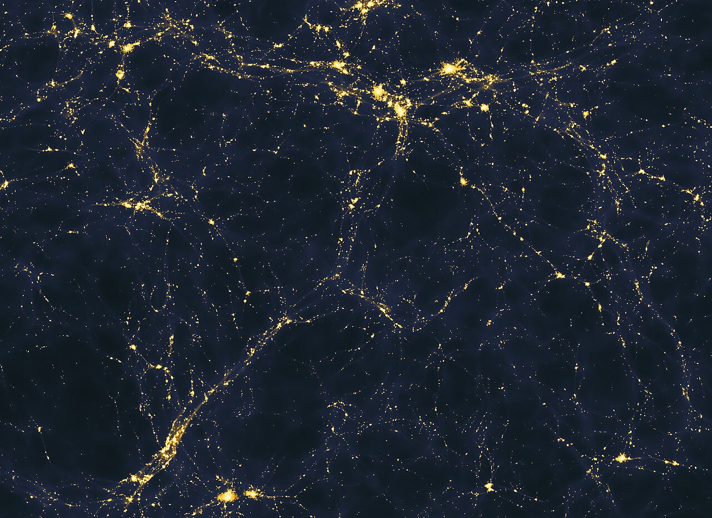

# Filaments — the threads of the web

Loop doc for Issue #219 (iteration 4). Filaments are the branching threads
of L2: dense ridges of galaxies and hot gas joining cluster nodes across
voids, holding roughly half of all cosmic mass in a few percent of the
volume. Sibling docs: `walls.md`, `voids.md`, `superclusters.md`; bridge in
`previous-l1.md`, entry in `entry.md`, timeline in `lifetime.md`.

## What they are and how they look

In redshift maps filaments read as thin chains of galaxies with vast empty
gaps between; in simulations they are the bright fibres of the foam, knots
at the intersections, voids everywhere else. A filament in emission — the
model below, light spread over 50+ million light-years — shows the same
topology the surveys trace: threads, junctions, emptiness. Rope-like
filaments have similar cross-section axes; flattened ones grade into walls.

Target visual (files in `images/`, credits and licenses at the bottom):

Sources: Wikipedia "Galaxy filament"; Wikipedia "Large-scale structure of
the universe"; Pontzen et al. 2014 (ApJ Lett. 792:L34); NASA SVS 10118.

## How they are found

No single finder owns the truth: NEXUS+ (scale-space Hessian), the
Multiscale Morphology Filter, and Bisous (cylinder-stacking on galaxy
positions) disagree most on tenuous objects, moving mass shares by factors
of two — which is why every share above cites its method. Filament gas
itself is extraordinarily thin: 1–10 particles per cubic meter in the
warm-hot phase, seen only in long integrations (X-ray absorption, Sunyaev-
Zel'dovich dips, stacked lensing). Sources: Cautun et al. (NEXUS+);
Aragon-Calvo et al. (MMF); Wikipedia "Warm-hot intergalactic medium".

## Example objects

- Sloan Great Wall filaments: the 433 Mpc wall complex (1.37 billion
  light-years, ~1 billion light-years away) is itself a bundle of
  filaments and embedded superclusters including SCl 126 — 1.8–2.7 times
  the CfA2 wall. Sources: Wikipedia "Galaxy filament"; Wikipedia "Sloan
  Great Wall".
- Quipu (reported 2025): 428 Mpc / ~1.4 billion light-years long,
  ~2.4 x 10^17 solar masses (~200,000+ Milky Ways) in 68 X-ray clusters —
  the largest known structure by mass and length, found in ROSAT X-ray clusters
  (redshift range ~0.027–0.065). Sources: Wikipedia
  "Quipu (cosmic structure)"; Böhringer et al., A&A 695:A59.
- BOSS Great Wall (redshift ~0.47, ~6.8 billion light-years light-travel):
  ~1 billion light-years across, 830+ visible galaxies, ~10,000 Milky-Way
  masses; two wall components (186 and 173 Mpc/h) plus smaller
  superclusters. Source: Wikipedia "BOSS Great Wall".
- Coma Filament: holds the Coma Supercluster and forms part of the CfA2
  Great Wall — the nearest giant thread, feeding the Coma Cluster node.
  Source: Wikipedia "Coma Filament".
- Typical size: commonly 50–80 Mpc (160–260 million light-years) long;
  masses from group scale up to 10^17 solar masses in the giants. Source:
  Wikipedia "Galaxy filament".

## How they were created

Inflation stretched quantum flickers into over- and under-density ripples
(one part in 100,000, traced by the microwave background). After
recombination the pressure-free dark matter collapsed first into halos,
then ordinary matter fell in. Collapse runs fastest along one axis at a
time (Zel'dovich 1970): sheets first, then filaments, then knots — which is
why the web is thread-dominated. Growth of small-scale modes had waited out
the radiation era (Mészáros effect) until matter-radiation equality at
~47,000 years freed them. Sources: Wikipedia "Structure formation";
Wikipedia "Zeldovich approximation"; Wikipedia "Void (astronomy)".

## How they change over time

Small halos form first, then galaxies, groups, clusters and superclusters —
the Millennium-class simulations show matter condensing into filaments and
halos while voids drain to a tenth of mean density. Filament gas heats as it
falls in: 30–50% of ordinary matter today is 100,000–10,000,000 K
intergalactic plasma in filaments (the warm-hot medium holding the
"missing" baryons), against ~11% at redshift 2. Direct imaging caught the
feeding in the act: 2019 Lyman-alpha fluorescence around forming clusters,
2021 MUSE diffuse glow over 2.5–4 comoving Mpc outside nodes. In the far
future, accelerating expansion pulls bound clusters apart and filaments
dissolve — Laniakea given as the example. Sources: Wikipedia "Warm-hot
intergalactic medium"; Wikipedia "Large-scale structure of the universe";
Wikipedia "Galaxy filament".

## How it interacts with the others

Filaments are the middle managers of the web: matter flees void interiors
for walls, drains along filaments, and lands in nodes — voids up to 100 Mpc
across at under a tenth of mean density, walls near mean density, clusters
where walls meet and filaments cross. Void centers are gravitational hills
(effectively repulsive), cluster centers are wells. Massive clusters such
as Coma sit exactly at filament intersections and are fed by them.
Filament-induced forces dominate local gravity almost everywhere; nodes
rule only their neighborhoods. Sources: Wikipedia "Void (astronomy)";
Wikipedia "Galaxy filament"; Cosmic Web Dynamics 2024.

## Key numbers

- 1 Mpc = 3.26 million light-years = 3.09 x 10^22 m.
- Typical filament: 50–80 Mpc = (1.5–2.5) x 10^24 m.
- Sloan: 433 Mpc, ~1.4 Gly, 1.3 x 10^25 m; Quipu: 428 Mpc, ~2.4 x 10^17 suns.
- BOSS: ~1 Gly, ~10^4 Milky Ways, redshift ~0.47.
- Warm-hot medium: 10^5–10^7 K, 40–50% of baryons today.

Sources: pages named above; 1 Mpc conversions standard.

## Image credits and licenses

| File | Shows | Credit (required) | License / terms |
|---|---|---|---|
| `filament-light-early-universe.jpg` | Simulated light spread on 50+ Mly scales (1280px) | Andrew Pontzen and Fabio Governato (UCL) | CC-BY 2.0 (`https://creativecommons.org/licenses/by/2.0/`) |

Note: complements (not duplicates) `L01/images/filament-bridge-eso-potw2504a.jpg`,
a close-up bridge view. The Round 2 audit (T5) confirms each file, credit
and term; replacements are separate updates.

## Sources

- Wikipedia, Galaxy filament: `https://en.wikipedia.org/wiki/Galaxy_filament`
- Wikipedia, Sloan Great Wall: `https://en.wikipedia.org/wiki/Sloan_Great_Wall`
- Wikipedia, BOSS Great Wall: `https://en.wikipedia.org/wiki/BOSS_Great_Wall`
- Wikipedia, Quipu: `https://en.wikipedia.org/wiki/Quipu_%28cosmic_structure%29`
- Böhringer et al. 2025: `https://www.aanda.org/10.1051/0004-6361/202453582`
- Wikipedia, Coma Filament: `https://en.wikipedia.org/wiki/Coma_Filament`
- Wikipedia, Structure formation: `https://en.wikipedia.org/wiki/Structure_formation`
- Wikipedia, Zeldovich approximation: `https://en.wikipedia.org/wiki/Zeldovich_approximation`
- Wikipedia, Warm-hot intergalactic medium: `https://en.wikipedia.org/wiki/Warm%E2%80%93hot_intergalactic_medium`
- Wikipedia, Void: `https://en.wikipedia.org/wiki/Void_%28astronomy%29`
- NASA SVS, cosmic web journey: `https://svs.gsfc.nasa.gov/10118/`
- Pontzen et al. 2014: `https://iopscience.iop.org/article/10.1088/2041-8205/792/2/L34`
- Commons file page: `https://commons.wikimedia.org/wiki/File:Large-scale_structure_of_light_distribution_in_the_universe.jpg`
