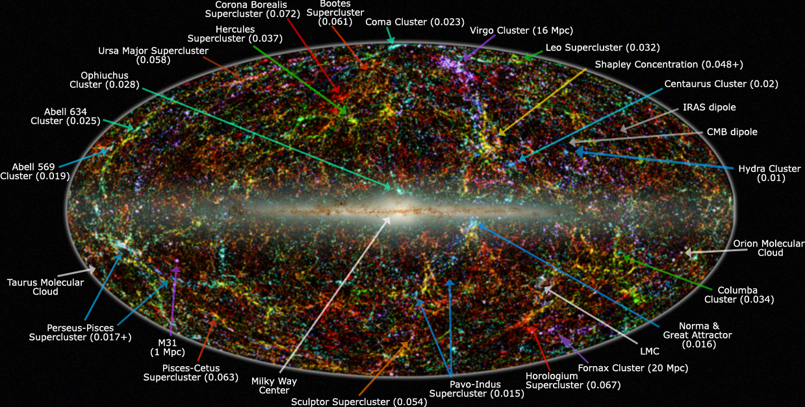

# Lifetime — dated stages of the L2 web

Loop doc for Issue #219 (iteration 3). The full dated timeline of L2-scale
structure (tens to hundreds of megaparsecs: filaments, sheets, voids,
knots): from inflation seeds to the far-future fate. Sibling docs carry the
per-part stories (`filaments.md`, `walls.md`, `voids.md`,
`superclusters.md`); bridge in `previous-l1.md`, entry in `entry.md`.

## The stages

**Seeds from inflation (10^-36 to 10^-32 s).** Exponential expansion
stretches space ~10^26–10^30 and amplifies quantum flickers into density
ripples of one part in 100,000 — the seeds of every later web. No L2
structures exist yet, only the seed power spectrum. Source: ESA, Planck and
inflation.

**First sound, then silence (~380,000 years, redshift ~1100).** The plasma
cools to ~3000 K, electrons and protons form neutral hydrogen, light
escapes as the microwave background, and the sound-wave pattern freezes —
including the preferred galaxy separation of ~150 Mpc (~500 million
light-years) still visible as baryon acoustic oscillations in galaxy pairs
today. L2 over- and under-densities are still linear. Sources: ESA, Planck
and the CMB; SDSS-III BOSS.

**First lights (~100–400 Myr, fiducial ~200 Myr).** The first massive stars
end the Dark Ages; their ultraviolet starts ionizing bubbles. Only the
densest knots inside future filaments light up; inter-filament L2 gas stays
cold and neutral; no warm-hot filament gas yet. Sources: NASA Webb early
universe; Max Planck MPIA (end of reionization).

**Reionization (~250 Myr–1.1 Gyr).** Ionized bubbles percolate (midpoint
~700 Myr, complete by ~1.0–1.1 Gyr). Low-density L2 voids and sheets ionize
first along open channels while filaments stay partly self-shielded. A
TNG-style census puts knot-plus-filament mass share at only ~8% at redshift
4. Source: Max Planck MPIA (Bosman, end of cosmic dawn).

**Cosmic noon (~2–3 Gyr, redshift ~3–2).** Star formation peaks — about half
of today's stellar mass forms — with quasars and black-hole feedback at
maximum. Filament-fed accretion runs fastest: cold gas streams along
filaments into knots, shocks start heating filament gas, and the filament
mass fraction climbs steeply. Source: ESA, Cosmic eras.

**Slowdown and takeover (~8–9.8 Gyr).** Matter-dominated braking ends;
acceleration begins ~9 billion years in (~5 billion years ago), matter-dark
energy equality near redshift 0.3–0.4. Linear growth freezes: large
filaments stop thickening in comoving coordinates, structure growth slows,
voids expand faster. Source: NASA, dark energy.

**Today (13.8 Gyr).** The depleted web: the 150 Mpc ruler confirmed in BOSS
and DESI clustering; knot-plus-filament mass share ~33% at redshift 0
against ~8% at redshift 4; 30–50% of ordinary matter as 100,000–10,000,000 K
filament plasma (the warm-hot medium holding the "missing" baryons), only
~20% in galaxies and clusters. Filaments are hot thin highways; mergers are
rare; the gas is starved. Cross-check against the part docs: the WHIM
interval matches `filaments.md`, the 8-to-33 share matches the growth story
in `walls.md`, and the stalled assembly matches `superclusters.md` (Coma
unrelaxed, Shapley core still collapsing). Sources: SDSS-III BOSS; Martizzi et al. 2019
(IllustrisTNG baryons); Davé et al. 2001; Wikipedia warm-hot medium.

**Far-future fate (~20–50 Gyr to 10^14 years).** Filament dissolution and
isolation: in comoving coordinates the skeleton sharpens, but filaments
thin and starve while clusters become isolated islands receding
exponentially in physical coordinates. The Local Group merges; Virgo grows
unreachable; no new L2 structures form; star formation ends near 10^14
years. The existing web stretches into disconnected bound knots. Sources:
Hoffman et al. 2007 (future of local large-scale structure); Wikipedia,
future of an expanding universe.

**Heat death (toward 10^100 years).** Continued expansion toward maximum
entropy: near-vacuum, no gradients, cold dark isolated remnants. The L2
concept dissolves — only event-horizon islands remain. Source: Wikipedia,
ultimate fate of the universe.

## Key numbers

- Inflation: 10^-36–10^-32 s, stretch ~10^26–10^30, seeds ~10^-5.
- Recombination: ~380,000 years, redshift ~1100; BAO ruler ~150 Mpc.
- First stars: ~200 Myr; reionization complete ~1.0–1.1 Gyr.
- Cosmic noon: 2–3 Gyr; dark-energy takeover ~9 Gyr in (redshift ~0.4).
- Today: 13.787 +/- 0.020 Gyr; knots+filaments ~33% of mass (from ~8% at
  redshift 4); warm-hot medium 30–50% of baryons.
- Fate: isolation by ~10^11–10^14 years; heat death toward 10^100 years.

Sources: Planck Collaboration 2018; papers and pages named above.

## Image credits and licenses

No new images this iteration — the timeline reuses the L02 image set (see
`previous-l1.md` and `entry.md` credit tables): the 2MASS panorama above
(`2mass-lss-aitoff.jpg`, public domain) and the logarithmic map
(`observable-universe-log.png`, CC-BY-SA 3.0 Budassi).

## Sources

- ESA, inflation: `https://www.esa.int/Science_Exploration/Space_Science/Planck/The_cosmic_microwave_background_and_inflation`
- ESA, CMB: `https://www.esa.int/Science_Exploration/Space_Science/Planck/Planck_and_the_cosmic_microwave_background`
- ESA, Cosmic eras: `https://www.esa.int/Science_Exploration/Space_Science/Cosmic_eras`
- NASA Webb, early universe: `https://science.nasa.gov/mission/webb/early-universe`
- Max Planck MPIA, end of cosmic dawn: `https://www.mpg.de/18720037/the-end-of-the-cosmic-dawn`
- NASA, dark energy: `https://science.nasa.gov/dark-energy`
- SDSS-III BOSS: `https://www.sdss3.org/surveys/boss.php`
- Martizzi et al. 2019, TNG baryons: `https://arxiv.org/abs/1810.01883`
- Davé et al. 2001: `http://ui.adsabs.harvard.edu/abs/2001ApJ...552..473D/abstract`
- Wikipedia, warm-hot medium: `https://en.wikipedia.org/wiki/Warm%E2%80%93hot_intergalactic_medium`
- Hoffman et al. 2007, local future: `https://ui.adsabs.harvard.edu/abs/2007JCAP...10..016H`
- Wikipedia, ultimate fate: `https://en.wikipedia.org/wiki/Ultimate_fate_of_the_universe`
