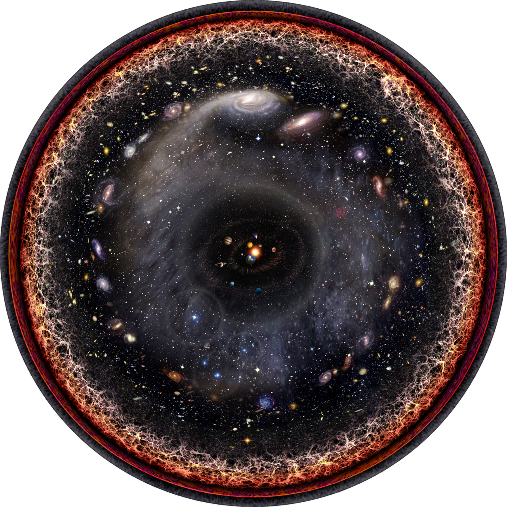

# L1 behind us — the Observable universe as previous level

This document bridges [L01 — Observable universe](../../L01/documents/README.md)
into [L02 — Cosmic web](./README.md): what the previous level looks like, what
carries over when you zoom in, and what changes at L2 scale. Entry itself —
the visual transition and its effects — lives in [the entry transition](./entry.md). Part detail
lives in [filaments](./filaments.md), [walls](./walls.md), [voids](./voids.md) and [superclusters](./superclusters.md); the
dated timeline in [the lifetime page](./lifetime.md).

## What L1 is and how it looks

The Observable universe is the whole ball of space we can see: about 93
billion light-years across (8.8 x 10^26 m), centered on the observer. It is
not a photograph taken at one moment — light from the far edge has traveled
for 13.8 billion years while expansion carried its source outward, so the
sphere is a record assembled from different cosmic times. From the inside it
looks smooth: above roughly 70-80 Mpc/h (about 100-115 Mpc, or ~300-380
million light-years, for h ~ 0.7) galaxy counts even out in every direction,
the cosmological principle confirmed by surveys such as WiggleZ, which measured
the transition from fractal clumping on small scales to homogeneity on large
ones (fractal dimension within 1% of 3 above that scale, out to ~300 Mpc/h).

Target visuals (files in `images/`, credits and licenses at the bottom):

Sources: Britannica "Observable universe"; Wikipedia "Observable universe";
WiggleZ homogeneity measurement (arXiv 1205.6812); `../../../../docs/universes/ladder.md`
(R5 anchor row L1).

## What carries over into L2

Everything L1 shows is still there, only closer. The same structures — the
filaments, walls, voids and superclusters traced by galaxy surveys — become
the L2 contents: filaments, walls, giant voids, superclusters, with Laniakea
as the home supercluster (`../../../../docs/universes/ladder.md`, L2 row). The L2 anchor
is the Sloan Great Wall: 1.37 billion light-years long (1.30 x 10^25 m),
about one-sixtieth to one-seventieth of the Observable diameter (93 / 1.37
is about 68), sitting roughly a billion
light-years away in Corvus, Hydra and Centaurus. Announced in 2003 from Sloan
Digital Sky Survey data (Gott, Juric and colleagues), it holds several
superclusters — richest is SCl 126 in its densest region — though a 2011
analysis argued it may be a chance alignment of three structures rather than
one coherent wall. Laniakea, our own basin of
attraction holding the Milky Way and ~100,000 nearby galaxies, spans about
500 million light-years (~160 Mpc in the Tully et al. 2014 definition;
later watershed work gives ~120-160 Mpc depending on method) — a flow-model
boundary (basin of attraction, sometimes called a supercluster cocoon or
watershed), not a visible shell, and not gravitationally bound as a whole:
it is expected to disperse rather than hold together. Sources: ladder R5 anchors;
Gott et al. 2005 (SGW discovery); Einasto et al. 2011 (SCl 126, alignment
debate); Tully et al. 2014 (Laniakea basin); Wikipedia "Sloan Great Wall";
Wikipedia "Laniakea Supercluster"; Scale of Space (Laniakea size).

## What changes at this zoom

**From smooth to structured.** At L1 the web is below resolution: the whole
Observable sphere reads as one glowing ball with brighter patches. At L2 the
homogeneity dissolves and the web topology appears — dense supercluster
complexes joined by filaments, flat walls between them, giant voids filling
most of the volume. The rule of thumb: homogeneity holds looking across L2
cells, structure rules looking inside one — the same ~150 Mpc baryon-acoustic
ruler that calibrates L1 distances is itself an L2-scale feature.

**From one cell to eight portals.** The L1 cell opens into L2 through 8
octant portals, each showing its L2 cell at a true size ratio of 1.48e-2
(`../../../../docs/universes/ladder.md`, R6 table). Populations (field galaxies shown as
points) never open; only portals do. Our path runs through the home
supercluster Laniakea, with the Sloan Great Wall as the far landmark.
Sources: ladder R6 amendment; ADR 0010 (portal vs population).

**From edge to neighborhood.** The L1 edge — the particle horizon, the oldest
light — drops out of view. What replaces it is addressable geography: named
walls (Sloan, CfA2, South Pole), named voids (Local, Bootes), named flows
(toward the Great Attractor and Shapley). The part docs name each one with
sizes and examples. Sources: L01 reference (`../../L01/documents/README.md`,
superclusters and voids docs).

## A map still being drawn

The geography above is surveyed, not simulated: SDSS/BOSS proved the ~150 Mpc
baryon-acoustic ruler in galaxy clustering, and DESI (five-year survey
completed April 2026, 50M-plus redshifts; DR2 BAO precision ~0.24%) plus
ESA Euclid (launched 2023, first data March 2025) are redrawing it in finer
detail. New superstructures (Quipu reported 2025, South Pole Wall 2020) keep
entering the record; the part docs carry the examples, this bridge only notes
the direction. Sources: DESI DR2 results guide (March 2025); ESA Euclid
mission pages; Max Planck Society (Quipu).

## Where to go next

- [The entry transition](./entry.md) — the L1-to-L2 dive in plain steps, effects on entry, timing.
- [Filaments](./filaments.md) — threads: looks, creation, WHIM heating, feeding, examples to Quipu scale.
- [Walls](./walls.md) — sheets: CfA2, Sloan and South Pole walls, draining into filaments.
- [Voids](./voids.md) — giant voids: Local, Bootes, KBC, Eridanus, outflows, dark-energy probes.
- [Superclusters](./superclusters.md) — basins of attraction: Laniakea home, Shapley, Coma, Quipu, Hyperion.
- [The lifetime page](./lifetime.md) — dated stages from inflation seeds to the far-future fate.

## Key numbers

- Observable diameter: ~93 billion light-years (8.8 x 10^26 m, Planck/WMAP).
- L2 span: 10^24–10^26 m; anchor Sloan Great Wall 1.37 Gly (1.30 x 10^25 m).
- Homogeneity scale: 70-80 Mpc/h (~100-115 Mpc for h ~ 0.7); fractal below, smooth above (WiggleZ).
- Laniakea: ~500 million light-years across, ~100,000 galaxies (flow basin).
- L1 to L2 ratio: 1.48e-2, 8 octant portals per L1 cell.
- Age anchor: 13.787 +/- 0.020 Gyr (Planck 2018); CMB 2.725 K scaling as (1+z).

Sources: ladder R5/R6; Planck Collaboration 2018; WiggleZ (arXiv 1205.6812);
Wikipedia "Sloan Great Wall" and "Laniakea Supercluster".

## Image credits and licenses

| File | Shows | Credit (required) | License / terms |
|---|---|---|---|
| `earths-location-8maps.jpg` | Eight-map zoom Earth to Observable universe (1280px) | Andrew Z. Colvin | CC-BY-SA 3.0 (`https://creativecommons.org/licenses/by-sa/3.0/`) |
| `observable-universe-log.png` | Logarithmic Observable universe, Earth at center (1280px) | Pablo Carlos Budassi | CC-BY-SA 3.0 (`https://creativecommons.org/licenses/by-sa/3.0/`) |

## Sources

- Ladder: `../../../../docs/universes/ladder.md` (R5 anchors, R6 ratios, gap note)
- Britannica, Observable universe: `https://www.britannica.com/topic/observable-universe`
- Wikipedia, Observable universe: `https://en.wikipedia.org/wiki/Observable_universe`
- Wikipedia, Sloan Great Wall: `https://en.wikipedia.org/wiki/Sloan_Great_Wall`
- Wikipedia, Laniakea Supercluster: `https://en.wikipedia.org/wiki/Laniakea_Supercluster`
- WiggleZ homogeneity: `https://arxiv.org/abs/1205.6812`
- Scale of Space, Laniakea size: `https://scaleofspace.org/objects/laniakea-supercluster`
- Planck Collaboration 2018 (VI): `https://arxiv.org/abs/1807.06209`
- Gott et al. 2005, A Map of the Universe (SGW discovery): `https://arxiv.org/abs/astro-ph/0310571`
- Einasto et al. 2011, SGW morphology (SCl 126, alignment debate): `https://arxiv.org/abs/1105.1632`
- Tully et al. 2014, Laniakea basin of attraction: `https://ui.adsabs.harvard.edu/abs/2014Natur.513...71T/abstract`
- Dupuy and Courtois 2023, watershed superclusters: `https://ar5iv.labs.arxiv.org/html/2305.02339`
- DESI DR2 results guide (March 2025): `https://www.desi.lbl.gov/2025/03/19/desi-dr2-results-march-19-guide`
- ESA Euclid mission: `https://www.esa.int/Science_Exploration/Space_Science/Euclid`
- Max Planck, Quipu (2025): `https://www.mpg.de/24197951/largest-superstructure-in-the-nearby-universe-unveiled`
- L01 reference index: `../../L01/documents/README.md`
